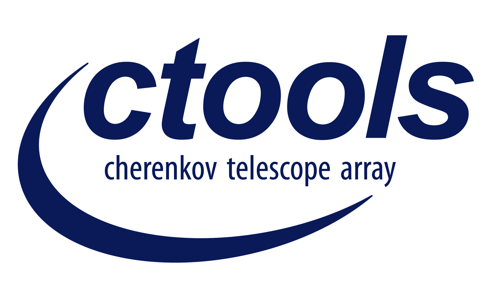

.. _about:

About
=====

ctools is a software package developed for the scientific analysis of 
Cherenkov Telescope Array (CTA) data.
Analysis of data from existing Imaging Air Cherenkov Telescopes (such as 
H.E.S.S., MAGIC or VERITAS) is also supported, provided that the data and 
response functions are available in the format defined for CTA.

ctools comprises a set of ftools-like binary executables with a 
command-line interface allowing for interactive step-wise data analysis. 
ctools includes also a Python module allowing to control all executables. 
Creation of shell or Python scripts and pipelines is supported. 
ctools provides cscripts, which are Python scripts complementing the 
binary executables. 
Extensions of the ctools package by user defined binary executables or 
Python scripts is supported.

ctools are based on GammaLib, a versatile toolbox for the high-level 
analysis of astronomical gamma-ray data. 
Besides CTA, GammaLib supports also the analysis of Fermi/LAT and COMPTEL 
data, and extensions to support further gamma-ray instruments are planned. 
An interface to virtual observatory ressources is also in preparation. 
By making use of the GammaLib multi-instrument capabilities, ctools 
supports the joint analysis of CTA (or any IACT providing data in the 
CTA format), Fermi/LAT and COMPTEL data.

Acknowledging or citing ctools
------------------------------

If you use ctools for work/research presented in a publication we ask you
that you include the following standard acknowledgment:

   *This research made use of ctools, a community-developed analysis package
   for Imaging Air Cherenkov Telescope data. ctools is based on GammaLib,
   a community-developed toolbox for the high-level analysis of astronomical
   gamma-ray data.*

If you wish, you can also include a link to http://cta.irap.omp.eu/ctools/
(if the journal allows this) in addition to the above text.

If you are giving a presentation or talk featuring work/research that makes
use of ctools, we suggest using this logo on your title slide:

License
-------

ctools is free software distributed under the GNU GPL license version 3.
