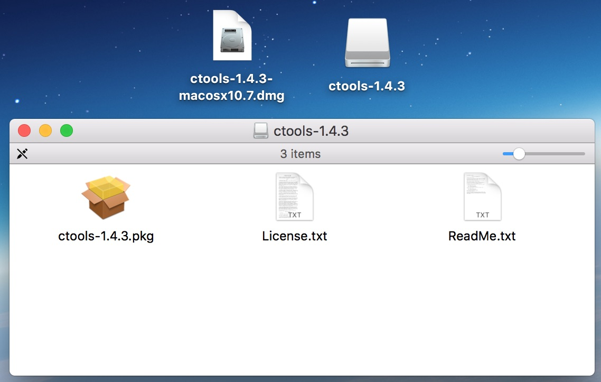
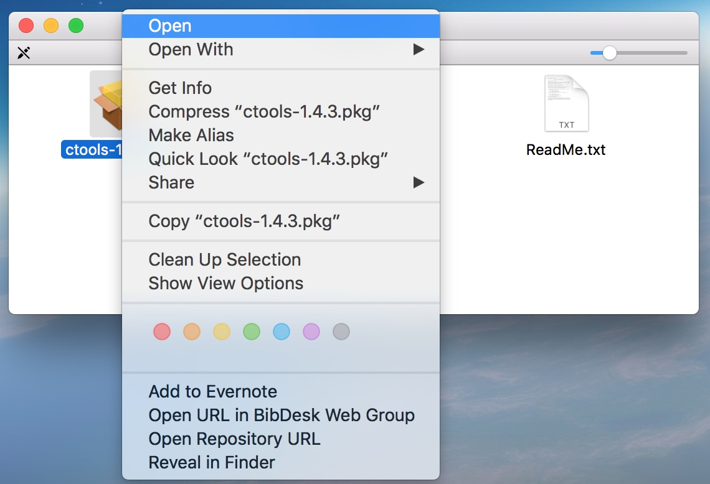
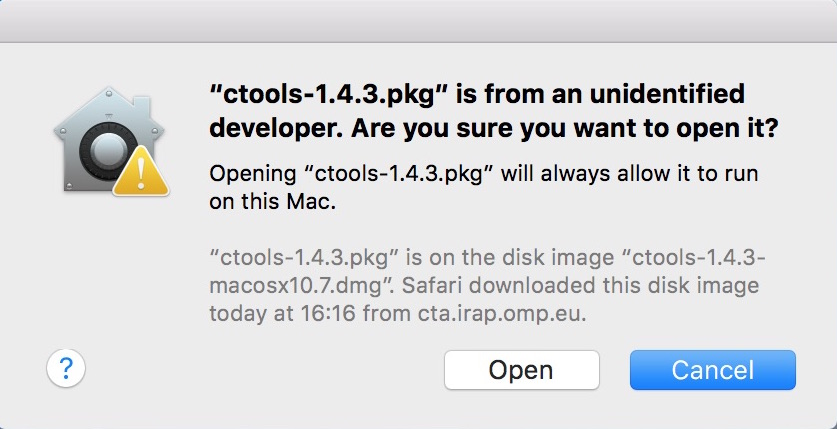
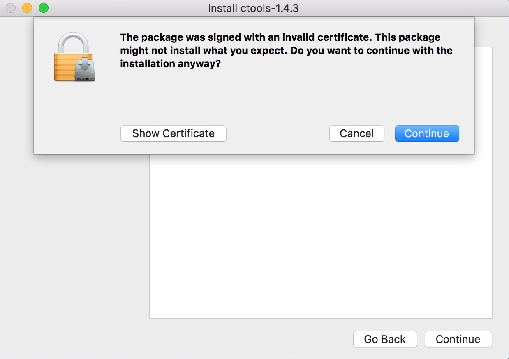
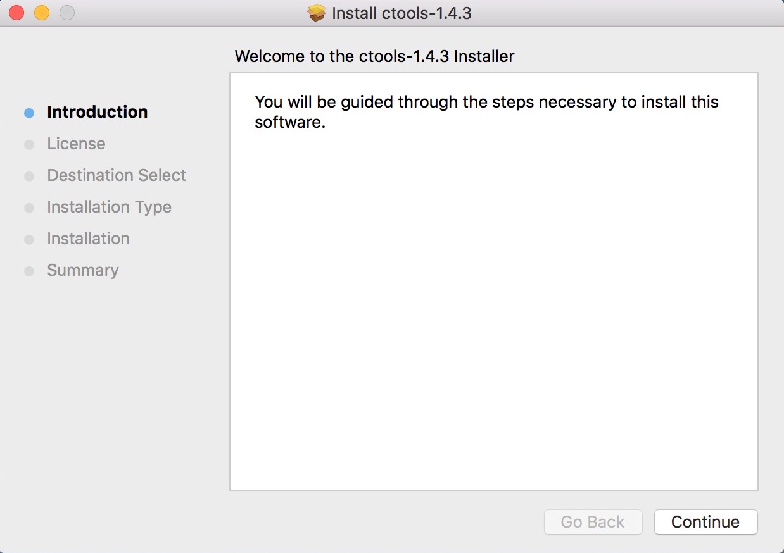
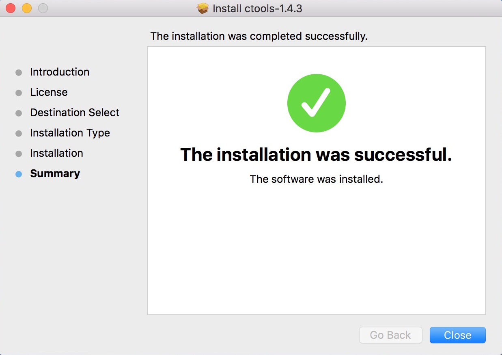

.. _sec_install_binary:

Installing as binary package
============================

Mac OS X
--------

After :ref:`downloading the Mac OS X binary disk image <sec_download>`
double-click on the image to mount the disk

Now open the installer package by right-clicking (ctrl-click) on the installer
package icon. This allows to install a software package with an invalid
certificate (ctools has so far no Apple certificate)

A window will show up, warning that the package comes from an unidentified
developer. Click on ``Open`` to continue.

Now the installer opens, warning that the package has been signed with an
invalid certificate. Click on ``Continue`` to proceed.

Follow now the installer instructions by clicking on ``Continue``. As the
software will be installed in ``/usr/local/gamma`` the installer will ask
you for the ``root`` password on your machine.

At the end you should see a window like this:

