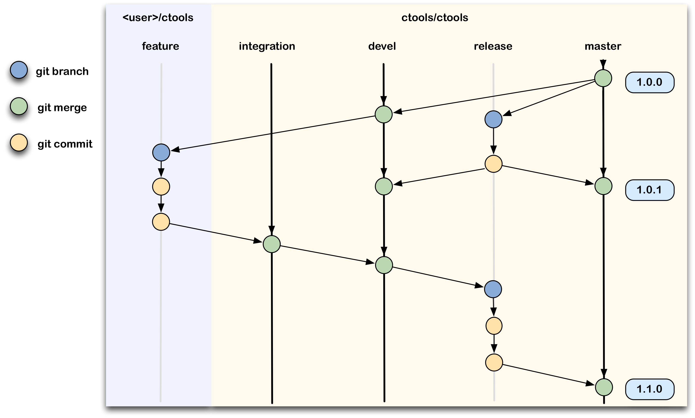
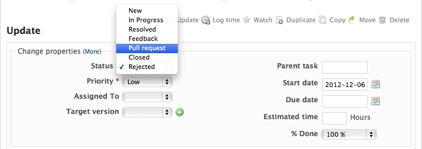

.. _git:

Using Git and GitLab
====================

The ctools source code is version controlled using
`Git <https://git-scm.com/>`_ that is managed through a
`GitLab <https://cta-gitlab.irap.omp.eu/ctools/ctools>`_ web interface.

Every developer will create a user in
`GitLab <https://cta-gitlab.irap.omp.eu/ctools/ctools>`_
and have an own copy (a so called fork) of the ctools code in his/her
user space.
There is hence no need or possibility to push to the main ctools repository.
Once you forked from the ctools repository, you can create
feature branches and add some new code (or correct a bug), and issue a pull
request so that your change gets included in the trunk.
Note that we do not use
`GitLab's <https://cta-gitlab.irap.omp.eu/ctools/ctools>`_
pull request feature  for the moment, as all issues are tracked on our
`Redmine <https://cta-redmine.irap.omp.eu/projects/ctools>`_
system, but this may change in the future.
Our `Git <https://git-scm.com/>`_ workflow is identical to the one you
typically use on `GitHub <https://github.com/ctools/ctools>`_.
You may in fact also use `GitHub <https://github.com/ctools/ctools>`_
for your code developments, as the ctools source code is mirrored to
`GitHub <https://github.com/ctools/ctools>`_ in a read only repository.

Before you start
----------------

Make sure you configured your `Git <https://git-scm.com/>`_ using your user
name and e-mail address (you only need to do this once on your machine):

.. code-block:: bash

   $ git config --global user.name "John Doe"
   $ git config --global user.email johndoe@example.com

In addition, you may need to add

.. code-block:: bash

   $ git config --global http.sslverify "false"

so that you have no SSL certificate error when you access the
repository.

Overview
--------

The figure below illustrates the `Git <https://git-scm.com/>`_ workflow
that we use for the ctools development.
Permanent branches are shown as black lines, temporary branches as grey lines.
The yellow area is the ctools repository, the light blue area is your
forked user space.
There are three permanent branches in the ctools repository:

* the ``master`` branch that holds the latest release
* the ``devel`` branch that is the trunk on which development progresses
* the ``integration`` branch that is used for code integration

A temporary ``release`` branch is used for hotfixes and generally for code
testing prior to any release.
As developer you will work in your user space and work on temporary
``feature`` branches.

Forking the project
-------------------

As the first step you need to create a fork of the project in your user
space.
Connect to `GitLab <https://cta-gitlab.irap.omp.eu/ctools/ctools>`_
using your Redmine user name and password (if you have not yet an
account on
`Redmine <https://cta-redmine.irap.omp.eu/projects/ctools>`_ then go
ahead and create one).
Select the `ctools <https://cta-gitlab.irap.omp.eu/ctools/ctools>`_
project and click on ``Fork``.

This brings you to a screen that invites you to fork the project into
your user space.
Click on your user.

After a short while a fork will be created that now is under your
ownership.

Now you can clone this fork using

.. code-block:: bash

   $ git clone https://cta-gitlab.irap.omp.eu/[user]/ctools.git

where ``[user]`` is your
`GitLab <https://cta-gitlab.irap.omp.eu/ctools/ctools>`_
(or `Redmine <https://cta-redmine.irap.omp.eu/projects/ctools>`_)
user name.
To keep in sync with the ctools repository you should add it as
a remote repository using

.. code-block:: bash

   $ git remote add upstream https://cta-gitlab.irap.omp.eu/ctools/ctools.git

You can then type

.. code-block:: bash

   $ git pull upstream devel

to pull in changes from the ``devel`` branch of ctools in your
repository.

Modifying or adding code
------------------------

To work on a new feature or to correct a bug you should always create a new
branch.
You do this by typing

.. code-block:: bash

   $ git checkout devel
   $ git pull upstream devel
   $ git checkout -b 5783-correct-event-selection

which makes sure that you are on your ``devel`` branch, then pulls in changes
from the ctools repository, and finally creates the
``5783-correct-event-selection`` branch.
New branches should always start with an issue number, followed by
a meaningful name that indicates what the branch is good for (use hyphens
to separate words).
You can find the relevant issue number using the
`Redmine issue tracker <https://cta-redmine.irap.omp.eu/projects/ctools/issues>`_.

Suppose that your goal is to correct a bug in the event selection in
``ctselect``.
You would then probably modify the ``ctselect.cpp`` file that is found in the
``src/ctselect`` repository.
Once you have verified that the bug is correct you should commit your changes.

First stage the files you want to commit:

.. code-block:: bash

   $ git add src/ctselect/ctselect.cpp

and then commit your change:

.. code-block:: bash

   $ git commit -m "Corrected event selection in ctselect (#5783)
   >
   > The event selection in ctselect was not done correctly in case
   > that no time intervals are specified. This is fixed now."

where the message in quotes should be comprised of a single line subject
that describes what was changed, and a message body that describes why
the change was made. Subject line and message body should be separated
by a blank line (see `How to Write a Git Commit Message
<http://chris.beams.io/posts/git-commit/>`_).

To make the changes available to other users, and specifically to allow
their merging into the ctools repository, you need to push you local
changes into your
`GitLab's <https://cta-gitlab.irap.omp.eu/ctools/ctools>`_
repository.
You do this by typing

.. code-block:: bash

   $ git push origin 5783-correct-event-selection

Note that the ``origin`` argument specifies that you want to push your
changes into the same repository from which you cloned the code.

Creating a pull request
-----------------------

Once the code is pushed into your repository you can create a request that
your code should be merged into the ctools repository.
For this you have to open the relevant issue in the
`Redmine issue tracker <https://cta-redmine.irap.omp.eu/projects/ctools/issues>`_
and put the status of the issue to ``Pull request``:

You should indiciate in the notes in which repository and on which branch
your change is.
You should also describe the changes or addition you made to the code.
Explain what you have done. Say if there is anything you’d like particular
attention for - like a complicated change or some code you are not happy
with.
If you don’t think your request is ready to be merged, just say so in your
pull request message.
This is still a good way of getting some preliminary code review.
