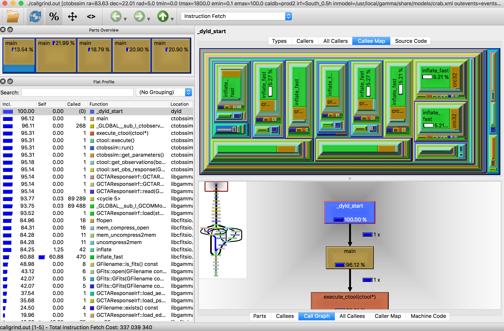

.. _dev_profiling_usage:

Using valgrind
==============

Mac OS X
--------

A valgrind analysis is performed using the ``valgrind`` executable. Here we
show as example how the :ref:`ctobssim` tool is profiled. The ``valgrind``
executable should be run in a specific repository since a large number of
output files will be generated by the tool.

.. code-block:: bash

   $ valgrind --tool=callgrind -v --dump-every-bb=10000000 ctobssim ra=83.63 dec=22.01 rad=5.0 tmin=0.0 tmax=1800.0 emin=0.1 emax=100.0 caldb=prod2 irf=South_0.5h inmodel=$CTOOLS/share/models/crab.xml outevents=events.fits

While the ``valgrind`` executable is still running you can start already the
``qcachegrind`` executable that will display the analysis results:

.. code-block:: bash

   $ qcachegrind

This will open up a window with the profiling results displayed in tabular and
graphical form. An example of the window is shown in the figure below:

   *qcachegrind window*
