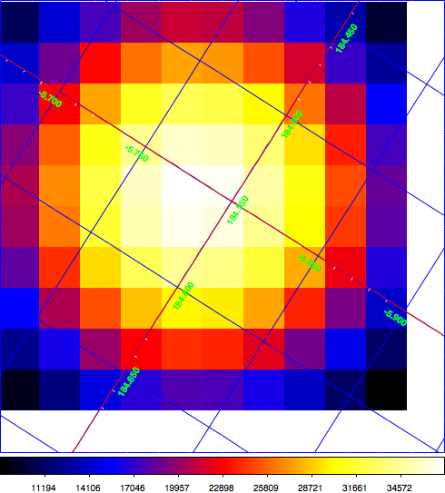

.. _beyond:

Beyond the first steps
----------------------

Assuming that you have read the :ref:`quickstart <quickstart>` tutorial,
here now some information on how to make the following more complex 
analyses:

- :ref:`sec_combining_obs`

- :ref:`sec_stacked`

- :ref:`sec_tsmap`

- :ref:`sec_residual`

.. _sec_combining_obs:

Combining observations
~~~~~~~~~~~~~~~~~~~~~~

Generally, the CTA data you may want to analyse will not only be composed of
a single observation (a.k.a. run) but of a list of observations that should
be combined in a joint analysis.
ctools has the capability to collect individual observations in a list and
to perform for example a joint maximum likelihood fit of all observations 
in a single shot.
Here is an example that illustrates how to do that.

Let's start with the simulation of two 30 min long observations of the Crab
nebula, each offset by 0.5 deg from the nebula in opposite directions:

.. code-block:: bash

  $ ctobssim
  RA of pointing (degrees) (0-360) [83.63] 
  Dec of pointing (degrees) (-90-90) [22.01] 21.51
  Radius of FOV (degrees) (0-180) [5.0] 
  Start time (MET in s) (0) [0.0] 
  End time (MET in s) (0) [1800.0] 
  Lower energy limit (TeV) (0) [0.1] 
  Upper energy limit (TeV) (0) [100.0] 
  Calibration database [dummy] 
  Instrument response function [cta_dummy_irf] 
  Model [$CTOOLS/share/models/crab.xml] 
  Output event data file or observation definition file [events.fits] events1.fits

.. code-block:: bash

  $ ctobssim
  RA of pointing (degrees) (0-360) [83.63] 
  Dec of pointing (degrees) (-90-90) [21.51] 22.51
  Radius of FOV (degrees) (0-180) [5.0] 
  Start time (MET in s) (0) [0.0] 
  End time (MET in s) (0) [1800.0] 
  Lower energy limit (TeV) (0) [0.1] 
  Upper energy limit (TeV) (0) [100.0] 
  Calibration database [dummy] 
  Instrument response function [cta_dummy_irf] 
  Model [$CTOOLS/share/models/crab.xml] 
  Output event data file or observation definition file [events1.fits] events2.fits

This will produce the two event files ``events1.fits`` and ``events2.fits``
on disk.

As next step we have to create an **observation definition XML file** that
collects both observations in a list.
Here is how such a file would look like:

.. code-block:: xml

  <?xml version="1.0" standalone="no"?>
  <observation_list title="observation library">
    <observation name="Crab" id="00001" instrument="CTA">
      <parameter name="EventList" file="events1.fits"/>
    </observation>
    <observation name="Crab" id="00002" instrument="CTA">
      <parameter name="EventList" file="events2.fits"/>
    </observation>
  </observation_list>

The file contains a single ``<observation_list>`` tag that contains
two ``<observation>`` tags that each define an observation.
Each observation has a ``name``, an ``id`` and an ``instrument``
attribute.
The ``name`` attribute can have any arbitrary value, and may be the
same for all observations.
**However, the** ``id`` **attribute needs to be a unique character
string for any given instrument.**
The ``instrument`` attribute is a case-sensitive string that identifies
the instrument with which the observation was taken.
**Please make sure that the instrument string is set correctly so that
ctools knows which instrument specific functions need to be called.**

.. note::

   The instrument string for a CTA observation is obviously ``CTA``.
   In case that data from any existing Imaging Air Cherenkov Telescope
   are provided in the correct format, the instrument strings
   ``HESS``, ``MAGIC`` and ``VERITAS`` are also recognised. This opens
   the obvious possibility to combine data from different
   Imaging Air Cherenkov Telescope in a joint analysis.
   **Please recall that instrument strings are case sensitive.**

Now we are ready to do a joint maximum likelihood analysis using
:ref:`ctlike`:

.. code-block:: bash

  $ ctlike
  Event list, counts cube or observation definition file [events.fits] obs.xml
  Calibration database [dummy] 
  Instrument response function [cta_dummy_irf] 
  Source model [$CTOOLS/share/models/crab.xml] 
  Source model output file [crab_results.xml]

Instead of providing an event list or a counts cube, we now provided the
filename of the observation definition XML file (here ``obs.xml``) as input
parameter.
:ref:`ctlike` recognises this format and automatically performs a
joint analysis, as indicated in the log file:

.. code-block:: xml

  2015-02-04T20:33:26: +==============+
  2015-02-04T20:33:26: | Observations |
  2015-02-04T20:33:26: +==============+
  2015-02-04T20:33:26: === GObservations ===
  2015-02-04T20:33:26:  Number of observations ....: 2
  2015-02-04T20:33:26:  Number of predicted events : 0
  2015-02-04T20:33:26: === GCTAObservation ===
  2015-02-04T20:33:26:  Name ......................: Crab
  2015-02-04T20:33:26:  Identifier ................: 00001
  2015-02-04T20:33:26:  Instrument ................: CTA
  2015-02-04T20:33:26:  Event file ................: events1.fits
  2015-02-04T20:33:26:  Event type ................: EventList
  2015-02-04T20:33:26:  Statistics ................: Poisson
  2015-02-04T20:33:26:  Ontime ....................: 1800 s
  2015-02-04T20:33:26:  Livetime ..................: 1710 s
  2015-02-04T20:33:26:  Deadtime correction .......: 0.95
  2015-02-04T20:33:26:  User energy range .........: undefined
  2015-02-04T20:33:26: === GCTAPointing ===
  2015-02-04T20:33:26:  Pointing direction ........: (RA,Dec)=(83.63,21.51)
  ...
  2015-02-04T20:33:26: === GCTAObservation ===
  2015-02-04T20:33:26:  Name ......................: Crab
  2015-02-04T20:33:26:  Identifier ................: 00002
  2015-02-04T20:33:26:  Instrument ................: CTA
  2015-02-04T20:33:26:  Event file ................: events2.fits
  2015-02-04T20:33:26:  Event type ................: EventList
  2015-02-04T20:33:26:  Statistics ................: Poisson
  2015-02-04T20:33:26:  Ontime ....................: 1800 s
  2015-02-04T20:33:26:  Livetime ..................: 1710 s
  2015-02-04T20:33:26:  Deadtime correction .......: 0.95
  2015-02-04T20:33:26:  User energy range .........: undefined
  2015-02-04T20:33:26: === GCTAPointing ===
  2015-02-04T20:33:26:  Pointing direction ........: (RA,Dec)=(83.63,22.51)
  ...
  2015-02-04T20:33:26: +=================================+
  2015-02-04T20:33:26: | Maximum likelihood optimisation |
  2015-02-04T20:33:26: +=================================+
  2015-02-04T20:33:26:  >Iteration   0: -logL=89099.788, Lambda=1.0e-03
  2015-02-04T20:33:26:  >Iteration   1: -logL=89094.435, Lambda=1.0e-03, delta=5.353, max(|grad|)=-4.388872 [Normalization:7]
  2015-02-04T20:33:26:  >Iteration   2: -logL=89094.420, Lambda=1.0e-04, delta=0.015, max(|grad|)=-0.116432 [Index:3]
  2015-02-04T20:33:26:  >Iteration   3: -logL=89094.420, Lambda=1.0e-05, delta=0.000, max(|grad|)=-0.003989 [Index:3]
  2015-02-04T20:33:26: 
  2015-02-04T20:33:26: +=========================================+
  2015-02-04T20:33:26: | Maximum likelihood optimization results |
  2015-02-04T20:33:26: +=========================================+
  2015-02-04T20:33:26: === GOptimizerLM ===
  2015-02-04T20:33:26:  Optimized function value ..: 89094.420
  2015-02-04T20:33:26:  Absolute precision ........: 0.005
  2015-02-04T20:33:26:  Acceptable value decrease .: 2
  2015-02-04T20:33:26:  Optimization status .......: converged
  2015-02-04T20:33:26:  Number of parameters ......: 9
  2015-02-04T20:33:26:  Number of free parameters .: 4
  2015-02-04T20:33:26:  Number of iterations ......: 3
  2015-02-04T20:33:26:  Lambda ....................: 1e-06
  2015-02-04T20:33:26:  Maximum log likelihood ....: -89094.420
  2015-02-04T20:33:26:  Observed events  (Nobs) ...: 12260.000
  2015-02-04T20:33:26:  Predicted events (Npred) ..: 12260.000 (Nobs - Npred = 6.95764e-06)
  2015-02-04T20:33:26: === GModels ===
  2015-02-04T20:33:26:  Number of models ..........: 2
  2015-02-04T20:33:26:  Number of parameters ......: 9
  2015-02-04T20:33:26: === GModelSky ===
  2015-02-04T20:33:26:  Name ......................: Crab
  2015-02-04T20:33:26:  Instruments ...............: all
  2015-02-04T20:33:26:  Instrument scale factors ..: unity
  2015-02-04T20:33:26:  Observation identifiers ...: all
  2015-02-04T20:33:26:  Model type ................: PointSource
  2015-02-04T20:33:26:  Model components ..........: "SkyDirFunction" * "PowerLaw" * "Constant"
  2015-02-04T20:33:26:  Number of parameters ......: 6
  2015-02-04T20:33:26:  Number of spatial par's ...: 2
  2015-02-04T20:33:26:   RA .......................: 83.6331 [-360,360] deg (fixed,scale=1)
  2015-02-04T20:33:26:   DEC ......................: 22.0145 [-90,90] deg (fixed,scale=1)
  2015-02-04T20:33:26:  Number of spectral par's ..: 3
  2015-02-04T20:33:26:   Prefactor ................: 6.06322e-16 +/- 1.44948e-17 [1e-23,1e-13] ph/cm2/s/MeV (free,scale=1e-16,gradient)
  2015-02-04T20:33:26:   Index ....................: -2.49814 +/- 0.0178524 [-0,-5]  (free,scale=-1,gradient)
  2015-02-04T20:33:26:   PivotEnergy ..............: 300000 [10000,1e+09] MeV (fixed,scale=1e+06,gradient)
  2015-02-04T20:33:26:  Number of temporal par's ..: 1
  2015-02-04T20:33:26:   Constant .................: 1 (relative value) (fixed,scale=1,gradient)
  2015-02-04T20:33:26: === GCTAModelRadialAcceptance ===
  2015-02-04T20:33:26:  Name ......................: Background
  2015-02-04T20:33:26:  Instruments ...............: CTA
  2015-02-04T20:33:26:  Instrument scale factors ..: unity
  2015-02-04T20:33:26:  Observation identifiers ...: all
  2015-02-04T20:33:26:  Model type ................: "Gaussian" * "FileFunction" * "Constant"
  2015-02-04T20:33:26:  Number of parameters ......: 3
  2015-02-04T20:33:26:  Number of radial par's ....: 1
  2015-02-04T20:33:26:   Sigma ....................: 3.0356 +/- 0.0215259 [0.01,10] deg2 (free,scale=1,gradient)
  2015-02-04T20:33:26:  Number of spectral par's ..: 1
  2015-02-04T20:33:26:   Normalization ............: 0.99936 +/- 0.0122024 [0,1000]  (free,scale=1,gradient)
  2015-02-04T20:33:26:  Number of temporal par's ..: 1
  2015-02-04T20:33:26:   Constant .................: 1 (relative value) (fixed,scale=1,gradient)
  2015-02-04T20:33:26: 
  2015-02-04T20:33:26: +==============+
  2015-02-04T20:33:26: | Save results |
  2015-02-04T20:33:26: +==============+
  2015-02-04T20:33:26: 
  2015-02-04T20:33:26: Application "ctlike" terminated after 10 wall clock seconds, consuming 0.385432 seconds of CPU time.

The log file indicates that the fit converged quickly, the spectral
parameters of the Crab nebula have now been constrained using the events
from both observations.
The computation time increases roughly linearly with the number of
observations that are combined, although ctools implements parallel 
multi-core processing which will spread the likelihood computation for 
the different observations over all CPU cores that are available. 
**Doing a joint unbinned analysis is thus an efficient solution if
data from multiple observations should be combined.**

Combining observations is not limited to unbinned data (i.e. event lists)
but may also be applied to binned data (i.e. counts cubes).
Using :ref:`ctbin` we can create counts cubes from both event lists which
may then be combined in an observation definition XML file:

.. code-block:: xml

  <?xml version="1.0" standalone="no"?>
  <observation_list title="observation library">
    <observation name="Crab" id="00001" instrument="CTA">
      <parameter name="CountsCube" file="cntcube1.fits"/>
    </observation>
    <observation name="Crab" id="00002" instrument="CTA">
      <parameter name="CountsCube" file="cntcube2.fits"/>
    </observation>
  </observation_list>

Feeding the observation definition XML file to :ref:`ctlike` will then
lead to a joint binned analysis.
In the joint binned analysis, the events of individual observations are
not combined, but are kept separate in distinct counts cubes.
This is not very efficient, as generally counts cubes for short duration
observations are only sparsly populated and the likelihood computation 
has to loop over a hugh number of data space bins (though also here
:ref:`ctlike` benefits from multi-core parallel processing).
**Though possible, a joint binned analysis is thus not the recommended
method for combining observations.**
An alternative is to stack the events of all observations into a single
counts cube.
The :ref:`following section <sec_stacked>` describes how such a stacked
analysis is done with ctools.

.. note::

  Given that logic, unbinned and binned observations may also be combined
  in a joint analysis, although this Use Case may be a bit academic:

  .. code-block:: xml

    <?xml version="1.0" standalone="no"?>
    <observation_list title="observation library">
      <observation name="Crab" id="00001" instrument="CTA">
        <parameter name="EventList" file="events1.fits"/>
      </observation>
      <observation name="Crab" id="00002" instrument="CTA">
        <parameter name="CountsCube" file="cntcube2.fits"/>
      </observation>
    </observation_list>

.. _sec_stacked:

Performing a stacked analysis
~~~~~~~~~~~~~~~~~~~~~~~~~~~~~

A stacked analysis is a binned analysis where all data from multiple
observations are stacked into a single counts cube.
The event stacking is done using the :ref:`ctbin` tool.
Instead of providing to :ref:`ctbin` an event list we
now specify the observation definition XML file ``obs.xml`` 
on input.
:ref:`ctbin` will then loop over all observations and collect all events
into a single counts cube:

.. code-block:: bash

  $ ctbin
  Event list or observation definition file [events2.fits] obs.xml
  First coordinate of image center in degrees (RA or galactic l) [83.63] 
  Second coordinate of image center in degrees (DEC or galactic b) [22.01] 
  Projection method e.g. AIT|AZP|CAR|MER|STG|TAN (AIT|AZP|CAR|MER|STG|TAN) [CAR] 
  Coordinate system (CEL - celestial, GAL - galactic) (CEL|GAL) [CEL] 
  Image scale (in degrees/pixel) [0.02] 
  Size of the X axis in pixels [200] 
  Size of the Y axis in pixels [200] 
  Algorithm for defining energy bins (FILE|LIN|LOG) [LOG] 
  Start value for first energy bin in TeV [0.1] 
  Stop value for last energy bin in TeV [100.0] 
  Number of energy bins [20] 
  Output counts cube [cntcube2.fits] cntcube.fits

We now have a stacked counts cube ``cntcube.fits`` on disk.
Before we can use that counts cube in a maximum likelihood
analysis, we have to compute the instrument response and the
background model that are needed to describe the stacked data.
For the former, we have to compute the total exposure for the stacked
cube (i.e. the sum of the effective areas for each observation multiplied
by the corresponding lifetimes) and an effective point spread function
(i.e. the point spread function of the different observations weighted by
the corresponding exposures).
To get both informations we use the :ref:`ctexpcube` and 
:ref:`ctpsfcube` tools:

.. code-block:: bash

  $ ctexpcube
  Event list or observation definition file [NONE] obs.xml
  Calibration database [dummy] 
  Instrument response function [cta_dummy_irf] 
  Counts cube for exposure cube definition [NONE] cntcube.fits
  Output exposure cube file [expcube.fits]

.. code-block:: bash

  $ ctpsfcube
  Event list or observation definition file [NONE] obs.xml
  Calibration database [dummy] 
  Instrument response function [cta_dummy_irf] 
  Counts cube for psf cube definition [NONE] 
  First coordinate of image center in degrees (RA or galactic l) [83.63] 
  Second coordinate of image center in degrees (DEC or galactic b) [22.01] 
  Projection method e.g. AIT|AZP|CAR|MER|MOL|STG|TAN (AIT|AZP|CAR|MER|MOL|STG|TAN) [CAR] 
  Coordinate system (CEL - celestial, GAL - galactic) (CEL|GAL) [CEL] 
  Image scale (in degrees/pixel) [1.0] 
  Size of the X axis in pixels [10] 
  Size of the Y axis in pixels [10] 
  Start value for first energy bin in TeV [0.1] 
  Stop value for last energy bin in TeV [100.0] 
  Number of energy bins [20] 
  Output psf cube file [psfcube.fits]

We provide the ``obs.xml`` file on input to inform both tools which
observations have been combined.
For :ref:`ctexpcube` we further provide the counts cube so that the
tool can copy the exposure cube definition (number of spatial pixels
and pixel size, number of energy bins) from the counts cube.
This minimises the number of further user parameters that need to be
provided and assures an exposure cube that is compatible with the counts
cube.
For :ref:`ctpsfcube` we do not use the counts cube for the PSF cube
definition as this would lead to a hugh file owing to the fine spatial
pixelisation of the counts cube.
Since the PSF evolves only slowly over the field of fiew, we provide a
rather coarse spatial binning of 1 degree covering a grid of 10 x 10 
degrees around the centre of the counts cube.
For the energy binning, we use the same logarithmic binning that has
also been used for the counts cube.

As final step of the analysis preparation, we need to generate a
background cube using the :ref:`ctbkgcube` tool:

.. code-block:: bash

  $ ctbkgcube
  Input event list or observation definition file [NONE] obs.xml
  Calibration database [dummy] 
  Instrument response function [cta_dummy_irf] 
  Input (background) model XML file [NONE] $CTOOLS/share/models/crab.xml
  Counts cube for background cube definition [NONE] cntcube.fits
  Output background cube file [bkgcube.fits] 
  Output (background) model XML file [NONE] model.xml

The usage of :ref:`ctbkgcube` is very similar to that of :ref:`ctexpcube`,
yet it takes the model XML file as an additional input parameter.
We here use the usual ``$CTOOLS/share/models/crab.xml`` Crab plus
background model file that is shipped with the ctools.
:ref:`ctbkgcube` provides on output the background cube file
``bkgcube.fits`` and the model XML file ``model.xml`` that can
be used for further analysis.
Having a look at ``model.xml`` illustrates how the background
modelling works:

.. code-block:: xml

  <?xml version="1.0" encoding="UTF-8" standalone="no"?>
  <source_library title="source library">
    <source name="Crab" type="PointSource" tscalc="0">
      <spectrum type="PowerLaw">
        <parameter name="Prefactor" value="5.7" error="0" scale="1e-16" min="1e-07" max="1000" free="1" />
        <parameter name="Index" value="2.48" error="0" scale="-1" min="0" max="5" free="1" />
        <parameter name="Scale" value="0.3" scale="1e+06" min="0.01" max="1000" free="0" />
      </spectrum>
      <spatialModel type="SkyDirFunction">
        <parameter name="RA" value="83.6331" scale="1" min="-360" max="360" free="0" />
        <parameter name="DEC" value="22.0145" scale="1" min="-90" max="90" free="0" />
      </spatialModel>
    </source>
    <source name="ctbkgcube default background model" type="CTACubeBackground">
      <spectrum type="PowerLaw">
        <parameter name="Prefactor" value="1" error="0" scale="1" min="0" free="1" />
        <parameter name="Index" value="0" error="0" scale="1" min="-10" max="10" free="1" />
        <parameter name="Scale" value="1" scale="1e+06" free="0" />
      </spectrum>
      <spatialModel type="MapCubeFunction" file="bkgcube.fits">
        <parameter name="Normalization" value="1" scale="1" min="0.001" max="1000" free="0" />
      </spatialModel>
    </source>
  </source_library>

The Crab source component is the same that is also present in
``$CTOOLS/share/models/crab.xml`` and is not modified.
The background component, however, has been replaced and now is
the ``ctbkgcube default background model``.
This model is of type ``CTACubeBackground`` which is a 3-dimensional
data cube that describes the expected background rate as function
of spatial position and energy.
The data cube is multiplied by a power law spectrum that allows to adjust
the normalization and slope of the background spectrum in the fit.
This power law could be replaced by any spectral model that is found
as an appropriate multiplicator to the background cube.

.. note::

   There is no constraint on providing the same spatial binning or
   the same energy binning for an exposure cube, a PSF cube,
   a background cube and a counts cube.
   ctools interpolates internally the exposure cube, PSF cube and
   background cube values, hence any arbitrary appropriate binning may
   be used.
   Using the same binning for the exposure cube, the background cube and
   the counts cube is only a convenience.

Now we have all files at hand to launch a stacked maximum likelihood
analysis using the :ref:`ctlike` tool:

.. code-block:: bash

  $ ctlike
  Event list, counts cube or observation definition file [events.fits] cntcube.fits
  Exposure cube file [NONE] expcube.fits
  PSF cube file [NONE] psfcube.fits
  Source model [$CTOOLS/share/models/crab.xml] model.xml
  Source model output file [crab_results.xml]

:ref:`ctlike` recognises that a counts cube should be analysed and queries
for the exposure cube and PSF cube file names.
We specified the names of the files produced by the :ref:`ctexpcube` and
:ref:`ctpsfcube` tools and furthermore provided the ``model.xml`` file
that is generated by the :ref:`ctbkgcube` tool as source model.
The log file of the :ref:`ctlike` run is shown below.
Note that the spectral model that is multiplied with the background
cube has a Prefactor of 1.06 +/- 0.02 and an Index of 0.004 +/- 0.009,
indicating a very small correction to the actual spectrum of the background
cube.
Real life situations may of course require larger correction factors.

.. code-block:: xml

  2015-02-04T23:00:25: +=================================+
  2015-02-04T23:00:25: | Maximum likelihood optimisation |
  2015-02-04T23:00:25: +=================================+
  2015-02-04T23:00:29:  >Iteration   0: -logL=36748.112, Lambda=1.0e-03
  2015-02-04T23:00:33:  >Iteration   1: -logL=36734.170, Lambda=1.0e-03, delta=13.942, max(|grad|)=34.291911 [Index:8]
  2015-02-04T23:00:38:  >Iteration   2: -logL=36734.127, Lambda=1.0e-04, delta=0.044, max(|grad|)=0.178088 [Index:8]
  2015-02-04T23:00:42:  >Iteration   3: -logL=36734.127, Lambda=1.0e-05, delta=0.000, max(|grad|)=-0.001993 [Index:8]
  2015-02-04T23:00:46: 
  2015-02-04T23:00:46: +=========================================+
  2015-02-04T23:00:46: | Maximum likelihood optimization results |
  2015-02-04T23:00:46: +=========================================+
  2015-02-04T23:00:46: === GOptimizerLM ===
  2015-02-04T23:00:46:  Optimized function value ..: 36734.127
  2015-02-04T23:00:46:  Absolute precision ........: 0.005
  2015-02-04T23:00:46:  Acceptable value decrease .: 2
  2015-02-04T23:00:46:  Optimization status .......: converged
  2015-02-04T23:00:46:  Number of parameters ......: 11
  2015-02-04T23:00:46:  Number of free parameters .: 4
  2015-02-04T23:00:46:  Number of iterations ......: 3
  2015-02-04T23:00:46:  Lambda ....................: 1e-06
  2015-02-04T23:00:46:  Maximum log likelihood ....: -36734.127
  2015-02-04T23:00:46:  Observed events  (Nobs) ...: 10685.000
  2015-02-04T23:00:46:  Predicted events (Npred) ..: 10685.000 (Nobs - Npred = 2.06522e-06)
  2015-02-04T23:00:46: === GModels ===
  2015-02-04T23:00:46:  Number of models ..........: 2
  2015-02-04T23:00:46:  Number of parameters ......: 11
  2015-02-04T23:00:46: === GModelSky ===
  2015-02-04T23:00:46:  Name ......................: Crab
  2015-02-04T23:00:46:  Instruments ...............: all
  2015-02-04T23:00:46:  Instrument scale factors ..: unity
  2015-02-04T23:00:46:  Observation identifiers ...: all
  2015-02-04T23:00:46:  Model type ................: PointSource
  2015-02-04T23:00:46:  Model components ..........: "SkyDirFunction" * "PowerLaw" * "Constant"
  2015-02-04T23:00:46:  Number of parameters ......: 6
  2015-02-04T23:00:46:  Number of spatial par's ...: 2
  2015-02-04T23:00:46:   RA .......................: 83.6331 [-360,360] deg (fixed,scale=1)
  2015-02-04T23:00:46:   DEC ......................: 22.0145 [-90,90] deg (fixed,scale=1)
  2015-02-04T23:00:46:  Number of spectral par's ..: 3
  2015-02-04T23:00:46:   Prefactor ................: 6.01471e-16 +/- 1.44183e-17 [1e-23,1e-13] ph/cm2/s/MeV (free,scale=1e-16,gradient)
  2015-02-04T23:00:46:   Index ....................: -2.49533 +/- 0.0179769 [-0,-5]  (free,scale=-1,gradient)
  2015-02-04T23:00:46:   PivotEnergy ..............: 300000 [10000,1e+09] MeV (fixed,scale=1e+06,gradient)
  2015-02-04T23:00:46:  Number of temporal par's ..: 1
  2015-02-04T23:00:46:   Constant .................: 1 (relative value) (fixed,scale=1,gradient)
  2015-02-04T23:00:46: === GCTAModelCubeBackground ===
  2015-02-04T23:00:46:  Name ......................: ctbkgcube default background model
  2015-02-04T23:00:46:  Instruments ...............: all
  2015-02-04T23:00:46:  Instrument scale factors ..: unity
  2015-02-04T23:00:46:  Observation identifiers ...: all
  2015-02-04T23:00:46:  Model type ................: "MapCubeFunction" * "PowerLaw" * "Constant"
  2015-02-04T23:00:46:  Number of parameters ......: 5
  2015-02-04T23:00:46:  Number of spatial par's ...: 1
  2015-02-04T23:00:46:   Normalization ............: 1 [0.001,1000]  (fixed,scale=1,gradient)
  2015-02-04T23:00:46:  Number of spectral par's ..: 3
  2015-02-04T23:00:46:   Prefactor ................: 1.05876 +/- 0.0178132 [0,infty[ ph/cm2/s/MeV (free,scale=1,gradient)
  2015-02-04T23:00:46:   Index ....................: 0.00396962 +/- 0.00881842 [-10,10]  (free,scale=1,gradient)
  2015-02-04T23:00:46:   PivotEnergy ..............: 1e+06 MeV (fixed,scale=1e+06,gradient)
  2015-02-04T23:00:46:  Number of temporal par's ..: 1
  2015-02-04T23:00:46:   Constant .................: 1 (relative value) (fixed,scale=1,gradient)
  2015-02-04T23:00:46: 
  2015-02-04T23:00:46: +==============+
  2015-02-04T23:00:46: | Save results |
  2015-02-04T23:00:46: +==============+
  2015-02-04T23:00:46: 
  2015-02-04T23:00:46: Application "ctlike" terminated after 43 wall clock seconds, consuming 21.5624 seconds of CPU time.

.. _sec_tsmap:

Generating a Test Statistics map
~~~~~~~~~~~~~~~~~~~~~~~~~~~~~~~~

In the above examples we were always considering that we knew exactly
where the source is located, but in real life situations this may not
necessarily be the case.
We thus need a mean to search for significant excess emission in our data.
One possibility to accomplish this task is to compute the Test Statistics
for a specific source at a grid of trial positions.
The :ref:`cttsmap` tool will exactly do that job.
The Test Statistics is defined as twice the log-likelihood difference 
between fitting a source at a given position on top of a model or fitting
no source.
Roughly speaken, the square root of the Test Statistics value gives
the source detection significance in Gaussian sigmas, although the
exact releation depends somewhat on the formulation of the statistical
problem.

Here an example where we apply the :ref:`cttsmap` tool to our two
simulated observations of the Crab in unbinned mode.
On input we provide a source model XML file and the name of the source
in the XML file that should be moved on a grid of test positions.
This means that the position of the source given in the XML file is
in fact ignored and replaced by the grid positions that are defined by
the user parameters.
In the example we defined a grid of 10 x 10 positions around the
nominal position of the Crab nebula with a grid spacing of 0.02 degrees.

.. code-block:: bash

  $ cttsmap
  Input event list, counts cube or observation definition file [events.fits] obs.xml
  Calibration database [dummy] 
  Instrument response function [cta_dummy_irf] 
  Source model [$CTOOLS/share/models/crab.xml] 
  Test source [Crab] 
  First coordinate of image center in degrees (RA or galactic l) [83.63] 
  Second coordinate of image center in degrees (DEC or galactic b) [22.01] 
  Projection method e.g. AIT|AZP|CAR|MER|STG|TAN (AIT|AZP|CAR|MER|STG|TAN) [CAR] 
  Coordinate system (CEL - celestial, GAL - galactic) (CEL|GAL) [CEL] 
  Image scale (in degrees/pixel) [0.02] 
  Size of the X axis in pixels [200] 10
  Size of the Y axis in pixels [200] 10
  Output Test Statistics map [tsmap.fits]

:ref:`cttsmap` writes the Test Statistics map in the ``tsmap.fits`` file
that contains one extension for the Test Statistics value and further
extensions for the spectral parameters that have been fitted for the
source at each position of the grid.
The figure below show the Test Statistics map which reaches a maximum
value of 13782 near the centre of the map.

   *Test Statistics map of the Crab region*

.. note::

   Alike :ref:`ctlike`, the :ref:`cttsmap` tool works either for unbinned,
   binned or stacked analysis. On input it takes either a single event 
   list, a single counts cube, or an observation definition XML file that
   allows a joint analysis of multiple observations.

.. _sec_residual:

Generating a residual map
~~~~~~~~~~~~~~~~~~~~~~~~~

TBW
