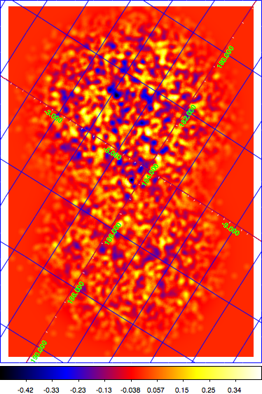

.. _sec_connecting_model:

Connecting observations to specific models
~~~~~~~~~~~~~~~~~~~~~~~~~~~~~~~~~~~~~~~~~~

In the previous examples there was always a single background model
component to describe the residual particle background in the
various dataset.
This implies that the spatial and spectral shape of the background
distribution is assumed to be identical for all observations.
This is fine in a simulation, but for a real life situation this
assumption will probably not hold.

Let's go back to the case of a joint analysis of two observations,
specified by the following observation definition XML file:

.. code-block:: xml

  <?xml version="1.0" standalone="no"?>
  <observation_list title="observation library">
    <observation name="Crab" id="00001" instrument="CTA">
      <parameter name="EventList" file="events1.fits"/>
    </observation>
    <observation name="Crab" id="00002" instrument="CTA">
      <parameter name="EventList" file="events2.fits"/>
    </observation>
  </observation_list>

Each observation has a **unique identifier string** and we can use this 
unique string to connect that observation to a specific model component.
This is illustrated in the model XML file below that now has two background
components.
**Model components in a XML file need to have a unique name**, for this
reason we have named the components ``Background_00001`` and
``Background_00002``.
Both components now have an ``id`` attribute that ties the model to
an observation.
In other words, the model is only applicable to a specific observation
(it will be ignored for all other observations).
In our case, model ``Background_00001`` applies to the ``events1.fits``
event list while model ``Background_00002`` applies to the ``events2.fits``
event list.

.. code-block:: xml

  <?xml version="1.0" standalone="no"?>
  <source_library title="source library">
    <source name="Crab" type="PointSource">
      <spectrum type="PowerLaw">
         <parameter name="Prefactor" scale="1e-16" value="5.7"  min="1e-07" max="1000.0" free="1"/>
         <parameter name="Index"     scale="-1"    value="2.48" min="0.0"   max="+5.0"   free="1"/>
         <parameter name="Scale"     scale="1e6"   value="0.3"  min="0.01"  max="1000.0" free="0"/>
      </spectrum>
      <spatialModel type="SkyDirFunction">
        <parameter name="RA"  scale="1.0" value="83.6331" min="-360" max="360" free="0"/>
        <parameter name="DEC" scale="1.0" value="22.0145" min="-90"  max="90"  free="0"/>
      </spatialModel>
    </source>
    <source name="Background_00001" type="RadialAcceptance" instrument="CTA" id="00001">
      <spectrum type="FileFunction" file="$CTOOLS/share/models/bkg_dummy.txt">
        <parameter scale="1.0" name="Normalization" min="0.0" max="1000.0" value="1.0" free="1"/>
      </spectrum>
      <radialModel type="Gaussian">
         <parameter name="Sigma" scale="1.0" value="3.0" min="0.01" max="10.0" free="1"/>
      </radialModel>
    </source>
    <source name="Background_00002" type="RadialAcceptance" instrument="CTA" id="00002">
      <spectrum type="FileFunction" file="$CTOOLS/share/models/bkg_dummy.txt">
        <parameter scale="1.0" name="Normalization" min="0.0" max="1000.0" value="10.0" free="1"/>
      </spectrum>
      <radialModel type="Gaussian">
         <parameter name="Sigma" scale="1.0" value="3.0" min="0.01" max="10.0" free="1"/>
      </radialModel>
    </source>
    </source_library>

Note that both background model components distinguish in their event rate;
component ``Background_00002`` has a ten times larger background rate than
component ``Background_00001``.
To illustrate this difference, we simulated two observations offset by
+/- 2 degrees from the Crab nebulae using :ref:`ctobssim`.
We then performed a joint fit of the observations using :ref:`ctlike`
and created a resdiual map using :ref:`csresmap` that is shown below.
Obviously, the upper observation has larger residuals owing to the ten 
times larger background rate that was used in the simulation of the
associated data.

     *Residual map of two jointly analysed observations offset by +/- 2 degrees*

The scheme is even more versatile in that it allows to connect a given 
model component to several specific observations.
This is illustrated in the model definition file below where component
``Background_00001`` is now applicable for observations ``00001``, 
``00003`` and ``00004``.

.. code-block:: xml

  <?xml version="1.0" standalone="no"?>
  <source_library title="source library">
    <source name="Crab" type="PointSource">
      <spectrum type="PowerLaw">
         <parameter name="Prefactor" scale="1e-16" value="5.7"  min="1e-07" max="1000.0" free="1"/>
         <parameter name="Index"     scale="-1"    value="2.48" min="0.0"   max="+5.0"   free="1"/>
         <parameter name="Scale"     scale="1e6"   value="0.3"  min="0.01"  max="1000.0" free="0"/>
      </spectrum>
      <spatialModel type="SkyDirFunction">
        <parameter name="RA"  scale="1.0" value="83.6331" min="-360" max="360" free="0"/>
        <parameter name="DEC" scale="1.0" value="22.0145" min="-90"  max="90"  free="0"/>
      </spatialModel>
    </source>
    <source name="Background_00001" type="RadialAcceptance" instrument="CTA" id="00001,00003,00004">
      <spectrum type="FileFunction" file="$CTOOLS/share/models/bkg_dummy.txt">
        <parameter scale="1.0" name="Normalization" min="0.0" max="1000.0" value="1.0" free="1"/>
      </spectrum>
      <radialModel type="Gaussian">
         <parameter name="Sigma" scale="1.0" value="3.0" min="0.01" max="10.0" free="1"/>
      </radialModel>
    </source>
    <source name="Background_00002" type="RadialAcceptance" instrument="CTA" id="00002">
      <spectrum type="FileFunction" file="$CTOOLS/share/models/bkg_dummy.txt">
        <parameter scale="1.0" name="Normalization" min="0.0" max="1000.0" value="10.0" free="1"/>
      </spectrum>
      <radialModel type="Gaussian">
         <parameter name="Sigma" scale="1.0" value="3.0" min="0.01" max="10.0" free="1"/>
      </radialModel>
    </source>
  </source_library>

   

