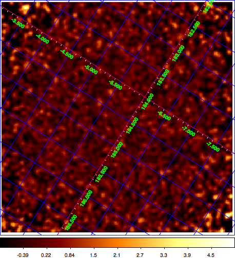

.. _sec_residual:

Generating a residual map
~~~~~~~~~~~~~~~~~~~~~~~~~

Once the data are fitted you may want to inspect the residuals between
the observed counts and the modeled event distribution.
This task is done using the :ref:`csresmap` script.
:ref:`csresmap` will create a stacked counts cube (using :ref:`ctbin`)
and subtract from this counts cube a model cube (computed using
:ref:`ctmodel`).
The difference will then be summed over all energy bins and divided by
the model value to obtained the fractional residuals

.. math::
   Residual = \frac{Counts-Model}{Model}

for all map pixels.

Suppose that you have done the following unbinned ``ctlike`` analysis:

.. code-block:: bash

  $ ctlike
  Event list, counts cube or observation definition file [events.fits] obs.xml
  Calibration database [prod2] 
  Instrument response function [South_50h] 
  Source model [$CTOOLS/share/models/crab.xml] 
  Source model output file [crab_results.xml] 

The :ref:`csresmap` script is then used as follows:

.. code-block:: bash

  $ csresmap
  Parfile csresmap.par not found. Create default parfile.
  Event list, counts cube, or observation definition file [events.fits] obs.xml
  Calibration database [prod2] 
  Instrument response function [South_50h] 
  Source model [$CTOOLS/share/models/crab.xml] crab_results.xml
  Output residual map [resmap.fits] 
  First coordinate of image center in degrees (RA or galactic l) [83.63] 
  Second coordinate of image center in degrees (DEC or galactic b) [22.01] 
  Coordinate System (CEL|GAL) [CEL] 
  Projection method e.g. AIT|AZP|CAR|MER|MOL|STG|TAN (AIT|AZP|CAR|MER|MOL|STG|TAN) [CAR]
  Size of the X axis in pixels [200] 
  Size of the Y axis in pixels [200] 
  Pixel size (deg/pixel) [0.02] 

In our example, the map will cover a field of 4 x 4 degrees centred on the 
Crab nebula at a pixel scale of 0.02 degrees per pixel.
The resulting residual map ``resmap.fits``, smoothed with a Gaussian
kernel of 3 pixels to enhance features, is shown in the following figure.
Obviously, the map is free from any significant residuals.

   *Residual map of the Crab region*

