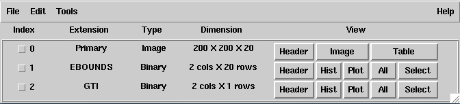

.. _quickstart:

A quick ctools tutorial
-----------------------

First steps with ctools
~~~~~~~~~~~~~~~~~~~~~~~

This section provides a step-by-step description of the CTA data analysis
procedure implemented in ctools. In this example we will simulate data for
the Crab nebula, observed on-axis, as a single source in the CTA field of 
view.

The example consists of the following analysis steps:

- :ref:`sec_simulating_cta`

- :ref:`sec_binning_cta`

- :ref:`sec_fitting_cta`

- :ref:`sec_unbinned_cta`

- :ref:`sec_butterfly_cta`

.. _sec_simulating_cta:

Simulating CTA data
~~~~~~~~~~~~~~~~~~~

CTA data are simulated using the :ref:`ctobssim` tool. To invoke the tool,
type :ref:`ctobssim` at the console prompt (which is denoted by ``$``).
:ref:`ctobssim` will query for a number of parameters:

.. code-block:: bash

  $ ctobssim
  RA of pointing (degrees) (0-360) [83.63] 
  Dec of pointing (degrees) (-90-90) [22.01] 
  Radius of FOV (degrees) (0-180) [5.0] 
  Start time (MET in s) (0) [0.0] 
  End time (MET in s) (0) [1800.0] 
  Lower energy limit (TeV) (0) [0.1] 
  Upper energy limit (TeV) (0) [100.0] 
  Calibration database [dummy] 
  Instrument response function [cta_dummy_irf] 
  Model [$CTOOLS/share/models/crab.xml] 
  Output event data file or observation definition file [events.fits] 

Each line represents a query for one parameter value.
The line starts with a short description of the parameter, followed by 
the default value proposed by ctobssim in squared brackets ``[ ]``.
**If no parameter is entered the default value will be used**
(which is the case for all parameters shown here).
Otherwise, the specified value will overwrite the default value.
The round brackets ``( )`` indicate the range of possible parameter
values (if applicable).

You may have recognised that the environment variable ``$CTOOLS`` has 
been used in the path name of the model. ctools will automatically expand
the environment variables in parameter inputs.

The CTA instrument properties (effective area, PSF width) are taken for
the moment from a dummy calibration database.

Events are simulated based on the instrument properties and based on a
source and background model. Only events that fall within the specified
region of interest (ROI), defined as a circle around a sky position in
Right Ascension and Declination (in degrees), will be stored in the output
event data file. The duration of the simulation is taken here to 30 minutes
(or 1800 seconds). Events are simulated for energies between 0.1 and 100 TeV.

The source and background model is defined by the XML file
``$CTOOLS/share/models/crab.xml``:

.. code-block:: xml

  <?xml version="1.0" standalone="no"?>
  <source_library title="source library">
    <source name="Crab" type="PointSource">
      <spectrum type="PowerLaw">
         <parameter name="Prefactor" scale="1e-16" value="5.7"  min="1e-07" max="1000.0" free="1"/>
         <parameter name="Index"     scale="-1"    value="2.48" min="0.0"   max="+5.0"   free="1"/>
         <parameter name="Scale"     scale="1e6"   value="0.3"  min="0.01"  max="1000.0" free="0"/>
      </spectrum>
      <spatialModel type="SkyDirFunction">
        <parameter name="RA"  scale="1.0" value="83.6331" min="-360" max="360" free="0"/>
        <parameter name="DEC" scale="1.0" value="22.0145" min="-90"  max="90"  free="0"/>
      </spatialModel>
    </source>
    <source name="Background" type="RadialAcceptance" instrument="CTA">
      <spectrum type="FileFunction" file="$CTOOLS/share/models/bkg_dummy.txt">
        <parameter scale="1.0" name="Normalization" min="0.0" max="1000.0" value="1.0" free="1"/>
      </spectrum>
      <radialModel type="Gaussian">
         <parameter name="Sigma" scale="1.0" value="3.0" min="0.01" max="10.0" free="1"/>
      </radialModel>
    </source>
  </source_library>

The model consists of a source library that contains two components:
the Crab nebula and an instrumental background model.

The Crab nebula is modelled by a factorized sky model that has a spectral
and a spatial component (tags ``<spectrum>`` and ``<spatialModel>``,
respectively). The spectrum is modelled by a power law, which is defined by 
three parameters: the ``Prefactor``, the ``Index`` and the ``Scale``.
The spatial model has two parameters: Right Ascension in degrees (RA), and 
Declination in degrees (DEC). Each parameter has a value and a scale factor, 
the real value of the parameter being the product ``value * scale``. Typically,
scale is chosen so that value is of the order of 1 (this is relevant for 
model fitting). In addition, value is bound by a minimum (min) and 
maximum (max) value, and a parameter may be free (``free="1"``) or fixed
(``free="0"``). The min, max, and free attributes are not relevant here for
the simulations, but they will be important for the model fitting later.

The spectral intensity I(E) (in units of photons/cm2/s/MeV) of the power
law is given by 

.. math::
    \frac{dN}{dE} = N_0 \left( \frac{E}{E_0} \right)^{\gamma}

where the parameters in the XML definition have the following mappings:

* :math:`N_0` = ``Prefactor``
* :math:`\gamma` = ``Index``
* :math:`E_0` = ``Scale``

Note that energies are given in MeV. This is a GammaLib convention that
can not be modified. **So make sure you always use MeV as energy unit in
an XML file.**

The instrumental background of CTA is modelled by a factorized data model
that has a spectral and a radial component (tags ``<spectrum>`` and
``<radialModel>``, respectively). The spectral component describes the 
on-axis background counting rate of CTA as function of energy in units of 
counts/s/sr/MeV. The radial component describes the variation of the 
background rate with offset angle squared, (i.e. square of the offset angle 
with respect to the pointing direction) which is modelled here by a Gaussian. 
The only parameter of the radial component is the width of the Gaussian Sigma, 
which is here set to 3 degrees squared.

:ref:`ctobssim` has a couple of hidden parameters, the most important one being
certainly ``seed``. ``seed`` is an integer that specifies the seed value
for the random number generator, and changing this parameter will allow to
generate statistically independent Monte Carlo samples of CTA event data.
To use for example a seed value of 41 you should type:

.. code-block:: bash

  $ ctobssim seed=41

:ref:`ctobssim` will write 2 files in the working directory: ``events.fits``
and ``ctobssim.log``. The first file contains the simulated events in FITS 
format and can be inspected using ``fv`` or ``ds9``. The FITS file will 
contain three extensions: an empty primary image, a binary table named 
``EVENTS`` that holds the events (one row per event), and a binary table
named ``GTI`` holding the Good Time Intervals (for the moment a single row
with 2 columns providing the start and the stop time of the simulated time
interval).

The second file produced by :ref:`ctobssim` is a human readable log file that
contains information about the job execution. As example, the last lines
from this file are shown here:

.. code-block:: xml

  2015-02-04T15:04:56: +======================+
  2015-02-04T15:04:56: | Simulate observation |
  2015-02-04T15:04:56: +======================+
  2015-02-04T15:04:56: === Observation ===
  2015-02-04T15:04:56:  Simulation area ...........: 1.9635e+11 cm2
  2015-02-04T15:04:56:  Simulation cone ...........: RA=83.63 deg, Dec=22.01 deg, r=5.5 deg
  2015-02-04T15:04:56:  Time interval .............: 0 - 1800 s
  2015-02-04T15:04:56:  Photon energy range .......: 100 GeV - 100 TeV
  2015-02-04T15:04:56:  Event energy range ........: 100 GeV - 100 TeV
  2015-02-04T15:04:56:  MC source photons .........: 207547 [Crab]
  2015-02-04T15:04:56:  MC source events ..........: 995 [Crab]
  2015-02-04T15:04:56:  MC source events ..........: 995 (all source models)
  2015-02-04T15:04:56:  MC background events ......: 5146
  2015-02-04T15:04:56:  MC events .................: 6141 (all models)

Each line starts with the UTC time at which the line has been written. In
this run, 207547 Crab photons have been thrown over an area of 19.6 square
kilometres during a time interval of 1800 seconds. 995 of these photons have
been registered by CTA as events. In the same time interval, 5146 background
events have been registred by CTA.

You may change the name of the log file using the hidden parameter 
``logfile``:

.. code-block:: bash

  $ ctobssim logfile=my-private-log-file

Furthermore, you may decide on the amount of information provided in the 
log file (the chattiness of the executable) using the hidden parameter 
``chatter``:

.. code-block:: bash

  $ ctobssim chatter=4

``chatter`` can vary between 0 and 4, 0 providing no information while 4 
provides the most detailed information. **By default, all ctools have a
chatter level of 2.**

You may also duplicate the log file information into the console by setting
the hidden ``debug`` parameter to yes:

.. code-block:: bash

  $ ctobssim debug=yes

.. _sec_binning_cta:

Binning CTA data
~~~~~~~~~~~~~~~~

As next analysis step you will bin the data in a counts cube using 
:ref:`ctbin`.
A counts cube is a 3 dimensional data cube, spanned by
Right Ascension (or Galactic longitude), Declination (or Galactic latitude),
and energy (typically logarithmically spaced, but this is under user
control).

:ref:`ctbin` is executed by typing:

.. code-block:: bash

  $ ctbin
  Event list or observation definition file [events.fits] 
  First coordinate of image center in degrees (RA or galactic l) [83.63] 
  Second coordinate of image center in degrees (DEC or galactic b) [22.01] 
  Projection method e.g. AIT|AZP|CAR|MER|STG|TAN (AIT|AZP|CAR|MER|STG|TAN) [CAR] 
  Coordinate system (CEL - celestial, GAL - galactic) (CEL|GAL) [CEL] 
  Image scale (in degrees/pixel) [0.02] 
  Size of the X axis in pixels [200] 
  Size of the Y axis in pixels [200] 
  Algorithm for defining energy bins (FILE|LIN|LOG) [LOG] 
  Start value for first energy bin in TeV [0.1] 
  Stop value for last energy bin in TeV [100.0] 
  Number of energy bins [20] 
  Output counts cube [cntcube.fits]

The counts cube will be centred on the location of the Crab (Right Ascension
83.63 degrees, Declination 22.01 degrees) and will be aligned in celestial
coordinates. A cartesian projection has been selected. The counts cube has 
200 x 200 spatial pixels of 0.02 x 0.02 degrees in size, hence it covers a 
total area of 4 x 4 degrees.

The counts cube will contain 20 maps, which are logarithmically spaced
in energy, and which cover the energy range from 0.1 TeV to 100 TeV. In this
example, the counts cube will be saved as ``cntcube.fits`` in the working
directory. In addition to the counts cube, that is stored as the primary
image extension, the FITS file also contains an extension named ``EBOUNDS``
that defines the energy boundaries that were used, and an extension ``GTI``
that defines the Good Time Intervals that have been used. The following
image shows the resulting FITS file. The ``EBOUNDS`` table has 20 rows, one
for each energy bin, while the ``GTI`` table has just a single row, indicating
the start and stop time of the simulated data.

   *Counts cube FITS file*

An image of the first bin, covering the energy range 100 - 141 GeV, is 
shown below:

.. figure:: cntmap-map.jpg
   :width: 50%

   *Counts cube for first energy bin*

For illustration, the last few lines of the log file ``ctbin.log`` are 
reproduced below:

.. code-block:: xml

  2015-02-04T15:33:34: +====================+
  2015-02-04T15:33:34: | Binned observation |
  2015-02-04T15:33:34: +====================+
  2015-02-04T15:33:34: === GObservations ===
  2015-02-04T15:33:34:  Number of observations ....: 1
  2015-02-04T15:33:34:  Number of predicted events : 0
  2015-02-04T15:33:34: === GCTAObservation ===
  2015-02-04T15:33:34:  Name ......................: 
  2015-02-04T15:33:34:  Identifier ................: 
  2015-02-04T15:33:34:  Instrument ................: CTA
  2015-02-04T15:33:34:  Event file ................: 
  2015-02-04T15:33:34:  Event type ................: CountsCube
  2015-02-04T15:33:34:  Statistics ................: Poisson
  2015-02-04T15:33:34:  Ontime ....................: 1800 s
  2015-02-04T15:33:34:  Livetime ..................: 1710 s
  2015-02-04T15:33:34:  Deadtime correction .......: 0.95
  2015-02-04T15:33:34:  User energy range .........: undefined
  2015-02-04T15:33:34: === GCTAPointing ===
  2015-02-04T15:33:34:  Pointing direction ........: (RA,Dec)=(83.63,22.01)
  2015-02-04T15:33:34:  Response function .........: undefined
  2015-02-04T15:33:34: === GCTAEventCube ===
  2015-02-04T15:33:34:  Number of events ..........: 5542
  2015-02-04T15:33:34:  Number of elements ........: 800000
  2015-02-04T15:33:34:  Number of pixels ..........: 40000
  2015-02-04T15:33:34:  Number of energy bins .....: 20
  2015-02-04T15:33:34:  Time interval .............: 0 - 1800 sec
  2015-02-04T15:33:34: 
  2015-02-04T15:33:34: +==================+
  2015-02-04T15:33:34: | Save observation |
  2015-02-04T15:33:34: +==================+
  2015-02-04T15:33:34: 
  2015-02-04T15:33:34: Application "ctbin" terminated after 14 wall clock seconds, consuming 0.332675 seconds of CPU time.

From the 6141 events that have been simulated and stored in the 
``events.fits`` file, 5542 lie within the cube boundaries and are thus put
into the resulting counts cube. The counts cube is stored in a cartesian
projection in a World Coordinate System (WCS) compliant format.

.. _sec_fitting_cta:

Fitting CTA data
~~~~~~~~~~~~~~~~

Now we are ready to fit the simulated data with a model. For simplicity
we use in this example the same model that we used to simulate the data
with :ref:`ctobssim`. Model fitting is done using the :ref:`ctlike` tool,
and we do the fit by typing:

.. code-block:: bash

  $ ctlike
  Event list, counts cube or observation definition file [events.fits] cntcube.fits
  Exposure cube file (only needed for stacked analysis) [NONE] 
  PSF cube file (only needed for stacked analysis) [NONE] 
  Calibration database [dummy] 
  Instrument response function [cta_dummy_irf] 
  Source model [$CTOOLS/share/models/crab.xml] 
  Source model output file [crab_results.xml]

Fitting of the data is done in *binned* mode, which means that the events
have been binned into a counts cube and the fit computes the log-likelihood
function by summing over all 200 x 200 x 20 bins of the counts cube. There is
an alternative method, the so called *unbinned* mode, where the events are
not binned into a counts cube and the log-likelihood is computed directly by
summing over all events. We will explore the *unbinned* mode later.

One of the parameters of :ref:`ctlike` is a source model output file
(we specified ``crab_results.xml`` in the example), and this file will be
a copy of the source model input XML file where the parameter values have
been replaced by the fit results. In addition, the statistical uncertainties
are added for each fitted parameter using the attribute error. Below we show 
the XML result file that has been produced by the run:

.. code-block:: xml

  <?xml version="1.0" encoding="UTF-8" standalone="no"?>
  <source_library title="source library">
    <source name="Crab" type="PointSource">
      <spectrum type="PowerLaw">
        <parameter name="Prefactor" value="6.07928" error="0.204582" scale="1e-16" min="1e-07" max="1000" free="1" />
        <parameter name="Index" value="2.5009" error="0.0252057" scale="-1" min="0" max="5" free="1" />
        <parameter name="Scale" value="0.3" scale="1e+06" min="0.01" max="1000" free="0" />
      </spectrum>
      <spatialModel type="SkyDirFunction">
        <parameter name="RA" value="83.6331" scale="1" min="-360" max="360" free="0" />
        <parameter name="DEC" value="22.0145" scale="1" min="-90" max="90" free="0" />
      </spatialModel>
    </source>
    <source name="Background" type="RadialAcceptance" instrument="CTA">
      <spectrum type="FileFunction" file="$CTOOLS/share/models/bkg_dummy.txt">
        <parameter name="Normalization" value="0.990708" error="0.0192887" scale="1" min="0" max="1000" free="1" />
      </spectrum>
      <radialModel type="Gaussian">
        <parameter name="Sigma" value="3.02523" error="0.0594117" scale="1" min="0.01" max="10" free="1" />
      </radialModel>
    </source>
  </source_library>

In this example, the ``Prefactor`` and ``Index`` of the spectral model for the
Crab as well as the ``Normalization`` and ``Sigma`` parameter of the radial
acceptance model have been fitted (all parameters having the attribute 
``free="1"`` are fitted).

To get more details about the model fitting you can inspect the log file.
Below the last lines of the ctlike.log log file that has been produced by
this run:

.. code-block:: xml

  2015-02-04T15:50:43: +=================================+
  2015-02-04T15:50:43: | Maximum likelihood optimisation |
  2015-02-04T15:50:43: +=================================+
  2015-02-04T15:50:44:  >Iteration   0: -logL=22752.553, Lambda=1.0e-03
  2015-02-04T15:50:46:  >Iteration   1: -logL=22750.640, Lambda=1.0e-03, delta=1.913, max(|grad|)=-0.941594 [Index:3]
  2015-02-04T15:50:47:  >Iteration   2: -logL=22750.632, Lambda=1.0e-04, delta=0.008, max(|grad|)=-0.079270 [Index:3]
  2015-02-04T15:50:48:  >Iteration   3: -logL=22750.632, Lambda=1.0e-05, delta=0.000, max(|grad|)=-0.003073 [Index:3]
  2015-02-04T15:50:49: 
  2015-02-04T15:50:49: +=========================================+
  2015-02-04T15:50:49: | Maximum likelihood optimization results |
  2015-02-04T15:50:49: +=========================================+
  2015-02-04T15:50:49: === GOptimizerLM ===
  2015-02-04T15:50:49:  Optimized function value ..: 22750.632
  2015-02-04T15:50:49:  Absolute precision ........: 0.005
  2015-02-04T15:50:49:  Acceptable value decrease .: 2
  2015-02-04T15:50:49:  Optimization status .......: converged
  2015-02-04T15:50:49:  Number of parameters ......: 9
  2015-02-04T15:50:49:  Number of free parameters .: 4
  2015-02-04T15:50:49:  Number of iterations ......: 3
  2015-02-04T15:50:49:  Lambda ....................: 1e-06
  2015-02-04T15:50:49:  Maximum log likelihood ....: -22750.632
  2015-02-04T15:50:49:  Observed events  (Nobs) ...: 5542.000
  2015-02-04T15:50:49:  Predicted events (Npred) ..: 5542.000 (Nobs - Npred = 3.3498e-06)
  2015-02-04T15:50:49: === GModels ===
  2015-02-04T15:50:49:  Number of models ..........: 2
  2015-02-04T15:50:49:  Number of parameters ......: 9
  2015-02-04T15:50:49: === GModelSky ===
  2015-02-04T15:50:49:  Name ......................: Crab
  2015-02-04T15:50:49:  Instruments ...............: all
  2015-02-04T15:50:49:  Instrument scale factors ..: unity
  2015-02-04T15:50:49:  Observation identifiers ...: all
  2015-02-04T15:50:49:  Model type ................: PointSource
  2015-02-04T15:50:49:  Model components ..........: "SkyDirFunction" * "PowerLaw" * "Constant"
  2015-02-04T15:50:49:  Number of parameters ......: 6
  2015-02-04T15:50:49:  Number of spatial par's ...: 2
  2015-02-04T15:50:49:   RA .......................: 83.6331 [-360,360] deg (fixed,scale=1)
  2015-02-04T15:50:49:   DEC ......................: 22.0145 [-90,90] deg (fixed,scale=1)
  2015-02-04T15:50:49:  Number of spectral par's ..: 3
  2015-02-04T15:50:49:   Prefactor ................: 6.07928e-16 +/- 2.04582e-17 [1e-23,1e-13] ph/cm2/s/MeV (free,scale=1e-16,gradient)
  2015-02-04T15:50:49:   Index ....................: -2.5009 +/- 0.0252057 [-0,-5]  (free,scale=-1,gradient)
  2015-02-04T15:50:49:   PivotEnergy ..............: 300000 [10000,1e+09] MeV (fixed,scale=1e+06,gradient)
  2015-02-04T15:50:49:  Number of temporal par's ..: 1
  2015-02-04T15:50:49:   Constant .................: 1 (relative value) (fixed,scale=1,gradient)
  2015-02-04T15:50:49: === GCTAModelRadialAcceptance ===
  2015-02-04T15:50:49:  Name ......................: Background
  2015-02-04T15:50:49:  Instruments ...............: CTA
  2015-02-04T15:50:49:  Instrument scale factors ..: unity
  2015-02-04T15:50:49:  Observation identifiers ...: all
  2015-02-04T15:50:49:  Model type ................: "Gaussian" * "FileFunction" * "Constant"
  2015-02-04T15:50:49:  Number of parameters ......: 3
  2015-02-04T15:50:49:  Number of radial par's ....: 1
  2015-02-04T15:50:49:   Sigma ....................: 3.02523 +/- 0.0594117 [0.01,10] deg2 (free,scale=1,gradient)
  2015-02-04T15:50:49:  Number of spectral par's ..: 1
  2015-02-04T15:50:49:   Normalization ............: 0.990708 +/- 0.0192887 [0,1000]  (free,scale=1,gradient)
  2015-02-04T15:50:49:  Number of temporal par's ..: 1
  2015-02-04T15:50:49:   Constant .................: 1 (relative value) (fixed,scale=1,gradient)
  2015-02-04T15:50:49: 
  2015-02-04T15:50:49: +==============+
  2015-02-04T15:50:49: | Save results |
  2015-02-04T15:50:49: +==============+
  2015-02-04T15:50:49: 
  2015-02-04T15:50:49: Application "ctlike" terminated after 15 wall clock seconds, consuming 5.92686 seconds of CPU time.

The maximum likelihood optimizer required 3 iterations to converge. This
is pretty fast, but recall that we used the same model file for the simulation
and for fitting, hence the initial parameter values were already very close
to the best fitting values. To see the impact of the initial parameters on
the fit result, you may re-run :ref:`ctlike` using another copy of the model
XML file where you change the value attributes of the parameters that should be 
fitted. You will see that the optimizer requires a couple of more iterations,
but it should converge to the same solution (provided that the initial values
are not too far of the best fitting values).

.. note::

   As sanity check you should verify that the predicted number of events
   (Npred) is equal to the observed number of events (Nobs). To facilitate
   this comparison, :ref:`ctlike` provides the difference Nobs - Npred in 
   the log file. In real life situations, this difference may not always be
   small, in particular if the source model is too constrained. You may 
   then free some of the model parameters so that the fit can correctly
   describe the data.

.. note::

   The :ref:`ctlike` tool has the ability to estimate the detection 
   significance for sources in the XML model. This is done by computing
   the Test Statistic value which is defined as twice the log-likelihood
   difference between fitting a source at a given position on top of a 
   (background) model or fitting no source. Roughly speaken, the square
   root of the Test Statistic value gives the source detection significance
   in Gaussian sigmas, although the exact relation depends somewhat on
   the formulation of the statistical problem.

   To instruct :ref:`ctlike` to compute the Test Statistic value for a
   given source you need to add the attribute ``tscalc="1"`` to the XML
   file:

   .. code-block:: xml

      <source name="Crab" type="PointSource" tscalc="1">

   :ref:`ctlike` will then compute the Test Statistic value for that
   source and dump the result in the log file:

   .. code-block:: xml

      2015-02-05T08:29:07: === GModelSky ===
      2015-02-05T08:29:07:  Name ......................: Crab
      2015-02-05T08:29:07:  Instruments ...............: all
      2015-02-05T08:29:07:  Test Statistic ............: 6875.35

   The Test Statistic value will also be added as new attribute
   ``ts`` to the XML result file:

   .. code-block:: xml

      <source name="Crab" type="PointSource" ts="6875.350" tscalc="1">

.. _sec_unbinned_cta:

Doing an unbinned analysis
~~~~~~~~~~~~~~~~~~~~~~~~~~

As gamma-ray events are rare, the counts cubes generated by :ref:`ctbin`
will in general be sparse, having many empty pixels, in particular at
high energies.
An alternative analysis technique consists of working directly on the event
list without binning the events in a counts cube. We will see the benefit of
such an analysis later once you re-run :ref:`ctlike` in unbinned mode.

For unbinned analysis you first have to define the data space region over
which the analysis is done. This is similiar to the :ref:`ctbin` step for
a binned analysis where you defined the size of the counts cube, the energy
range, and the time interval. For unbinned analysis you have no such thing 
as a counts cube, but you have to define over which region of the data space
the selected events are spread (because the ctools have to integrate over
this region to compute the total number of predicted events in the data space
that you analyse). Furthermore, you have to define what energy range is
covered, and what time interval is spanned by the data. All this is done 
by the :ref:`ctselect` tool, which replaces the :ref:`ctbin` step in an
unbinned analysis.

:ref:`ctselect` performs an event selection by choosing only events within
a given region-of-interest (ROI), within a given energy band, and within a
given time interval from the input event list. The ROI is a circular region on
the sky, for which you define the centre (in celestial coordinates) and the
radius. Such a circular ROI is sometimes also called an acceptance cone. The
following example shows how to run ctselect:

.. code-block:: bash

  $ ctselect
  Input event list or observation definition file [events.fits] 
  RA for ROI centre (degrees) (0-360) [83.63] 
  Dec for ROI centre (degrees) (-90-90) [22.01] 
  Radius of ROI (degrees) (0-180) [3.0] 
  Start time (CTA MET in seconds) (0) [0.0] 
  End time (CTA MET in seconds) (0) [0.0] 
  Lower energy limit (TeV) (0) [0.1] 
  Upper energy limit (TeV) (0) [100.0] 
  Output event list or observation definition file [selected_events.fits]

:ref:`ctselect` takes the input event list ``events.fits``, performs an
event selection, and writes the selected event into the file 
``selected_events.fits``. The parameters it will query for are the centre
of the ROI, the radius of the ROI, the start and stop time (in seconds),
and the energy lower and upper limits (in TeV). The event selection information
is also written as a set of data selection keywords to the output events
file ``selected_events.fits``, by respecting the same syntax that has been
implemented for Fermi/LAT. The following image is a screen dump of the data
selection keywords that have been written to the ``EVENTS`` header in the
file ``selected_events.fits``:

.. figure:: dskeys.jpg
   :width: 60%

   *Data selection keywords*

**It is mandatory for an unbinned analysis that these data selection keywords
exist in the FITS file.**
If they don't exist, :ref:`ctlike` will not execute in unbinned mode.

Below some lines of the ``ctselect.log`` file that show the data selection 
part:

.. code-block:: xml

  2015-02-04T17:21:41: +=================+
  2015-02-04T17:21:41: | Event selection |
  2015-02-04T17:21:41: +=================+
  2015-02-04T17:21:41: === Observation ===
  2015-02-04T17:21:41:  Selected energy range .....: 0.1 - 100 TeV
  2015-02-04T17:21:41:  Requested ROI .............: Centre(RA,DEC)=(83.63, 22.01) deg, Radius=3 deg
  2015-02-04T17:21:41:  ROI of data ...............: Centre(RA,DEC)=(83.63, 22.01) deg, Radius=5 deg
  2015-02-04T17:21:41:  Selected ROI ..............: Centre(RA,DEC)=(83.63, 22.01) deg, Radius=3 deg
  2015-02-04T17:21:41:  cfitsio selection .........: ENERGY >= 0.10000000 && ENERGY <= 100.00000000 && ANGSEP(83.630000,22.010000,RA,DEC) <= 3.000000
  2015-02-04T17:21:41:  FITS filename .............: /var/tmp/tmp.0.pTIaTL[EVENTS][ENERGY >= 0.10000000 && ENERGY <= 100.00000000 && ANGSEP(83.630000,22.010000,RA,DEC) <= 3.000000]
 
.. note::

   :ref:`ctobssim` will also write data selection keywords in the event
   list FITS file, hence you can run :ref:`ctlike` directly on a FITS file
   produced by :ref:`ctobssim`. Any selection performed by :ref:`ctselect`
   needs to be fully enclosed within any previous selection, e.g. the ROI
   needs to be fully enclosed in the acceptance cone used for event 
   simulation, the energy selection must be fully comprised in the
   range of simulated energies, the same applies for the temporal selection.
   :ref:`ctselect` will automatically adjust
   the selection parameters to guarantee full enclosure. To keep track of
   this adjustment, the :ref:`ctselect` log file quotes the requested
   selection, and existing selections, and the selection that was finally 
   applied.

.. note::

   :ref:`ctselect` may of course also be used for event selection prior to
   binned analysis, for example to select events for a given period in
   time. **If you use** :ref:`ctselect` **however to make a spatial or energy
   selection, make sure that the counts cube is fully enclosed in the
   selection intervals.** Otherwise you will get empty zones in the counts 
   cube of which the ctools are not aware of, and the subsequent analysis
   results will be wrong.

Now that you have selected the events of interest, you can run ctlike in 
unbinned mode. To do this you have to specify the selected event list 
instead of the counts cube:

.. code-block:: bash

  $ ctlike
  Event list, counts cube or observation definition file [cntmap.fits] selected_events.fits
  Calibration database [dummy] 
  Instrument response function [cta_dummy_irf] 
  Source model [$CTOOLS/share/models/crab.xml] 
  Source model output file [crab_results.xml] 

You will recognise that :ref:`ctlike` runs much faster in unbinned mode
compared to binned mode.
This is understandable as the selected event list contains
only 6127 events, while the binned counts cube we used before had 
200 x 200 x 20 = 800000 pixels. As unbinned maximum likelihood fitting loops
over the events (while binned maximum likelihood loops over the pixels),
there are much less operations to perform in unbinned than in binned mode
(there is some additional overhead in unbinned mode that comes from
integrating the models over the region of interest, yet this is negligible
compared to the operations needed when looping over the pixels). So as long
as you work with short event lists, unbinned mode is faster.
Unbinned :ref:`ctlike` should also be more precise as no binning is performed,
hence there is no loss of information due to histogramming.

Below you see the corresponding output from the ctlike.log file. The fitted
parameters are essentially identical to the ones found in binned mode.
The slight difference with respect to the binned analysis may be explained
by the different event sample that has been used for the analysis: while 
binned likelihood works on rectangular counts cubes, unbinned likelihood works
on circular event selection regions. It is thus not possible to select exactly
the same events for both analyses.

.. code-block:: xml

  2015-02-04T17:31:58: +=================================+
  2015-02-04T17:31:58: | Maximum likelihood optimisation |
  2015-02-04T17:31:58: +=================================+
  2015-02-04T17:31:58:  >Iteration   0: -logL=44395.244, Lambda=1.0e-03
  2015-02-04T17:31:58:   Iteration   1: -logL=44396.223, Lambda=1.0e-03, delta=-0.979, max(|grad|)=9.644743 [Sigma:6] (stalled)
  2015-02-04T17:31:58:  >Iteration   2: -logL=44396.162, Lambda=1.0e-02, delta=0.061, max(|grad|)=-0.309683 [Normalization:7]
  2015-02-04T17:31:59:  >Iteration   3: -logL=44396.162, Lambda=1.0e-03, delta=0.000, max(|grad|)=-0.008931 [Index:3]
  2015-02-04T17:31:59: 
  2015-02-04T17:31:59: +=========================================+
  2015-02-04T17:31:59: | Maximum likelihood optimization results |
  2015-02-04T17:31:59: +=========================================+
  2015-02-04T17:31:59: === GOptimizerLM ===
  2015-02-04T17:31:59:  Optimized function value ..: 44396.162
  2015-02-04T17:31:59:  Absolute precision ........: 0.005
  2015-02-04T17:31:59:  Acceptable value decrease .: 2
  2015-02-04T17:31:59:  Optimization status .......: converged
  2015-02-04T17:31:59:  Number of parameters ......: 9
  2015-02-04T17:31:59:  Number of free parameters .: 4
  2015-02-04T17:31:59:  Number of iterations ......: 3
  2015-02-04T17:31:59:  Lambda ....................: 0.0001
  2015-02-04T17:31:59:  Maximum log likelihood ....: -44396.162
  2015-02-04T17:31:59:  Observed events  (Nobs) ...: 6127.000
  2015-02-04T17:31:59:  Predicted events (Npred) ..: 6127.000 (Nobs - Npred = 0.000303534)
  2015-02-04T17:31:59: === GModels ===
  2015-02-04T17:31:59:  Number of models ..........: 2
  2015-02-04T17:31:59:  Number of parameters ......: 9
  2015-02-04T17:31:59: === GModelSky ===
  2015-02-04T17:31:59:  Name ......................: Crab
  2015-02-04T17:31:59:  Instruments ...............: all
  2015-02-04T17:31:59:  Instrument scale factors ..: unity
  2015-02-04T17:31:59:  Observation identifiers ...: all
  2015-02-04T17:31:59:  Model type ................: PointSource
  2015-02-04T17:31:59:  Model components ..........: "SkyDirFunction" * "PowerLaw" * "Constant"
  2015-02-04T17:31:59:  Number of parameters ......: 6
  2015-02-04T17:31:59:  Number of spatial par's ...: 2
  2015-02-04T17:31:59:   RA .......................: 83.6331 [-360,360] deg (fixed,scale=1)
  2015-02-04T17:31:59:   DEC ......................: 22.0145 [-90,90] deg (fixed,scale=1)
  2015-02-04T17:31:59:  Number of spectral par's ..: 3
  2015-02-04T17:31:59:   Prefactor ................: 6.13325e-16 +/- 2.05738e-17 [1e-23,1e-13] ph/cm2/s/MeV (free,scale=1e-16,gradient)
  2015-02-04T17:31:59:   Index ....................: -2.5057 +/- 0.0250818 [-0,-5]  (free,scale=-1,gradient)
  2015-02-04T17:31:59:   PivotEnergy ..............: 300000 [10000,1e+09] MeV (fixed,scale=1e+06,gradient)
  2015-02-04T17:31:59:  Number of temporal par's ..: 1
  2015-02-04T17:31:59:   Constant .................: 1 (relative value) (fixed,scale=1,gradient)
  2015-02-04T17:31:59: === GCTAModelRadialAcceptance ===
  2015-02-04T17:31:59:  Name ......................: Background
  2015-02-04T17:31:59:  Instruments ...............: CTA
  2015-02-04T17:31:59:  Instrument scale factors ..: unity
  2015-02-04T17:31:59:  Observation identifiers ...: all
  2015-02-04T17:31:59:  Model type ................: "Gaussian" * "FileFunction" * "Constant"
  2015-02-04T17:31:59:  Number of parameters ......: 3
  2015-02-04T17:31:59:  Number of radial par's ....: 1
  2015-02-04T17:31:59:   Sigma ....................: 3.04429 +/- 0.0330227 [0.01,10] deg2 (free,scale=1,gradient)
  2015-02-04T17:31:59:  Number of spectral par's ..: 1
  2015-02-04T17:31:59:   Normalization ............: 0.996767 +/- 0.0175227 [0,1000]  (free,scale=1,gradient)
  2015-02-04T17:31:59:  Number of temporal par's ..: 1
  2015-02-04T17:31:59:   Constant .................: 1 (relative value) (fixed,scale=1,gradient)
  2015-02-04T17:31:59: 
  2015-02-04T17:31:59: +==============+
  2015-02-04T17:31:59: | Save results |
  2015-02-04T17:31:59: +==============+
  2015-02-04T17:31:59: 
  2015-02-04T17:31:59: Application "ctlike" terminated after 8 wall clock seconds, consuming 0.21275 seconds of CPU time.

.. _sec_butterfly_cta:

Calculating and visualising a butterfly
~~~~~~~~~~~~~~~~~~~~~~~~~~~~~~~~~~~~~~~

To visualise the analysis results retrieved above, one can calculate the
confidence band of the spectral fit.
The :ref:`ctbutterfly` tool takes the optimised source model as input.
It takes the covariance matrix from the fit to conduct a
Gaussian error propagation for each energy value. It will write the 
butterfly information into an ASCII file.
The following example shows how to compute such a butterfly from the command
line.

.. code-block:: bash

  $ ctbutterfly
  Input event list, cube or observation definition file [events.fits] 
  Calibration database [dummy] 
  Instrument response function [cta_dummy_irf] 
  Source model [$CTOOLS/share/models/crab.xml] crab_results.xml
  Source of interest [Crab] 
  Start value for first energy bin in TeV [0.1] 
  Stop value for last energy bin in TeV [100.0] 
  Output ascii file [butterfly.txt]

Now that you have computed the confidence band of the spectral fit and 
that you will have an ASCII file named ``butterfly.txt`` on disk you can
visualise the butterfly using the script ``show_butterfly.py`` that is 
in the ctools ``example`` folder. You will need matplotlib on your system
to make this work. To launch the script, type:

.. code-block:: bash

  python $CTOOLS/share/examples/python/show_butterfly.py butterfly.txt
	
This will result in a canvas which should look like the following:

.. figure:: butterfly.jpg
   :width: 60%

   *Confidence band of the fit*
 