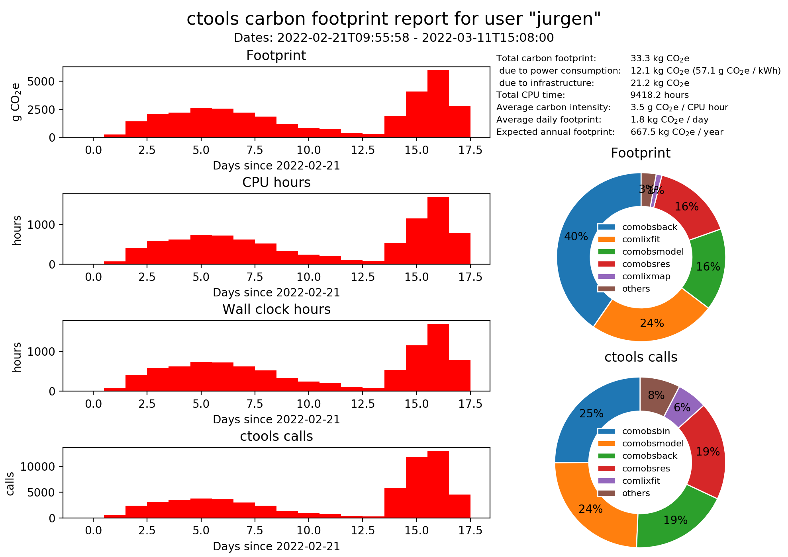

.. _sec_environment:

Environmental impact
====================

Like any human activity, using ctools will have an environmental impact. This
includes for example the greenhouse gas emissions related to electricity
production that is needed to run your computer or data centre. It includes as
well the environmental footprint of your computing hardware, the power and
material behind your internet connection, your storage array, and even the
footprint of the personnel that eventually runs your data centre.

As ctools user you should be aware of this footprint, and you should aim
to reduce it as much as possible.

To guide you in this endeavor, all ctools and cscripts inform you at the end
of the log file about the estimated carbon footprint of your computations:

.. code-block:: bash

   2022-02-18T22:33:26: Application "ctlike" terminated after 3910.0 wall clock seconds, consuming 3881.18 seconds of CPU time and generating a carbon footprint of 3.81083 g eCO2.

This estimate is based on the study of
`Berthoud et al. (2020) <https://hal.archives-ouvertes.fr/hal-02549565v4/document>`_
who assessed the carbon footprint of the DAHU cluster of the UMS GRICAD (Grenoble,
France) in 2019. Their study included

* server fabrication
* server environment
* server usage (electricity)
* travelling of personnel in the context of their work
* travelling of personnel from home to office
* personnel equipment
* personnel energy

`Berthoud et al. (2020) <https://hal.archives-ouvertes.fr/hal-02549565v4/document>`_
found that, per CPU hour, the footprint of the GRICAD data centre was 2.43 g CO2e
(equivalent CO2 emissions) due to electricity use and 2.25 g CO2e due to the data
centre environment, hardware fabrication and the personnel. For their study a
carbon intensity of 108 g eCO2 / kWh for greenhouse gas emission due to
electricity generation was assumed.

The latter varies substantially between countries. While the current electricity mix
in France has a (rounded) carbon intensity of 60 g eCO2 / kWh, values go through
240 g eCO2 / kWh (Spain), 410 g eCO2 / kWh (Italy), 460 g eCO2 / kWh (Germany),
520 g eCO2 / kWh (USA), up to 840 g eCO2 / kWh (Australia). So eventually, you should
think about doing your computations in a country with a low carbon intensity, or make
sure that your data centre is running on a low carbon energy source.

ctools will determine in which country your code is executed and fetch the appropriate
carbon intensity for the general energy mix in this country to estimate the carbon
footprint of your computations. The estimate is done using

.. math::
   {\rm Carbon\,\,footprint} = \left( 2.25 + 2.43 \frac{\rm CI}{108} \right) \times {\rm CPU\,\,hours}

where :math:`{\rm CI}` is the carbon intensity of the electricity mix in your country
in units of g eCO2 / kWh, :math:`{\rm CPU\,\,hours}` is the number of CPU hours your
computation took, and :math:`{\rm Carbon\,\,footprint}` is the carbon footprint in g eCO2.

The carbon footprint of all ctools and cscript runs are stored in an ASCII file
that you will find in a folder under your home directory, named ``.gamma/statistics.csv``.
This file is regularly scanned and purged by the GammaLib daemon that creates the
high-level statistics file ``.gamma/statistics.xml`` that is in the same folder. You may
display the content of this file using the ``csfootprint`` script:

.. code-block:: bash

   $ csfootprint debug=yes
   Start time for report (UTC string, JD, MJD or MET in seconds) [NONE]
   Stop time for report (UTC string, JD, MJD or MET in seconds) [NONE]
   Output graphics file (NONE if no graphics should be generated) [NONE]
   ...
   2022-03-11T15:12:58: +===================+
   2022-03-11T15:12:58: | Global statistics |
   2022-03-11T15:12:58: +===================+
   2022-03-11T15:12:58:  Creation date .............: 2022-02-21T10:55:46
   2022-03-11T15:12:58:  Last statistics update ....: 2022-03-11T15:11:43
   2022-03-11T15:12:58:  Statistics date interval ..: 2022-02-21T09:55:58 - 2022-03-11T15:08:00
   2022-03-11T15:12:58:  Used date interval ........: 2022-02-21T09:55:58 - 2022-03-11T15:08:00
   2022-03-11T15:12:58:  Duration of used interval .: 437.2 hours
   2022-03-11T15:12:58:  Total number of ctool runs : 61250
   2022-03-11T15:12:58:  Total wall clock time .....: 9418.0 hours
   2022-03-11T15:12:58:  Total CPU time ............: 9418.2 hours
   2022-03-11T15:12:58:  Average CPU load ..........: 100.0 %
   2022-03-11T15:12:58:  Total carbon footprint ....: 33.3 kg CO2e
   2022-03-11T15:12:58:   due to power consumption .: 12.1 kg CO2e (57.1 g CO2e / kWh)
   2022-03-11T15:12:58:   due to infrastructure ....: 21.2 kg CO2e
   2022-03-11T15:12:58:  Average carbon intensity ..: 3.5 g CO2e / CPU hour
   2022-03-11T15:12:58:  Average daily footprint ...: 1.8 kg CO2e / day
   2022-03-11T15:12:58:  Expected annual footprint .: 667.5 kg CO2e / year
   2022-03-11T15:12:58:
   2022-03-11T15:12:58: +==================+
   2022-03-11T15:12:58: | Daily statistics |
   2022-03-11T15:12:58: +==================+
   2022-03-11T15:12:58: === Carbon footprint ===
   2022-03-11T15:12:58:  2022-02-21 ................: 3.6 g CO2e
   2022-03-11T15:12:58:  2022-02-22 ................: 239.6 g CO2e
   2022-03-11T15:12:58:  2022-02-23 ................: 1.4 kg CO2e
   2022-03-11T15:12:58:  2022-02-24 ................: 2.1 kg CO2e
   2022-03-11T15:12:58:  2022-02-25 ................: 2.2 kg CO2e
   2022-03-11T15:12:58:  2022-02-26 ................: 2.6 kg CO2e
   2022-03-11T15:12:58:  2022-02-27 ................: 2.6 kg CO2e
   2022-03-11T15:12:58:  2022-02-28 ................: 2.2 kg CO2e
   2022-03-11T15:12:58:  2022-03-01 ................: 1.9 kg CO2e
   2022-03-11T15:12:58:  2022-03-02 ................: 1.2 kg CO2e
   2022-03-11T15:12:58:  2022-03-03 ................: 853.8 g CO2e
   2022-03-11T15:12:58:  2022-03-04 ................: 723.2 g CO2e
   2022-03-11T15:12:58:  2022-03-05 ................: 372.5 g CO2e
   2022-03-11T15:12:58:  2022-03-06 ................: 300.7 g CO2e
   2022-03-11T15:12:58:  2022-03-08 ................: 1.9 kg CO2e
   2022-03-11T15:12:58:  2022-03-09 ................: 4.1 kg CO2e
   2022-03-11T15:12:58:  2022-03-10 ................: 6.0 kg CO2e
   2022-03-11T15:12:58:  2022-03-11 ................: 2.8 kg CO2e
   2022-03-11T15:12:58: === ctools or cscript calls ===
   2022-03-11T15:12:58:  2022-02-21 ................: 52
   2022-03-11T15:12:58:  2022-02-22 ................: 545
   2022-03-11T15:12:58:  2022-02-23 ................: 2372
   2022-03-11T15:12:58:  2022-02-24 ................: 3097
   2022-03-11T15:12:58:  2022-02-25 ................: 3520
   2022-03-11T15:12:58:  2022-02-26 ................: 3813
   2022-03-11T15:12:58:  2022-02-27 ................: 3606
   2022-03-11T15:12:58:  2022-02-28 ................: 2985
   2022-03-11T15:12:58:  2022-03-01 ................: 2412
   2022-03-11T15:12:58:  2022-03-02 ................: 1322
   2022-03-11T15:12:58:  2022-03-03 ................: 911
   2022-03-11T15:12:58:  2022-03-04 ................: 747
   2022-03-11T15:12:58:  2022-03-05 ................: 356
   2022-03-11T15:12:58:  2022-03-06 ................: 284
   2022-03-11T15:12:58:  2022-03-08 ................: 5850
   2022-03-11T15:12:58:  2022-03-09 ................: 11850
   2022-03-11T15:12:58:  2022-03-10 ................: 13015
   2022-03-11T15:12:58:  2022-03-11 ................: 4513
   2022-03-11T15:12:58: === Used wall clock time ===
   2022-03-11T15:12:58:  2022-02-21 ................: 51.2 minutes
   2022-03-11T15:12:58:  2022-02-22 ................: 67.8 hours
   2022-03-11T15:12:58:  2022-02-23 ................: 400.1 hours
   2022-03-11T15:12:58:  2022-02-24 ................: 584.9 hours
   2022-03-11T15:12:58:  2022-02-25 ................: 625.2 hours
   2022-03-11T15:12:58:  2022-02-26 ................: 732.0 hours
   2022-03-11T15:12:58:  2022-02-27 ................: 723.2 hours
   2022-03-11T15:12:58:  2022-02-28 ................: 621.0 hours
   2022-03-11T15:12:58:  2022-03-01 ................: 524.5 hours
   2022-03-11T15:12:58:  2022-03-02 ................: 329.3 hours
   2022-03-11T15:12:58:  2022-03-03 ................: 241.6 hours
   2022-03-11T15:12:58:  2022-03-04 ................: 204.6 hours
   2022-03-11T15:12:58:  2022-03-05 ................: 105.4 hours
   2022-03-11T15:12:58:  2022-03-06 ................: 85.1 hours
   2022-03-11T15:12:58:  2022-03-08 ................: 535.9 hours
   2022-03-11T15:12:58:  2022-03-09 ................: 1159.5 hours
   2022-03-11T15:12:58:  2022-03-10 ................: 1693.2 hours
   2022-03-11T15:12:58:  2022-03-11 ................: 783.9 hours
   2022-03-11T15:12:58: === Used CPU time ===
   2022-03-11T15:12:58:  2022-02-21 ................: 1.0 hours
   2022-03-11T15:12:58:  2022-02-22 ................: 67.8 hours
   2022-03-11T15:12:58:  2022-02-23 ................: 400.1 hours
   2022-03-11T15:12:58:  2022-02-24 ................: 584.9 hours
   2022-03-11T15:12:58:  2022-02-25 ................: 625.2 hours
   2022-03-11T15:12:58:  2022-02-26 ................: 732.0 hours
   2022-03-11T15:12:58:  2022-02-27 ................: 723.2 hours
   2022-03-11T15:12:58:  2022-02-28 ................: 621.0 hours
   2022-03-11T15:12:58:  2022-03-01 ................: 524.5 hours
   2022-03-11T15:12:58:  2022-03-02 ................: 329.3 hours
   2022-03-11T15:12:58:  2022-03-03 ................: 241.6 hours
   2022-03-11T15:12:58:  2022-03-04 ................: 204.6 hours
   2022-03-11T15:12:58:  2022-03-05 ................: 105.4 hours
   2022-03-11T15:12:58:  2022-03-06 ................: 85.1 hours
   2022-03-11T15:12:58:  2022-03-08 ................: 535.9 hours
   2022-03-11T15:12:58:  2022-03-09 ................: 1159.5 hours
   2022-03-11T15:12:58:  2022-03-10 ................: 1693.2 hours
   2022-03-11T15:12:58:  2022-03-11 ................: 783.9 hours
   2022-03-11T15:12:58:
   2022-03-11T15:12:58: +================================+
   2022-03-11T15:12:58: | ctools and cscripts statistics |
   2022-03-11T15:12:58: +================================+
   2022-03-11T15:12:58: === Carbon footprint ===
   2022-03-11T15:12:58:  comobsback ................: 13.5 kg CO2e
   2022-03-11T15:12:58:  comlixfit .................: 8.1 kg CO2e
   2022-03-11T15:12:58:  comobsmodel ...............: 5.2 kg CO2e
   2022-03-11T15:12:58:  comobsres .................: 5.2 kg CO2e
   2022-03-11T15:12:58:  comlixmap .................: 364.9 g CO2e
   2022-03-11T15:12:58:  ctlike ....................: 319.7 g CO2e
   2022-03-11T15:12:58:  cttsmap ...................: 205.8 g CO2e
   2022-03-11T15:12:58:  comobsbin .................: 165.1 g CO2e
   2022-03-11T15:12:58:  csspec ....................: 130.7 g CO2e
   2022-03-11T15:12:58:  comobssim .................: 116.1 g CO2e
   2022-03-11T15:12:58:  ... (list truncated after 10 entries) ...
   2022-03-11T15:12:58: === ctools or cscript calls ===
   2022-03-11T15:12:58:  comobsbin .................: 15352
   2022-03-11T15:12:58:  comobsmodel ...............: 14856
   2022-03-11T15:12:58:  comobsback ................: 11439
   2022-03-11T15:12:58:  comobsres .................: 11428
   2022-03-11T15:12:58:  comlixfit .................: 3525
   2022-03-11T15:12:58:  comobssim .................: 3458
   2022-03-11T15:12:58:  ctlike ....................: 1048
   2022-03-11T15:12:58:  cscaldb ...................: 63
   2022-03-11T15:12:58:  comobsselect ..............: 20
   2022-03-11T15:12:58:  csfootprint ...............: 17
   2022-03-11T15:12:58:  ... (list truncated after 10 entries) ...
   2022-03-11T15:12:58: === Used wall clock time ===
   2022-03-11T15:12:58:  comobsback ................: 3810.6 hours
   2022-03-11T15:12:58:  comlixfit .................: 2282.3 hours
   2022-03-11T15:12:58:  comobsmodel ...............: 1480.6 hours
   2022-03-11T15:12:58:  comobsres .................: 1471.7 hours
   2022-03-11T15:12:58:  comlixmap .................: 103.2 hours
   2022-03-11T15:12:58:  ctlike ....................: 90.4 hours
   2022-03-11T15:12:58:  cttsmap ...................: 58.2 hours
   2022-03-11T15:12:58:  comobsbin .................: 46.7 hours
   2022-03-11T15:12:58:  csspec ....................: 37.0 hours
   2022-03-11T15:12:58:  comobssim .................: 32.9 hours
   2022-03-11T15:12:58:  ... (list truncated after 10 entries) ...
   2022-03-11T15:12:58: === Used CPU time ===
   2022-03-11T15:12:58:  comobsback ................: 3810.6 hours
   2022-03-11T15:12:58:  comlixfit .................: 2282.3 hours
   2022-03-11T15:12:58:  comobsmodel ...............: 1480.7 hours
   2022-03-11T15:12:58:  comobsres .................: 1471.7 hours
   2022-03-11T15:12:58:  comlixmap .................: 103.2 hours
   2022-03-11T15:12:58:  ctlike ....................: 90.4 hours
   2022-03-11T15:12:58:  cttsmap ...................: 58.2 hours
   2022-03-11T15:12:58:  comobsbin .................: 46.7 hours
   2022-03-11T15:12:58:  csspec ....................: 37.0 hours
   2022-03-11T15:12:58:  comobssim .................: 32.9 hours
   2022-03-11T15:12:58:  ... (list truncated after 10 entries) ...

The ``csfootprint`` script optionally generates a graphical representation
of the carbon footprint if a file name other than ``NONE`` is provided for the
output graphics file. The ``matplotlib`` Python module is required to produce
the representation. If the module is not installed the graphical output will
be skipped. Below is an example of graphics produced by ``csfootprint``:

   *Carbon footprint statistics generated by csfootprint*

