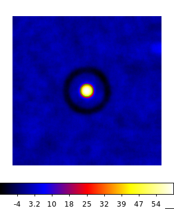
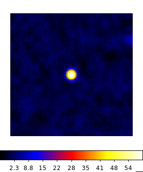
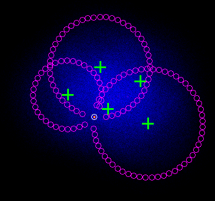

.. _classical_analysis:

Performing a classical analysis
--------------------------------

  .. admonition:: What you will learn

     You will learn how to perform a *classical* atmospheric Cherenkov analysis
     of a source. In thys type of analysis you do not need to have a 3D (spatial
     and spectral) model of the residual hadronic background. First you create a
     skymap to identify a source region. Then, you extract the measured counts
     from the source region and from one or more background regions, and perform
     a 1D maximum likelihood analysis to derive the source's spectrum.

We will assume that you have selected the observations available around your
source of interest. You can do this using the :ref:`csobsselect` script.

We will derive the spectrum of a source with known position, i.e., the supernova
remnants Cassiopeia A. First, you want to create a skymap to identify the source
region. You can do this using the :ref:`ctskymap` tool.

.. code-block:: bash

    $ ctskymap
    Input event list or observation definition XML file [events.fits] obs.xml
    First coordinate of image center in degrees (RA or galactic l) (0-360) [83.63] 350.85
    Second coordinate of image center in degrees (DEC or galactic b) (-90-90) [22.01] 58.815
    Projection method (AIT|AZP|CAR|GLS|MER|MOL|SFL|SIN|STG|TAN) [CAR] TAN
    Coordinate system (CEL - celestial, GAL - galactic) (CEL|GAL) [CEL]
    Image scale (in degrees/pixel) [0.02]
    Size of the X axis in pixels [200] 250
    Size of the Y axis in pixels [200] 250
    Lower energy limit (TeV) [0.1]
    Upper energy limit (TeV) [100.0] 50.
    Background subtraction method (NONE|IRF|RING) [NONE] RING
    Source region radius for estimating on-counts (degrees) [0.0] 0.2
    Inner ring radius (degrees) [0.6]
    Outer ring radius (degrees) [0.8]
    Output skymap file [skymap.fits]

In the spirit of the classical analysis we have chosen to derive the background
using the RING method (e.g., Berge et al. 2007 A&A 466 1219B), in which for each
point in the map (trial source position) the background is derived from a ring
centered at the same position. The RING method is fast and robust against linear
gradients of the background rates, but requires a model (from the :ref:`instrument response functions <glossary_irf>`
) of the background acceptance as a function of position in the camera. You
need to choose inner/outer radii such that you avoid emission from a source when
deriving the background. This means that the inner radius must be much larger
than the source's size, or the instrument PSF for a pointlike source. This has
produced a FITS file ``skymap.fits`` that contains three images of the region
around the source. The primary image shows the excess counts, i.e., the total
number of counts minus the estimated background counts. The BACKGROUND image
shows the number of estimated background counts. Finally, the SIGNIFICANCE image
shows the significance of the excess, calculated according to Li&Ma 1983 ApJ 272
317, Eq. 17. We can visualize the resulting map using `ds9 <http://ds9.si.edu>`_.

   *Sky map of the significance of a gamma-ray excess around Cas A. The green circle shows a circular region with 0.2 deg radius centered at the source's position.*

You can note that there is a ring with negative significance (i.e.,
a count deficit) at offsets between 0.6 deg and 0.8 deg from the source. This is
an artefact due to the fact that when computing the background for a trial
source in this area the region around Cas A was falling into the ring used for
the background estimation.

We will recompute the skymap addressing this issue. We will provide an input
exclusion region to avoid Cas A when calculating the background for any trial
source position. To this end you can use two exclusion formats: a `ds9 <http://ds9.si.edu>`_ region
file, or a FITS WCS map. For this example we will use a circular region with
radius 0.25 dec centered on Cas A. This is what the corresponding ds9 region
file looks like.

.. code-block:: bash

    # Region file format: DS9 version 4.1
    global color=green dashlist=8 3 width=1 font="helvetica 10 normal roman" select=1 highlite=1 dash=0 fixed=0 edit=1 move=1 delete=1 include=1 source=1
    fk5
    circle(350.85,58.815,720.000")

In fact we could have done this from the beginning since Cas A is a know source.
In general you will need to iterate until you have found all the significant
gamma-ray emission regions and added them to the exlusion regions/map, which is
then necessary for spectral extraction.

We rerun :ref:`ctskymap` with the new parameters.

.. code-block:: bash

    $ ctskymap inexclusion=CasA-exclusion.reg
    Input event list or observation definition XML file [obs.xml]
    First coordinate of image center in degrees (RA or galactic l) (0-360) [350.85]
    Second coordinate of image center in degrees (DEC or galactic b) (-90-90) [58.815]
    Projection method (AIT|AZP|CAR|GLS|MER|MOL|SFL|SIN|STG|TAN) [TAN]
    Coordinate system (CEL - celestial, GAL - galactic) (CEL|GAL) [CEL]
    Image scale (in degrees/pixel) [0.02]
    Size of the X axis in pixels [250]
    Size of the Y axis in pixels [250]
    Lower energy limit (TeV) [0.1]
    Upper energy limit (TeV) [50.]
    Background subtraction method (NONE|IRF|RING) [RING]
    Source region radius for estimating on-counts (degrees) [0.2] 0.2
    Inner ring radius (degrees) [0.6]
    Outer ring radius (degrees) [0.8] 0.8
    Output skymap file [skymap.fits] skymap-exclusion.fits

Below you can see the new significance map with the source/exclusion region.

   *Sky map of the significance of a gamma-ray excess around Cas A. The green circle shows a circular region with 0.2 deg radius centered at the source's position, that is excluded from the background estimation.*

For a classical spectral analysis we need to derive count spectra for the source
region and for background regions. This is accomplished by the :ref:`csphagen`
script. This script saves the source (On) and background (Off) count spectra
in `OGIP format <https://heasarc.gsfc.nasa.gov/docs/heasarc/ofwg/docs/spectra/ogip_92_007/node5.html>`_,
along with the relevant information from the :ref:`instrument response functions <glossary_irf>`
refashioned according to this format conventions.

:ref:`csphagen` calculates the background counts using the REFLECTED algorithm
(e.g., Berge et al. 2007 A&A 466 1219B), in which, for each individual
observation the background regions have the same shape as the source region, and
are rotated around the center of the camera keeping the same offset. As many
reflected regions as possible are used, excluding the area of the camera near
the source position. Since the background rates are expected to be approximately
radially symmetric in camera coordinates, this method minimizes the impact of
the background rate modeling from Monte Carlo. An optional exclusion map (in
FITS WCS format) can be provided as input through the ``inexclusion`` hidden
parameter if other regions of significant gamma-ray emission ought to be
excluded from the background computation.

.. code-block:: bash

    $ csphagen
    Input event list or observation definition XML file [obs.xml]
    Binning algorithm (LIN|LOG|FILE) [LOG]
    Lower energy limit (TeV) [0.1]
    Upper energy limit (TeV) [100.0] 50.
    Number of energy bins [120] 30
    Coordinate system (CEL - celestial, GAL - galactic) (CEL|GAL) [CEL]
    Right Ascension of source region centre (deg) (0-360) [83.63] 350.85
    Declination of source region centre (deg) (-90-90) [22.01] 58.815
    Radius of source region circle (deg) (0-180) [0.2]
    Stack multiple observations into single PHA, ARF and RMF files? [no] yes
    Output observation definition XML file [onoff_obs.xml]

This has produced in output several files. An xml observations file lists
the On/Off observations. Since we have decided to stack multiple observations we
have only one output On/Off observation. Alternatively, we can keep an On/Off
observation for each of the original observations. This is what the xml file
looks like.

.. code-block:: bash

    <?xml version="1.0" encoding="UTF-8" standalone="no"?>
    <observation_list title="observation list">
      <observation name="" id="" instrument="CTAOnOff" statistic="cstat">
        <parameter name="Pha_on" file="onoff_stacked_pha_on.fits" />
        <parameter name="Pha_off" file="onoff_stacked_pha_off.fits" />
        <parameter name="Arf" file="onoff_stacked_arf.fits" />
        <parameter name="Rmf" file="onoff_stacked_rmf.fits" />
      </observation>
    </observation_list>

The observation entails four FITS files. ``onoff_stacked_pha_on.fits`` and
``onoff_stacked_pha_off.fits`` contain the On and Off spectra, respectively.
These are stored in the SPECTRUM extension of the FITS file, along with ancillary
information, notably the scaling factor to be applied to the background spectrum,
BACKSCAL. The third extension, EBOUNDS, contains the boundaries of the energy
bins, as defined by the binning parameters in input to csphagen. The file
``onoff_stacked_arf.fits`` contains the spectral response of the instrument
extracted fromt the :ref:`instrument response functions <glossary_irf>`,
including effective area for gamma-ray detection and background rates, in the
SPECRESP extension. The file ``onoff_stacked_rmf.fits`` contains the remaining
part of the instrument response, i.e., an energy redistribution matrix (MATRIX),
as well as another instance of the EBOUNDS table. Note that we are performing a
1D analysis: the effect of the PSF is already folded into the effective area
computation.

.. note::

    The first part of the FITS files names (and a full path to the desired
    location) can be set using the hiddeg ``prefix`` parameter of
    :ref:`csphagen`. If you decide not to stack multiple observations the string
    ``stacked`` with be replaced by the observation id for each of the original
    observations.

There are also come ancillary `ds9 <http://ds9.si.edu>`_ region files, that show
the On region and the Off regions for each observation, ``onoff_on.reg`` and
``onoff_xxx_off.reg`` (with xxx observation id), respectively. Below there is
a skymap where you can see the position of the On and Off regions for a few
observations, along with the pointing directions of the observations (extracted
using the :ref:`csobsinfo` script).

   *Sky map of the event counts around Cas A (not background subtracted). The green crosses show the pointing directions, the magenta circles the Off regions for three of those observations, and the white circle the On region.*

.. note::

    If you wish to limit the number of observations considered to those pointed
    closer to the source, you can do this either at the observation selection
    level (see :ref:`csobsselect`), or directly in :ref:`csphagen` via the
    hidden ``maxoffset`` parameter.