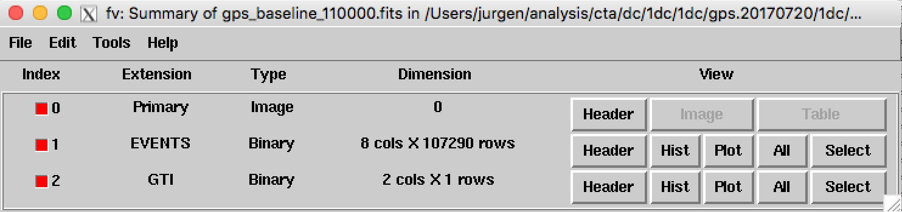
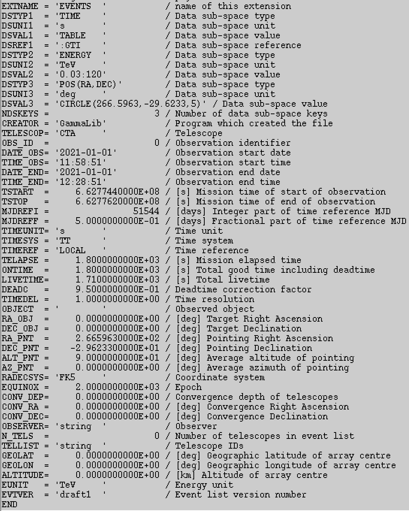
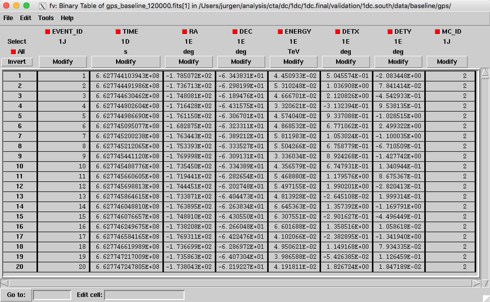

.. _1dc_data_organisation:

Data organisation
-----------------

Layout
^^^^^^

The content of the ``1dc.pre`` folder should be as follows:

.. code-block:: bash

   caldb/
   caldb/data
   caldb/data/cta
   caldb/data/cta/prod3b
   caldb/data/cta/prod3b/caldb.indx
   caldb/data/cta/prod3b/bcf
   ...
   data/
   data/baseline/
   data/baseline/gc
   data/baseline/gc/gc_baseline_000001.fits
   data/baseline/gc/gc_baseline_000002.fits
   ...
   models/
   models/models_gc.xml
   ...
   obs/
   obs/obs_gc_baseline.xml

Instrument Response Functions
^^^^^^^^^^^^^^^^^^^^^^^^^^^^^

The ``caldb`` folder contains the
:ref:`Instrument Response Functions <glossary_irf>`
that are necessary for the analysis of the simulated CTA data.
The folder contains the ``prod3b`` response that should be used for the
:ref:`first CTA Data Challenge <glossary_1dc>`.
In the pre-release, only the response functions for CTA South are
available for a zenith angle of 20 deg.
Specifically, the following response functions are available:

 +-----------------------+-------+---------------+--------+----------+
 | Response name         | Site  | Configuration | Zenith | Duration |
 +=======================+=======+===============+========+==========+
 | ``South_z20_50h``     | South | Baseline      | 20 deg | 50 hours |
 +-----------------------+-------+---------------+--------+----------+
 | ``South_z20_5h``      | South | Baseline      | 20 deg | 5 hours  |
 +-----------------------+-------+---------------+--------+----------+
 | ``South_z20_0.5h``    | South | Baseline      | 20 deg | 30 min   |
 +-----------------------+-------+---------------+--------+----------+
 | ``South_TS_z20_50h``  | South | Threshold     | 20 deg | 50 hours |
 +-----------------------+-------+---------------+--------+----------+
 | ``South_TS_z20_5h``   | South | Threshold     | 20 deg | 5 hours  |
 +-----------------------+-------+---------------+--------+----------+
 | ``South_TS_z20_0.5h`` | South | Threshold     | 20 deg | 30 min   |
 +-----------------------+-------+---------------+--------+----------+

.. warning::
   The **50 hours**
   :ref:`Instrument Response Functions <glossary_irf>`
   were used for the **simulation** of the
   :ref:`first CTA Data Challenge <glossary_1dc>`
   data. Please use only these response functions for the analysis. If you use
   :ref:`Observation Definition Files <glossary_obsdef>`
   for the analysis (see below) the appropriate 50 hours response functions
   will be used automatically.

Event data
^^^^^^^^^^

The ``data`` folder contains the calibrated, reconstructed and background
reduced event data that were procuded for the
:ref:`first CTA Data Challenge <glossary_1dc>`
and that were stored into FITS files.
Each event file contains the events for an
:ref:`observation <glossary_obs>`
(or run) of 30 minutes duration and comprises an
:ref:`event list <glossary_eventlist>`
and a
:ref:`Good Time Intervals <glossary_gti>`
binary table extension (see figure below).

   *Structure of an event file*

The header of the ``EVENTS`` table contains information about the
:ref:`observation <glossary_obs>`
such as
the start and stop date and time,
the duration and livetime of the observation, and
the pointing direction in Right Ascension and Declination (see figure below).

   *Header of an event list*

.. note::
   The pointing direction during an observation is fixed. The simulation has
   the following characteristics:

   * Number of observations (and pointings): 1673
   * Duration of each observation: 1800 sec
   * Deadtime fraction: 5%
   * Total exposure time of simulation: 836.5 hours
   * Simulated event energies: 30 GeV - 120 TeV
   * Maximum off-axis angle: 5 deg
   * Start date of observations: 2021-01-01 11:58:51
   * End date of observations: 2021-03-30 12:28:51

.. warning::
   Only the following header keywords in the ``EVENTS`` table have meaningful
   values:

   * ``DSTYPx`` - Data sub-space type
   * ``DSUNIx`` - Data sub-space unit
   * ``DSVALx`` - Data sub-space value
   * ``DSREFx`` - Data sub-space reference
   * ``OBS_ID`` - Observation identifier
   * ``DATE_OBS`` - start date of observation (UTC)
   * ``TIME_OBS`` - start time of observation (UTC)
   * ``DATE_END`` - end date of observation (UTC)
   * ``TIME_END`` - end time of observation (UTC)
   * ``TSTART`` - start time of observation, counted from time reference (s)
   * ``TSTOP`` - stop time of observation, counted from time reference (s)
   * ``MJDREFI`` - integer part of time reference MJD (days)
   * ``MJDREFF`` - fractional part of time reference MJD (days)
   * ``TIMEUNIT`` - time unit
   * ``TIMESYS`` - time system
   * ``TIMEREF`` - time reference
   * ``TELAPSE`` - elapsed time (s)
   * ``ONTIME`` - exposure time (s)
   * ``LIVETIME`` - livetime (s)
   * ``DEADC`` - deadtime correction factor, livetime / exposure time
   * ``TIMEDEL`` - time resolution
   * ``RA_PNT`` - Right Ascension of pointing direction (deg)
   * ``DEC_PNT`` - Declination of pointing direction (deg)
   * ``RADECSYS`` - Coordinate system
   * ``EQUINOX`` - Coordinate epoch

   All remaining header keywords have arbitrary values and should not be
   used for the analysis.

Each row of the ``EVENTS`` table corresponds to a single event.
Each event is characterised by

 +--------------+-------------------------------------------+----------+
 | Column       | Meaning                                   | Unit     |
 +==============+===========================================+==========+
 | ``EVENT_ID`` | Event number in file                      | unitless |
 +--------------+-------------------------------------------+----------+
 | ``TIME``     | Time stamp, countered from time reference | s        |
 +--------------+-------------------------------------------+----------+
 | ``RA``       | Reconstructed Right Ascension             | deg      |
 +--------------+-------------------------------------------+----------+
 | ``DEC``      | Reconstructed Declination                 | deg      |
 +--------------+-------------------------------------------+----------+
 | ``ENERGY``   | Reconstructed energy                      | TeV      |
 +--------------+-------------------------------------------+----------+
 | ``DETX``     | Reconstructed camera X coordinate         | deg      |
 +--------------+-------------------------------------------+----------+
 | ``DETY``     | Reconstructed camera Y coordinate         | deg      |
 +--------------+-------------------------------------------+----------+

An example of an ``EVENTS`` table is shown below.

   *Content of an event list*

.. warning::
   The time stamps in the ``TIME`` column are **not** necessarily in ascending
   order.

Observation Definition Files
^^^^^^^^^^^^^^^^^^^^^^^^^^^^

The file ``obs_gc_baseline.xml`` is a so called
:ref:`Observation Definition File <glossary_obsdef>`
that contains the information (or metadata) of a list of observations.
The file is a plain ASCII files in XML format that can be inspected and
manipulated by any text editor.

Models
^^^^^^

The ``models`` folder contains the definitions of all source and background
models that were used for simulating the data.
The file ``models_gc.xml`` is a so called
:ref:`Model Definition File <glossary_moddef>`
that collects the definition of all model components used for the Galactic
Centre Survey simulation.
The other files in the folder are ASCII and FITS files containing spectral,
temporal and spatial information that was used in the simulations.

.. warning::
   The ASCII and FITS files should always reside in the same folder as the
   :ref:`model definition XML files <glossary_moddef>`
   since the latter reference the former.

