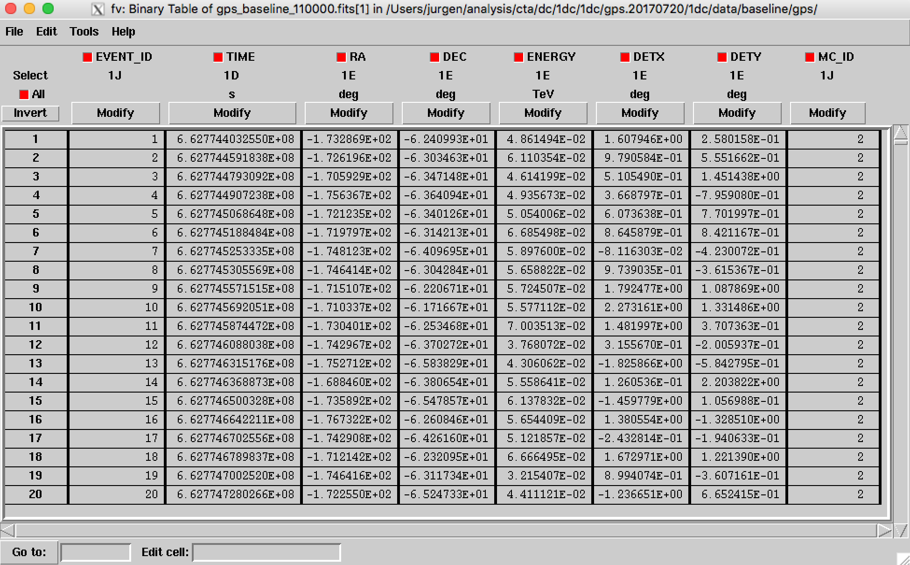

.. _1dc_data_organisation:

Data organisation
-----------------

Layout
^^^^^^

The content of the ``1dc`` folder should be as follows:

.. code-block:: bash

   caldb/
   caldb/data
   caldb/data/cta
   caldb/data/cta/1dc
   caldb/data/cta/1dc/caldb.indx
   caldb/data/cta/1dc/bcf
   ...
   data/baseline/agn
   data/baseline/agn/agn_baseline_510000.fits
   data/baseline/agn/agn_baseline_510001.fits
   ...
   data/
   data/baseline/
   data/baseline/egal
   data/baseline/egal/egal_baseline_210000.fits
   data/baseline/egal/egal_baseline_210001.fits
   ...
   data/baseline/gc
   data/baseline/gc/gc_baseline_310000.fits
   data/baseline/gc/gc_baseline_310001.fits
   ...
   data/baseline/gps
   data/baseline/gps/gps_baseline_110000.fits
   data/baseline/gps/gps_baseline_110001.fits
   ...
   models/
   models/models_agn.xml
   models/models_egal.xml
   models/models_gc.xml
   models/models_gps.xml
   ...
   obs/
   obs/obs_agn_baseline.xml
   obs/obs_egal_baseline.xml
   obs/obs_gc_baseline.xml
   obs/obs_gps_baseline.xml

Instrument Response Functions
^^^^^^^^^^^^^^^^^^^^^^^^^^^^^

The ``caldb`` folder contains the
:ref:`instrument response functions <glossary_irf>`
that are necessary for the analysis of the simulated CTA data.
The folder contains the ``1dc`` response that should be used for the
:ref:`first CTA Data Challenge <glossary_1dc>`.
Specifically, the following response functions are available:

 +-----------------------+-------+---------------+--------+----------+
 | Response name         | Site  | Configuration | Zenith | Duration |
 +=======================+=======+===============+========+==========+
 | ``South_z20_50h``     | South | Baseline      | 20 deg | 50 hours |
 +-----------------------+-------+---------------+--------+----------+
 | ``South_z40_50h``     | South | Baseline      | 40 deg | 50 hours |
 +-----------------------+-------+---------------+--------+----------+
 | ``North_z20_50h``     | North | Baseline      | 20 deg | 50 hours |
 +-----------------------+-------+---------------+--------+----------+
 | ``North_z40_50h``     | North | Baseline      | 40 deg | 50 hours |
 +-----------------------+-------+---------------+--------+----------+

Event data
^^^^^^^^^^

The ``data`` folder contains the calibrated, reconstructed and background
reduced event data that were procuded for the
:ref:`first CTA Data Challenge <glossary_1dc>`
and that were stored into FITS files.
Event data are split into :ref:`observations <glossary_obs>` with a fixed
pointing direction (observations are also known as runs).
The duration of an observation is 25 minutes for the Extragalactic Survey
and 30 minutes for the Galactic Plane and Centre surveys and the AGN monitoring
program.
The properties of the event data for all simulations are summarised in the
table below:

   +-----------------------------------+------------------+------------------+------------------+-----------------+
   | Parameter                         |        GPS       |         GC       |      EGAL        |       AGN       |
   +===================================+==================+==================+==================+=================+
   | Number of observations            |             3270 |             1671 |             1271 |            1920 |
   +-----------------------------------+------------------+------------------+------------------+-----------------+
   | Duration of each observation      |           1800 s |           1800 s |           1500 s |          1800 s |
   +-----------------------------------+------------------+------------------+------------------+-----------------+
   | Deadtime fraction                 |               2% |               2% |               2% |              2% |
   +-----------------------------------+------------------+------------------+------------------+-----------------+
   | Total exposure time of simulation |           1635 h |          835.5 h |         529.58 h |        960.00 h |
   +-----------------------------------+------------------+------------------+------------------+-----------------+
   | Simulated event energies          | 30 GeV - 160 TeV | 30 GeV - 160 TeV | 30 GeV - 160 TeV | 30 GeV - 50 TeV |
   +-----------------------------------+------------------+------------------+------------------+-----------------+
   | Maximum off-axis angle            |            5 deg |            5 deg |            5 deg |           5 deg |
   +-----------------------------------+------------------+------------------+------------------+-----------------+
   | Start date of observations        |       2021-01-01 |       2021-01-01 |       2021-01-01 |      2021-01-01 |
   +-----------------------------------+------------------+------------------+------------------+-----------------+
   | End date of observations          |       2021-04-18 |       2021-03-29 |       2021-02-25 |      2022-07-09 |
   +-----------------------------------+------------------+------------------+------------------+-----------------+

Each event file contains the events for an
:ref:`observation <glossary_obs>` and comprises an
:ref:`event list <glossary_eventlist>`
and a
:ref:`good time intervals <glossary_gti>`
binary table extension (see figure below).

.. figure:: event_file.png
   :width: 600px
   :align: center

   *Structure of an event file*

The header of the ``EVENTS`` table contains information about the
:ref:`observation <glossary_obs>`
such as
the start and stop date and time,
the duration and livetime of the observation, and
the pointing direction in Right Ascension and Declination.
In addition, the header contains the names and identifiers of the sources that
have been simulated (see figure below).

.. figure:: event_header.png
   :width: 500px
   :align: center

   *Header of an event list*

.. warning::
   Only the following header keywords in the ``EVENTS`` table have meaningful
   values:

   * ``DSTYPx`` - Data sub-space type
   * ``DSUNIx`` - Data sub-space unit
   * ``DSVALx`` - Data sub-space value
   * ``DSREFx`` - Data sub-space reference
   * ``NDSKEYS`` - Number of data sub-space keys
   * ``NMCIDS`` - Number of Monte Carlo identifiers
   * ``MIDxxxxx`` - Monte Carlo identifier
   * ``MMNxxxxx`` - Model name for Monte Carlo identifier
   * ``OBS_ID`` - Observation identifier
   * ``DATE_OBS`` - start date of observation (UTC)
   * ``TIME_OBS`` - start time of observation (UTC)
   * ``DATE_END`` - end date of observation (UTC)
   * ``TIME_END`` - end time of observation (UTC)
   * ``TSTART`` - start time of observation, counted from time reference (s)
   * ``TSTOP`` - stop time of observation, counted from time reference (s)
   * ``MJDREFI`` - integer part of time reference MJD (days)
   * ``MJDREFF`` - fractional part of time reference MJD (days)
   * ``TIMEUNIT`` - time unit
   * ``TIMESYS`` - time system
   * ``TIMEREF`` - time reference
   * ``TELAPSE`` - elapsed time (s)
   * ``ONTIME`` - exposure time (s)
   * ``LIVETIME`` - livetime (s)
   * ``DEADC`` - deadtime correction factor, livetime / exposure time
   * ``TIMEDEL`` - time resolution
   * ``RA_PNT`` - Right Ascension of pointing direction (deg)
   * ``DEC_PNT`` - Declination of pointing direction (deg)
   * ``RADECSYS`` - Coordinate system
   * ``EQUINOX`` - Coordinate epoch

   All remaining header keywords have arbitrary values and should not be
   used for the analysis.

Each row of the ``EVENTS`` table corresponds to a single event.
Each event is characterised by

 +--------------+-------------------------------------------+----------+
 | Column       | Meaning                                   | Unit     |
 +==============+===========================================+==========+
 | ``EVENT_ID`` | Event number in file                      | unitless |
 +--------------+-------------------------------------------+----------+
 | ``TIME``     | Time stamp, countered from time reference | s        |
 +--------------+-------------------------------------------+----------+
 | ``RA``       | Reconstructed Right Ascension             | deg      |
 +--------------+-------------------------------------------+----------+
 | ``DEC``      | Reconstructed Declination                 | deg      |
 +--------------+-------------------------------------------+----------+
 | ``ENERGY``   | Reconstructed energy                      | TeV      |
 +--------------+-------------------------------------------+----------+
 | ``DETX``     | Reconstructed camera X coordinate         | deg      |
 +--------------+-------------------------------------------+----------+
 | ``DETY``     | Reconstructed camera Y coordinate         | deg      |
 +--------------+-------------------------------------------+----------+
 | ``MC_ID``    | Monte Carlo identifier                    | unitless |
 +--------------+-------------------------------------------+----------+

An example of an ``EVENTS`` table is shown below.

   *Content of an event list*

.. warning::
   The time stamps in the ``TIME`` column are **not** necessarily in ascending
   order.

Observation Definition Files
^^^^^^^^^^^^^^^^^^^^^^^^^^^^

The files ``obs_agn_baseline.xml``, ``obs_egal_baseline.xml``,
``obs_gc_baseline.xml``, and ``obs_gps_baseline.xml`` are so called
:ref:`observation definition files <glossary_obsdef>`
containing the information (or metadata) of a list of observations.
The file is a plain ASCII files in XML format that can be inspected and
manipulated by any text editor.

Models
^^^^^^

The ``models`` folder contains the definitions of all source and background
models that were used for simulating the data.
The files ``models_agn.xml``, ``models_egal.xml``, ``models_gc.xml`` and
``models_gps.xml`` are so called
:ref:`model definition files <glossary_moddef>`
collecting the definition of all model components used for the three surveys.
Since the same sky model was used for all surveys the four files are
identical.
The other files in the folder are ASCII and FITS files containing spectral,
temporal and spatial information that was used in the simulations.

.. warning::
   The ASCII and FITS files should always reside in the same folder as the
   :ref:`model definition XML files <glossary_moddef>`
   since the latter reference the former.

