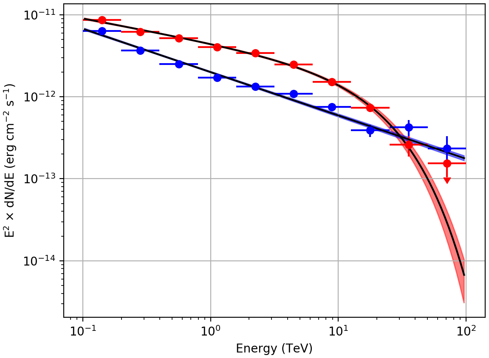

.. _1dc_first_fitting:

Fitting the model components to the counts cube
-----------------------------------------------

  .. admonition:: What you will learn

     You will learn how to **fit a parametric model** to the counts cube using
     a maximum likelihood algorithm.

     You will also learn how to display the fit results in form of
     `ds9 <http://ds9.si.edu>`_
     region files, butterfly diagrams and spectral points.

     Please note that display tools are **not** part of ctools, yet some
     scripts for result display that use the ``matplotlib`` Python module can be
     found in the
     ``$CTOOLS/share/examples/python``
     folder (see :ref:`how to display results<1dc_howto_display>`).

Now you are ready to fit the model to the counts cube and to determine its
maximum likelihood parameters.

You do this with the :ref:`ctlike` tool that adjusts all parameters in the
:ref:`model definition file <glossary_moddef>`
that have the attribute ``free`` set to ``"1"``.
In the current example, the free model parameters are the positions and spectral
parameters of the two point sources and the spectral normalisation of the
background component.
You run the :ref:`ctlike` tool as follows:

.. code-block:: bash

   $ ctlike
   Input event list, counts cube or observation definition XML file [events.fits] cntcube.fits
   Input exposure cube file (only needed for stacked analysis) [NONE] expcube.fits
   Input PSF cube file (only needed for stacked analysis) [NONE] psfcube.fits
   Input background cube file (only needed for stacked analysis) [NONE] bkgcube.fits
   Input model definition XML file [$CTOOLS/share/models/crab.xml] stacked_models.xml
   Output model definition XML file [crab_results.xml] stacked_results.xml

The tool will take a few minutes (on Mac OS X) to perform the model fitting,
and will write the results into an updated
:ref:`model definition file <glossary_moddef>`
containing the fitted model parameters and their statistical uncertainties.
You may inspect the log file ``ctlike.log`` to verify that the model fit
converged properly, as illustrated in the example below:

.. code-block:: bash

   2017-08-25T17:08:21: +=================================+
   2017-08-25T17:08:21: | Maximum likelihood optimisation |
   2017-08-25T17:08:21: +=================================+
   2017-08-25T17:08:29:  >Iteration   0: -logL=291914.550, Lambda=1.0e-03
   2017-08-25T17:08:38:  >Iteration   1: -logL=266273.754, Lambda=1.0e-03, delta=25640.797, step=1.0e+00, max(|grad|)=65025.077045 [Index:13]
   2017-08-25T17:08:47:  >Iteration   2: -logL=260715.584, Lambda=1.0e-04, delta=5558.169, step=1.0e+00, max(|grad|)=11091.356780 [Index:3]
   2017-08-25T17:08:56:  >Iteration   3: -logL=258904.982, Lambda=1.0e-05, delta=1810.602, step=1.0e+00, max(|grad|)=6846.470902 [Index:3]
   2017-08-25T17:09:05:  >Iteration   4: -logL=258532.557, Lambda=1.0e-06, delta=372.425, step=1.0e+00, max(|grad|)=1815.217272 [RA:0]
   2017-08-25T17:09:14:  >Iteration   5: -logL=258519.171, Lambda=1.0e-07, delta=13.386, step=1.0e+00, max(|grad|)=457.965339 [RA:0]
   2017-08-25T17:09:22:  >Iteration   6: -logL=258519.093, Lambda=1.0e-08, delta=0.078, step=1.0e+00, max(|grad|)=106.109881 [RA:0]
   2017-08-25T17:09:31:  >Iteration   7: -logL=258519.089, Lambda=1.0e-09, delta=0.004, step=1.0e+00, max(|grad|)=23.002701 [DEC:1]
   2017-08-25T17:09:40:
   2017-08-25T17:09:40: +=========================================+
   2017-08-25T17:09:40: | Maximum likelihood optimisation results |
   2017-08-25T17:09:40: +=========================================+
   2017-08-25T17:09:40: === GOptimizerLM ===
   2017-08-25T17:09:40:  Optimized function value ..: 258519.089
   2017-08-25T17:09:40:  Absolute precision ........: 0.005
   2017-08-25T17:09:40:  Acceptable value decrease .: 2
   2017-08-25T17:09:40:  Optimization status .......: converged
   2017-08-25T17:09:40:  Number of parameters ......: 16
   2017-08-25T17:09:40:  Number of free parameters .: 10
   2017-08-25T17:09:40:  Number of iterations ......: 7
   2017-08-25T17:09:40:  Lambda ....................: 1e-10
   2017-08-25T17:09:40:  Maximum log likelihood ....: -258519.089
   2017-08-25T17:09:40:  Observed events  (Nobs) ...: 2069014.000
   2017-08-25T17:09:40:  Predicted events (Npred) ..: 2069013.992 (Nobs - Npred = 0.00783161679282784)

You may also convert the fitted model positions into a `ds9 <http://ds9.si.edu>`_
region file using the :ref:`csmodelinfo` script so that you can overlay the
fit results over a sky map:

.. code-block:: bash

   $ csmodelinfo pnt_type=circle free_color=black show_labels=no
   Input model definition XML file [model.xml] stacked_results.xml
   Output DS9 region file [ds9.reg] positions.reg

The command line arguments ``pnt_type``, ``free_color`` and ``show_labels``
enable to fine tune the parameters in the `ds9 <http://ds9.si.edu>`_
region file. In this case, the positions are marked by black circles without
showing the source names.

The following image shows a zoom of the sky map that comprises both point
sources, with the initial source positions determined by :ref:`cssrcdetect`
as green crosses and the positions fitted by :ref:`ctlike` as black circles.
Obviously, the initial positions were already near the fitted positions,
which is required to assure the proper convergence of the fit.

.. figure:: first_skymap_fitted.png
   :width: 600px
   :align: center

   *Background subtracted sky map of the events recorded around the Galactic Centre during the Galactic Plane Survey with the fitted positions of the sources shown as black circles*

You can also convert the spectral parameters of the point sources into a
butterfly diagram for each source using the :ref:`ctbutterfly` tool.
The butterfly diagram shows the envelope of all spectral models that are
statistically compatible with the data.
You create the butterfly diagram for the first source using

.. code-block:: bash

   $ ctbutterfly
   Input event list, counts cube or observation definition XML file [events.fits] cntcube.fits
   Input exposure cube file (only needed for stacked analysis) [NONE] expcube.fits
   Input PSF cube file (only needed for stacked analysis) [NONE] psfcube.fits
   Input background cube file (only needed for stacked analysis) [NONE] bkgcube.fits
   Source of interest [Crab] Src001
   Input model definition XML file [$CTOOLS/share/models/crab.xml] stacked_results.xml
   Start value for first energy bin in TeV [0.1]
   Stop value for last energy bin in TeV [100.0]
   Output ASCII file [butterfly.txt] butterfly_src001.txt

and for the second source using

.. code-block:: bash

   $ ctbutterfly
   Input event list, counts cube or observation definition XML file [cntcube.fits]
   Input exposure cube file (only needed for stacked analysis) [expcube.fits]
   Input PSF cube file (only needed for stacked analysis) [psfcube.fits]
   Input background cube file (only needed for stacked analysis) [bkgcube.fits]
   Source of interest [Src001] Src002
   Input model definition XML file [stacked_results.xml]
   Start value for first energy bin in TeV [0.1]
   Stop value for last energy bin in TeV [100.0]
   Output ASCII file [butterfly_src001.txt] butterfly_src002.txt

The butterfly diagrams for both sources are displayed in the figure below.
The figure also shows spectral points for each source that were determined
using the :ref:`csspec` script.
You create the spectrum for the first source using

.. code-block:: bash

   $ csspec
   Input event list, counts cube, or observation definition XML file [events.fits] cntcube.fits
   Input exposure cube file (only needed for stacked analysis) [NONE] expcube.fits
   Input PSF cube file (only needed for stacked analysis) [NONE] psfcube.fits
   Input background cube file (only needed for stacked analysis) [NONE] bkgcube.fits
   Input model definition XML file [$CTOOLS/share/models/crab.xml] stacked_results.xml
   Source name [Crab] Src001
   Binning algorithm (LIN|LOG|FILE) [LOG]
   Lower energy limit (TeV) [0.1]
   Upper energy limit (TeV) [100.0]
   Number of energy bins (0=unbinned) [20] 10
   Output spectrum file [spectrum.fits] spectrum_src001.fits

and for the second source using

.. code-block:: bash

   $ csspec
   Input event list, counts cube, or observation definition XML file [cntcube.fits]
   Input exposure cube file (only needed for stacked analysis) [expcube.fits]
   Input PSF cube file (only needed for stacked analysis) [psfcube.fits]
   Input background cube file (only needed for stacked analysis) [bkgcube.fits]
   Input model definition XML file [stacked_results.xml]
   Source name [Src001] Src002
   Binning algorithm (LIN|LOG|FILE) [LOG]
   Lower energy limit (TeV) [0.1]
   Upper energy limit (TeV) [100.0]
   Number of energy bins (0=unbinned) [10]
   Output spectrum file [spectrum_src001.fits] spectrum_src002.fits

The :ref:`csspec` script divided here the data into ten logarithmically
spaced energy bins and determined the source flux in each of the bins using
a maximum likelihood model fit.

.. figure:: first_spectrum_stacked.png
   :width: 600px
   :align: center

   *Butterfly diagrams determined with ctbutterfly and spectral points determined with csspec for Src001 (red) and Src002 (blue)*

Obviously, ``Src001`` has a spectral cut-off (red flux points) and hence is not
adequately described by a power law model. You should therefore replace the
power law in the
:ref:`model definition file <glossary_moddef>`
by an exponentially cutoff power law, as shown below:

.. code-block:: xml

   <?xml version="1.0" encoding="UTF-8" standalone="no"?>
   <source_library title="source library">
     <source name="Src001" type="PointSource">
       <spectrum type="ExponentialCutoffPowerLaw">
         <parameter name="Prefactor"    scale="1e-18" value="5.7"  min="1e-07" max="1000.0" free="1"/>
         <parameter name="Index"        scale="-1"    value="2.48" min="0.0"   max="+5.0"   free="1"/>
         <parameter name="CutoffEnergy" scale="1e7"   value="1.0"  min="0.01"  max="1000.0" free="1"/>
         <parameter name="PivotEnergy"  scale="1e6"   value="0.3"  min="0.01"  max="1000.0" free="0"/>
       </spectrum>
       <spatialModel type="PointSource">
         <parameter name="RA"  value="266.4045" scale="1" free="1" />
         <parameter name="DEC" value="-28.9945" scale="1" free="1" />
       </spatialModel>
     </source>
     ...
   </source_library>

Fitting this model to the data improves the fit and the resulting butterfly
diagram follows now reasonably well the spectral points:

   *Butterfly diagrams determined with ctbutterfly for an exponentially cut-off power law for Src001 (red)*
