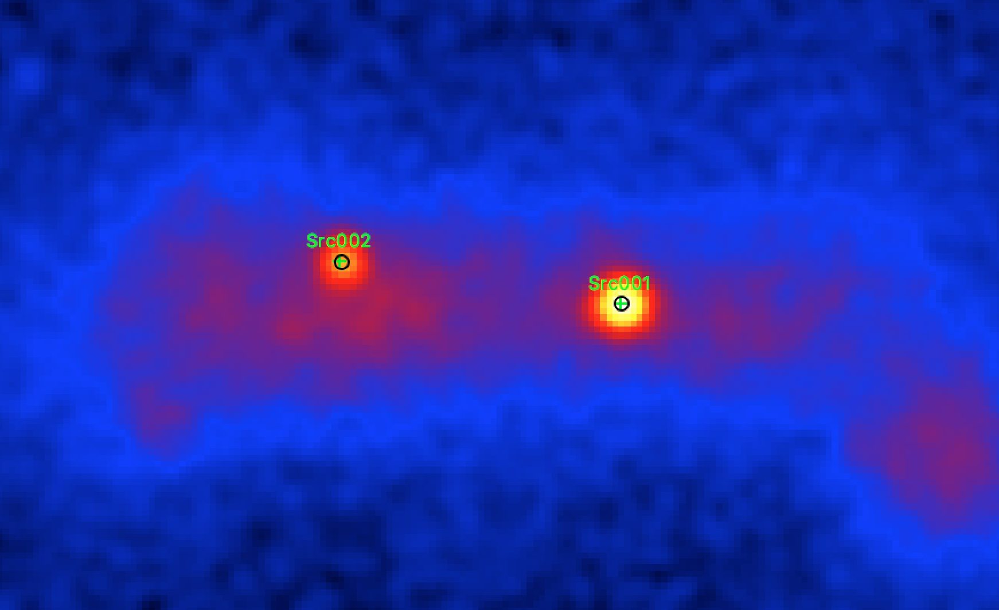
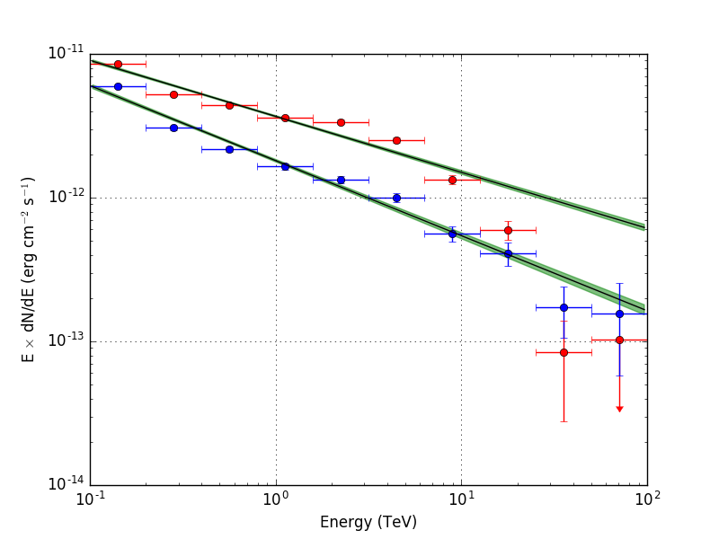

.. _1dc_first_fitting:

Fitting the model components to the data
----------------------------------------

Now you are ready to fit the model to the data and to determine its maximum
likelihood parameters.

You do this with the :ref:`ctlike` tool that adjusts all parameters in the
:ref:`model definition file <glossary_moddef>`
that have the attribute ``free`` set to ``"1"``.
In the current example, the free model parameters are the positions and spectral
parameters of the two point sources and the spectral normalisation of the
background component.
You run the :ref:`ctlike` tool as follows:

.. code-block:: bash

   $ ctlike
   Input event list, counts cube or observation definition XML file [events.fits] obs_selected.xml
   Input model definition XML file [$CTOOLS/share/models/crab.xml] models.xml
   Output model definition XML file [crab_results.xml] results.xml

The tool will take a few minutes (on Mac OS X) to perform the model fitting,
and will write the results into an updated
:ref:`model definition file <glossary_moddef>`
containing the fitted model parameters and their statistical uncertainties.
You may inspect the log file ``ctlike.log`` to verify that the model fit
converged properly, as illustrated in the example below:

.. code-block:: bash

   2017-03-03T18:06:30: +=================================+
   2017-03-03T18:06:30: | Maximum likelihood optimisation |
   2017-03-03T18:06:30: +=================================+
   2017-03-03T18:06:56:  >Iteration   0: -logL=18221386.597, Lambda=1.0e-03
   2017-03-03T18:07:19:  >Iteration   1: -logL=18206762.996, Lambda=1.0e-03, delta=14623.601, max(|grad|)=45198.417696 [Index:13]
   2017-03-03T18:07:42:  >Iteration   2: -logL=18203712.440, Lambda=1.0e-04, delta=3050.557, max(|grad|)=10013.593417 [Index:3]
   2017-03-03T18:08:04:  >Iteration   3: -logL=18202302.390, Lambda=1.0e-05, delta=1410.050, max(|grad|)=7461.719387 [Index:3]
   2017-03-03T18:08:27:  >Iteration   4: -logL=18201825.720, Lambda=1.0e-06, delta=476.669, max(|grad|)=4076.653047 [RA:0]
   2017-03-03T18:08:50:  >Iteration   5: -logL=18201757.606, Lambda=1.0e-07, delta=68.114, max(|grad|)=1547.953907 [RA:0]
   2017-03-03T18:09:13:  >Iteration   6: -logL=18201754.932, Lambda=1.0e-08, delta=2.674, max(|grad|)=388.888160 [RA:0]
   2017-03-03T18:09:36:  >Iteration   7: -logL=18201754.869, Lambda=1.0e-09, delta=0.063, max(|grad|)=81.488909 [RA:0]
   2017-03-03T18:09:59:  >Iteration   8: -logL=18201754.866, Lambda=1.0e-10, delta=0.003, max(|grad|)=16.367278 [RA:0]
   2017-03-03T18:10:22:
   2017-03-03T18:10:22: +=========================================+
   2017-03-03T18:10:22: | Maximum likelihood optimisation results |
   2017-03-03T18:10:22: +=========================================+
   2017-03-03T18:10:22: === GOptimizerLM ===
   2017-03-03T18:10:22:  Optimized function value ..: 18201754.866
   2017-03-03T18:10:22:  Absolute precision ........: 0.005
   2017-03-03T18:10:22:  Acceptable value decrease .: 2
   2017-03-03T18:10:22:  Optimization status .......: converged
   2017-03-03T18:10:22:  Number of parameters ......: 16
   2017-03-03T18:10:22:  Number of free parameters .: 10
   2017-03-03T18:10:22:  Number of iterations ......: 8
   2017-03-03T18:10:22:  Lambda ....................: 1e-11
   2017-03-03T18:10:22:  Maximum log likelihood ....: -18201754.866
   2017-03-03T18:10:22:  Observed events  (Nobs) ...: 2841472.000
   2017-03-03T18:10:22:  Predicted events (Npred) ..: 2841471.996 (Nobs - Npred = 0.00435844948515296)

You may also convert the fitted model positions into a `ds9 <http://ds9.si.edu>`_
region file using the :ref:`csmodelinfo` script so that you can overlay the
fit results over a sky map:

.. code-block:: bash

   $ csmodelinfo pnt_type=circle free_color=black show_labels=no
   Input model definition XML file [model.xml] results.xml
   Output DS9 region file [ds9.reg] positions.reg

The command line arguments ``pnt_type``, ``free_color`` and ``show_labels``
enable to fine tune the parameters in the `ds9 <http://ds9.si.edu>`_
region file. In this case, the positions are marked by black circles without
showing the source names.

The following image shows a zoom of the sky map that comprises both point
sources, with the initial source positions determined by :ref:`cssrcdetect`
as green crosses and the positions fitted by :ref:`ctlike` as black circles.
Obviously, the initial positions were already near the fitted positions,
which is required to assure the proper convergence of the fit.

   *Background subtracted sky map of the events recorded around the Galactic Centre during the Galactic Centre Survey with the fitted positions of the sources shown as black circles*

You can also convert the spectral parameters of the point sources into a
butterfly diagram for each source using the :ref:`ctbutterfly` tool.
The butterfly diagram shows the envelope of all power laws that are
statistically compatible with the data.
You create the butterfly diagram for the first source using

.. code-block:: bash

   $ ctbutterfly
   Input event list, counts cube or observation definition XML file [events.fits] obs_selected.xml
   Source of interest [Crab] Src001
   Input model definition XML file [$CTOOLS/share/models/crab.xml] results.xml
   Start value for first energy bin in TeV [0.1]
   Stop value for last energy bin in TeV [100.0]
   Output ASCII file [butterfly.txt] butterfly_src001.txt

and for the second source using

.. code-block:: bash

   $ ctbutterfly
   Input event list, counts cube or observation definition XML file [events.fits] obs_selected.xml
   Source of interest [Crab] Src002
   Input model definition XML file [$CTOOLS/share/models/crab.xml] results.xml
   Start value for first energy bin in TeV [0.1]
   Stop value for last energy bin in TeV [100.0]
   Output ASCII file [butterfly.txt] butterfly_src002.txt

The butterfly diagrams for both sources are displayed in the figure below:

   *Butterfly diagrams determined with ctbutterfly and spectral points determined with csspec for Src001 (top) and Src002 (bottom)*

The figure also shows spectral points for each source that were determined
using the :ref:`csspec` script.
You create the spectrum for the first source using

.. code-block:: bash

   $ csspec
   Input event list, counts cube, or observation definition XML file [events.fits] obs_selected.xml
   Input model definition XML file [$CTOOLS/share/models/crab.xml] results.xml
   Source name [Crab] Src001
   Binning algorithm (LIN|LOG|FILE) [LOG]
   Lower energy limit (TeV) [0.1]
   Upper energy limit (TeV) [100.0]
   Number of energy bins (0=unbinned) [20] 10
   Output spectrum file [spectrum.fits] spectrum_src001.fits

and for the second source using

.. code-block:: bash

   $ csspec
   Input event list, counts cube, or observation definition XML file [events.fits] obs_selected.xml
   Input model definition XML file [$CTOOLS/share/models/crab.xml] results.xml
   Source name [Crab] Src002
   Binning algorithm (LIN|LOG|FILE) [LOG]
   Lower energy limit (TeV) [0.1]
   Upper energy limit (TeV) [100.0]
   Number of energy bins (0=unbinned) [20] 10
   Output spectrum file [spectrum.fits] spectrum_src002.fits

The :ref:`csspec` script divided here the data into ten logarithmically
spaced energy bins and determined the source flux in each of the bins using
a maximum likelihood model fit.
