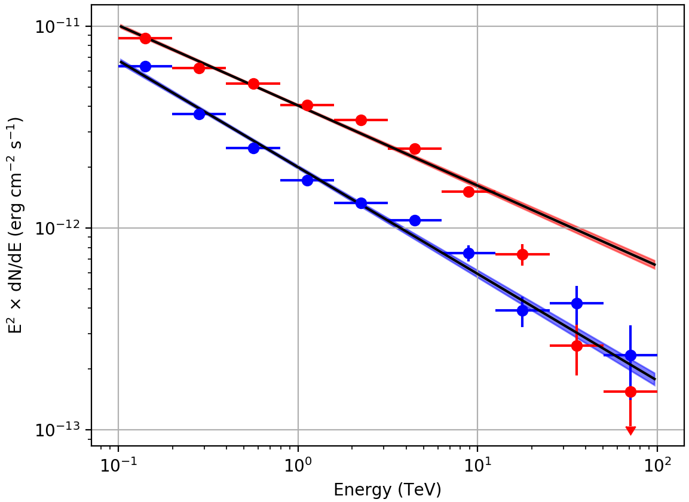

.. _1dc_first_fitting:

Fitting the model components to the counts cube
-----------------------------------------------

.. admonition:: You will learn ...

   ... how to **fit a parametric model** to the counts cube using an
   maximum liklihood algorithm.

   You will also learn how to display the fit results in form of
   `ds9 <http://ds9.si.edu>`_
   region files, butterfly diagrams and spectral points.

   Please note that display tools are **not** part of ctools, yet some
   scripts for result display that use the ``matplotlib`` Python module can be
   found in the
   ``$CTOOLS/share/examples/python``
   folder. For example you may use ``show_butterfly.py`` to display a butterfly
   diagram or ``show_spectrum.py`` to display spectral points. Do not hesitate to
   copy and adjust these scripts as needed, they are examples.

Now you are ready to fit the model to the counts cube and to determine its
maximum likelihood parameters.

You do this with the :ref:`ctlike` tool that adjusts all parameters in the
:ref:`model definition file <glossary_moddef>`
that have the attribute ``free`` set to ``"1"``.
In the current example, the free model parameters are the positions and spectral
parameters of the two point sources and the spectral normalisation of the
background component.
You run the :ref:`ctlike` tool as follows:

.. code-block:: bash

   $ ctlike
   Input event list, counts cube or observation definition XML file [events.fits] cntcube.fits
   Input exposure cube file (only needed for stacked analysis) [NONE] expcube.fits
   Input PSF cube file (only needed for stacked analysis) [NONE] psfcube.fits
   Input background cube file (only needed for stacked analysis) [NONE] bkgcube.fits
   Input model definition XML file [$CTOOLS/share/models/crab.xml] stacked_models.xml
   Output model definition XML file [crab_results.xml] stacked_results.xml

The tool will take a few minutes (on Mac OS X) to perform the model fitting,
and will write the results into an updated
:ref:`model definition file <glossary_moddef>`
containing the fitted model parameters and their statistical uncertainties.
You may inspect the log file ``ctlike.log`` to verify that the model fit
converged properly, as illustrated in the example below:

.. code-block:: bash

   2017-06-01T10:55:30: +=================================+
   2017-06-01T10:55:30: | Maximum likelihood optimisation |
   2017-06-01T10:55:30: +=================================+
   2017-06-01T10:55:44:  >Iteration   0: -logL=242348.647, Lambda=1.0e-03
   2017-06-01T10:55:58:  >Iteration   1: -logL=222180.556, Lambda=1.0e-03, delta=20168.091, step=1.0e+00, max(|grad|)=50061.839794 [Index:13]
   2017-06-01T10:56:11:  >Iteration   2: -logL=218667.504, Lambda=1.0e-04, delta=3513.051, step=1.0e+00, max(|grad|)=-11303.423190 [RA:6]
   2017-06-01T10:56:24:  >Iteration   3: -logL=217668.566, Lambda=1.0e-05, delta=998.938, step=1.0e+00, max(|grad|)=-9596.810651 [RA:6]
   2017-06-01T10:56:38:  >Iteration   4: -logL=217500.656, Lambda=1.0e-06, delta=167.910, step=1.0e+00, max(|grad|)=-6620.600218 [RA:6]
   2017-06-01T10:56:52:  >Iteration   5: -logL=217460.888, Lambda=1.0e-07, delta=39.769, step=1.0e+00, max(|grad|)=-4306.170420 [RA:6]
   2017-06-01T10:57:05:  >Iteration   6: -logL=217441.548, Lambda=1.0e-08, delta=19.339, step=1.0e+00, max(|grad|)=3170.609703 [RA:0]
   2017-06-01T10:57:20:  >Iteration   7: -logL=217432.039, Lambda=1.0e-09, delta=9.510, step=1.0e+00, max(|grad|)=2239.034002 [RA:0]
   2017-06-01T10:57:34:  >Iteration   8: -logL=217427.577, Lambda=1.0e-10, delta=4.461, step=1.0e+00, max(|grad|)=1582.498191 [RA:0]
   2017-06-01T10:57:48:  >Iteration   9: -logL=217425.390, Lambda=1.0e-11, delta=2.188, step=1.0e+00, max(|grad|)=1162.116922 [RA:0]
   2017-06-01T10:58:03:  >Iteration  10: -logL=217424.221, Lambda=1.0e-12, delta=1.169, step=1.0e+00, max(|grad|)=815.765881 [RA:0]
   2017-06-01T10:58:17:  >Iteration  11: -logL=217423.683, Lambda=1.0e-13, delta=0.538, step=1.0e+00, max(|grad|)=542.812704 [RA:0]
   2017-06-01T10:58:31:  >Iteration  12: -logL=217423.482, Lambda=1.0e-14, delta=0.200, step=1.0e+00, max(|grad|)=288.286783 [RA:0]
   2017-06-01T10:58:45:  >Iteration  13: -logL=217423.422, Lambda=1.0e-15, delta=0.060, step=1.0e+00, max(|grad|)=221.413071 [RA:0]
   2017-06-01T10:59:00:  >Iteration  14: -logL=217423.378, Lambda=1.0e-16, delta=0.044, step=1.0e+00, max(|grad|)=226.131427 [RA:0]
   2017-06-01T10:59:17:  >Iteration  15: -logL=217423.330, Lambda=1.0e-17, delta=0.048, step=1.0e+00, max(|grad|)=180.270743 [RA:0]
   2017-06-01T10:59:32:  >Iteration  16: -logL=217423.309, Lambda=1.0e-18, delta=0.020, step=1.0e+00, max(|grad|)=104.148460 [RA:0]
   2017-06-01T10:59:46:  >Iteration  17: -logL=217423.303, Lambda=1.0e-19, delta=0.007, step=1.0e+00, max(|grad|)=63.327107 [RA:0]
   2017-06-01T11:00:00:  >Iteration  18: -logL=217423.298, Lambda=1.0e-20, delta=0.004, step=1.0e+00, max(|grad|)=42.005734 [RA:0]
   2017-06-01T11:00:14:
   2017-06-01T11:00:14: +=========================================+
   2017-06-01T11:00:14: | Maximum likelihood optimisation results |
   2017-06-01T11:00:14: +=========================================+
   2017-06-01T11:00:14: === GOptimizerLM ===
   2017-06-01T11:00:14:  Optimized function value ..: 217423.298
   2017-06-01T11:00:14:  Absolute precision ........: 0.005
   2017-06-01T11:00:14:  Acceptable value decrease .: 2
   2017-06-01T11:00:14:  Optimization status .......: converged
   2017-06-01T11:00:14:  Number of parameters ......: 16
   2017-06-01T11:00:14:  Number of free parameters .: 10
   2017-06-01T11:00:14:  Number of iterations ......: 18
   2017-06-01T11:00:14:  Lambda ....................: 1e-21
   2017-06-01T11:00:14:  Maximum log likelihood ....: -217423.298
   2017-06-01T11:00:14:  Observed events  (Nobs) ...: 2204717.000
   2017-06-01T11:00:14:  Predicted events (Npred) ..: 2204716.997 (Nobs - Npred = 0.00283915968611836)

You may also convert the fitted model positions into a `ds9 <http://ds9.si.edu>`_
region file using the :ref:`csmodelinfo` script so that you can overlay the
fit results over a sky map:

.. code-block:: bash

   $ csmodelinfo pnt_type=circle free_color=black show_labels=no
   Input model definition XML file [model.xml] stacked_results.xml
   Output DS9 region file [ds9.reg] positions.reg

The command line arguments ``pnt_type``, ``free_color`` and ``show_labels``
enable to fine tune the parameters in the `ds9 <http://ds9.si.edu>`_
region file. In this case, the positions are marked by black circles without
showing the source names.

The following image shows a zoom of the sky map that comprises both point
sources, with the initial source positions determined by :ref:`cssrcdetect`
as green crosses and the positions fitted by :ref:`ctlike` as black circles.
Obviously, the initial positions were already near the fitted positions,
which is required to assure the proper convergence of the fit.

.. figure:: first_skymap_fitted.png
   :width: 600px
   :align: center

   *Background subtracted sky map of the events recorded around the Galactic Centre during the Galactic Plane Survey with the fitted positions of the sources shown as black circles*

You can also convert the spectral parameters of the point sources into a
butterfly diagram for each source using the :ref:`ctbutterfly` tool.
The butterfly diagram shows the envelope of all spectral models that are
statistically compatible with the data.
You create the butterfly diagram for the first source using

.. code-block:: bash

  $ ctbutterfly
  Input event list, counts cube or observation definition XML file [events.fits] cntcube.fits
  Input exposure cube file (only needed for stacked analysis) [ctexpcube.fits] expcube.fits
  Input PSF cube file (only needed for stacked analysis) [psfcube.fits]
  Input background cube file (only needed for stacked analysis) [bkgcube.fits]
  Source of interest [Crab] Src001
  Input model definition XML file [$CTOOLS/share/models/crab.xml] stacked_results.xml
  Start value for first energy bin in TeV [0.1]
  Stop value for last energy bin in TeV [100.0]
  Output ASCII file [butterfly.txt] butterfly_src001.txt

and for the second source using

.. code-block:: bash

   $ ctbutterfly
   Input event list, counts cube or observation definition XML file [cntcube.fits]
   Input exposure cube file (only needed for stacked analysis) [expcube.fits]
   Input PSF cube file (only needed for stacked analysis) [psfcube.fits]
   Input background cube file (only needed for stacked analysis) [bkgcube.fits]
   Source of interest [Src001] Src002
   Input model definition XML file [stacked_results.xml]
   Start value for first energy bin in TeV [0.1]
   Stop value for last energy bin in TeV [100.0]
   Output ASCII file [butterfly_src001.txt] butterfly_src002.txt

The butterfly diagrams for both sources are displayed in the figure below.
The figure also shows spectral points for each source that were determined
using the :ref:`csspec` script.
You create the spectrum for the first source using

.. code-block:: bash

   $ csspec
   Input event list, counts cube, or observation definition XML file [events.fits] cntcube.fits
   Input exposure cube file (only needed for stacked analysis) [NONE] expcube.fits
   Input PSF cube file (only needed for stacked analysis) [NONE] psfcube.fits
   Input background cube file (only needed for stacked analysis) [NONE] bkgcube.fits
   Input model definition XML file [$CTOOLS/share/models/crab.xml] stacked_results.xml
   Source name [Crab] Src001
   Binning algorithm (LIN|LOG|FILE) [LOG]
   Lower energy limit (TeV) [0.1]
   Upper energy limit (TeV) [100.0]
   Number of energy bins (0=unbinned) [20] 10
   Output spectrum file [spectrum.fits] spectrum_src001.fits

and for the second source using

.. code-block:: bash

   $ csspec
   Input event list, counts cube, or observation definition XML file [cntcube.fits]
   Input exposure cube file (only needed for stacked analysis) [expcube.fits]
   Input PSF cube file (only needed for stacked analysis) [psfcube.fits]
   Input background cube file (only needed for stacked analysis) [bkgcube.fits]
   Input model definition XML file [stacked_results.xml]
   Source name [Src001] Src002
   Binning algorithm (LIN|LOG|FILE) [LOG]
   Lower energy limit (TeV) [0.1]
   Upper energy limit (TeV) [100.0]
   Number of energy bins (0=unbinned) [10]
   Output spectrum file [spectrum_src001.fits] spectrum_src002.fits

The :ref:`csspec` script divided here the data into ten logarithmically
spaced energy bins and determined the source flux in each of the bins using
a maximum likelihood model fit.

   *Butterfly diagrams determined with ctbutterfly and spectral points determined with csspec for Src001 (red) and Src002 (blue)*

Obviously, ``Src001`` has a spectral cut-off (red flux points) and hence is not
adequately described by a power law model.
Replacing the spectral model of ``Src001`` by an exponentially cut-off
power law improves the fit to the data, as illustrated by the figure below.

.. figure:: first_spectrum_cutoff_stacked.png
   :width: 600px
   :align: center

   *Butterfly diagrams determined with ctbutterfly for an exponentially cut-off power law for Src001 (red)*
