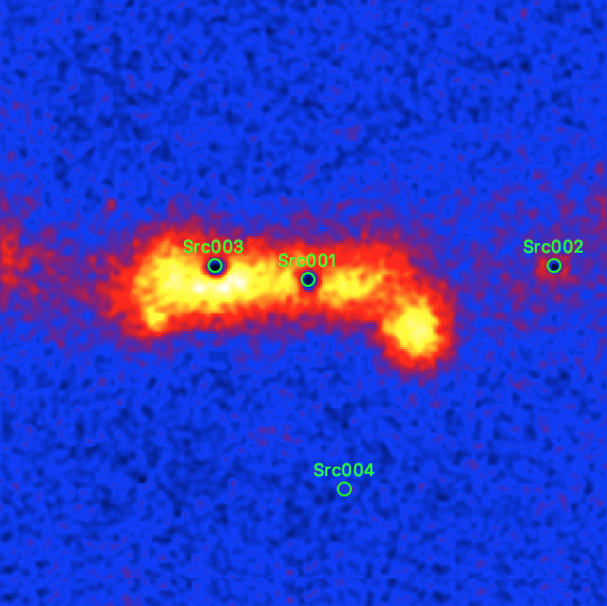

.. _1dc_first_improving:

Iteratively improving the model
-------------------------------

  .. admonition:: What you will learn

     You will learn how to **iteratively improve** your source model by
     inspecting the fit residuals and by adjusting the model components as needed.

After doing the model fit you should investigate the residuals to verify that
the model components properly describe the observed event distribution.
You do this with the :ref:`csresmap` script by providing the output
:ref:`model definition file <glossary_moddef>`
``results.xml`` produced by :ref:`ctlike` as input:

.. code-block:: bash

   $ csresmap
   Input event list, counts cube, or observation definition XML file [events.fits] cntcube.fits
   Input model cube file (generated with ctmodel) [NONE]
   Input exposure cube file [NONE] expcube.fits
   Input PSF cube file [NONE] psfcube.fits
   Input background cube file [NONE] bkgcube.fits
   Input model definition XML file [$CTOOLS/share/models/crab.xml] results_stacked_eplaw.xml
   Residual map computation algorithm (SUB|SUBDIV|SUBDIVSQRT|SIGNIFICANCE) [SIGNIFICANCE]
   Output residual map file [resmap.fits]

This produces the file ``resmap.fits`` that contains a residual map that
you can display for example with `ds9 <http://ds9.si.edu>`_.
The figure below shows the map with a linear color scaling and the fitted source
positions overlayed as green circles.

   *Residual sky map after subtraction of the fitted model*

The subtraction of the fitted sources clearly leaves some emission holes at
their locations, which means that the fitted sources picked up some of the
underlying Galactic diffuse gamma-ray emission. To prevent this cross-talk,
a diffuse emission model should be added to the
:ref:`model definition file <glossary_moddef>`,
as illustrated below:

.. code-block:: xml

   <?xml version="1.0" encoding="UTF-8" standalone="no"?>
   <source_library title="source library">
     <source name="IEM" type="DiffuseSource">
       <spectrum type="ConstantValue">
         <parameter name="Value" value="1" scale="1" min="1e-05" max="100000" free="1" />
       </spectrum>
       <spatialModel type="MapCubeFunction" file="$CTADATA/models/cube_iem.fits.gz">
         <parameter name="Normalization" value="1" scale="1" min="0.001" max="1000" free="0" />
       </spatialModel>
     </source>
     <source name="Src001" type="PointSource">
       ...
     </source>
   </source_library>

Repeating the fit with this model and producing a corresponding residual map
produces the map shown below. Now, the residuals near the two point sources
are flat and the diffuse emission has disappeared. Some additional sources now
become clearly visible. It is left as an exercise to the User to include model
components for these additional sources in the
:ref:`model definition file <glossary_moddef>`
in order to reduce the fit residuals.
An example for such an exercise is shown
:ref:`here <howto_extent>`.

.. figure:: first_skymap_residual_iem.png
   :width: 400px
   :align: center

   *Residual sky map after subtraction of the fitted model including a diffuse emission component*
