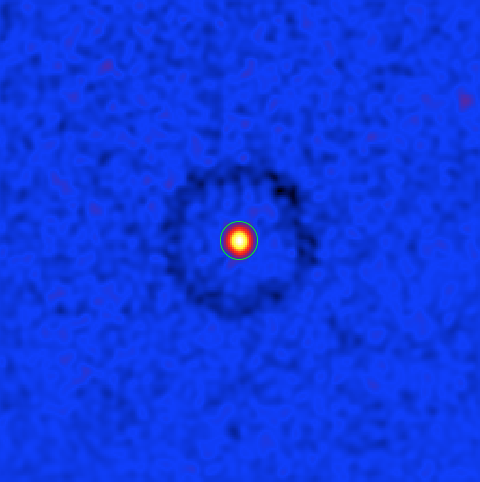
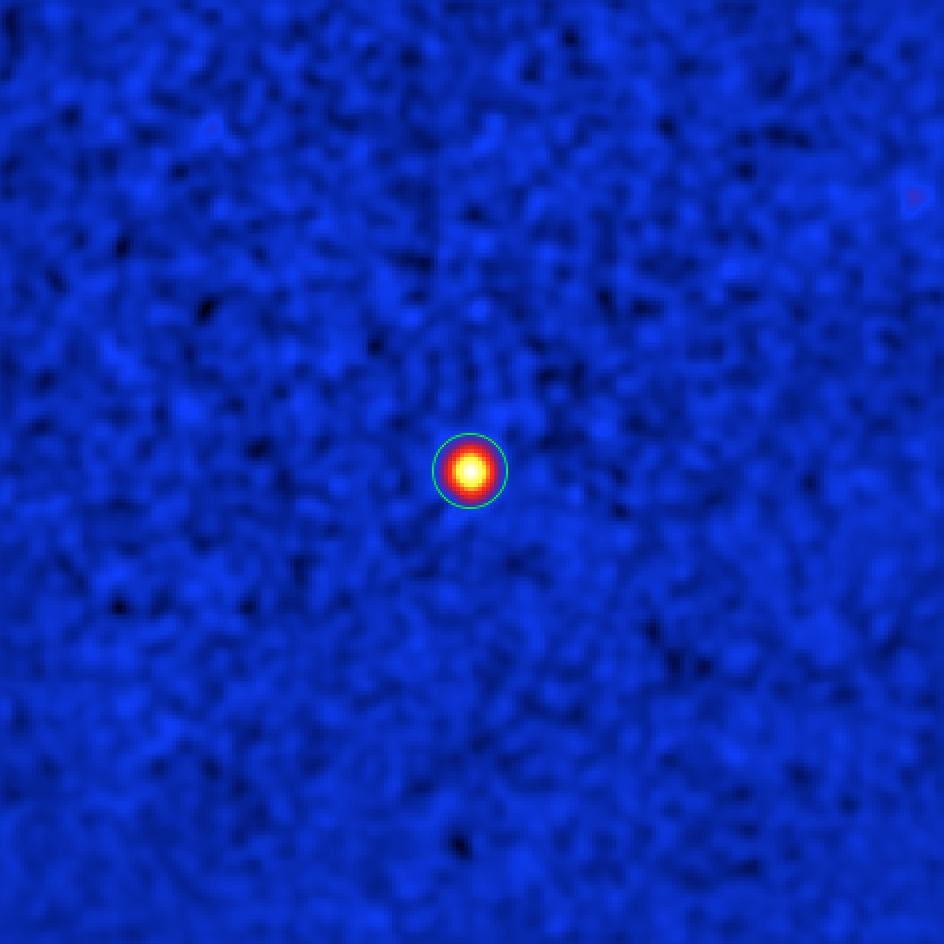
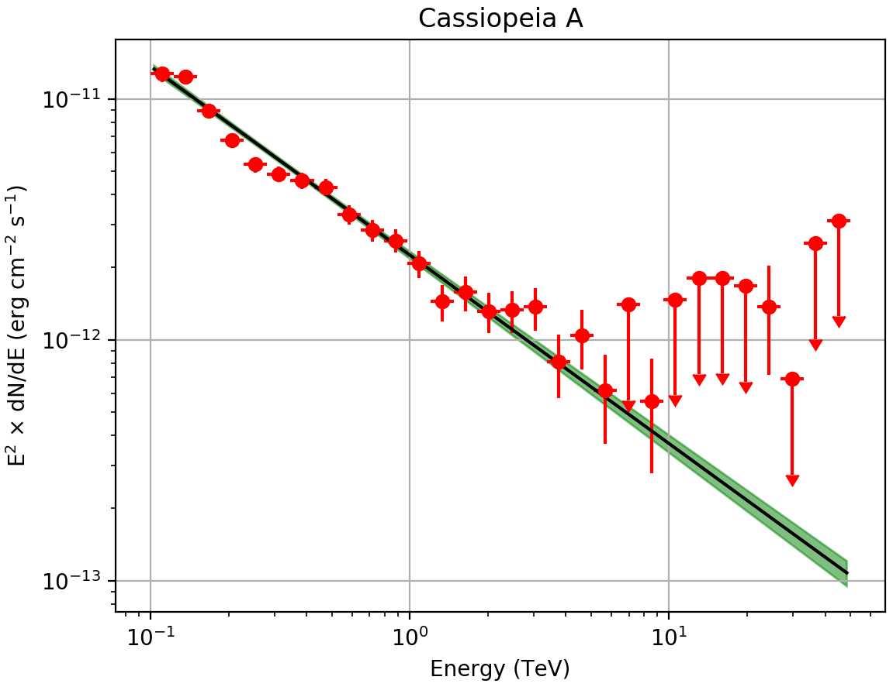

.. _1dc_classical_analysis:

Performing a classical (On/Off) analysis
----------------------------------------

  .. admonition:: What you will learn

     You will learn how to perform a *classical* analysis
     of a source. In this type of analysis you do not need to have a 3D (spatial
     and spectral) model of the irreducible background.

So far you have analysed the data in a 3-dimensional data space, spanned by
position and energy, and you have used a maximum likelihood method to adjust a
parametric model to the full data space.
That's the same way how Fermi-LAT data are analysed.

Traditionally, however, a different technique is used for analysing data from
Imaging Air Cherenkov Telescopes.
Since the irreducible background is sometimes difficult to model, it is often
preferred to use the data themselves to assess the background, assuming some
symmetries of the event distribution in the data space.

In ctools this method is called *classical* or *On/Off* analysis.

To execute this tutorial, create and step into a new directory:

.. code-block:: bash

   $ mkdir my_onoff_analysis
   $ cd my_onoff_analysis

Selecting the data
^^^^^^^^^^^^^^^^^^

Let's use the On/Off analysis method now for deriving the spectrum of a source
with known position.
We consider here the supernova remnant Cassiopeia A.

First, use the :ref:`csobsselect` script to select observations around the
source of interest.

.. code-block:: bash

   $ csobsselect
   Input event list or observation definition XML file [obs.xml] $CTADATA/obs/obs_gps_baseline.xml
   Pointing selection region shape (CIRCLE|BOX) [CIRCLE]
   Coordinate system (CEL - celestial, GAL - galactic) (CEL|GAL) [CEL]
   Right Ascension of selection centre (deg) (0-360) [83.63] 350.85
   Declination of selection centre (deg) (-90-90) [22.01] 58.815
   Radius of selection circle (deg) (0-180) [5.0] 2.5
   Start time (UTC string, JD, MJD or MET in seconds) [NONE]
   Output observation definition XML file [outobs.xml] obs.xml

.. note::
   The offset between pointing and event directions is limited to 2.5 deg
   for the sake of a faster execution time for the tutorial.
   You can of course use a larger radius to select more observations for
   which the source is within the field of view, which will increase the event
   statistic and provide a more precise source spectrum.

Define the source and exclusion regions
^^^^^^^^^^^^^^^^^^^^^^^^^^^^^^^^^^^^^^^

Next, create a skymap to identify the source region. You do this using the
:ref:`ctskymap` tool.

.. code-block:: bash

   $ ctskymap
   Input event list or observation definition XML file [events.fits] obs.xml
   Coordinate system (CEL - celestial, GAL - galactic) (CEL|GAL) [CEL]
   Projection method (AIT|AZP|CAR|GLS|MER|MOL|SFL|SIN|STG|TAN) [CAR]
   First coordinate of image center in degrees (RA or galactic l) (0-360) [83.63] 350.85
   Second coordinate of image center in degrees (DEC or galactic b) (-90-90) [22.01] 58.815
   Image scale (in degrees/pixel) [0.02]
   Size of the X axis in pixels [200] 250
   Size of the Y axis in pixels [200] 250
   Lower energy limit (TeV) [0.1]
   Upper energy limit (TeV) [100.0] 50.0
   Background subtraction method (NONE|IRF|RING) [NONE] RING
   Source region radius for estimating on-counts (degrees) [0.1] 0.05
   Inner background ring radius (degrees) [0.6]
   Outer background ring radius (degrees) [0.8]
   Number of iterations for exclusion regions computation (0-100) [0]
   Output skymap file [skymap.fits]

The ``RING`` background subtraction method was used that is also a classical
analysis method.
For each pixel in the map the ``RING`` method estimates the background from a
ring centered at the pixel.
The ``RING`` method is fast and robust against linear gradients of the
background rates, but requires a model
(from the :ref:`instrument response functions <glossary_irf>`)
of the background acceptance as a function of position in the field of view.
You need to choose the ring inner and outer radii such that you avoid emission
from a source when deriving the background.
This means that the inner radius must be larger than the source's size, or the
instrument point spread function for a pointlike source.

:ref:`ctskymap` will produce a FITS file ``skymap.fits`` that contains three
images of the region around the source.
The primary image shows the excess counts, i.e., the total number of counts
minus the estimated background counts.
The ``BACKGROUND`` image shows the number of estimated background counts.
Finally, the ``SIGNIFICANCE`` image shows the significance of the excess,
calculated according to
`Li & Ma (1983) ApJ, 272, 317 <http://cdsads.u-strasbg.fr/abs/1983ApJ...272..317L>`_,
equation 17.

You can visualize the resulting map using `ds9 <http://ds9.si.edu>`_.

   *Sky map of the significance of a gamma-ray excess around Cas A. The green circle shows a circular region with 0.2 deg radius centered at the source's position.*

Note that there is a ring with negative significance (i.e., a count deficit)
at offsets between 0.6 deg and 0.8 deg from the source. This is
an artefact due to the fact that when computing the background for a trial
source in this area the region around Cas A was falling into the ring used for
the background estimation.

The artefact can be avoided by excluding the region around Cas A from the ring
background estimation. To do this, let's create an ASCII file in
`ds9 region format <http://ds9.si.edu/doc/ref/region.html>`_

.. code-block:: bash

   $ nano CasA_exclusion.reg
   fk5
   circle(350.85,58.815,0.2)

that contains a circular region with radius 0.2 deg centered on Cas A.
Alternatively, you could have created a FITS WCS map where all non-zero pixels
will specify the region to be excluded.

Now re-run :ref:`ctskymap` with the exclusion region file provided as
parameter ``inexclusion`` on the command line:

.. code-block:: bash

   $ ctskymap inexclusion=CasA_exclusion.reg
   Input event list or observation definition XML file [obs.xml]
   Coordinate system (CEL - celestial, GAL - galactic) (CEL|GAL) [CEL]
   Projection method (AIT|AZP|CAR|GLS|MER|MOL|SFL|SIN|STG|TAN) [CAR]
   First coordinate of image center in degrees (RA or galactic l) (0-360) [350.85]
   Second coordinate of image center in degrees (DEC or galactic b) (-90-90) [58.815]
   Image scale (in degrees/pixel) [0.02]
   Size of the X axis in pixels [250]
   Size of the Y axis in pixels [250]
   Lower energy limit (TeV) [0.1]
   Upper energy limit (TeV) [50.0]
   Background subtraction method (NONE|IRF|RING) [RING]
   Source region radius for estimating on-counts (degrees) [0.05]
   Inner background ring radius (degrees) [0.6]
   Outer background ring radius (degrees) [0.8]
   Number of iterations for exclusion regions computation (0-100) [0]
   Output skymap file [skymap.fits] skymap_exclusion.fits

Below you can see the new significance map with the source exclusion region.

   *Sky map of the significance of a gamma-ray excess around Cas A. The green circle shows a circular region with 0.2 deg radius centered at the source's position, that is excluded from the background estimation.*

In fact you could have excluded Cas A from the beginning since it is a known
source.
In general you will need to iterate until you have found all the significant
gamma-ray emission regions and added them to the exclusion regions or map,
which will then be used for spectral extraction.

.. note::
   :ref:`ctskymap` will automatically generate exclusion maps by collecting all
   sky map pixels with a significance above a given threshold in an exclusion
   map. Since the pixel significance will depend on the background estimate,
   and hence the exclusion map itself, the pixel significance needs to be
   iteratively recomputed after update of the exclusion map. The ``iterations``
   parameter allows to specify the number of iterations (typically 3 are
   sufficient) and the ``threshold`` parameter specifies the significance
   threshold for pixels to be included in the exclusion map.

Create an On/Off observation
^^^^^^^^^^^^^^^^^^^^^^^^^^^^

Now you are ready to create the source and background spectra, as well as the
corresponding response files.
The collection of all these files is called an *On/Off observation*, which
has the special ``instrument`` attribute ``CTAOnOff`` in ctools.
To create an On/Off observation for Cas A, run the :ref:`csphagen` script as
follows:

.. code-block:: bash

   $ csphagen
   Input event list or observation definition XML file [obs.xml]
   Input model definition XML file (if NONE, use point source) [NONE]
   Algorithm for defining energy bins (FILE|LIN|LOG) [LOG]
   Start value for first energy bin in TeV [0.1]
   Stop value for last energy bin in TeV [100.0] 50.0
   Number of energy bins [120] 30
   Stack multiple observations into single PHA, ARF and RMF files? [no] yes
   Output observation definition XML file [onoff_obs.xml]
   Output model definition XML file [onoff_model.xml]
   Method for background estimation (REFLECTED|CUSTOM) [REFLECTED]
   Coordinate system (CEL - celestial, GAL - galactic) (CEL|GAL) [CEL]
   Right Ascension of source region centre (deg) (0-360) [83.63] 350.85
   Declination of source region centre (deg) (-90-90) [22.01] 58.815
   Radius of source region circle (deg) (0-180) [0.2]

The script will produce a number of output files.
The central output file is the
:ref:`observation definition file <glossary_obsdef>`
``onoff_obs.xml`` which looks as follows:

.. code-block:: xml

   <?xml version="1.0" encoding="UTF-8" standalone="no"?>
   <observation_list title="observation list">
     <observation name="" id="" instrument="CTAOnOff" statistic="wstat">
       <parameter name="Pha_on"  file="onoff_stacked_pha_on.fits" />
       <parameter name="Pha_off" file="onoff_stacked_pha_off.fits" />
       <parameter name="Arf"     file="onoff_stacked_arf.fits" />
       <parameter name="Rmf"     file="onoff_stacked_rmf.fits" />
     </observation>
   </observation_list>

The source and background spectra are stored in so called
`Pulse Hight Analyzer (PHA) <https://heasarc.gsfc.nasa.gov/docs/heasarc/ofwg/docs/spectra/ogip_92_007.pdf>`_
files with the ``name`` attributes ``Pha_on`` and ``Pha_off``.
The effective area, corrected for the angular cut, is stored in a so called
`Auxilliary Response File (ARF) <https://heasarc.gsfc.nasa.gov/docs/heasarc/ofwg/docs/spectra/ogip_92_007.pdf>`_
with the ``name`` attribute ``Arf``.
The energy dispersion is stored in a so called
`Redistribution Matrix File (RMF) <https://heasarc.gsfc.nasa.gov/docs/heasarc/ofwg/docs/spectra/ogip_92_007.pdf>`_
with the ``name`` attribute ``Rmf``.

There are also some ancillary `ds9 <http://ds9.si.edu>`_ region files, that
contain the On region and the Off regions for each observation,
``onoff_on.reg`` and ``onoff_xxx_off.reg`` (with ``xxx`` being the input
observation identifier), respectively.

.. note::
   In the above example you have stacked all input observations into a single
   On/Off observations. If you decide not to stack the observation there will
   be one output observation per input observation in the
   :ref:`observation definition XML file <glossary_obsdef>`
   and in the filenames the string ``stacked`` will be replaced by the
   observation identifier of the input observations.

Below you see a skymap showing the pointing directions along with the position
of the On and Off regions for two observations (extracted from the
:ref:`observation definition file <glossary_obsdef>`
using the :ref:`csobsinfo` script).

   *Sky map of the event counts in a larger region around Cas A (not background subtracted). The green crosses show the pointing directions, the magenta circles the Off regions, and the white circle the On region.*

Fitting the On/Off observation
^^^^^^^^^^^^^^^^^^^^^^^^^^^^^^

:ref:`csphagen` also generated an output
:ref:`model definition file <glossary_moddef>`
``onoff_model.xml`` than can be readily used for model fitting. Here is the
content of that file:

.. code-block:: xml

   <?xml version="1.0" encoding="UTF-8" standalone="no"?>
   <source_library title="source library">
     <source name="Dummy" type="PointSource">
       <spectrum type="PowerLaw">
         <parameter name="Prefactor" value="1" error="0" scale="1e-18" min="0" free="1" />
         <parameter name="Index" value="1" error="-0" scale="-2" min="-5" max="5" free="1" />
         <parameter name="PivotEnergy" value="1" scale="1000000" free="0" />
       </spectrum>
       <spatialModel type="PointSource">
         <parameter name="RA" value="350.85" scale="1" free="0" />
         <parameter name="DEC" value="58.815" scale="1" free="0" />
       </spatialModel>
     </source>
   </source_library>

Fit now the model to the data using :ref:`ctlike`:

.. code-block:: bash

   $ ctlike
   Input event list, counts cube or observation definition XML file [events.fits] onoff_obs.xml
   Input model definition XML file [$CTOOLS/share/models/crab.xml] onoff_model.xml
   Output model definition XML file [crab_results.xml] CasA_results.xml

The fit result can be inspected by peeking the log file:

.. code-block:: none

   2019-04-09T13:23:01: +=================================+
   2019-04-09T13:23:01: | Maximum likelihood optimisation |
   2019-04-09T13:23:01: +=================================+
   2019-04-09T13:23:01:  >Iteration   0: -logL=808.123, Lambda=1.0e-03
   2019-04-09T13:23:01:  >Iteration   1: -logL=397.528, Lambda=1.0e-03, delta=410.596, step=1.0e+00, max(|grad|)=5592.136956 [Index:3]
   2019-04-09T13:23:01:  >Iteration   2: -logL=30.531, Lambda=1.0e-04, delta=366.997, step=1.0e+00, max(|grad|)=44.701876 [Index:3]
   2019-04-09T13:23:01:  >Iteration   3: -logL=28.754, Lambda=1.0e-05, delta=1.777, step=1.0e+00, max(|grad|)=8.638016 [Index:3]
   2019-04-09T13:23:01:  >Iteration   4: -logL=28.718, Lambda=1.0e-06, delta=0.036, step=1.0e+00, max(|grad|)=2.410274 [Index:3]
   2019-04-09T13:23:01:  >Iteration   5: -logL=28.717, Lambda=1.0e-07, delta=0.001, step=1.0e+00, max(|grad|)=0.338036 [Index:3]
   2019-04-09T13:23:01:
   2019-04-09T13:23:01: +=========================================+
   2019-04-09T13:23:01: | Maximum likelihood optimisation results |
   2019-04-09T13:23:01: +=========================================+
   2019-04-09T13:23:01: === GOptimizerLM ===
   2019-04-09T13:23:01:  Optimized function value ..: 28.717
   2019-04-09T13:23:01:  Absolute precision ........: 0.005
   2019-04-09T13:23:01:  Acceptable value decrease .: 2
   2019-04-09T13:23:01:  Optimization status .......: converged
   2019-04-09T13:23:01:  Number of parameters ......: 6
   2019-04-09T13:23:01:  Number of free parameters .: 2
   2019-04-09T13:23:01:  Number of iterations ......: 5
   2019-04-09T13:23:01:  Lambda ....................: 1e-08
   2019-04-09T13:23:01:  Maximum log likelihood ....: -28.717
   2019-04-09T13:23:01:  Observed events  (Nobs) ...: 9732.000
   2019-04-09T13:23:01:  Predicted events (Npred) ..: 9685.547 (Nobs - Npred = 46.4528551491258)
   2019-04-09T13:23:01: === GModels ===
   2019-04-09T13:23:01:  Number of models ..........: 1
   2019-04-09T13:23:01:  Number of parameters ......: 6
   2019-04-09T13:23:01: === GModelSky ===
   2019-04-09T13:23:01:  Name ......................: Dummy
   2019-04-09T13:23:01:  Instruments ...............: all
   2019-04-09T13:23:01:  Instrument scale factors ..: unity
   2019-04-09T13:23:01:  Observation identifiers ...: all
   2019-04-09T13:23:01:  Model type ................: PointSource
   2019-04-09T13:23:01:  Model components ..........: "PointSource" * "PowerLaw" * "Constant"
   2019-04-09T13:23:01:  Number of parameters ......: 6
   2019-04-09T13:23:01:  Number of spatial par's ...: 2
   2019-04-09T13:23:01:   RA .......................: 350.85 deg (fixed,scale=1)
   2019-04-09T13:23:01:   DEC ......................: 58.815 deg (fixed,scale=1)
   2019-04-09T13:23:01:  Number of spectral par's ..: 3
   2019-04-09T13:23:01:   Prefactor ................: 1.40288229704921e-18 +/- 4.79754801405267e-20 [0,infty[ ph/cm2/s/MeV (free,scale=1e-18,gradient)
   2019-04-09T13:23:01:   Index ....................: -2.78268915221025 +/- 0.0230642440053814 [10,-10]  (free,scale=-2,gradient)
   2019-04-09T13:23:01:   PivotEnergy ..............: 1000000 MeV (fixed,scale=1000000,gradient)
   2019-04-09T13:23:01:  Number of temporal par's ..: 1
   2019-04-09T13:23:01:   Normalization ............: 1 (relative value) (fixed,scale=1,gradient)

.. tip::
   By default the ``WSTAT`` statistic is used which does not require a
   background model. If a background model should be used it needs to be
   provided as input model to :ref:`csphagen`. Here an example for an
   input model:

   .. code-block:: xml

      <?xml version="1.0" encoding="UTF-8" standalone="no"?>
      <source_library title="source library">
        <source name="Cassiopeia A" type="PointSource">
          <spectrum type="PowerLaw">
            <parameter name="Prefactor"   value="1.45" scale="1e-18" min="0"            free="1"/>
            <parameter name="Index"       value="2.75" scale="-1"    min="-10" max="10" free="1"/>
            <parameter name="PivotEnergy" value="1"    scale="1e6"                      free="0"/>
          </spectrum>
          <spatialModel type="PointSource">
            <parameter name="RA"  value="350.8500" scale="1" free="0"/>
            <parameter name="DEC" value="58.8150"  scale="1" free="0"/>
          </spatialModel>
        </source>
        <source name="Background model" type="CTAIrfBackground" instrument="CTA">
          <spectrum type="PowerLaw">
            <parameter name="Prefactor" value="1" scale="1"   min="0.001" max="1000" free="1"/>
            <parameter name="Index"     value="0" scale="1"   min="-5"    max="5"    free="1"/>
            <parameter name="Scale"     value="1" scale="1e6" min="0.01"  max="1000" free="0"/>
          </spectrum>
        </source>
      </source_library>

   Now rerun :ref:`csphagen` as follows:

   .. code-block:: bash

      $ csphagen
      Input event list or observation definition XML file [obs.xml]
      Input model definition XML file (if NONE, use point source) [NONE] CasA_model.xml
      Source name [Crab] Cassiopeia A
      Algorithm for defining energy bins (FILE|LIN|LOG) [LOG]
      Start value for first energy bin in TeV [0.1]
      Stop value for last energy bin in TeV [50.0]
      Number of energy bins [30]
      Stack multiple observations into single PHA, ARF and RMF files? [yes]
      Output observation definition XML file [onoff_obs.xml] onoff_obs_cstat.xml
      Output model definition XML file [onoff_model.xml] onoff_model_cstat.xml
      Method for background estimation (REFLECTED|CUSTOM) [REFLECTED]
      Coordinate system (CEL - celestial, GAL - galactic) (CEL|GAL) [CEL]
      Right Ascension of source region centre (deg) (0-360) [350.85]
      Declination of source region centre (deg) (-90-90) [58.815]
      Radius of source region circle (deg) (0-180) [0.2]

   This produces an
   :ref:`observation definition file <glossary_obsdef>`
   ``onoff_obs_cstat.xml`` which has the ``statistic`` attribute set to
   ``cstat``:

   Now you can refit the data:

   .. code-block:: bash

      $ ctlike
      Input event list, counts cube or observation definition XML file [onoff_obs.xml] onoff_obs_cstat.xml
      Input model definition XML file [models.xml] onoff_model_cstat.xml
      Output model definition XML file [CasA_results.xml] CasA_results_cstat.xml

   The fit results, which are very similar to those obtained using ``WSTAT``
   before, are shown below:

   .. code-block:: none

      2019-04-09T21:27:21: === GModelSky ===
      2019-04-09T21:27:21:  Name ......................: Cassiopeia A
      2019-04-09T21:27:21:  Instruments ...............: all
      2019-04-09T21:27:21:  Instrument scale factors ..: unity
      2019-04-09T21:27:21:  Observation identifiers ...: all
      2019-04-09T21:27:21:  Model type ................: PointSource
      2019-04-09T21:27:21:  Model components ..........: "PointSource" * "PowerLaw" * "Constant"
      2019-04-09T21:27:21:  Number of parameters ......: 6
      2019-04-09T21:27:21:  Number of spatial par's ...: 2
      2019-04-09T21:27:21:   RA .......................: 350.85 deg (fixed,scale=1)
      2019-04-09T21:27:21:   DEC ......................: 58.815 deg (fixed,scale=1)
      2019-04-09T21:27:21:  Number of spectral par's ..: 3
      2019-04-09T21:27:21:   Prefactor ................: 1.40606639795433e-18 +/- 4.84093827184383e-20 [0,infty[ ph/cm2/s/MeV (free,scale=1e-18,gradient)
      2019-04-09T21:27:21:   Index ....................: -2.75705171501787 +/- 0.023581178160149 [10,-10]  (free,scale=-1,gradient)
      2019-04-09T21:27:21:   PivotEnergy ..............: 1000000 MeV (fixed,scale=1000000,gradient)
      2019-04-09T21:27:21:  Number of temporal par's ..: 1
      2019-04-09T21:27:21:   Normalization ............: 1 (relative value) (fixed,scale=1,gradient)

Visualising the source spectrum
^^^^^^^^^^^^^^^^^^^^^^^^^^^^^^^

You can visualise the source spectrum using the :ref:`ctbutterfly` tool and the
:ref:`csspec` script, the first shows the uncertainty band of the fitted
spectral model, while the second shows the spectral energy distribution (SED)
of the source.

Like for a binned or unbinned analysis, you can create a butterfly diagram by typing

.. code-block:: bash

   $ ctbutterfly
   Input event list, counts cube or observation definition XML file [events.fits] onoff_obs.xml
   Source of interest [Crab] Cassiopeia A
   Input model definition XML file [$CTOOLS/share/models/crab.xml] CasA_results.xml
   Lower energy limit (TeV) [0.1]
   Upper energy limit (TeV) [100.0] 50.0
   Output ASCII file [butterfly.txt]

and the SED by typing

.. code-block:: bash

   $ csspec
   Input event list, counts cube, or observation definition XML file [events.fits] onoff_obs.xml
   Input model definition XML file [$CTOOLS/share/models/crab.xml] CasA_results.xml
   Source name [Crab] Cassiopeia A
   Spectrum generation method (SLICE|NODES|AUTO) [AUTO]
   Binning algorithm (LIN|LOG|FILE) [LOG]
   Lower energy limit (TeV) [0.1]
   Upper energy limit (TeV) [100.0] 50.0
   Number of energy bins [20] 30
   Output spectrum file [spectrum.fits]

The plot below displays the derived spectrum and butterfly

   *Spectral Energy Distribution of the source: the best-fit function over the whole energy range and its uncertainty range, along with the spectral points in energy bins.*

To reproduce the plot
:download:`download <show_onoff_spectrum.py>`
the matplotlib based script and type

.. code-block:: bash

   $ ./show_onoff_spectrum.py
