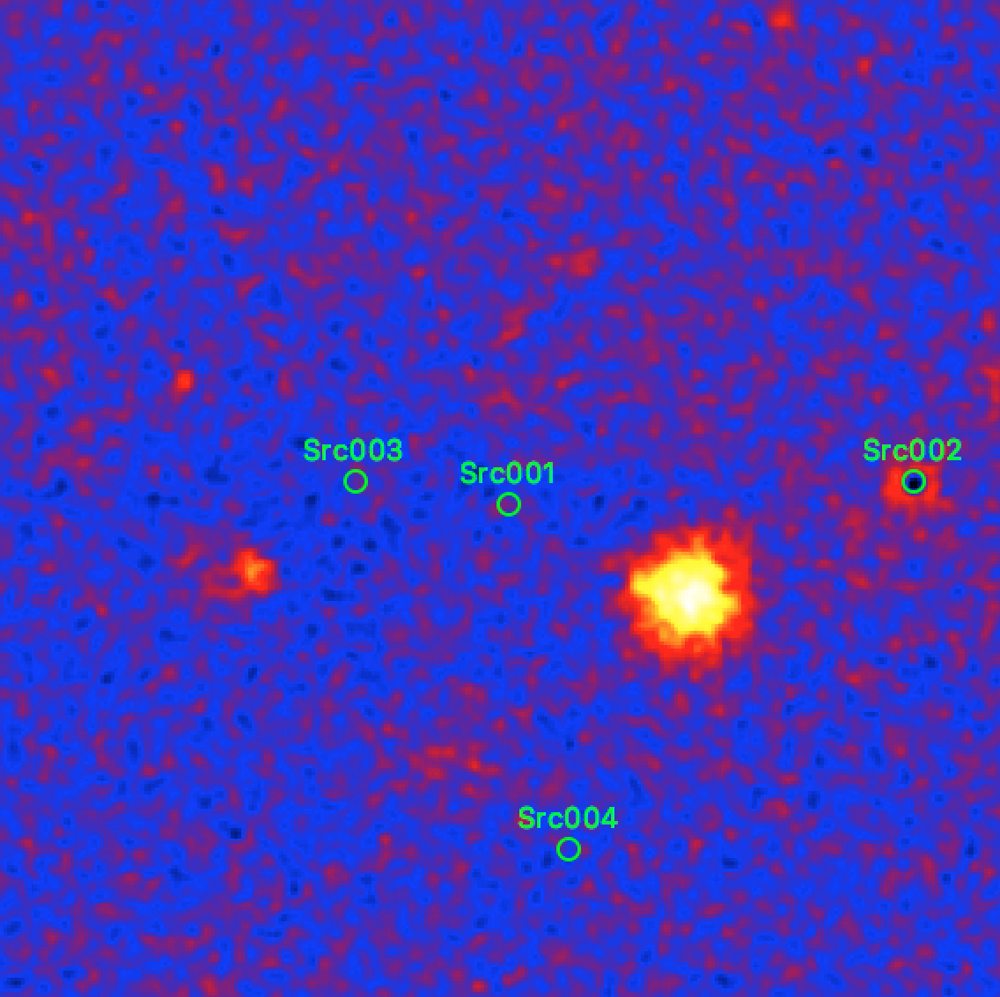

.. _1dc_first_residuals:

Inspecting the fit residuals
----------------------------

After doing the model fit you should investigate the residuals to verify that
the model components properly describe the observed event distribution.
You do this with the :ref:`csresmap` script by providing the output
:ref:`model definition file <glossary_moddef>`
``results.xml`` produced by :ref:`ctlike` as input:

.. code-block:: bash

   $ csresmap
   Input event list, counts cube, or observation definition XML file [events.fits] obs_selected.xml
   Input model definition XML file [$CTOOLS/share/models/crab.xml] results.xml
   First coordinate of image center in degrees (RA or galactic l) (0-360) [83.63] 0.0
   Second coordinate of image center in degrees (DEC or galactic b) (-90-90) [22.01] 0.0
   Lower energy limit (TeV) [0.1]
   Upper energy limit (TeV) [100.0]
   Coordinate System (CEL|GAL) [CEL] GAL
   Projection method (AIT|AZP|CAR|MER|MOL|STG|TAN) [CAR]
   Size of the X axis in pixels [200] 400
   Size of the Y axis in pixels [200] 400
   Pixel size (deg/pixel) [0.02] 0.02
   Residual map computation algorithm (SUB|SUBDIV|SUBDIVSQRT) [SUBDIV] SUB
   Output residual map file [resmap.fits]

This produces the file ``resmap.fits`` that contains a residual map that
you can display for example with `ds9 <http://ds9.si.edu>`_.
The figure below shows the map, with the fitted source positions overlayed
as white circles.

.. figure:: first_skymap_residual.png
   :width: 400px
   :align: center

   *Residual sky map after subtraction of the fitted model*

The subtraction of the fitted sources clearly leaves some emission holes at
their locations, which means that the fitted sources picked up some of the
underlying Galactic diffuse gamma-ray emission. To prevent this cross-talk,
a diffuse emission model should be added to the
:ref:`model definition file <glossary_moddef>`,
as illustrated below:

.. code-block:: xml

   <?xml version="1.0" encoding="UTF-8" standalone="no"?>
   <source_library title="source library">
     <source name="Src001" type="PointSource">
       <spectrum type="PowerLaw">
         <parameter name="Prefactor" value="1" error="0" scale="5.7e-18" min="0" free="1" />
         <parameter name="Index" value="1" error="-0" scale="-2.48" min="-4.03225806451613" max="4.03225806451613" free="1" />
         <parameter name="PivotEnergy" value="1" scale="300000" free="0" />
       </spectrum>
       <spatialModel type="PointSource">
         <parameter name="RA" value="266.424004498437" error="0" scale="1" free="1" />
         <parameter name="DEC" value="-29.0049010253548" error="0" scale="1" free="1" />
       </spatialModel>
     </source>
     <source name="Src002" type="PointSource">
       <spectrum type="PowerLaw">
         <parameter name="Prefactor" value="1" error="0" scale="5.7e-18" min="0" free="1" />
         <parameter name="Index" value="1" error="-0" scale="-2.48" min="-4.03225806451613" max="4.03225806451613" free="1" />
         <parameter name="PivotEnergy" value="1" scale="300000" free="0" />
       </spectrum>
       <spatialModel type="PointSource">
         <parameter name="RA" value="266.831945177213" error="0" scale="1" free="1" />
         <parameter name="DEC" value="-28.1460284439951" error="0" scale="1" free="1" />
       </spatialModel>
     </source>
     <source name="IEM" type="DiffuseSource">
       <spectrum type="ConstantValue">
         <parameter name="Value" value="1" error="0" scale="1" min="1e-05" max="100000" free="1" />
       </spectrum>
       <spatialModel type="MapCubeFunction" file="$CTADATA/models/cube_iem.fits.gz">
         <parameter name="Normalization" value="1" scale="1" min="0.001" max="1000" free="0" />
       </spatialModel>
     </source>
     <source name="Background" type="CTAIrfBackground">
       <spectrum type="PowerLaw">
         <parameter name="Prefactor" value="1" error="0" scale="1" min="0" free="1" />
         <parameter name="Index" value="0" error="0" scale="1" min="-10" max="10" free="1" />
         <parameter name="PivotEnergy" value="1" scale="1000000" free="0" />
       </spectrum>
     </source>
   </source_library>

Repeating the fit with this model and producing a corresponding residual map
produces the map shown below. Now, the residuals near the two point sources are
flat. A big fraction of the diffuse emission has also disappeared and additional
source structures are visible that can be taken into account in a next iteration
of the model fit.

   *Residual sky map after subtraction of the fitted model including a diffuse emission component*

