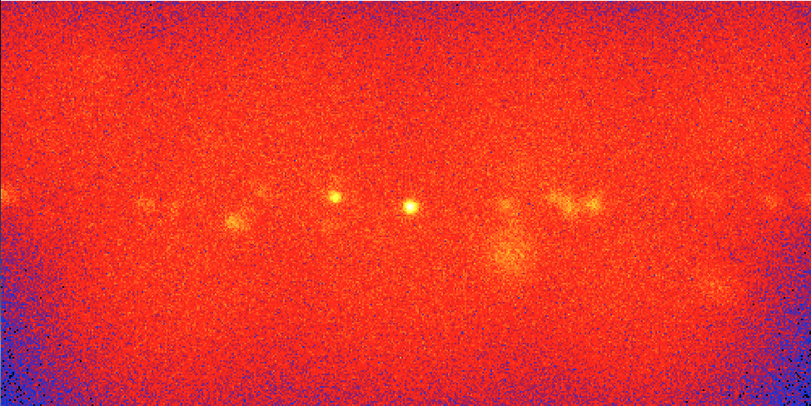
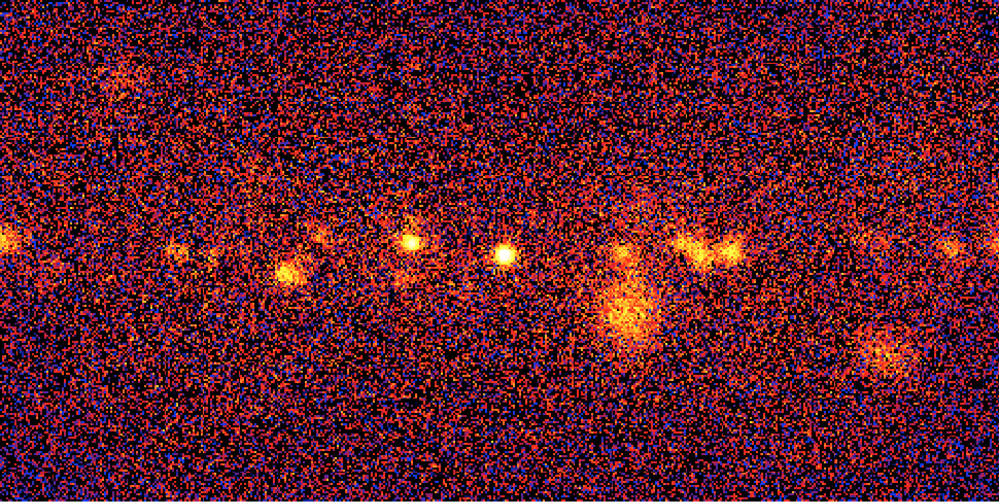

.. _1dc_sky_map:

Generating a sky map from the events
------------------------------------

After having selected the observations and the events you can begin your
analysis.

The first thing you want to do is to visualise the content of the
observations by generating a sky map from the events. You do this with the
:ref:`ctskymap` tool by typing:

.. code-block:: bash

   $ ctskymap
   Input event list or observation definition XML file [events.fits] obs_selected.xml
   First coordinate of image center in degrees (RA or galactic l) (0-360) [83.63] 0.0
   Second coordinate of image center in degrees (DEC or galactic b) (-90-90) [22.01] 0.0
   Projection method (AIT|AZP|CAR|MER|MOL|STG|TAN) [CAR]
   Coordinate system (CEL - celestial, GAL - galactic) (CEL|GAL) [CEL] GAL
   Image scale (in degrees/pixel) [0.02]
   Size of the X axis in pixels [200] 400
   Size of the Y axis in pixels [200] 400
   Lower energy limit (TeV) [0.1]
   Upper energy limit (TeV) [100.0]
   Background subtraction method (NONE|IRF) [NONE]
   Output skymap file [skymap.fits]

This generates a sky map centred on the Galactic Centre in Galactic
coordinates using a cartesian projection.
The sky map is 8 degrees wide and 8 degrees high, with an image scale of
0.02 degrees per pixel.
All events between 100 GeV and 100 TeV are collected in the sky map.
The sky map is written into the FITS file ``skymap.fits`` that is created in
the working directory.
The sky map, displayed using
`ds9 <http://ds9.si.edu>`_,
is shown below:

   *Sky map of the events recorded around the Galactic Centre during the Galactic Centre Survey*

The sky map shows a wide-spread distribution of events with a number of sources
superimposed.
Many of the events originate from an irreducable background that hampers the
recognition of the gamma-ray sources.
To describe the irreducable background in the CTA data, templates of the
background event distribution are included in the
:ref:`Instrument Response Functions <glossary_irf>`.
These templates can be used by :ref:`ctskymap` to subtract the irreducable
background contribution from the sky map.
The background subtraction is enabled by running the :ref:`ctskymap` with
the background subtraction method set to ``IRF``, as shown in the following
example:

.. code-block:: bash

   $ ctskymap
   Input event list or observation definition XML file [events.fits] obs_selected.xml
   First coordinate of image center in degrees (RA or galactic l) (0-360) [83.63] 0.0
   Second coordinate of image center in degrees (DEC or galactic b) (-90-90) [22.01] 0.0
   Projection method (AIT|AZP|CAR|MER|MOL|STG|TAN) [CAR]
   Coordinate system (CEL - celestial, GAL - galactic) (CEL|GAL) [CEL] GAL
   Image scale (in degrees/pixel) [0.02]
   Size of the X axis in pixels [400]
   Size of the Y axis in pixels [400]
   Lower energy limit (TeV) [0.1]
   Upper energy limit (TeV) [100.0]
   Background subtraction method (NONE|IRF) [NONE] IRF
   Output skymap file [skymap.fits] skymap_bkgsubtract.fits

The figure below shows the resulting sky map.
The irreducable background has been subtracted from the sky map and the sources
of gamma-ray emission are now clearly discernable.

   *Background subtracted sky map of the events recorded around the Galactic Centre during the Galactic Centre Survey*
