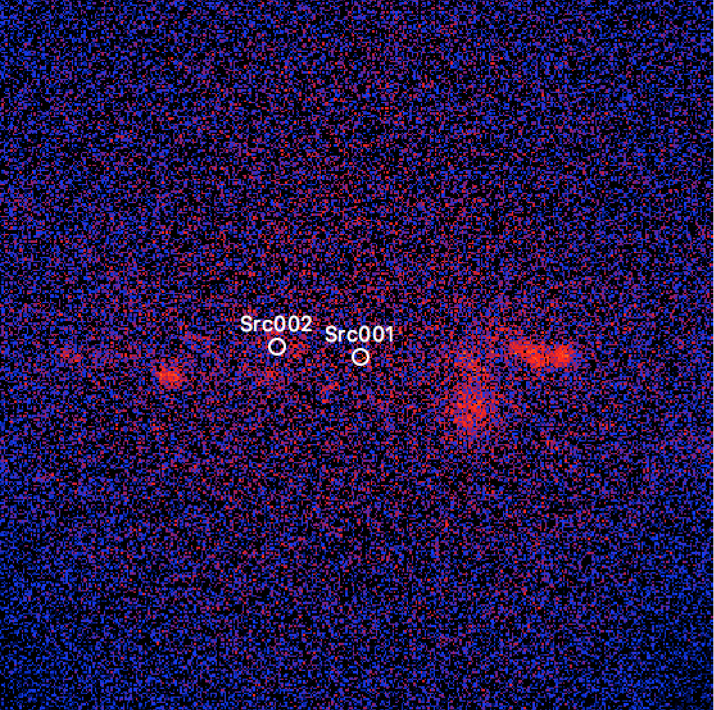
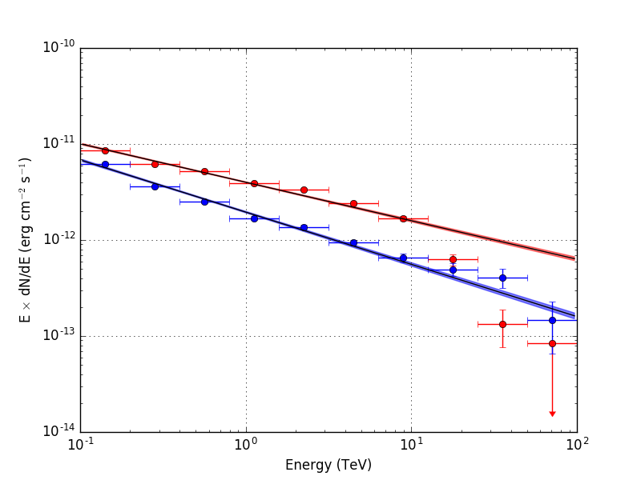

.. _1dc_first_stacked:

Performing a stacked analysis
-----------------------------

In the previous example you have fit the model to the data using an unbinned
maximum likelihood method, which directly operates on the event lists without
any binning of the data. This is the most precise method to analysis the CTA
data, yet as you may have recognised, it is a time consuming method, in
particular if you want to analyse a large number of events.

An alternative analysis method is the stacked analysis, where the data from
all observations are binned into a single
:ref:`counts cube <glossary_countscube>`,
spanned by
Right Ascension (or Galactic longitude),
Declination (or Galactic latitude), and energy.
For observation durations exceeding a few 10 hours, a stacked analysis is
generally faster than an unbinned analysis, but any temporal information
is lost.

To perform a stacked analyses, you start with creating a
:ref:`counts cube <glossary_countscube>`
by typing

.. code-block:: bash

   $ ctbin
   Input event list or observation definition XML file [events.fits] obs_selected.xml
   First coordinate of image center in degrees (RA or galactic l) (0-360) [83.63] 0.0
   Second coordinate of image center in degrees (DEC or galactic b) (-90-90) [22.01] 0.0
   Projection method (AIT|AZP|CAR|MER|MOL|STG|TAN) [CAR]
   Coordinate system (CEL - celestial, GAL - galactic) (CEL|GAL) [CEL] GAL
   Image scale (in degrees/pixel) [0.02]
   Size of the X axis in pixels [200] 300
   Size of the Y axis in pixels [200] 300
   Algorithm for defining energy bins (FILE|LIN|LOG) [LOG]
   Start value for first energy bin in TeV [0.1]
   Stop value for last energy bin in TeV [100.0]
   Number of energy bins (1-200) [20]
   Output counts cube file [cntcube.fits]

This creates a 3-dimensional counts cube in Galactic coordinates, centred on
the Galactic centre and 6 degrees x 6 degrees wide, with 20 logarithmically
spaced energy bins between 100 GeV and 100 TeV.

As next step you have to compute the effective response function for the
counts cube. The effective response function is composed of an exposure
cube, a point spread function cube, and a background cube. You generate
the cubes by typing

.. code-block:: bash

   $ ctexpcube
   Input event list or observation definition XML file [NONE] obs_selected.xml
   Input counts cube file to extract exposure cube definition [NONE] cntcube.fits
   Output exposure cube file [expcube.fits]

.. code-block:: bash

   $ ctpsfcube
   Input event list or observation definition XML file [NONE] obs_selected.xml
   Input counts cube file to extract PSF cube definition [NONE]
   First coordinate of image center in degrees (RA or galactic l) (0-360) [83.63] 0.0
   Second coordinate of image center in degrees (DEC or galactic b) (-90-90) [22.01] 0.0
   Projection method (AIT|AZP|CAR|MER|MOL|STG|TAN) [CAR]
   Coordinate system (CEL - celestial, GAL - galactic) (CEL|GAL) [CEL] GAL
   Image scale (in degrees/pixel) [1.0]
   Size of the X axis in pixels [10]
   Size of the Y axis in pixels [10]
   Lower energy limit (TeV) [0.1]
   Upper energy limit (TeV) [100.0]
   Number of energy bins [20]
   Output PSF cube file [psfcube.fits]

.. code-block:: bash

   $ ctbkgcube
   Input event list or observation definition XML file [NONE] obs_selected.xml
   Input counts cube file to extract background cube definition [NONE] cntcube.fits
   Input model definition XML file [NONE] models.xml
   Output background cube file [bkgcube.fits]
   Output model definition XML file [NONE] stacked_models.xml

.. note::
   For convenience, the dimensions of the exposure and background cubes were
   taken identical to the dimensions of the counts cube. This is however not
   a requirement, and each of the cubes may have a different dimension and
   size. For the point spread function cube a coarser spatial binning was
   used to keep the size of the cube at a manageable level. The point spread
   function cube varies in fact only slowly over the field of view, and a
   coarse spatial binning is sufficient to capture that variability.

With this prepatory work finished, you can now perform a binned maximum
likelihood using :ref:`ctlike`. Instead of the
:ref:`Observation Definition File <glossary_obsdef>`
specified for the unbinned analysis, you now need to specify the
:ref:`counts cube <glossary_countscube>`
on input, and :ref:`ctlike` will then automatically query for the response
cubes:

.. code-block:: bash

   $ ctlike
   Input event list, counts cube or observation definition XML file [obs_selected.xml] cntcube.fits
   Input exposure cube file (only needed for stacked analysis) [NONE] expcube.fits
   Input PSF cube file (only needed for stacked analysis) [NONE] psfcube.fits
   Input background cube file (only needed for stacked analysis) [NONE] bkgcube.fits
   Input model definition XML file [models_iem.xml] stacked_models.xml
   Output model definition XML file [results_iem.xml] stacked_results.xml

You may recognise that :ref:`ctlike` now runs significantly faster.
An inspection of the log file ``ctlike.log`` demonstrates that the model fit
converged properly:

.. code-block:: bash

   2017-03-03T23:12:24: +=================================+
   2017-03-03T23:12:24: | Maximum likelihood optimisation |
   2017-03-03T23:12:24: +=================================+
   2017-03-03T23:12:33:  >Iteration   0: -logL=-1080268.343, Lambda=1.0e-03
   2017-03-03T23:12:42:  >Iteration   1: -logL=-1089316.960, Lambda=1.0e-03, delta=9048.617, max(|grad|)=-22966.895106 [Prefactor:12]
   2017-03-03T23:12:51:  >Iteration   2: -logL=-1092128.131, Lambda=1.0e-04, delta=2811.171, max(|grad|)=9934.069622 [Index:9]
   2017-03-03T23:13:00:  >Iteration   3: -logL=-1093496.845, Lambda=1.0e-05, delta=1368.715, max(|grad|)=7376.873836 [Index:9]
   2017-03-03T23:13:09:  >Iteration   4: -logL=-1093958.510, Lambda=1.0e-06, delta=461.664, max(|grad|)=3457.040882 [RA:6]
   2017-03-03T23:13:18:  >Iteration   5: -logL=-1094024.130, Lambda=1.0e-07, delta=65.620, max(|grad|)=1299.113262 [RA:6]
   2017-03-03T23:13:26:  >Iteration   6: -logL=-1094026.708, Lambda=1.0e-08, delta=2.578, max(|grad|)=329.460119 [RA:6]
   2017-03-03T23:13:35:  >Iteration   7: -logL=-1094026.768, Lambda=1.0e-09, delta=0.060, max(|grad|)=58.463240 [DEC:7]
   2017-03-03T23:13:44:  >Iteration   8: -logL=-1094026.769, Lambda=1.0e-10, delta=0.002, max(|grad|)=9.521771 [DEC:7]
   2017-03-03T23:13:53:
   2017-03-03T23:13:53: +=========================================+
   2017-03-03T23:13:53: | Maximum likelihood optimisation results |
   2017-03-03T23:13:53: +=========================================+
   2017-03-03T23:13:53: === GOptimizerLM ===
   2017-03-03T23:13:53:  Optimized function value ..: -1094026.769
   2017-03-03T23:13:53:  Absolute precision ........: 0.005
   2017-03-03T23:13:53:  Acceptable value decrease .: 2
   2017-03-03T23:13:53:  Optimization status .......: converged
   2017-03-03T23:13:53:  Number of parameters ......: 16
   2017-03-03T23:13:53:  Number of free parameters .: 10
   2017-03-03T23:13:53:  Number of iterations ......: 8
   2017-03-03T23:13:53:  Lambda ....................: 1e-11
   2017-03-03T23:13:53:  Maximum log likelihood ....: 1094026.769
   2017-03-03T23:13:53:  Observed events  (Nobs) ...: 2244622.000
   2017-03-03T23:13:53:  Predicted events (Npred) ..: 2244621.999 (Nobs - Npred = 0.00143111124634743)

Similar to the unbinned analysis you can use
:ref:`csresmap`
to compute a residual map for a counts cube by typing

.. code-block:: bash

   $ csresmap
   Input event list, counts cube, or observation definition XML file [obs_selected.xml] cntcube.fits
   Input model cube file (generated with ctmodel) [NONE]
   Input exposure cube file (only needed for stacked analysis) [NONE] expcube.fits
   Input PSF cube file (only needed for stacked analysis) [NONE] psfcube.fits
   Input background cube file (only needed for stacked analysis) [NONE] bkgcube.fits
   Input model definition XML file [results.xml] stacked_results.xml
   Residual map computation algorithm (SUB|SUBDIV|SUBDIVSQRT) [SUB]
   Output residual map file [resmap.fits] stacked_resmap.fits

which generates a residual map that is similar to the map obtained for the
unbinned analysis. The result is displayed below.

   *Residual sky map after subtraction of the fitted model for a stacked analysis*

You can also use
:ref:`ctbutterfly`
to compute a butterfly diagram for a counts cube by typing

.. code-block:: bash

   $ ctbutterfly
   Input event list, counts cube or observation definition XML file [obs_selected.xml] cntcube.fits
   Input exposure cube file (only needed for stacked analysis) [NONE] expcube.fits
   Input PSF cube file (only needed for stacked analysis) [NONE] psfcube.fits
   Input background cube file (only needed for stacked analysis) [NONE] bkgcube.fits
   Source of interest [Src002] Src001
   Input model definition XML file [results.xml] stacked_results.xml
   Start value for first energy bin in TeV [0.1]
   Stop value for last energy bin in TeV [100.0]
   Output ASCII file [butterfly_src002.txt] butterfly_stacked_src001.txt

and you can use
:ref:`csspec`
to derive a source spectrum from a counts cube by typing

.. code-block:: bash

   $ csspec
   Input event list, counts cube, or observation definition XML file [obs_selected.xml] cntcube.fits
   Input exposure cube file (only needed for stacked analysis) [NONE] expcube.fits
   Input PSF cube file (only needed for stacked analysis) [NONE] psfcube.fits
   Input background cube file (only needed for stacked analysis) [NONE] bkgcube.fits
   Input model definition XML file [results.xml] stacked_results.xml
   Source name [Src002] Src001
   Binning algorithm (LIN|LOG|FILE) [LOG]
   Lower energy limit (TeV) [0.1]
   Upper energy limit (TeV) [100.0]
   Number of energy bins (0=unbinned) [10]
   Output spectrum file [spectrum_src002.fits] spectrum_stacked_src001.fits

The results are again similar to the results for the unbinned analysis,
as illustrated in the figure below:

   *Butterfly diagrams determined with ctbutterfly and spectral points determined with csspec for Src001 (top) and Src002 (bottom) using a stacked analysis*

