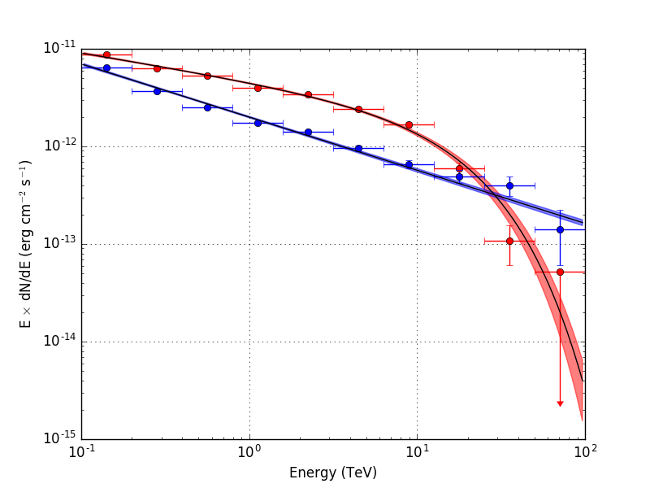

.. _1dc_first_unbinned:

Fitting the model components directly to the events
---------------------------------------------------

  .. admonition:: What you will learn

     You will learn how to analyse the event data using an **unbinned maximum
     likelihood analysis**.

     Use an unbinned maximum likelihood analysis if you have doubts about the
     impact of the selected binning on your analysis and if the number of
     observations is not too large (typically a few tens of 30 minute
     observations). Or if you simply to not worry about computation time.

Instead of binning the events into a counts cube and computing the effective
:ref:`instrument response functions <glossary_irf>`
you can directly fit the model to the events using an
unbinned maximum likelihood analysis. The advantage of the unbinned analysis
is that the event time remains an explicit quantity of the analysis and that
the different observations together with their
:ref:`instrument response functions <glossary_irf>`
are kept separate. In addition, no binning is performed and the analysis takes
full advantage of the information carried by each individual event. The
drawback is that the computing time scales linearly with the number of events
and the number of observations, becoming evetually prohibitive for the analysis
of large volumes of data (but for the analysis of small junks of data the
unbinned analysis is in fact faster than the stacked analysis).

To perform an unbinned model fitting you provide the
:ref:`observation definition file <glossary_obsdef>`
referencing the event lists as input to the :ref:`ctlike` tool:

.. code-block:: bash

  $ ctlike
  Input event list, counts cube or observation definition XML file [events.fits] obs_selected.xml
  Input model definition XML file [$CTOOLS/share/models/crab.xml] models-cutoff.xml
  Output model definition XML file [crab_results.xml] unbinned_results_cutoff.xml

The tool will take a few minutes (on Mac OS X) to perform the model fitting,
and will write the results into an updated
:ref:`model definition file <glossary_moddef>`
containing the fitted model parameters and their statistical uncertainties.
You may inspect the log file ``ctlike.log`` to verify that the model fit
converged properly, as illustrated in the example below:

.. code-block:: bash

  2017-06-01T20:05:20: +=================================+
  2017-06-01T20:05:20: | Maximum likelihood optimisation |
  2017-06-01T20:05:20: +=================================+
  2017-06-01T20:05:45:  >Iteration   0: -logL=22931413.804, Lambda=1.0e-03
  2017-06-01T20:06:07:  >Iteration   1: -logL=22907588.032, Lambda=1.0e-03, delta=23825.772, step=1.0e+00, max(|grad|)=52504.485825 [Index:14]
  2017-06-01T20:06:30:  >Iteration   2: -logL=22903885.853, Lambda=1.0e-04, delta=3702.179, step=1.0e+00, max(|grad|)=-10290.381382 [RA:0]
  2017-06-01T20:06:53:  >Iteration   3: -logL=22902481.876, Lambda=1.0e-05, delta=1403.977, step=1.0e+00, max(|grad|)=-9123.575655 [RA:0]
  2017-06-01T20:07:16:  >Iteration   4: -logL=22902094.570, Lambda=1.0e-06, delta=387.306, step=1.0e+00, max(|grad|)=-6729.088968 [RA:0]
  2017-06-01T20:07:39:  >Iteration   5: -logL=22902033.617, Lambda=1.0e-07, delta=60.953, step=1.0e+00, max(|grad|)=4767.267597 [RA:7]
  2017-06-01T20:08:01:  >Iteration   6: -logL=22902011.919, Lambda=1.0e-08, delta=21.698, step=1.0e+00, max(|grad|)=3512.413001 [RA:7]
  2017-06-01T20:08:23:  >Iteration   7: -logL=22902001.341, Lambda=1.0e-09, delta=10.579, step=1.0e+00, max(|grad|)=2564.774582 [RA:7]
  2017-06-01T20:08:47:  >Iteration   8: -logL=22901996.073, Lambda=1.0e-10, delta=5.268, step=1.0e+00, max(|grad|)=1861.903651 [RA:7]
  2017-06-01T20:09:11:  >Iteration   9: -logL=22901993.437, Lambda=1.0e-11, delta=2.636, step=1.0e+00, max(|grad|)=1346.480600 [RA:7]
  2017-06-01T20:09:34:  >Iteration  10: -logL=22901992.112, Lambda=1.0e-12, delta=1.325, step=1.0e+00, max(|grad|)=971.212000 [RA:7]
  2017-06-01T20:09:58:  >Iteration  11: -logL=22901991.444, Lambda=1.0e-13, delta=0.668, step=1.0e+00, max(|grad|)=699.296835 [RA:7]
  2017-06-01T20:10:20:  >Iteration  12: -logL=22901991.107, Lambda=1.0e-14, delta=0.338, step=1.0e+00, max(|grad|)=502.907376 [RA:7]
  2017-06-01T20:10:42:  >Iteration  13: -logL=22901990.935, Lambda=1.0e-15, delta=0.171, step=1.0e+00, max(|grad|)=361.381134 [RA:7]
  2017-06-01T20:11:04:  >Iteration  14: -logL=22901990.848, Lambda=1.0e-16, delta=0.087, step=1.0e+00, max(|grad|)=259.524646 [RA:7]
  2017-06-01T20:11:27:  >Iteration  15: -logL=22901990.804, Lambda=1.0e-17, delta=0.044, step=1.0e+00, max(|grad|)=186.312377 [RA:7]

Also the :ref:`ctbutterfly` tool and the :ref:`csspec` and :ref:`csresmap`
scripts can be run into unbinned mode by providing the
:ref:`observation definition file <glossary_obsdef>`
instead of the counts cube on input.
For illustration, the butterfly diagrams and spectra obtained for ``Src001``
and ``Src002`` using an unbinned maximum likelihood analysis are shown
below.

   *Butterfly diagrams determined with ctbutterfly and spectral points obtained with csspec using an unbinned analysis*
