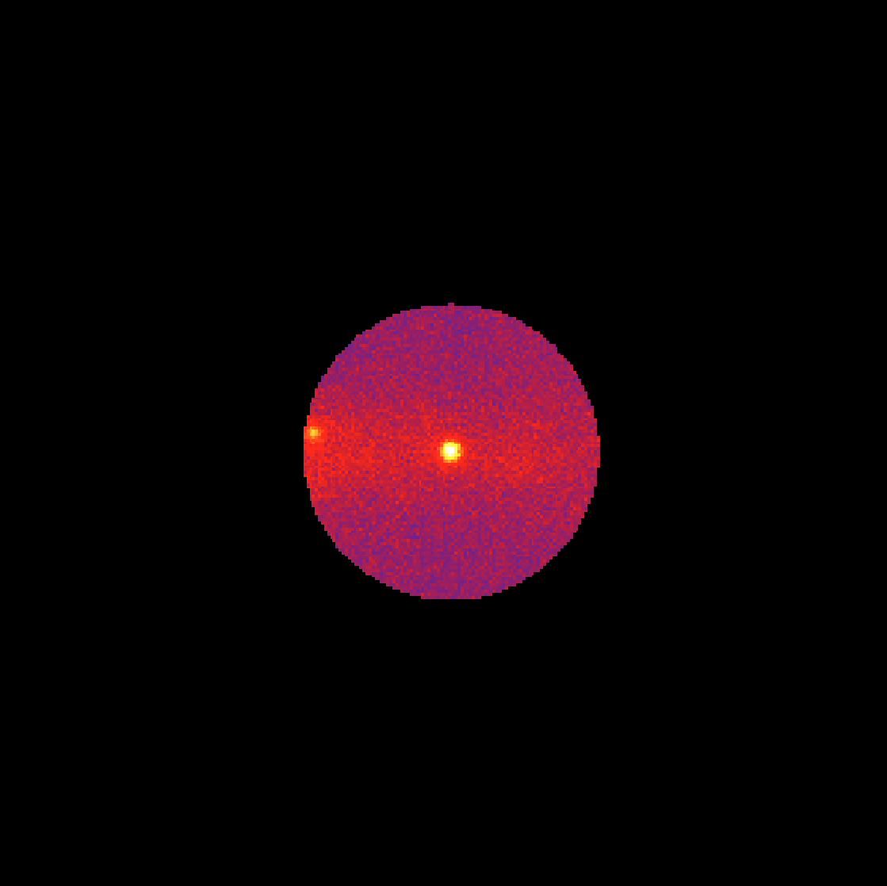

.. _1dc_howto_exclude:

How to exclude pixels from a counts cube?
-----------------------------------------

You can exclude bins in an analysis from a counts cube by using the
:ref:`ctcubemask` tool.

:ref:`ctcubemask` allows selecting only bins from a counts cube within a
circular Region of Interest (ROI) and within given energy boundaries.
Bins outside these regions will be masked (masked bins are flagged in a
counts cube with a value of -1).
In addition, circular regions of bins can be masked, and the definition of
these circular regions is taken from a
`ds9 region file <http://ds9.si.edu/doc/ref/region.html>`_.

The following example shows of how you can exclude all bins outside a
radius of 1 degree around the location of ``Src001``.

.. code-block:: bash

   $ ctcubemask
   Input counts cube or observation definition XML file [cntcube.fits]
   Input exclusion region file in ds9 format [NONE]
   RA for ROI centre (degrees) (0-360) [83.63] 266.42
   Dec for ROI centre (degrees) (-90-90) [22.01] -29.01
   Radius of ROI (degrees) (0-180) [3.0] 1.0
   Lower energy limit (TeV) [0.1]
   Upper energy limit (TeV) [100.0]
   Output counts cube or observation definition XML file [cntcube_filtered.fits]

A map of the resulting counts cube, summed over the energy axis, is shown
in the following image.

   *Filtered counts cube*
