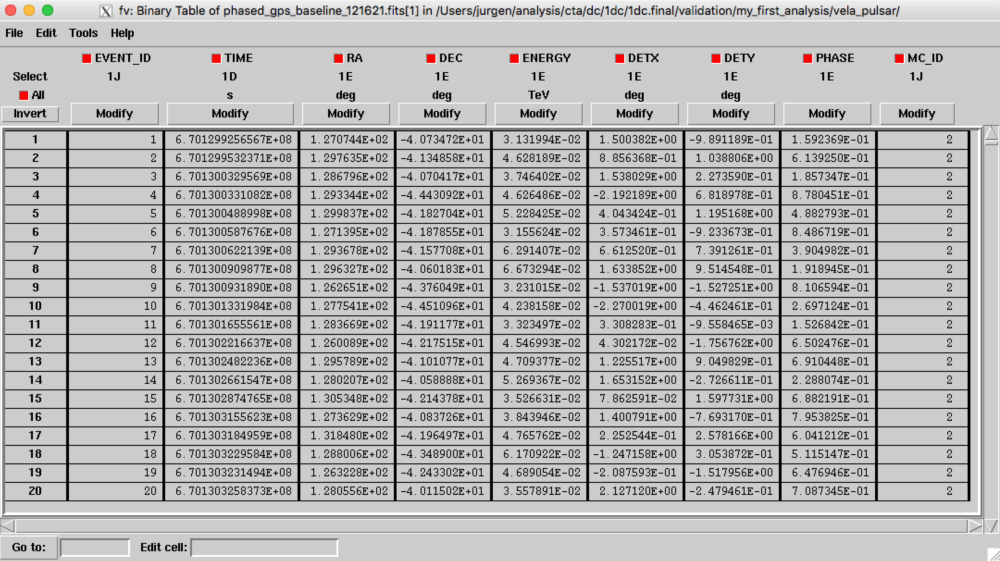
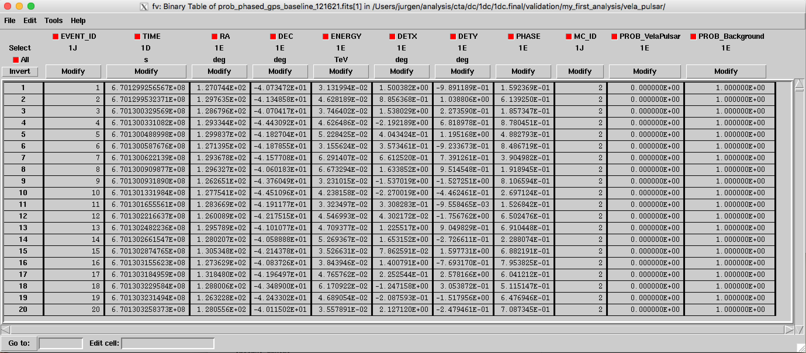
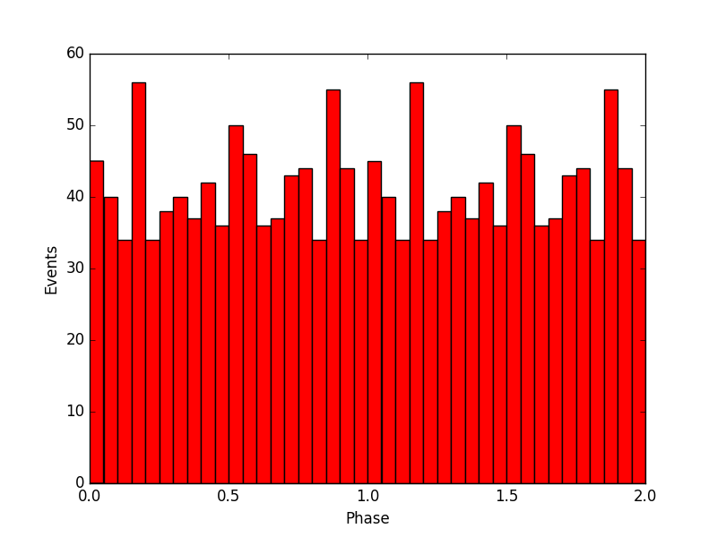
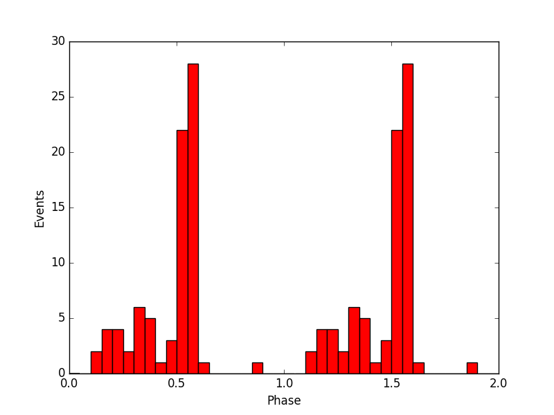

.. _1dc_howto_phasecurve:

How to generate a phase curve of a pulsar?
------------------------------------------

  .. admonition:: What you will learn

     You will learn how to **derive a phase curve for a pulsar**.

To determine the phase curve of a pulsar you first need the ephemerides
of the pulsar of interest. In this example we suppose that you want to
analyse the Vela Pulsar which for an epoch of 54686.2 (MJD) has the
following ephemerides:

* :math:`f = 11.19 \, {\rm s}^{-1}`
* :math:`\dot{f} = -1.55 \, 10^{-11} \, {\rm s}^{-2}`
* :math:`\ddot{f} = 6.46 \, 10^{-23} \, {\rm s}^{-3}`

You need to enter these ephemerides into a
:ref:`model definition file <glossary_moddef>`
with the following structure (note that the spectral and spatial information
is irrelevant for this example):

.. code-block:: xml

   <?xml version="1.0" encoding="UTF-8" standalone="no"?>
   <source_library title="source library">
     <source name="VelaPulsar" type="PointSource">
       <spectrum type="PowerLaw">
         <parameter name="Prefactor"   scale="1e-14" value="19.4" min="1e-07" max="1000.0" free="1"/>
         <parameter name="Index"       scale="-1"    value="4.45" min="0.0"   max="+10.0"  free="1"/>
         <parameter name="PivotEnergy" scale="1e3"   value="20.0" min="0.01"  max="1000.0" free="0"/>
       </spectrum>
       <spatialModel type="PointSource">
         <parameter name="RA"  scale="1" value="128.838" min="-360" max="360" free="0"/>
         <parameter name="DEC" scale="1" value="-45.178" min="-90"  max="90"  free="0"/>
       </spatialModel>
       <temporal type="PhaseCurve" file="$CTADATA/models/phasecurve_J0835-4510.fits">
         <parameter name="Normalization" scale="1"         value="1.0"     min="0.0"   max="1000.0"   free="0"/>
         <parameter name="MJD"           scale="1"         value="54686.2" min="0.0"   max="100000.0" free="0"/>
         <parameter name="Phase"         scale="1"         value="0.0"     min="0.0"   max="1.0"      free="0"/>
         <parameter name="F0"            scale="1"         value="11.19"   min="0.0"   max="1000.0"   free="0"/>
         <parameter name="F1"            scale="1e-11"     value="-1.55"   min="-10.0" max="1000.0"   free="0"/>
         <parameter name="F2"            scale="1e-23"     value="6.46"    min="0.0"   max="1000.0"   free="0"/>
       </temporal>
     </source>
   </source_library>

As next step you need to select all observations from the data with pointing
directions close to the Vela pulsar. In the example below, all observations
from the Galactic Plane Scan with pointing directions within 5 degrees of the
Vela pulsar are selected:

.. code-block:: bash

   $ csobsselect
   Input event list or observation definition XML file [obs.xml] $CTADATA/obs/obs_gps_baseline.xml
   Pointing selection region shape (CIRCLE|BOX) [CIRCLE]
   Coordinate system (CEL - celestial, GAL - galactic) (CEL|GAL) [CEL]
   Galactic longitude of selection centre (deg) (0-360) [184.56] 128.838
   Galactic latitude of selection centre (deg) (-90-90) [-5.79] -45.178
   Radius of selection circle (deg) (0-180) [5.0]
   Output observation definition XML file [outobs.xml] obs_vela.xml

This results in a selection of 45 observations from the Galactic Plane Survey
that will be compiled in the ``obs_vela.xml``
:ref:`observation definition file <glossary_obsdef>`.
Now you can compute the phase for every event in your selection using the
ephemerides of the Vela pulsar. You do this with the :ref:`ctphase` tool
as follows:

.. code-block:: bash

   $ ctphase
   Input event list or observation definition XML file [events.fits] obs_vela.xml
   Model definition XML file [$CTOOLS/share/models/crab.xml] models.xml
   Source in model definition XML file to use for phase computation [Crab] VelaPulsar
   Output event list or observation definition XML file [phased_events.fits] obs_vela_phased.xml

This produces a new
:ref:`observation definition file <glossary_obsdef>`
``obs_vela_phased.xml`` that points to event files to which a ``PHASE``
column was added. The format of the file is dislayed below. Each event
has now an associated phase value that was computed from the trigger time of
the event.

   *Event list file with phase information for the Vela pulsar*

To generate now a phase curve of the Vela pulsar you need to select all events
that are close to the source using the :ref:`ctselect` tool. To select for
example all events within 0.5 degrees of the Vela pulsar you need to type
the following:

.. code-block:: bash

   $ ctselect
   Input event list or observation definition XML file [events.fits] obs_vela_phased.xml
   RA for ROI centre (degrees) (0-360) [83.63] 128.838
   Dec for ROI centre (degrees) (-90-90) [22.01] -45.178
   Radius of ROI (degrees) (0-180) [3.0] 0.5
   Start time (CTA MET in seconds) [0.0]
   End time (CTA MET in seconds) [0.0]
   Lower energy limit (TeV) [0.1] 0.03
   Upper energy limit (TeV) [100.0] 160.0
   Output event list or observation definition XML file [selected_events.fits] obs_vela_phased_selected.xml

The selected events as a function of phase are displayed below. There is no
obvious indication of a phase dependence of the event rate.

.. figure:: howto_phasecurve_phases.png
   :width: 600px
   :align: center

   *Phase histogram for events selected within 0.5 degrees of the Vela pulsar*

An alternative method to select events from the
:ref:`observation definition file <glossary_obsdef>`
is based on the computation of the probability that the event arises from a
specific model component. To perform such a computation you have to

* add a background model component, and
* drop the temporal component from the Vela pulsar

in the
:ref:`model definition file <glossary_moddef>`. The resulting
:ref:`model definition file <glossary_moddef>`
should look as follows:

.. code-block:: xml

   <?xml version="1.0" encoding="UTF-8" standalone="no"?>
   <source_library title="source library">
     <source name="VelaPulsar" type="PointSource">
       <spectrum type="PowerLaw">
         <parameter name="Prefactor"   scale="1e-14" value="19.4" min="1e-07" max="1000.0" free="1"/>
         <parameter name="Index"       scale="-1"    value="4.45" min="0.0"   max="+10.0"  free="1"/>
         <parameter name="PivotEnergy" scale="1e3"   value="20.0" min="0.01"  max="1000.0" free="0"/>
       </spectrum>
       <spatialModel type="PointSource">
         <parameter name="RA"  scale="1" value="128.838" min="-360" max="360" free="0"/>
         <parameter name="DEC" scale="1" value="-45.178" min="-90"  max="90"  free="0"/>
       </spatialModel>
     </source>
     <source name="Background" type="CTAIrfBackground">
       <spectrum type="PowerLaw">
         <parameter name="Prefactor" value="1" error="0" scale="1" min="0" free="1" />
         <parameter name="Index" value="0" error="0" scale="1" min="-10" max="10" free="1" />
         <parameter name="PivotEnergy" value="1" scale="1000000" free="0" />
       </spectrum>
     </source>
   </source_library>

You can then run the :ref:`ctprob` tool that computes the probability that an
event arises either from the source or from the background component:

.. code-block:: bash

   $ ctprob
   Input event list or observation definition XML file [events.fits] obs_vela_phased.xml
   Input model definition XML file [$CTOOLS/share/models/crab.xml] models_prob.xml
   Output event list or observation definition XML file [prob_events.fits] obs_vela_phased_prob.xml

This produces a new
:ref:`observation definition file <glossary_obsdef>`
``obs_vela_phased_prob.xml`` that points to event files to which the
``PROB_VelaPulsar`` and ``PROB_Background`` columns have been added.
The format of the file is dislayed below. Each event has now an associated
probability value for all model components.

   *Event list file with phase and probability information for the Vela pulsar and probability information for the background model*

You now can perform an event selection based on the probability that an event
originates from the Vela pulsar. In the following example we set the
probability threshold to >20% by adding the attribute
``expr="PROB_VelaPulsar>0.2"`` after the :ref:`ctselect` command:

.. code-block:: bash

   $ ctselect expr="PROB_VelaPulsar>0.2"
   Input event list or observation definition XML file [obs_vela_phased.xml] obs_vela_phased_prob.xml
   RA for ROI centre (degrees) (0-360) [128.838]
   Dec for ROI centre (degrees) (-90-90) [-45.178]
   Radius of ROI (degrees) (0-180) [0.5] 5.0
   Start time (CTA MET in seconds) [0.0]
   End time (CTA MET in seconds) [0.0]
   Lower energy limit (TeV) [0.03]
   Upper energy limit (TeV) [160.0]
   Output event list or observation definition XML file [obs_vela_phased_selected.xml] obs_vela_phased_prob_selected.xml

The selected events as a function of phase are displayed below. Unfortunately
there is still no clear signal for a phase dependence of the event rate.

   *Phase histogram of events for events having a probability of >20% in originating from the Vela pulsar*

Since every event in the event files of the Data Challenge is tagged with a
Monte Carlo identifier that specifies from which model component it was
simulated, you may check how many events from the Vela pulsar are actually
expected in the data. The correspondance between the model components and
the Monte Carlo identifiers is given in the header of the event files
(see :ref:`1dc_data_organisation`), and from there you will find out that
the Vela pulsar has the Monte Carlo identifier ``86``. You can then select only
the events with this identifier by adding the attribute ``expr="MC_ID==86"``
after the :ref:`ctselect` command:

.. code-block:: bash

   $ ctselect expr="MC_ID==86"
   Input event list or observation definition XML file [obs_vela_phased_prob.xml] obs_vela_phased.xml
   RA for ROI centre (degrees) (0-360) [128.838]
   Dec for ROI centre (degrees) (-90-90) [-45.178]
   Radius of ROI (degrees) (0-180) [5.0]
   Start time (CTA MET in seconds) [0.0]
   End time (CTA MET in seconds) [0.0]
   Lower energy limit (TeV) [0.03]
   Upper energy limit (TeV) [160.0]
   Output event list or observation definition XML file [obs_vela_phased_prob_selected.xml] obs_vela_phased_mcid.xml

The resulting phase histogram is shown below. It now becomes obvious that
the peaks seen in the event histogram do indeed correspond to the expected
peaks from the Vela pulsar, but there are too few events in the simulated data
to allow for a unambiguous detection of the pulsar.

   *Distribution of Vela pulsar events as function of event phase*

.. note::
   The plots were created using the ``show_phases.py`` script that is
   located in the ctools example folder. The example script requires the
   `matplotlib <http://matplotlib.org>`_ Python module for display.
   You may reproduce the plots by typing

   .. code-block:: bash

      $ $CTOOLS/share/examples/python/show_phases.py obs_vela_phased_selected.xml
      $ $CTOOLS/share/examples/python/show_phases.py obs_vela_phased_prob_selected.xml
      $ $CTOOLS/share/examples/python/show_phases.py obs_vela_phased_mcid.xml

