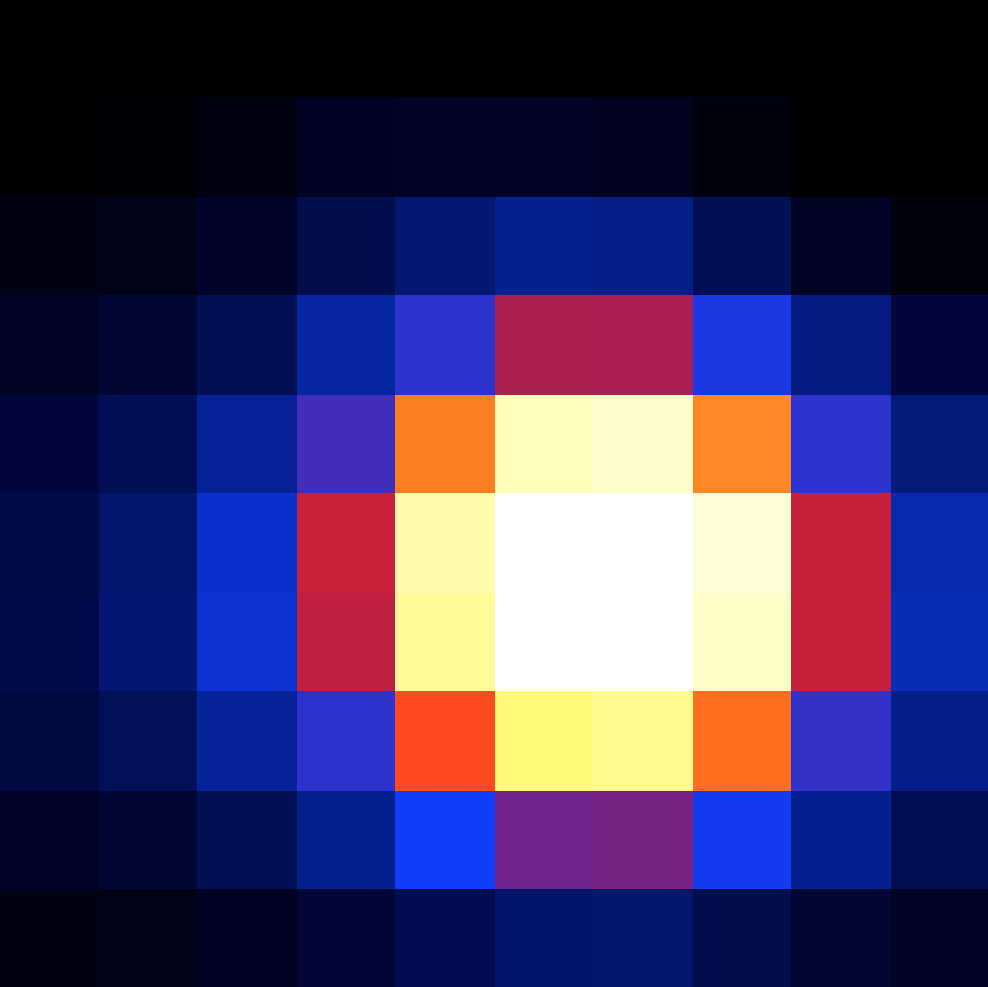

.. _1dc_howto_tsmap:

How to generate a Test Statistic map?
-------------------------------------

If you want to know how the Test Statistic changes with source position you
can create a Test Statistic map using the :ref:`cttsmap` tool. A Test
Statistic map is for example useful to study the precise error contours of
the source location, or to search for significant sources in a field.

An example for a :ref:`cttsmap` run is shown below. The example is based
on a stacked maximum likelihood analysis and generates a Test Statistic
map of size 0.5 x 0.5 degrees, centred on the Galactic Centre.

.. code-block:: bash

   $ cttsmap
   Input event list, counts cube or observation definition XML file [events.fits] cntcube.fits
   Input exposure cube file (only needed for stacked analysis) [NONE] expcube.fits
   Input PSF cube file (only needed for stacked analysis) [NONE] psfcube.fits
   Input background cube file (only needed for stacked analysis) [NONE] bkgcube.fits
   Test source name [Crab] Src001
   Input model definition XML file [$CTOOLS/share/models/crab.xml] stacked_models.xml
   First coordinate of image center in degrees (RA or galactic l) (0-360) [83.63] 0
   Second coordinate of image center in degrees (DEC or galactic b) (-90-90) [22.01] 0
   Projection method (AIT|AZP|CAR|MER|MOL|STG|TAN) [CAR]
   Coordinate system (CEL - celestial, GAL - galactic) (CEL|GAL) [CEL] GAL
   Image scale (in degrees/pixel) [0.02] 0.05
   Size of the X axis in pixels [200] 10
   Size of the Y axis in pixels [200] 10
   Output Test Statistic map file [tsmap.fits] tsmap_stacked.fits

The :ref:`cttsmap` tool creates a FITS file containing for each pixel the
Test Statistic value as well as the fit parameters for the test source.
The figure below shows the resulting Test Statistic map.

   *Test Statistic map around the Galactic centre*

.. note::
   The computation of a Test Statistic map is quite time consuming since a model
   fit is done for each map position. The :ref:`cttsmap` tool will take one
   of the sources in the
   :ref:`model definition file <glossary_moddef>`
   (here ``Src001``), displace the source to the bin centre of each map pixel,
   and perform a maximum likelihood fit for this modified model to compute
   the Test Statistic value.

   The ``binmin`` and ``binmax`` parameters can be used to compute only a
   subset of the bins in a map (see :ref:`cttsmap`). This functionality is
   used by the :ref:`cstsmapsplit` to generate a command sequence that is
   useful for parallelizing the Test Statistic map computation. The
   :ref:`cstsmapmerge` script can then be used to recombine the different
   partial maps into a single Test Statistic map.

   To produce the same result that has been produced above by the single
   :ref:`cttsmap` run, now however split over ten :ref:`cttsmap` jobs that
   can be executed in parallel, type

   .. code-block:: bash

      $ cstsmapsplit
      Input event list, counts cube or observation definition XML file [events.fits] cntcube.fits
      Input exposure cube file (only needed for stacked analysis) [NONE] expcube.fits
      Input PSF cube file (only needed for stacked analysis) [NONE] psfcube.fits
      Input background cube file (only needed for stacked analysis) [NONE] bkgcube.fits
      Input model definition XML file [$CTOOLS/share/models/crab.xml] stacked_models.xml
      First coordinate of image center in degrees (RA or galactic l) (0-360) [83.63] 0.0
      Second coordinate of image center in degrees (DEC or galactic b) (-90-90) [22.01] 0.0
      Projection method (AIT|AZP|CAR|MER|MOL|STG|TAN) [CAR]
      Coordinate system (CEL - celestial, GAL - galactic) (CEL|GAL) [CEL] GAL
      Image scale (in degrees/pixel) [0.02] 0.05
      Size of the X axis in pixels [200] 10
      Size of the Y axis in pixels [200] 10
      Test source name [Crab] Src001
      Output Test Statistic map file [tsmap.fits] tsmap_split.fits
      Number of TS map bins per task [5] 10
      Compute null hypothesis first? [yes]
      ASCII file containing all commands [commands.dat] tsmap_commands.dat

   The :ref:`cstsmapmerge` script creates the following ASCII file on output:

   .. code-block:: bash

      cttsmap inobs=cntcube.fits inmodel=stacked_models.xml srcname=Src001 expcube=expcube.fits psfcube=psfcube.fits bkgcube=bkgcube.fits edisp=no errors=no usepnt=no nxpix=10 nypix=10 binsz=0.05 coordsys=GAL xref=0.0 yref=0.0 proj=CAR publish=no chatter=2 clobber=yes debug=no mode=ql logL0=1082619.2527136307 binmin=0 binmax=10 outmap=tsmap_split_0.fits logfile=tsmap_split_0.log &
      cttsmap inobs=cntcube.fits inmodel=stacked_models.xml srcname=Src001 expcube=expcube.fits psfcube=psfcube.fits bkgcube=bkgcube.fits edisp=no errors=no usepnt=no nxpix=10 nypix=10 binsz=0.05 coordsys=GAL xref=0.0 yref=0.0 proj=CAR publish=no chatter=2 clobber=yes debug=no mode=ql logL0=1082619.2527136307 binmin=10 binmax=20 outmap=tsmap_split_1.fits logfile=tsmap_split_1.log &
      cttsmap inobs=cntcube.fits inmodel=stacked_models.xml srcname=Src001 expcube=expcube.fits psfcube=psfcube.fits bkgcube=bkgcube.fits edisp=no errors=no usepnt=no nxpix=10 nypix=10 binsz=0.05 coordsys=GAL xref=0.0 yref=0.0 proj=CAR publish=no chatter=2 clobber=yes debug=no mode=ql logL0=1082619.2527136307 binmin=20 binmax=30 outmap=tsmap_split_2.fits logfile=tsmap_split_2.log &
      cttsmap inobs=cntcube.fits inmodel=stacked_models.xml srcname=Src001 expcube=expcube.fits psfcube=psfcube.fits bkgcube=bkgcube.fits edisp=no errors=no usepnt=no nxpix=10 nypix=10 binsz=0.05 coordsys=GAL xref=0.0 yref=0.0 proj=CAR publish=no chatter=2 clobber=yes debug=no mode=ql logL0=1082619.2527136307 binmin=30 binmax=40 outmap=tsmap_split_3.fits logfile=tsmap_split_3.log &
      cttsmap inobs=cntcube.fits inmodel=stacked_models.xml srcname=Src001 expcube=expcube.fits psfcube=psfcube.fits bkgcube=bkgcube.fits edisp=no errors=no usepnt=no nxpix=10 nypix=10 binsz=0.05 coordsys=GAL xref=0.0 yref=0.0 proj=CAR publish=no chatter=2 clobber=yes debug=no mode=ql logL0=1082619.2527136307 binmin=40 binmax=50 outmap=tsmap_split_4.fits logfile=tsmap_split_4.log &
      cttsmap inobs=cntcube.fits inmodel=stacked_models.xml srcname=Src001 expcube=expcube.fits psfcube=psfcube.fits bkgcube=bkgcube.fits edisp=no errors=no usepnt=no nxpix=10 nypix=10 binsz=0.05 coordsys=GAL xref=0.0 yref=0.0 proj=CAR publish=no chatter=2 clobber=yes debug=no mode=ql logL0=1082619.2527136307 binmin=50 binmax=60 outmap=tsmap_split_5.fits logfile=tsmap_split_5.log &
      cttsmap inobs=cntcube.fits inmodel=stacked_models.xml srcname=Src001 expcube=expcube.fits psfcube=psfcube.fits bkgcube=bkgcube.fits edisp=no errors=no usepnt=no nxpix=10 nypix=10 binsz=0.05 coordsys=GAL xref=0.0 yref=0.0 proj=CAR publish=no chatter=2 clobber=yes debug=no mode=ql logL0=1082619.2527136307 binmin=60 binmax=70 outmap=tsmap_split_6.fits logfile=tsmap_split_6.log &
      cttsmap inobs=cntcube.fits inmodel=stacked_models.xml srcname=Src001 expcube=expcube.fits psfcube=psfcube.fits bkgcube=bkgcube.fits edisp=no errors=no usepnt=no nxpix=10 nypix=10 binsz=0.05 coordsys=GAL xref=0.0 yref=0.0 proj=CAR publish=no chatter=2 clobber=yes debug=no mode=ql logL0=1082619.2527136307 binmin=70 binmax=80 outmap=tsmap_split_7.fits logfile=tsmap_split_7.log &
      cttsmap inobs=cntcube.fits inmodel=stacked_models.xml srcname=Src001 expcube=expcube.fits psfcube=psfcube.fits bkgcube=bkgcube.fits edisp=no errors=no usepnt=no nxpix=10 nypix=10 binsz=0.05 coordsys=GAL xref=0.0 yref=0.0 proj=CAR publish=no chatter=2 clobber=yes debug=no mode=ql logL0=1082619.2527136307 binmin=80 binmax=90 outmap=tsmap_split_8.fits logfile=tsmap_split_8.log &
      cttsmap inobs=cntcube.fits inmodel=stacked_models.xml srcname=Src001 expcube=expcube.fits psfcube=psfcube.fits bkgcube=bkgcube.fits edisp=no errors=no usepnt=no nxpix=10 nypix=10 binsz=0.05 coordsys=GAL xref=0.0 yref=0.0 proj=CAR publish=no chatter=2 clobber=yes debug=no mode=ql logL0=1082619.2527136307 binmin=90 binmax=100 outmap=tsmap_split_9.fits logfile=tsmap_split_9.log &

   Now run the ASCII file by typing

   .. code-block:: bash

      ./tsmap_commands.dat

   This will execute ten :ref:`cttsmap` jobs and parallel that each creates
   ten pixels of the Test Statistic map. You combine the resulting ten Test
   Statistic maps into a single map by typing

   .. code-block:: bash

      $ cstsmapmerge
      Input TS map FITS files [tsmap.fits] tsmap_split_*.fits
      Output TS map FITS file [NONE] tsmap_split.fits

