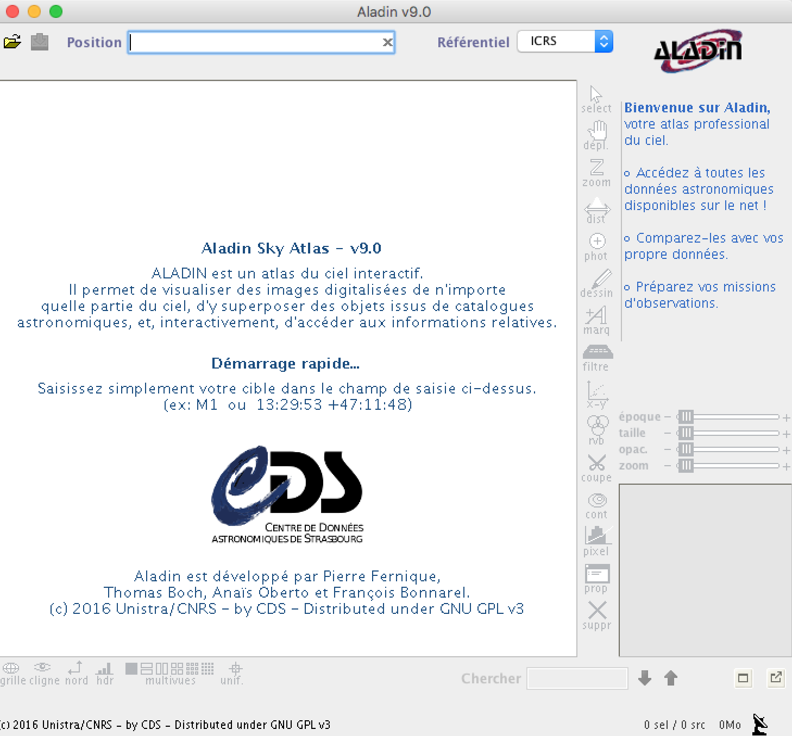
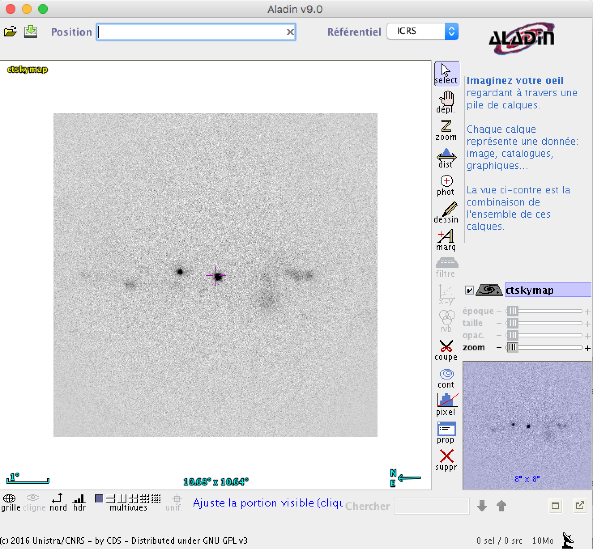
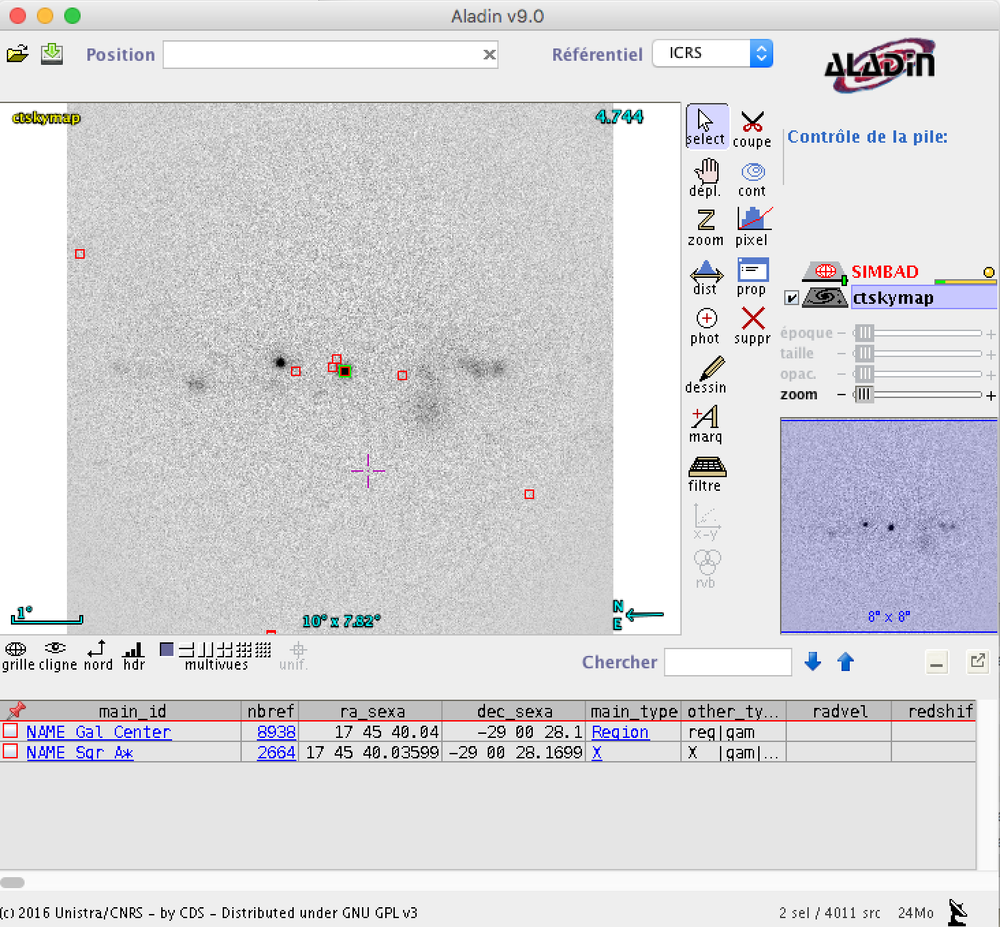

.. _1dc_howto_vo:

How to use Virtual Observatory tools with ctools?
-------------------------------------------------

Several ctools can interact with Virtual Observatory tools such as
`Aladin <http://aladin.u-strasbg.fr>`_
or
`Topcat <http://www.star.bris.ac.uk/~mbt/topcat/>`_
for the visualisation and exploration of the analysis results.

Let's take the example of generating a sky map, as explained
:ref:`before <1dc_sky_map>`. Start with launching the
`Aladin <http://aladin.u-strasbg.fr>`_
application on your desktop:

   *Aladin application after start-up*

Then use :ref:`ctskymap` to create a sky map and specify ``publish=yes``
as argument after the tool name:

.. code-block:: bash

   $ ctskymap publish=yes
   Input event list or observation definition XML file [events.fits] obs_selected.xml
   First coordinate of image center in degrees (RA or galactic l) (0-360) [83.63] 0.0
   Second coordinate of image center in degrees (DEC or galactic b) (-90-90) [22.01] 0.0
   Projection method (AIT|AZP|CAR|MER|MOL|STG|TAN) [CAR]
   Coordinate system (CEL - celestial, GAL - galactic) (CEL|GAL) [CEL] GAL
   Image scale (in degrees/pixel) [0.02]
   Size of the X axis in pixels [200] 400
   Size of the Y axis in pixels [200] 400
   Lower energy limit (TeV) [0.1]
   Upper energy limit (TeV) [100.0]
   Background subtraction method (NONE|IRF) [NONE]
   Output skymap file [skymap.fits]

Once :ref:`ctskymap` has terminated, the resulting sky map will automatically
appear in the
`Aladin <http://aladin.u-strasbg.fr>`_
application (see below).

   *Aladin application after ctskymap finished execution*

You can then overlay sky maps obtained at other wavelengths for comparison or
objects extracted from a catalogue. In the example below we show the overlay
of the
`Fermi/LAT 3FGL catalogue <https://fermi.gsfc.nasa.gov/ssc/data/access/lat/4yr_catalog/>`_
catalogue which allows us to identify ``Src001`` with a Fermi/LAT source at
the Galactic centre.

   *Overlay of the Fermi/LAT 3FGL catalogue over the sky map*

Below the list of tools and scripts that interact with Virtual Observatory
tools. Some tools or scripts publish tables instead of images, and the tables
can for example by displayed and explored using
`Topcat <http://www.star.bris.ac.uk/~mbt/topcat/>`_.

+-------------------+--------+-------------------+
| Tool or script    | Object | VO tool (example) |
+===================+========+===================+
| :ref:`cslightcrv` | Table  | Topcat            |
+-------------------+--------+-------------------+
| :ref:`csresmap`   | Image  | Aladin            |
+-------------------+--------+-------------------+
| :ref:`csspec`     | Table  | Topcat            |
+-------------------+--------+-------------------+
| :ref:`csviscube`  | Image  | Aladin            |
+-------------------+--------+-------------------+
| :ref:`ctbin`      | Image  | Aladin            |
+-------------------+--------+-------------------+
| :ref:`ctbkgcube`  | Image  | Aladin            |
+-------------------+--------+-------------------+
| :ref:`ctcubemask` | Image  | Aladin            |
+-------------------+--------+-------------------+
| :ref:`ctexpcube`  | Image  | Aladin            |
+-------------------+--------+-------------------+
| :ref:`ctmapcube`  | Image  | Aladin            |
+-------------------+--------+-------------------+
| :ref:`ctmodel`    | Image  | Aladin            |
+-------------------+--------+-------------------+
| :ref:`ctobssim`   | Table  | Topcat            |
+-------------------+--------+-------------------+
| :ref:`ctselect`   | Table  | Topcat            |
+-------------------+--------+-------------------+
| :ref:`ctskymap`   | Image  | Aladin            |
+-------------------+--------+-------------------+
| :ref:`cttsmap`    | Image  | Aladin            |
+-------------------+--------+-------------------+

