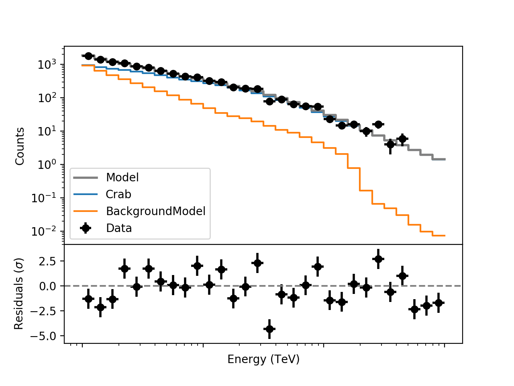

.. _sec_residual_spectrum:

Generating a residual spectrum
~~~~~~~~~~~~~~~~~~~~~~~~~~~~~~

In the previous tutorial you have used the :ref:`csresmap` script to
inspect the spatial residuals. You can also inspect the spectral
residuals using  the :ref:`csresspec` script.

The :ref:`csresspec`  script can deal with any observation type (unbinned,
binned, stacked, On/Off). For the example case with unbinned
observations the script is then used as follows:

.. code-block:: bash

  $ csresspec components=yes
  Input event list, counts cube, or observation definition XML file [obs.xml] 
  Calibration database [prod2] 
  Instrument response function [South_0.5h] 
  Lower energy limit (TeV) [0.1] 
  Upper energy limit (TeV) [100.0] 
  Number of model cube energy bins [30] 
  Stack observations [yes] 
  Coordinate System (CEL|GAL) [CEL] 
  Projection method (AIT|AZP|CAR|GLS|MER|MOL|SFL|SIN|STG|TAN) [CAR] 
  First coordinate of image/source region center in degrees (RA or galactic l) (0-360) [83.63] 
  Second coordinate of image/source region center in degrees (DEC or galactic b) (-90-90) [22.01]  
  Size of the X axis in pixels [200] 51
  Size of the Y axis in pixels [200] 51
  Pixel size (deg/pixel) [0.02] 
  Input model definition XML file [crab_results.xml] 
  Mask data to calculate residuals in ROI [yes] no
  Residuals computation algorithm (SUB|SUBDIV|SUBDIVSQRT|SIGNIFICANCE) [SIGNIFICANCE] 
  Output residual spectrum file [residual_spectrum.fits]

In our example, the residuals will cover energies from 100 GeV to 100
TeV, in 30 energy bins. Since we have decided to stack multiple
unbinned observations we have also entered parameters to perform a
spatial binning. Note that we have defined the spatial grid such that
we will obtain the residuals in a 1 degree square region around the
Crab. Optionally, a mask can be applied to either unbinned or binned
3D observations. We have used the hidden ``components`` parameter to
include the individual model components in the results file.

The :ref:`csresspec` script created the FITS file ``residual_spectrum.fits`` that contains
the results of the residual computation. A graphical display of the fit results is
shown below.

   *Data, model, and residuals from the spectral fit of the Crab nebula*

.. note::
   The figure was created by typing:

   .. code-block:: bash

      $ $CTOOLS/share/examples/python/show_spectrum.py residual_spectrum.fits

   Use the option ``-h`` to select the table to display if there are
   multiple observations.

