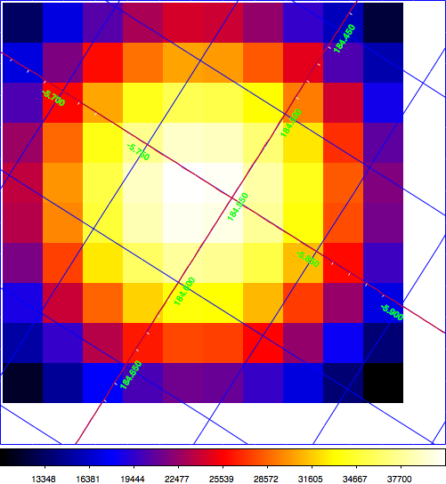

.. _sec_tsmap:

Generating a Test Statistic map
~~~~~~~~~~~~~~~~~~~~~~~~~~~~~~~

In the above examples you have always considering that you knew exactly
where the source is located, but in real life situations this may not
necessarily be the case.
You thus need a means to search for significant excess emission in your data.
One possibility to accomplish this task is to compute the Test Statistic
for a specific source at a grid of trial positions.
The :ref:`cttsmap` tool will do exactly that job.

The Test Statistic is defined as twice the log-likelihood difference 
between fitting a source at a given position on top of a model or fitting
no source.
Roughly speaken, the square root of the Test Statistic value gives
the source detection significance in Gaussian sigmas, although the
exact relation depends somewhat on the formulation of the statistical
problem.

Here an example of how to apply the :ref:`cttsmap` tool to the two
simulated observations of the Crab nebula in unbinned mode.
On input you provide a source model XML file and the name of the source
in the XML file that should be moved on a grid of test positions.
This means that the position of the source given in the XML file is
in fact ignored and replaced by the grid positions that are defined by
the user parameters.
In the example you defined a grid of 10 x 10 positions around the
nominal position of the Crab nebula with a grid spacing of 0.02°.

.. code-block:: bash

  $ cttsmap
  Input event list, counts cube or observation definition XML file [events.fits] obs.xml
  Calibration database [prod2] 
  Instrument response function [South_0.5h] 
  Input model XML file [$CTOOLS/share/models/crab.xml] 
  Test source name [Crab] 
  First coordinate of image center in degrees (RA or galactic l) (0-360) [83.63] 
  Second coordinate of image center in degrees (DEC or galactic b) (-90-90) [22.01] 
  Projection method (AIT|AZP|CAR|MER|MOL|STG|TAN) [CAR] 
  Coordinate system (CEL - celestial, GAL - galactic) (CEL|GAL) [CEL] 
  Image scale (in degrees/pixel) [0.02] 
  Size of the X axis in pixels [200] 10
  Size of the Y axis in pixels [200] 10
  Output Test Statistic map file [tsmap.fits] 

:ref:`cttsmap` writes the Test Statistic map in the ``tsmap.fits`` file
that contains one extension for the Test Statistic value and further
extensions for the spectral parameters that have been fitted for the
source at each position of the grid.
The figure below show the Test Statistic map which reaches a maximum
value of 42622 near the centre of the map.

   *Test Statistic map of the Crab region*

.. note::

   Similar to :ref:`ctlike` the :ref:`cttsmap` tool works either for unbinned,
   binned or stacked analysis. On input it takes either a single event 
   list, a single counts cube, or an observation definition XML file that
   allows a joint analysis of multiple observations.
