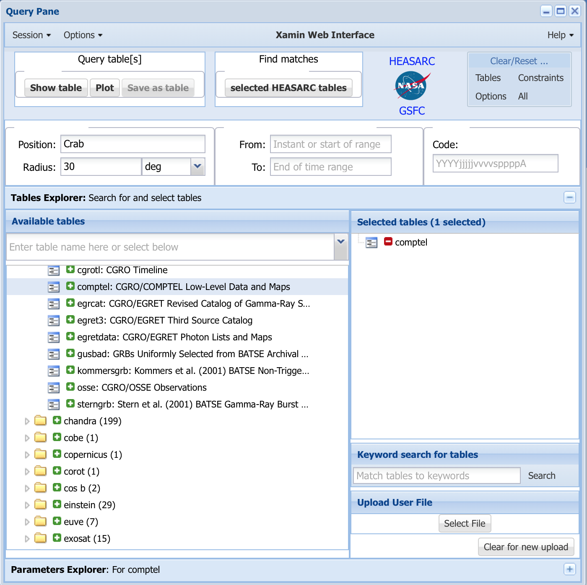
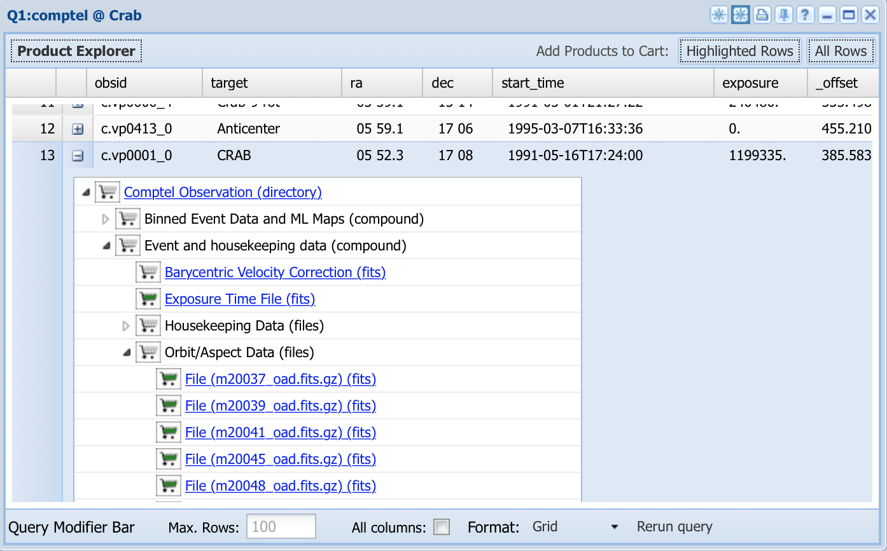
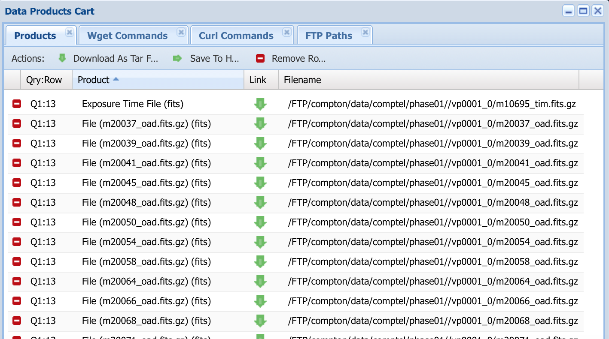

.. _comptel_download:

Download COMPTEL data
---------------------

  .. admonition:: What you will learn

     You will learn how to download COMPTEL data for an analysis with
     ctools.

Using HEASARC's Xamin interface
~~~~~~~~~~~~~~~~~~~~~~~~~~~~~~~

You can download COMPTEL data from the HEASARC data server through the
`Xamin Web Interface <https://heasarc.gsfc.nasa.gov/xamin/>`_.
As example, the figure below shows a request for data around the Crab pulsar.

   *Xamin Web Interface to query COMPTEL data*

Click on the button ``"Show table"`` in the upper left which opens a new
window that shows all available data sets. Click on the ``+`` symbol of an
observation identifier to show all available data products. In the example
below we selected that data products for obsid ``c.vp0001_0``,
which is the COMPTEL viewing period ``0001``, and inspected specifically
the Event and housekeeping data.

   *Available COMPTEL data products for viewing period 0001*

.. note::

  The COMPTEL obervations are divided into so-called viewing periods (``vp``) of
  typically 14 days. The Crab nebula was observed during many viewing periods.
  In this example, the data for the viewing period ``0001`` were selected.

.. note::

  The CGRO mission was devided into nine mission phases that correspond to the
  nine years of satellite operations. Viewing periods for ``phase01`` start
  with ``00``, viewing periods for ``phase02`` start with ``02``, and so on.

Clicking on the carts of files will add data products to your Data Products
Cart for download. In the example below, we added all Orbit/Aspect Data
files, a Processed Event file and the Exposure Time file. The latter
is actually a misnomer, since the corresponding file does not contain the
exposure time but the Good Time Intervals for viewing period ``0001``.

   *Data products cart for viewing period 0001*

Clicking on the ``"Download As Tar File"`` tab will download all data products
in a single tar file. Once the download is finished you need to put the
data in a standardised directory structure using the following commands:

.. code-block:: bash

   $ mkdir -p data/phase01
   $ tar xvfz xamin_download.tar.gz -C data/phase01/
   x vp0001_0/m10695_tim.fits.gz
   x vp0001_0/m20037_oad.fits.gz
   x vp0001_0/m20039_oad.fits.gz
   x vp0001_0/m20041_oad.fits.gz
   x vp0001_0/m20045_oad.fits.gz
   x vp0001_0/m20048_oad.fits.gz
   x vp0001_0/m20050_oad.fits.gz
   x vp0001_0/m20054_oad.fits.gz
   x vp0001_0/m20058_oad.fits.gz
   x vp0001_0/m20064_oad.fits.gz
   x vp0001_0/m20066_oad.fits.gz
   x vp0001_0/m20068_oad.fits.gz
   x vp0001_0/m20071_oad.fits.gz
   x vp0001_0/m20073_oad.fits.gz
   x vp0001_0/m20078_oad.fits.gz
   x vp0001_0/m20081_oad.fits.gz
   x vp0001_0/m28511_evp.fits.gz

.. note::

   ctools expects that the COMPTEL data from HEASARC are stored in a standardised
   directory structure that starts with a top-level data directory of any name
   under which there are directories for each of the nine mission phases:
   
   .. code-block:: bash
   
      data
      data/phase01
      data/phase02
      data/phase03
      data/phase04
      data/phase05
      data/phase06
      data/phase07
      data/phase08
      data/phase09

Once you untared and installed the downloaded data you need to create a database for
ctools analysis using :ref:`comgendb`. Before that we recommend to create a ``COMDATA``
environment variable that holds the absolute path to the COMPTEL data archive. You do
these steps with the following commands:

.. code-block:: bash

   $ export COMDATA=$PWD/data
   $ comgendb
   COMPTEL HEASARC archive directory [$COMDATA]
   COMPTEL database directory [$COMDATA/dbase]

You are now setup for COMPTEL science data analysis.

Using :ref:`comgendb`
~~~~~~~~~~~~~~~~~~~~~

You may alternatively use :ref:`comgendb` to download the full HEASARC COMPTEL
database on your computer. This requires ``wget`` to be installed on your system.
Downloading the full archive is useful if you intend to analyse more than a few
viewing periods. You can download the full archive and generate a database for
this archive using

.. code-block:: bash

   $ export COMDATA=$PWD/data
   $ comgendb download=yes
   COMPTEL HEASARC archive directory [$COMDATA]
   COMPTEL database directory [$COMDATA/dbase]

Once you have setup your database in that way you have all data needed for COMPTEL
data analysis on your system and you never need to repeat this step again.

.. warning::

   The download of the full COMPTEL database from HEASARC will take several
   hours.
