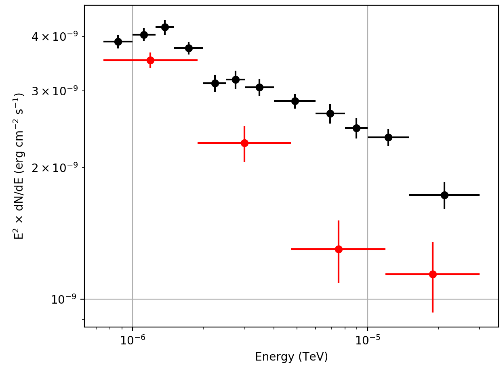

.. _howto_comptel_spectrum:

Generate a spectral energy distribution for a source
----------------------------------------------------

  .. admonition:: What you will learn

     You will learn how to use :ref:`ctlike` to derive the spectral energy
     density of a source from COMPTEL data.

To determine a spectrum of the Crab nebula you can use the :ref:`csspec`
script. To do this, type

.. code-block:: bash

   $ csspec
   Input event list, counts cube, or observation definition XML file [events.fits] obs.xml
   Input model definition XML file [$CTOOLS/share/models/crab.xml] models.xml
   Source name [Crab]
   Spectrum generation method (SLICE|NODES|AUTO) [AUTO]
   Algorithm for defining energy bins (FILE|LIN|LOG|POW) [LOG]
   Start value for first energy bin in TeV [0.1] 0.00000075
   Stop value for last energy bin in TeV [100.0] 0.00003
   Number of energy bins (1-200) [20] 4
   Output spectrum file [spectrum.fits]

This will generate a logarithmically spaced spectrum composed of 4 energy bins
comprised within 0.75 MeV and 30 GeV. The :ref:`csspec` tool is run in the ``AUTO``
mode, which for COMPTEL data corresponds to the ``NODES`` method. :ref:`csspec`
will convert the Crab spectrum in the input model into a node function and fit
all intensity nodes using :ref:`ctlike`. The resulting node intensities are
then interpreted as the spectral point, and are displayed as red data points
in the figure below. The black data points show the combined Crab nebular and
pulsar spectrum from
`Kuiper et al. 2001, A&A, 378, 918 <http://cdsads.u-strasbg.fr/abs/2001A%26A...378..918K>`_
for comparison.

   *Spectrum of the Crab derived using a node function*
