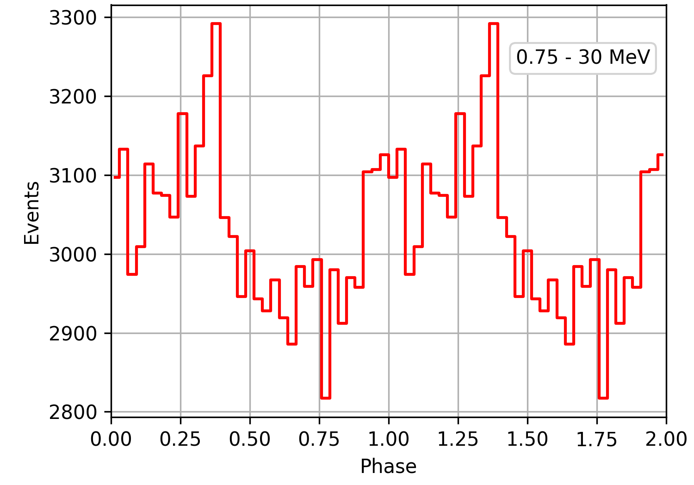

.. _comptel_pulsar:

Creating pulsar pulse profiles
------------------------------

  .. admonition:: What you will learn

     You will learn how you can generate pulse profiles for pulsars.

Some of the gamma-ray sources in our Galaxy are pulsars, and eventually you
want to study their pulse profiles in the MeV band using COMPTEL data.
You do this using the :ref:`compulbin` script that generates a pulse profile
FITS file. Below an example of how you can do this for the Crab pulsar.

.. code-block:: bash

   $ compulbin
   Input observation definition file [obs.xml]
   Pulsar name [PSR B0531+21]
   Pulsar ephemerides file [$CTOOLS/share/models/ephem_xte.psrtime]
   Minimum energy (MeV) (0.05-50.0) [0.75]
   Maximum energy (MeV) (0.05-50.0) [30.0]
   Number of phase bins (1-200) [33]
   Output pulsar phase bins file [pulsar.fits]

On output, :ref:`compulbin` creates a pulse profile FITS file that is displayed
in the figure below.

   *Crab pulsar pulse profile for viewing period 0001*

