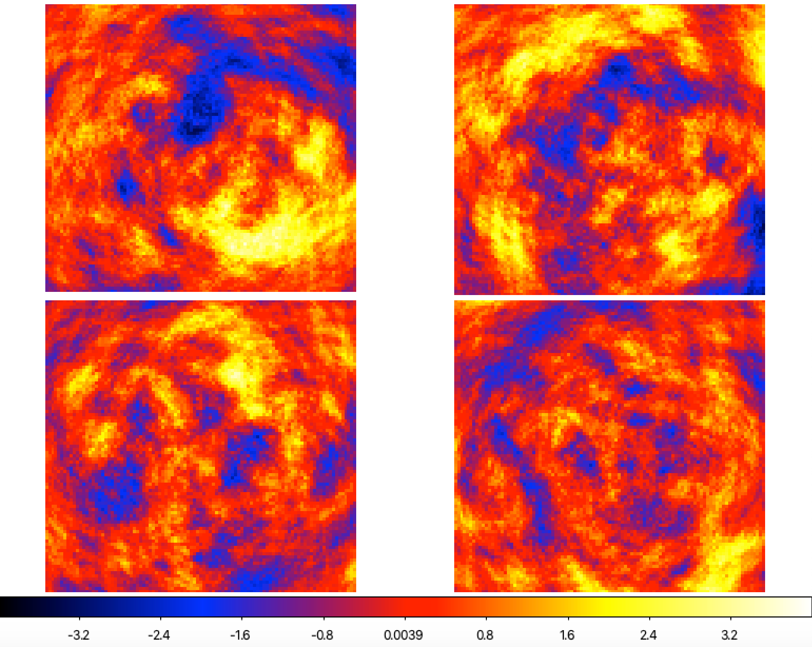

.. _comptel_residuals:

Inspecting fit residuals
------------------------

  .. admonition:: What you will learn

     You will learn how you can inspect the residuals after model fitting.

Following a model fit it is good practice to inspect the fit residuals, i.e.
the difference between the observed and the modelled event distributions. You do
this using the :ref:`comobsres` script that projects the fit residuals along
an event cone onto the sky. The example below show how a residual map is
created for the fit of the Crab point source model.

.. code-block:: bash

   $ comobsres
   Input observation definition file [obs.xml] outobs.xml
   Input model definition file [models.xml] results.xml
   Residual map computation algorithm (SUB|SUBDIV|SUBDIVSQRT|SIGNIFICANCE) [SIGNIFICANCE]
   Coordinate system (CEL - celestial, GAL - galactic) (CEL|GAL) [GAL]
   Projection method (AIT|AZP|CAR|GLS|MOL|SFL|SIN|STG|TAN) [TAN]
   Output residual map [resmap.fits]

On output :ref:`comobsres` creates a residual map that in the example above
is named ``resmap.fits``. The residual map is actually a map cube, containing
a residual map for each energy bin. The map cube is displayed in the Figure
below. The color scale ranges from -4 to +4 sigma. Some residuals appear to be
present in the data, with the largest residuals being generally observed at
low energies.

   *Residual maps for the four energy bins*
