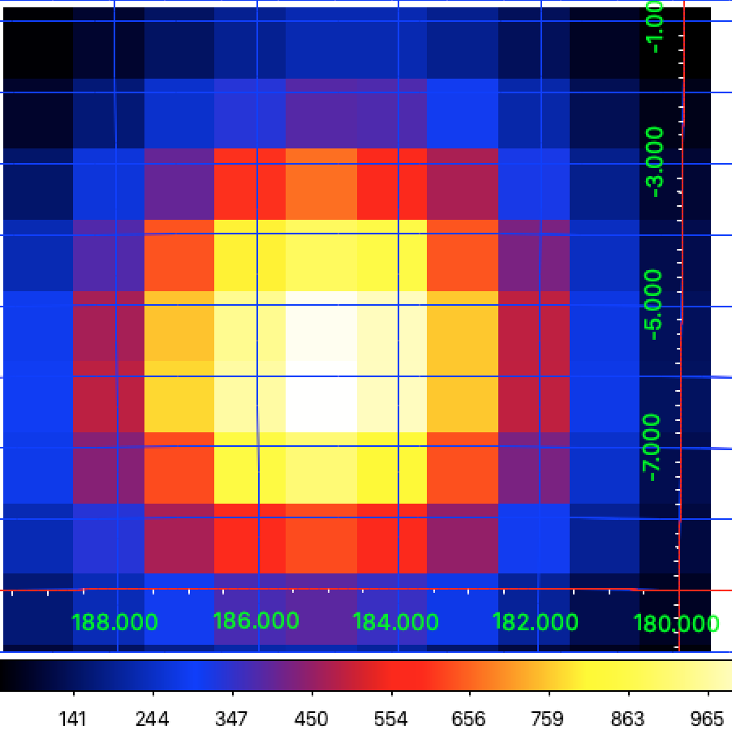

.. _comptel_tsmap:

Generating a TS map
-------------------

  .. admonition:: What you will learn

     You will learn how you can generate a Test Statistic map for COMPTEL
     data.

Eventually you may want to investigate if gamma-ray sources are present
in a specific data set. You do this using the :ref:`comlixmap` script that
generates a maximum likelihood map, also known as Test Statistic map. In the
example below, a Test Statistic map with 10x10 pixels is generated around
the position of the Crab pulsar and pulsar wind nebula. Note that :ref:`comlixmap`
will fit a test source jointly for the four energy bins that are present in
the
:ref:`observation definition file <glossary_obsdef>` ``obs_binned.xml``.

.. code-block:: bash

   $ comlixmap
   Input observation definition file [obs.xml] obs_binned.xml
   Input model definition file [models.xml]
   Test source name [Crab]
   Coordinate system (CEL - celestial, GAL - galactic) (CEL|GAL) [GAL]
   Projection method (AIT|AZP|CAR|GLS|MER|MOL|SFL|SIN|STG|TAN) [TAN]
   First coordinate of image center in degrees (RA or galactic l) (0-360) [180.24] 184.6
   Second coordinate of image center in degrees (DEC or galactic b) (-90-90) [-1.50] -5.8
   Image scale (in degrees/pixel) (0.01-10.0) [1.0]
   Size of the X axis in pixels (1-500) [10]
   Size of the Y axis in pixels (1-500) [10]
   Method for background computation (PHINOR|BGDLIXA|BGDLIXE) [BGDLIXE]
   Output Test Statistic map file [tsmap.fits]

.. warning::

   The executing of the :ref:`comlixmap` script takes some time since an iterative
   SRCLIX analysis is performed at each of the map's grid positions. The example
   above takes between 30 min and 2 hours, depending on operating system and
   processor speed.

On output :ref:`comlixmap` creates a Test Statistic map, which in the example
above is named ``tsmap.fits``. The figure below shows the content of the map,
which reveals a significant gamma-ray source at the position of the Crab.

   *Test statistic map around the Crab for viewing period 0001*

