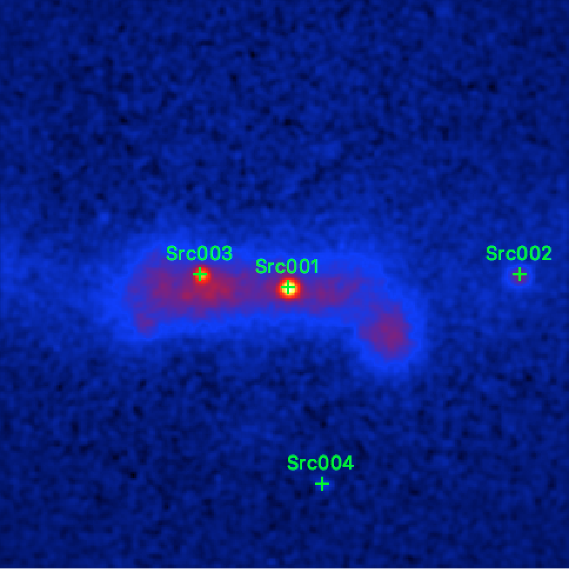

.. _1dc_select_models:

Detecting candidate sources
---------------------------

  .. admonition:: What you will learn

     You will learn how to **detect candidate sources** in a sky map.

     This will provide you with an initial
     :ref:`model definition file <glossary_moddef>`
     in XML format that can be directly used for maximum likelihood fitting.
     In subsequent steps you will iteratively improve this model to obtain a
     reliable description of the observed gamma-ray sky.

As next step you need to identify the location of candidate sources in the
sky map. You do this using the :ref:`cssrcdetect` script which implements a
peak finding algorithm that is applied to a smoothed version of a sky map.
By default, the smoothing kernel is a radial disk, and we apply here a
disk radius of 0.05 degree for the analysis. Only peaks more significant
than 5 sigma are retained.

.. code-block:: bash

   $ cssrcdetect
   Input sky map file [skymap.fits] skymap_irf.fits
   Source model type (POINT) [POINT]
   Background model type (NONE|IRF|AEFF|CUBE|RACC) [NONE] IRF
   Detection threshold (Gaussian sigma) [5.0]
   Correlation kernel radius (deg) [0.1] 0.05
   Output model definition XML file [models.xml]
   Output DS9 region file [ds9.reg]

This generates a
:ref:`model definition file <glossary_moddef>` ``models.xml``
that contains point source model components for all sources that were
detected in the sky map.
All model components have a power law as spectral component with
parameters that correspond to 1% of the very-high-energy spectrum of the
Crab, which is a reasonable starting condition for a subsequent model
fitting using the :ref:`ctlike` tool.

The script generated also a `ds9 <http://ds9.si.edu>`_ region file that can
be overlaid on the sky map. As indicated in the figure below, :ref:`cssrcdetect`
detected four sources.

   *IRF background subtracted sky map of the events recorded around the Galactic Centre during the Galactic Plane Survey with the detected sources overlaid*

Below is the content of the
:ref:`model definition file <glossary_moddef>`
that was generated by :ref:`cssrcdetect`.
There are five model components in the file and each model component is
identified using a unique ``name`` attribute.
The first four components, ``"Src001"`` to ``"Src004"``, are the four point sources
detected by :ref:`cssrcdetect`, the fifth component, ``"Background"``, is a
background model component of type ``"CTAIrfBackground"`` that was added because
``IRF`` was specified for the ``Background model type`` when running the script.
Having a background model component added allows to directly use the
:ref:`model definition file <glossary_moddef>`
for a model fitting with :ref:`ctlike`.

.. code-block:: xml

   <?xml version="1.0" encoding="UTF-8" standalone="no"?>
   <source_library title="source library">
     <source name="Src001" type="PointSource">
       <spectrum type="PowerLaw">
         <parameter name="Prefactor" value="1" error="0" scale="5.7e-18" min="0" free="1" />
         <parameter name="Index" value="1" error="-0" scale="-2.48" min="-4.03225806451613" max="4.03225806451613" free="1" />
         <parameter name="PivotEnergy" value="1" scale="300000" free="0" />
       </spectrum>
       <spatialModel type="PointSource">
         <parameter name="RA" value="266.424004498437" error="0" scale="1" free="1" />
         <parameter name="DEC" value="-29.0049010253548" error="0" scale="1" free="1" />
       </spatialModel>
     </source>
     <source name="Src002" type="PointSource">
       <spectrum type="PowerLaw">
         <parameter name="Prefactor" value="1" error="0" scale="5.7e-18" min="0" free="1" />
         <parameter name="Index" value="1" error="-0" scale="-2.48" min="-4.03225806451613" max="4.03225806451613" free="1" />
         <parameter name="PivotEnergy" value="1" scale="300000" free="0" />
       </spectrum>
       <spatialModel type="PointSource">
         <parameter name="RA" value="264.802012181975" error="0" scale="1" free="1" />
         <parameter name="DEC" value="-31.0050720432975" error="0" scale="1" free="1" />
       </spatialModel>
     </source>
     <source name="Src003" type="PointSource">
       <spectrum type="PowerLaw">
         <parameter name="Prefactor" value="1" error="0" scale="5.7e-18" min="0" free="1" />
         <parameter name="Index" value="1" error="-0" scale="-2.48" min="-4.03225806451613" max="4.03225806451613" free="1" />
         <parameter name="PivotEnergy" value="1" scale="300000" free="0" />
       </spectrum>
       <spatialModel type="PointSource">
         <parameter name="RA" value="266.831945177213" error="0" scale="1" free="1" />
         <parameter name="DEC" value="-28.1460284439951" error="0" scale="1" free="1" />
       </spatialModel>
     </source>
     <source name="Src004" type="PointSource">
       <spectrum type="PowerLaw">
         <parameter name="Prefactor" value="1" error="0" scale="5.7e-18" min="0" free="1" />
         <parameter name="Index" value="1" error="-0" scale="-2.48" min="-4.03225806451613" max="4.03225806451613" free="1" />
         <parameter name="PivotEnergy" value="1" scale="300000" free="0" />
       </spectrum>
       <spatialModel type="PointSource">
         <parameter name="RA" value="268.244867737546" error="0" scale="1" free="1" />
         <parameter name="DEC" value="-30.3728286753247" error="0" scale="1" free="1" />
       </spatialModel>
     </source>
     <source name="Background" type="CTAIrfBackground">
       <spectrum type="PowerLaw">
         <parameter name="Prefactor" value="1" error="0" scale="1" min="0" free="1" />
         <parameter name="Index" value="0" error="0" scale="1" min="-10" max="10" free="1" />
         <parameter name="PivotEnergy" value="1" scale="1000000" free="0" />
       </spectrum>
     </source>
   </source_library>
