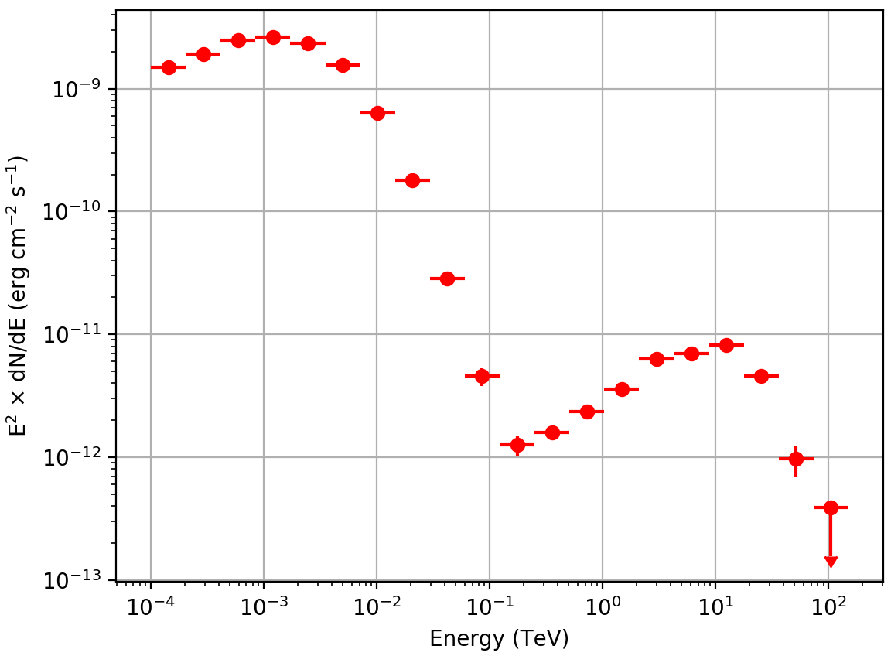

.. _howto_combine_instrument:

How to jointly analyse data from different instruments?
-------------------------------------------------------

  .. admonition:: What you will learn

     You will learn how to **jointly analyse data from different instruments**.

In this tutorial you will learn how to jointly analyse data observed with
Fermi-LAT and simulated data for CTA for the Vela pulsar and pulsar wind
nebula.

Prepare Fermi-LAT data
^^^^^^^^^^^^^^^^^^^^^^

The preparation of Fermi-LAT data will follow the description provided
on
:ref:`howto_fermi_prepare`.

Prepare CTA data
^^^^^^^^^^^^^^^^

For CTA the simulations of the Galactic Plane Scan from the first Data Challenge
will be used.
First, select all observations from the data with pointing directions close to
the Vela pulsar:

.. code-block:: bash

   $ csobsselect
   Input event list or observation definition XML file [obs.xml] $CTADATA/obs/obs_gps_baseline.xml
   Pointing selection region shape (CIRCLE|BOX) [CIRCLE]
   Coordinate system (CEL - celestial, GAL - galactic) (CEL|GAL) [CEL]
   Right Ascension of selection centre (deg) (0-360) [83.63] 128.838
   Declination of selection centre (deg) (-90-90) [22.01] -45.178
   Radius of selection circle (deg) (0-180) [5.0]
   Start time (UTC string, JD, MJD or MET in seconds) [NONE]
   Output observation definition XML file [outobs.xml] obs_vela.xml

Then bin the selected observations into a counts cube

.. code-block:: bash

   $ ctbin
   Input event list or observation definition XML file [events.fits] obs_vela.xml
   Coordinate system (CEL - celestial, GAL - galactic) (CEL|GAL) [CEL]
   Projection method (AIT|AZP|CAR|GLS|MER|MOL|SFL|SIN|STG|TAN) [CAR]
   First coordinate of image center in degrees (RA or galactic l) (0-360) [83.63] 128.838
   Second coordinate of image center in degrees (DEC or galactic b) (-90-90) [22.51] -45.178
   Image scale (in degrees/pixel) [0.02]
   Size of the X axis in pixels [200]
   Size of the Y axis in pixels [200]
   Algorithm for defining energy bins (FILE|LIN|LOG|POW) [LOG]
   Lower energy limit (TeV) [0.1] 0.03
   Upper energy limit (TeV) [100.0] 150.0
   Number of energy bins (1-200) [20] 40
   Output counts cube file [cntcube.fits]

Then compute the response cubes as follows

.. code-block:: bash

   $ ctexpcube
   Input event list or observation definition XML file [NONE] obs_vela.xml
   Input counts cube file to extract exposure cube definition [NONE] cntcube.fits
   Output exposure cube file [expcube.fits]

.. code-block:: bash

   $ ctpsfcube
   Input event list or observation definition XML file [NONE] obs_vela.xml
   Input counts cube file to extract PSF cube definition [NONE]
   Coordinate system (CEL - celestial, GAL - galactic) (CEL|GAL) [CEL]
   Projection method (AIT|AZP|CAR|GLS|MER|MOL|SFL|SIN|STG|TAN) [CAR]
   First coordinate of image center in degrees (RA or galactic l) (0-360) [83.63] 128.838
   Second coordinate of image center in degrees (DEC or galactic b) (-90-90) [22.51] -45.178
   Image scale (in degrees/pixel) [1.0]
   Size of the X axis in pixels [10]
   Size of the Y axis in pixels [10]
   Algorithm for defining energy bins (FILE|LIN|LOG|POW) [LOG]
   Lower energy limit (TeV) [0.1] 0.03
   Upper energy limit (TeV) [100.0] 150.0
   Number of energy bins (1-200) [20] 40
   Output PSF cube file [psfcube.fits]

.. code-block:: bash

   $ ctbkgcube
   Input event list or observation definition XML file [NONE] obs_vela.xml
   Input counts cube file to extract background cube definition [NONE] cntcube.fits
   Input model definition XML file [NONE] $CTOOLS/share/models/bkg_irf.xml
   Output background cube file [bkgcube.fits]
   Output model definition XML file [NONE] bkgcube.xml

Combining the observations
^^^^^^^^^^^^^^^^^^^^^^^^^^

Now you have all the data and hand. You have to create an
:ref:`observation definition file <glossary_obsdef>`
to combine the data for an analysis:

.. code-block:: xml

   <?xml version="1.0" standalone="no"?>
   <observation_list title="observation library">
     <observation name="Vela" id="000001" instrument="CTA">
       <parameter name="CountsCube"   file="cntcube.fits"/>
       <parameter name="ExposureCube" file="expcube.fits"/>
       <parameter name="PsfCube"      file="psfcube.fits"/>
       <parameter name="BkgCube"      file="bkgcube.fits"/>
     </observation>
     <observation name="Vela" id="000001" instrument="LAT">
       <parameter name="CountsMap"    file="srcmaps.fits"/>
       <parameter name="ExposureMap"  file="expmap.fits"/>
       <parameter name="LiveTimeCube" file="ltcube.fits"/>
       <parameter name="IRF"          value="P8R2_SOURCE_V6"/>
     </observation>
   </observation_list>

The
:ref:`observation definition file <glossary_obsdef>`
contains two observations of the Vela pulsar, a first done with CTA and a
second done with Fermi-LAT. The ``instrument`` attribute distinguishes between
both instruments.

Generate a spectral energy distribution
^^^^^^^^^^^^^^^^^^^^^^^^^^^^^^^^^^^^^^^

Before being able to generate a spectral energy distribution (SED) you have
to define a
:ref:`model definition file <glossary_moddef>`
that will be used to model the events for both observations.
The model that will be used in this analysis is shown below:

.. code-block:: xml

   <?xml version="1.0" standalone="no"?>
   <source_library title="source library">
     <source type="PointSource" name="Vela">
       <spectrum type="PowerLaw">
          <parameter name="Prefactor"   scale="1e-16" value="5.7"  min="1e-07" max="1000.0" free="1"/>
          <parameter name="Index"       scale="-1"    value="2.48" min="0.0"   max="+5.0"   free="1"/>
          <parameter name="PivotEnergy" scale="1e6"   value="0.3"  min="0.01"  max="1000.0" free="0"/>
       </spectrum>
       <spatialModel type="PointSource">
         <parameter name="RA"  scale="1.0" value="128.84" min="-360" max="360" free="1"/>
         <parameter name="DEC" scale="1.0" value="-45.18" min="-90"  max="90"  free="1"/>
       </spatialModel>
     </source>
     <source type="DiffuseSource" name="Galactic_diffuse" instrument="LAT">
       <spectrum type="Constant">
         <parameter name="Normalization" scale="1.0" value="1.0" min="0.1" max="1000.0" free="1"/>
       </spectrum>
       <spatialModel type="DiffuseMapCube" file="gll_iem_v06.fits">
         <parameter name="Normalization" scale="1.0" value="1.0" min="0.1" max="10.0" free="0"/>
       </spatialModel>
     </source>
     <source type="DiffuseSource" name="Extragalactic_diffuse" instrument="LAT">
       <spectrum type="FileFunction" file="iso_P8R2_SOURCE_V6_v06.txt">
         <parameter name="Normalization" scale="1.0" value="1.0" min="0.0" max="1000.0" free="0"/>
       </spectrum>
       <spatialModel type="DiffuseIsotropic">
         <parameter name="Value" scale="1.0" value="1.0" min="0.0" max="10.0" free="0"/>
       </spatialModel>
     </source>
     <source name="Background" type="CTACubeBackground" instrument="CTA">
       <spectrum type="PowerLaw">
         <parameter name="Prefactor"   scale="1.0"  value="1.0"  min="1e-3" max="1e+3"   free="1"/>
         <parameter name="Index"       scale="1.0"  value="0.0"  min="-5.0" max="+5.0"   free="1"/>
         <parameter name="PivotEnergy" scale="1e6"  value="1.0"  min="0.01" max="1000.0" free="0"/>
       </spectrum>
     </source>
   </source_library>

The model contains a point source located at the position of the Vela pulsar
with a power law spectrum. In addition, it contains two ``DiffuseSource``
components that are only applied for Fermi-LAT observations, which is indicated
by their ``instrument="LAT"`` attribute. Both components model the diffuse
background that prevails at GeV energies. Finally, the model contains a
``CTACubeBackground`` component that applies to CTA. You may have noticed that
the point source is the only component that has no ``instrument`` attribute,
meaning that this component applies to both instruments.

Now you are ready to generate the spectral energy distribution for the
combined data set. You do this using the :ref:`csspec` script as follows

.. code-block:: bash

   $ csspec
   Input event list, counts cube, or observation definition XML file [events.fits] obs.xml
   Input model definition XML file [$CTOOLS/share/models/crab.xml] models.xml
   Source name [Crab] Vela
   Spectrum generation method (SLICE|NODES|AUTO) [AUTO]
   Algorithm for defining energy bins (FILE|LIN|LOG|POW) [LOG]
   Start value for first energy bin in TeV [0.1] 0.0001
   Stop value for last energy bin in TeV [100.0] 150.0
   Number of energy bins (1-200) [20]
   Output spectrum file [spectrum.fits]

This will generate a logarithmically spaced spectrum composed of 20 energy bins
comprised within 100 MeV and 150 TeV. The :ref:`csspec` tool is run in the ``AUTO``
mode, which for different instruments corresponds to the ``NODES`` method.
The resulting spectral energy distribution is shown below:

   *Vela spectrum derived using csspec from real Fermi-LAT and simulated CTA data*

.. note::
   The figure was created using the ``show_spectrum.py`` script that is
   located in the ctools example folder. The example script requires the
   `matplotlib <http://matplotlib.org>`_ Python module for display.
   You may reproduce the plot by typing

   .. code-block:: bash

      $ $CTOOLS/share/examples/python/show_spectrum.py spectrum.fits
