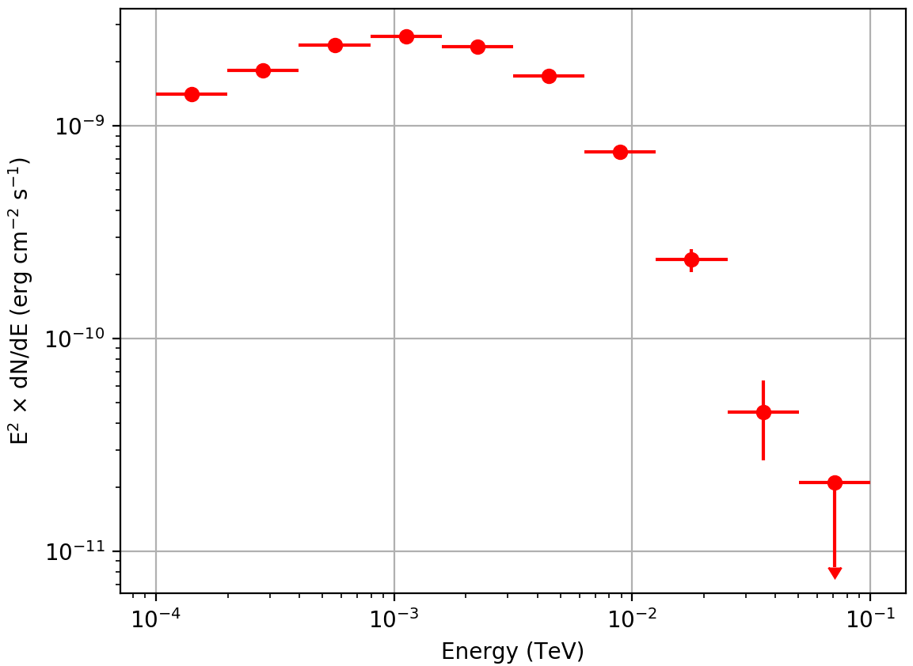

.. _fermi_spectrum:

Generate a spectrum
-------------------

  .. admonition:: What you will learn

     You will learn how to use :ref:`csspec` to derive the spectral energy
     density of a source from Fermi-LAT data.

To determine a spectrum of the Vela pulsar you can use the :ref:`csspec`
script. To do this, type

.. code-block:: bash

   $ csspec
   Input event list, counts cube, or observation definition XML file [events.fits] obs.xml
   Input model definition XML file [$CTOOLS/share/models/crab.xml] vela_results.xml
   Source name [Crab] Vela
   Spectrum generation method (SLICE|NODES|AUTO) [AUTO]
   Algorithm for defining energy bins (FILE|LIN|LOG|POW) [LOG]
   Start value for first energy bin in TeV [0.1] 0.0001
   Stop value for last energy bin in TeV [100.0] 0.1
   Number of energy bins (1-200) [20] 10
   Output spectrum file [spectrum.fits]

This will generate a logarithmically spaced spectrum composed of 10 energy bins
comprised within 100 MeV and 100 GeV. The :ref:`csspec` tool is run in the ``AUTO``
mode, which for Fermi-LAT data corresponds to the ``NODES`` method. :ref:`csspec`
will convert the Vela spectrum in the input model into a node function and fit
all intensity nodes using :ref:`ctlike`. The resulting node intensities are
then interpreted as the spectral point, and are displayed graphically below:

   *Spectrum of the Vela pulsar derived using csspec*

.. note::
   The figure was created using the ``show_spectrum.py`` script that is
   located in the ctools example folder. The example script requires the
   `matplotlib <http://matplotlib.org>`_ Python module for display.
   You may reproduce the plot by typing

   .. code-block:: bash

      $ $CTOOLS/share/examples/python/show_spectrum.py spectrum.fits
