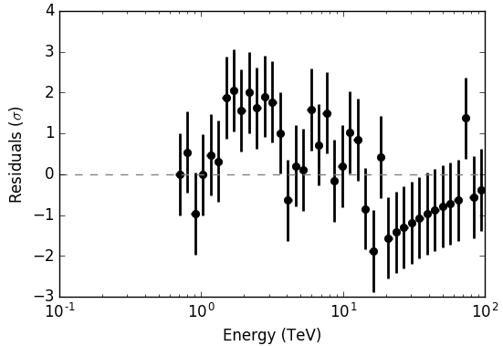

.. _hess_dr1_classical:

Performing a classical On/Off analysis
--------------------------------------

  .. admonition:: What you will learn

     You will learn **how to perform a classical On/Off analysis of the
     data**.

.. code-block:: bash

   $ csphagen use_irf_bkg=no
   Input event list or observation definition XML file [obs.xml] obs_crab_selected.xml
   Input model definition XML file (if NONE, use point source) [NONE] crab_models.xml
   Source name [Crab]
   Algorithm for defining energy bins (FILE|LIN|LOG) [LOG]
   Start value for first energy bin in TeV [0.1] 0.66
   Stop value for last energy bin in TeV [100.0]
   Number of energy bins [120] 40
   Stack multiple observations into single PHA, ARF and RMF files? [no]
   Output observation definition XML file [onoff_obs.xml] onoff_obs_crab.xml
   Method for background estimation (REFLECTED|CUSTOM) [REFLECTED]
   Coordinate system (CEL - celestial, GAL - galactic) (CEL|GAL) [CEL]
   Right Ascension of source region centre (deg) (0-360) [83.63]
   Declination of source region centre (deg) (-90-90) [22.01]
   Radius of source region circle (deg) (0-180) [0.2]

.. code-block:: xml

   <?xml version="1.0" encoding="UTF-8" standalone="no"?>
   <source_library title="source library">
     <source name="Crab" type="PointSource">
       <spectrum type="PowerLaw">
         <parameter name="Prefactor"   value="1" scale="5.7e-18" min="0" free="1" />
         <parameter name="Index"       value="1" scale="-2.48" min="-4" max="4" free="1" />
         <parameter name="PivotEnergy" value="1" scale="1000000" free="0" />
       </spectrum>
       <spatialModel type="PointSource">
         <parameter name="RA"  value="83.633" scale="1" free="0" />
         <parameter name="DEC" value="22.015" scale="1" free="0" />
       </spatialModel>
     </source>
   </source_library>

.. code-block:: bash

   $ ctlike statistic=wstat
   Input event list, counts cube or observation definition XML file [events.fits] onoff_obs_crab.xml
   Input model definition XML file [$CTOOLS/share/models/crab.xml] crab_models_onoff.xml
   Output model definition XML file [crab_results.xml]

.. code-block:: none

   2018-09-13T11:49:06: +=========================================+
   2018-09-13T11:49:06: | Maximum likelihood optimisation results |
   2018-09-13T11:49:06: +=========================================+
   2018-09-13T11:49:06: === GOptimizerLM ===
   2018-09-13T11:49:06:  Optimized function value ..: 60.048
   2018-09-13T11:49:06:  Absolute precision ........: 0.005
   2018-09-13T11:49:06:  Acceptable value decrease .: 2
   2018-09-13T11:49:06:  Optimization status .......: converged
   2018-09-13T11:49:06:  Number of parameters ......: 6
   2018-09-13T11:49:06:  Number of free parameters .: 2
   2018-09-13T11:49:06:  Number of iterations ......: 5
   2018-09-13T11:49:06:  Lambda ....................: 1e-08
   2018-09-13T11:49:06:  Maximum log likelihood ....: -60.048
   2018-09-13T11:49:06:  Observed events  (Nobs) ...: 605.000
   2018-09-13T11:49:06:  Predicted events (Npred) ..: 604.191 (Nobs - Npred = 0.808986318662733)
   2018-09-13T11:49:06: === GModels ===
   2018-09-13T11:49:06:  Number of models ..........: 1
   2018-09-13T11:49:06:  Number of parameters ......: 6
   2018-09-13T11:49:06: === GModelSky ===
   2018-09-13T11:49:06:  Name ......................: Crab
   2018-09-13T11:49:06:  Instruments ...............: all
   2018-09-13T11:49:06:  Instrument scale factors ..: unity
   2018-09-13T11:49:06:  Observation identifiers ...: all
   2018-09-13T11:49:06:  Model type ................: PointSource
   2018-09-13T11:49:06:  Model components ..........: "PointSource" * "PowerLaw" * "Constant"
   2018-09-13T11:49:06:  Number of parameters ......: 6
   2018-09-13T11:49:06:  Number of spatial par's ...: 2
   2018-09-13T11:49:06:   RA .......................: 83.633 deg (fixed,scale=1)
   2018-09-13T11:49:06:   DEC ......................: 22.015 deg (fixed,scale=1)
   2018-09-13T11:49:06:  Number of spectral par's ..: 3
   2018-09-13T11:49:06:   Prefactor ................: 4.77687464316323e-17 +/- 3.12433509735449e-18 [0,infty[ ph/cm2/s/MeV (free,scale=5.7e-18,gradient)
   2018-09-13T11:49:06:   Index ....................: -2.60709757251519 +/- 0.0767624316833204 [9.92,-9.92]  (free,scale=-2.48,gradient)
   2018-09-13T11:49:06:   PivotEnergy ..............: 1000000 MeV (fixed,scale=1000000,gradient)
   2018-09-13T11:49:06:  Number of temporal par's ..: 1
   2018-09-13T11:49:06:   Normalization ............: 1 (relative value) (fixed,scale=1,gradient)

The intensity at 1 TeV of the Crab was fitted to
:math:`(4.78 \pm 0.31) \times 10^{-11}\,{\rm photons}\,{\rm cm}^{-2}\,{\rm s}^{-1}\,{\rm TeV}^{-1}`
the spectral index of the power law is
:math:`-2.61 \pm 0.08`.
This can be compared to the values
:math:`(4.64 \pm 0.26) \times 10^{-11}\,{\rm photons}\,{\rm cm}^{-2}\,{\rm s}^{-1}\,{\rm TeV}^{-1}`
and
:math:`-2.61 \pm 0.07`
that were obtained before with the unbinned maximum likelihood fit using the
energy dispersion.

.. code-block:: bash

   $ csresspec components=yes
   Input event list, counts cube, or observation definition XML file [events.fits] onoff_obs_crab.xml
   Stack observations? [no] yes
   Input model definition XML file [$CTOOLS/share/models/crab.xml] crab_results_onoff.xml
   Residuals computation algorithm (SUB|SUBDIV|SUBDIVSQRT|SIGNIFICANCE) [SIGNIFICANCE]
   Output residual spectrum file [resspec.fits] resspec_onoff.fits

The script will produce the FITS file ``resspec.fits`` that contains the
spectral residuals for each of the model components.
To display the residuals you can use the ``show_residuals.py`` script in the
example folder as follows:

.. code-block:: bash

   $CTOOLS/share/examples/python/show_residuals.py resspec.fits

The figure below shows the resulting residual spectrum.
Although the model provides a reasonable first order approximation of the
spectral distribution of the data, there are still significant spectral
residuals that cannot be explained by the model.

   *Residual counts spectrum after model fitting*
