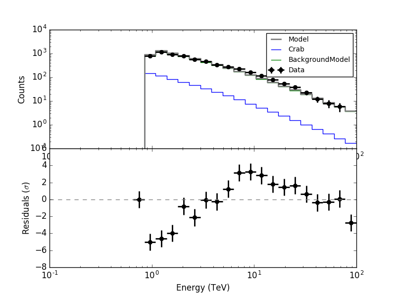
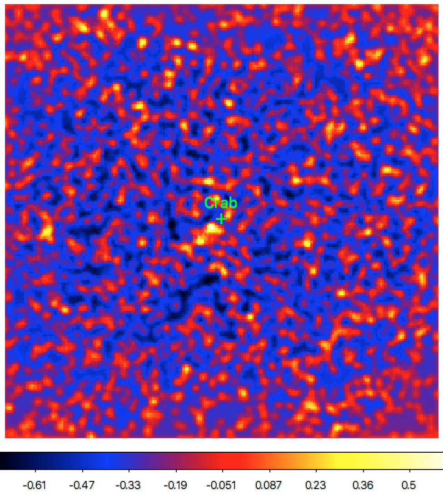

.. _hess_dr1_fitting:

Fitting a model to the data and inspecting fit residuals
--------------------------------------------------------

  .. admonition:: What you will learn

     You will learn **how to fit a parametric model to the data** and
     **how to inspect the fit residuals**.

Now you are ready to fit the model to the data.
Since the :ref:`cssrcdetect` script sets some default spectral parameters,
we suggest that you slightly adjust the
:ref:`model definition file <glossary_moddef>`
so that the model fit runs seamlessly.
For example, the pivot energy of a power law model should be comprised
within the energy interval of the data, hence you should set
``PivotEnergy`` for example to 1 TeV.
The ``error`` attributes are also not needed (although they do not harm),
so we remove them.
And finally we rename ``Src001`` to ``Crab``.
After these little adjustments, your
:ref:`model definition file <glossary_moddef>`
should look like this:

.. code-block:: xml

   <?xml version="1.0" encoding="UTF-8" standalone="no"?>
   <source_library title="source library">
     <source name="Crab" type="PointSource">
       <spectrum type="PowerLaw">
         <parameter name="Prefactor"   value="1" scale="5.7e-18" min="0" free="1" />
         <parameter name="Index"       value="1" scale="-2.48" min="-4" max="4" free="1" />
         <parameter name="PivotEnergy" value="1" scale="1000000" free="0" />
       </spectrum>
       <spatialModel type="PointSource">
         <parameter name="RA"  value="83.6192131308071" scale="1" free="1" />
         <parameter name="DEC" value="22.0199996472185" scale="1" free="1" />
       </spatialModel>
     </source>
     <source name="Background" type="CTAAeffBackground">
       <spectrum type="PowerLaw">
         <parameter name="Prefactor"   value="1" scale="1e-13" min="0" free="1" />
         <parameter name="Index"       value="1" scale="-2.5"  min="-4" max="4" free="1" />
         <parameter name="PivotEnergy" value="1" scale="1000000" free="0" />
       </spectrum>
     </source>
   </source_library>

Now you are ready to do the model fit.
For this you will use :ref:`ctlike` that you will run as follows:

.. code-block:: bash

   $ ctlike
   Input event list, counts cube or observation definition XML file [events.fits] obs_crab_selected.xml
   Input model definition XML file [$CTOOLS/share/models/crab.xml] crab_models.xml
   Output model definition XML file [crab_results.xml]

After a few seconds the tool will have terminated and you can inspect the fit
results.
They can for example be found in the ``ctlike.log`` file for which an excerpt
is shown below.

.. code-block:: none

   2018-09-11T21:17:31: +=========================================+
   2018-09-11T21:17:31: | Maximum likelihood optimisation results |
   2018-09-11T21:17:31: +=========================================+
   2018-09-11T21:17:31: === GOptimizerLM ===
   2018-09-11T21:17:31:  Optimized function value ..: 98422.688
   2018-09-11T21:17:31:  Absolute precision ........: 0.005
   2018-09-11T21:17:31:  Acceptable value decrease .: 2
   2018-09-11T21:17:31:  Optimization status .......: converged
   2018-09-11T21:17:31:  Number of parameters ......: 10
   2018-09-11T21:17:31:  Number of free parameters .: 6
   2018-09-11T21:17:31:  Number of iterations ......: 24
   2018-09-11T21:17:31:  Lambda ....................: 0.1
   2018-09-11T21:17:31:  Maximum log likelihood ....: -98422.688
   2018-09-11T21:17:31:  Observed events  (Nobs) ...: 9675.000
   2018-09-11T21:17:31:  Predicted events (Npred) ..: 9674.870 (Nobs - Npred = 0.129601074213497)
   2018-09-11T21:17:31: === GModels ===
   2018-09-11T21:17:31:  Number of models ..........: 2
   2018-09-11T21:17:31:  Number of parameters ......: 10
   2018-09-11T21:17:31: === GModelSky ===
   2018-09-11T21:17:31:  Name ......................: Crab
   2018-09-11T21:17:31:  Instruments ...............: all
   2018-09-11T21:17:31:  Instrument scale factors ..: unity
   2018-09-11T21:17:31:  Observation identifiers ...: all
   2018-09-11T21:17:31:  Model type ................: PointSource
   2018-09-11T21:17:31:  Model components ..........: "PointSource" * "PowerLaw" * "Constant"
   2018-09-11T21:17:31:  Number of parameters ......: 6
   2018-09-11T21:17:31:  Number of spatial par's ...: 2
   2018-09-11T21:17:31:   RA .......................: 83.6230374464172 +/- 0.00241074887155303 deg (free,scale=1)
   2018-09-11T21:17:31:   DEC ......................: 22.0249049416179 +/- 0.0022137104783551 deg (free,scale=1)
   2018-09-11T21:17:31:  Number of spectral par's ..: 3
   2018-09-11T21:17:31:   Prefactor ................: 4.81375364083447e-17 +/- 2.62970930530696e-18 [0,infty[ ph/cm2/s/MeV (free,scale=5.7e-18,gradient)
   2018-09-11T21:17:31:   Index ....................: -2.71079050853091 +/- 0.0652734279744327 [9.92,-9.92]  (free,scale=-2.48,gradient)
   2018-09-11T21:17:31:   PivotEnergy ..............: 1000000 MeV (fixed,scale=1000000,gradient)
   2018-09-11T21:17:31:  Number of temporal par's ..: 1
   2018-09-11T21:17:31:   Normalization ............: 1 (relative value) (fixed,scale=1,gradient)
   2018-09-11T21:17:31: === GCTAModelAeffBackground ===
   2018-09-11T21:17:31:  Name ......................: Background
   2018-09-11T21:17:31:  Instruments ...............: all
   2018-09-11T21:17:31:  Instrument scale factors ..: unity
   2018-09-11T21:17:31:  Observation identifiers ...: all
   2018-09-11T21:17:31:  Model type ................: "PowerLaw" * "Constant"
   2018-09-11T21:17:31:  Number of parameters ......: 4
   2018-09-11T21:17:31:  Number of spectral par's ..: 3
   2018-09-11T21:17:31:   Prefactor ................: 1.80502240642969e-13 +/- 2.34991048262393e-15 [0,infty[ ph/cm2/s/MeV (free,scale=1e-13,gradient)
   2018-09-11T21:17:31:   Index ....................: -2.58303579414564 +/- 0.0128891124984818 [10,-10]  (free,scale=-2.5,gradient)
   2018-09-11T21:17:31:   PivotEnergy ..............: 1000000 MeV (fixed,scale=1000000,gradient)
   2018-09-11T21:17:31:  Number of temporal par's ..: 1
   2018-09-11T21:17:31:   Normalization ............: 1 (relative value) (fixed,scale=1,gradient)

The fit has converged and the source was fitted at a position of
:math:`83.623 \pm 0.002` degrees in Right Ascension and
:math:`22.025 \pm 0.002` degrees in Declination.
The statistical :math:`1\sigma` positional uncertainty corresponds to 0.12 arcmin.
Systematic uncertainties are not computed.

According to
`SIMBAD <http://cdsportal.u-strasbg.fr/?target=Crab%20nebula>`_,
the Crab nebula is situated at a Right Ascension of 83.633 degrees and a
Declination of 22.015 degrees, which is 0.013 degrees (0.82 arcmin) away
from the fitted position.

The intensity at 1 TeV of the Crab was fitted to
:math:`(4.81 \pm 0.26) \times 10^{-11}\,{\rm photons}\,{\rm cm}^{-2}\,{\rm s}^{-1}\,{\rm TeV}^{-1}`
the spectral index of the power law is
:math:`-2.58 \pm 0.01`.
This can be compared to the values of
:math:`(3.45 \pm 0.05) \times 10^{-11}\,{\rm photons}\,{\rm cm}^{-2}\,{\rm s}^{-1}\,{\rm TeV}^{-1}`
and
:math:`-2.63 \pm 0.01`
reported in
`Aharonian et al. (2016), A&A, 457, 899 <https://www.aanda.org/articles/aa/abs/2006/39/aa5351-06/aa5351-06.html>`_.

Following a model fit, **you should always inspect the fit residuals.**
First let's inspect the spectral residuals.
You can do this using the :ref:`csresspec` script as follows:

.. code-block:: bash

   $ csresspec components=yes
   Input event list, counts cube, or observation definition XML file [events.fits] obs_crab_selected.xml
   Algorithm for defining energy bins (FILE|LIN|LOG) [LOG]
   Start value for first energy bin in TeV [0.1] 0.66
   Stop value for last energy bin in TeV [100.0]
   Number of energy bins (1-200) [20]
   Stack observations? [no] yes
   Coordinate System (CEL|GAL) [CEL]
   Projection method (AIT|AZP|CAR|GLS|MER|MOL|SFL|SIN|STG|TAN) [CAR]
   First coordinate of image/source region center in degrees (RA or galactic l) (0-360) [83.63]
   Second coordinate of image/source region center in degrees (DEC or galactic b) (-90-90) [22.51] 22.01
   Size of the X axis in pixels [200]
   Size of the Y axis in pixels [200]
   Pixel size (deg/pixel) [0.02]
   Input model definition XML file [$CTOOLS/share/models/crab.xml] crab_results.xml
   Mask data to calculate residuals in ROI? [no]
   Residuals computation algorithm (SUB|SUBDIV|SUBDIVSQRT|SIGNIFICANCE) [SIGNIFICANCE]
   Output residual spectrum file [resspec.fits]

The script will produce the FITS file ``resspec.fits`` that contains the
spectral residuals for each of the model components.
To display the residuals you can use the ``show_residuals.py`` script in the
example folder.
Apparently there as still significant spectral residuals that cannot be
explained by the model, yet overall, the model provides a reasonable first order
approximation of the data.

.. code-block:: bash

   $CTOOLS/share/examples/python/show_residuals.py resspec.fits

   *Residual spectrum*

Finally you should also inspect the spatial residuals.
You do this using the :ref:`csresmap` script as follows:

.. code-block:: bash

   $ csresmap
   Input event list, counts cube, or observation definition XML file [events.fits] obs_crab_selected.xml
   Input model definition XML file [$CTOOLS/share/models/crab.xml] crab_results.xml
   First coordinate of image center in degrees (RA or galactic l) (0-360) [83.63]
   Second coordinate of image center in degrees (DEC or galactic b) (-90-90) [22.51] 22.01
   Coordinate System (CEL|GAL) [CEL]
   Projection method (AIT|AZP|CAR|GLS|MER|MOL|SFL|SIN|STG|TAN) [CAR]
   Size of the X axis in pixels [200]
   Size of the Y axis in pixels [200]
   Pixel size (deg/pixel) [0.02]
   Lower energy limit (TeV) [0.1] 0.66
   Upper energy limit (TeV) [100.0]
   Residual map computation algorithm (SUB|SUBDIV|SUBDIVSQRT|SIGNIFICANCE) [SIGNIFICANCE]
   Output residual map file [resmap.fits]

The script will produce the FITS file ``resmap.fits`` that contains a map of
the spatial residuals.
You can display this map using
`ds9 <http://ds9.si.edu>`_.
The resulting residual map with a linear color scaling and a slight Gaussian
smoothing applied is shown below.
The map is relatively clean, although there are some small residuals
south-east of the fitted Crab nebula position.

   *Residual map with a slight Gaussian smoothing applied*
