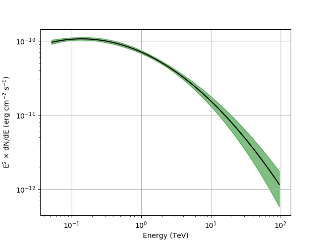
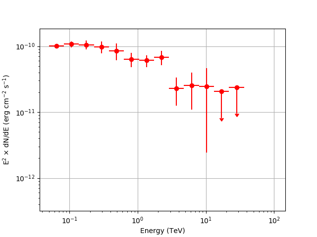

.. _hess_dr1_data:

Joint analysis of H.E.S.S. and Fermi data
=========================

  .. admonition:: What you will learn

     You will learn how to **jointly analyse data from H.E.S.S. and Fermi**.

In this tutorial you will learn how to jointly analyse data observed with H.E.S.S. and the
Fermi-LAT. This follows the same procedure illustrated in `this section <../howto/howto_combine_instruments>`_.

Prepare Fermi-LAT data
^^^^^^^^^^^^^^^^^^^^^^

For this tutorial you need to gather data for a source available in
the H.E.S.S. public data release, the Crab nebula.
The preparation of Fermi-LAT data can be adapted from
`this section <..howto/howto_fermi_prepare>`_. Get Source Class LAT data from the
Crab in the energy range 50-800 GeV. Apply a zenith angle cut at 105
deg. Then bin them on a 60x60 pixel
grid with 0.05 deg step, and on a logarithmic energy grid with 15 bins
from 50 GeV to 800 GeV, and calculate livetime cube, exposure map, and
diffuse model source maps. The results shown here correspond to P8R3 LAT
data covering the Fermi Mission Elapsed Time (MET) between 239557417 s
and 565315205 s, analysed using the fermitools 1.0.3. To run the tutorial faster you can select a shorter dataset. 

Prepare H.E.S.S. data
^^^^^^^^^^^^^^^^

We will use the On/Off observations generated in `this section <classical>`_.

Combining the observations
^^^^^^^^^^^^^^^^^^^^^^^^^^

Now you have all the data and hand. You have to create an
:ref:`observation definition file <glossary_obsdef>`
to combine the data for an analysis:

.. code-block:: xml

  <?xml version="1.0" standalone="no"?>
  <observation_list title="observation library">
    <observation name="Crab" id="000001" instrument="LAT">
      <parameter name="CountsMap"    file="srcmaps.fits"/>
      <parameter name="ExposureMap"  file="expmap.fits"/>
      <parameter name="LiveTimeCube" file="ltcube.fits"/>
      <parameter name="IRF"          value="P8R2_SOURCE_V6"/>
    </observation>
    <observation name="Crab" id="000002" instrument="HESSOnOff" statistic="wstat">
      <parameter name="Pha_on" file="onoff_stacked_pha_on.fits" />
      <parameter name="Pha_off" file="onoff_stacked_pha_off.fits" />
      <parameter name="Arf" file="onoff_stacked_arf.fits" />
      <parameter name="Rmf" file="onoff_stacked_rmf.fits" />
    </observation>
  </observation_list>

The ``instrument`` attribute distinguishes between the two
instruments. Note how we have specified thet ``statistic`` attribute
so that WSTAT will be used by all likelihood tools. Note how we are
using different analysis methods for the LAT and H.E.S.S. data, that
is binned and On/Off, respectively. Those are the standard analysis
methods for each instrument, but you can use any other method for
H.E.S.S. data, such as binned or unbinned. For H.E.S.S. you may choose
another analysis method, such as unbinned or binned.

Fit a spectral model to the data
^^^^^^^^^^^^^^^^^^^^^^^^^^^^^^^^^^^^^^^

You have to define a
:ref:`model definition file <glossary_moddef>`
that will be used to model the events for both observations.
The model that will be used in this analysis is shown below:

.. code-block:: xml

  <?xml version="1.0" standalone="no"?>
  <source_library title="source library">
    <source type="PointSource" name="Crab">
      <spectrum type="LogParabola">
        <parameter name="Prefactor"   scale="1e-17" value="3.23"   min="1e-07" max="10000.0" free="1"/>
        <parameter name="Index"       scale="-1"    value="2.47" min="0.5"   max="+5.0"   free="1"/>
        <parameter name="Curvature"   scale="-1"    value="0.24"   min="-5.0"  max="+5.0"   free="1"/>
        <parameter name="PivotEnergy" scale="1e6"   value="1.0"     min="0.01"  max="1000.0" free="0"/>
      </spectrum>
      <spatialModel type="PointSource">
        <parameter name="RA"  scale="1.0" value="83.633" min="-360" max="360" free="0"/>
        <parameter name="DEC" scale="1.0" value="22.015" min="-90"  max="90"  free="0"/>
      </spatialModel>
    </source>
    <source type="DiffuseSource" name="Galactic_diffuse" instrument="LAT">
      <spectrum type="Constant">
        <parameter name="Normalization" scale="1.0" value="1.0" min="0.1" max="10.0" free="1"/>
      </spectrum>
      <spatialModel type="DiffuseMapCube" file="gll_iem_v06.fits">
        <parameter name="Normalization" scale="1.0" value="1.0" min="0.1" max="10.0" free="0"/>
      </spatialModel>
    </source>
    <source type="DiffuseSource" name="Isotropic_diffuse"  instrument="LAT">
      <spectrum type="FileFunction" file="iso_P8R2_SOURCE_V6_v06.txt">
        <parameter name="Normalization" scale="1.0" value="1.0" min="0.0" max="1000.0" free="0"/>
      </spectrum>
      <spatialModel type="DiffuseIsotropic">
        <parameter name="Value" scale="1.0" value="1.0" min="0.0" max="10.0" free="0"/>
      </spatialModel>
    </source>
  </source_library>

The model contains a point source located at the position of the Crab
with a log-parabola spectrum. It does not have any ``instrument`` attribute, which means that it applies to all instruments.  In addition, the model contains two ``DiffuseSource``
components that are only applied for Fermi-LAT observations, which is indicated
by their ``instrument="LAT"`` attribute. Both components model the diffuse
background and are the same that were included in the generation of the source maps (the names need to coincide).

Now you can fit the model to the data using  :ref:`ctlike`:

.. code-block:: bash

		$ ctlike 
		Input event list, counts cube or observation definition XML file [] joint_observations.xml
		Input model definition XML file [] joint_models.xml
		Output model definition XML file [] joint_results.xml

The results are: prefactor (for 1 TeV pivot energy) (4.4±0.2)×10−11
photons cm−2 s−1 TeV−1, spectral index 2.42±0.04, and curvature
-0.106±0.018. They are broadly consistent with results from published
studies, e.g., `MAGIC collaboration (2015)
<http://adsabs.harvard.edu/abs/2015JHEAp...5...30A>`_.
We have used an energy threshold of 50 GeV to avoid contamination from
the Crab pulsar. The Fermi analysis can be extended to lower energies
for example by selecting photons based on the pulsar phase.

Butterfly and SED
^^^^^^^^^^^^^^^^^^^^^^^^^^^^^^^^^^^^^^^

We can now generate the butterfly

.. code-block:: bash
		
		$ ctbutterfly
		Input event list, counts cube or observation definition XML file [events.fits] joint_observations.xml 
		Source of interest [Crab] 
		Input model definition XML file [$CTOOLS/share/models/crab.xml] joint_results.xml 
		Lower energy limit (TeV) [0.1] 0.05
		Upper energy limit (TeV) [100.0] 
		Output ASCII file [butterfly.txt]

and spectral energy distribution (SED)

.. code-block:: bash

		$ csspec 
		Input event list, counts cube, or observation definition XML file [joint_observations.xml] 
		Input model definition XML file [joint_results.xml] 
		Source name [Crab] 
		Spectrum generation method (SLICE|NODES|AUTO) [AUTO] 
		Algorithm for defining energy bins (FILE|LIN|LOG) [LOG] 
		Start value for first energy bin in TeV [0.1] 0.05
		Stop value for last energy bin in TeV [100.0] 
		Number of energy bins (1-200) [10] 15
		Output spectrum file [spectrum.fits]

Below you can see the resulting butterfly and SED.

   *Spectral energy distribution of the Crab nebula from joint analysis of H.E.S.S. and Fermi data*

.. note::
   These figures were created by typing:

   .. code-block:: bash

	$ $CTOOLS/share/examples/python/show_butterfly.py butterfly.txt

        $ $CTOOLS/share/examples/python/show_spectrum.py spectrum.fits

The SED is not shown above 40 TeV because the low counting statistics
make the results uninteresting.
