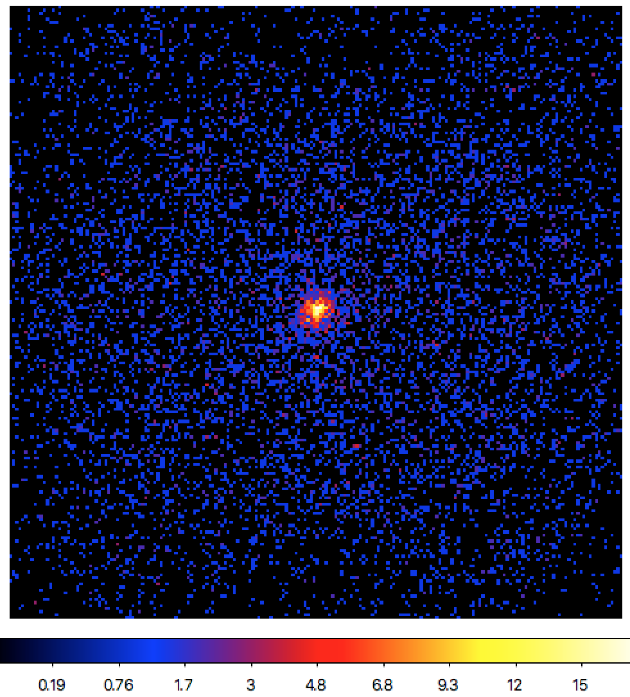
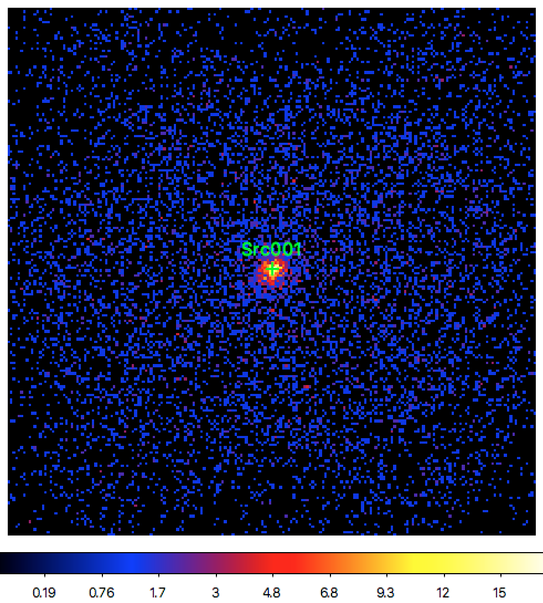

.. _hess_dr1_sky_map:

Generating a sky map and finding sources
----------------------------------------

  .. admonition:: What you will learn

     You will learn **how to generate a sky map from the selected events**
     and **how to find potential sources in the data**.

As next step you will make a sky map of the selected events to inspect what's
in the data.
You do this using the :ref:`ctskymap` tool.
Since the data correspond to observations of the Crab nebula you should centre
the sky map on this source.
The energy limits of the sky map should be set to the energy interval of the
data (0.66 - 100 TeV).
To create the sky map, type:

.. code-block:: bash

   $ ctskymap debug=yes
   Input event list or observation definition XML file [events.fits] obs_crab_selected.xml
   Coordinate system (CEL - celestial, GAL - galactic) (CEL|GAL) [CEL]
   Projection method (AIT|AZP|CAR|GLS|MER|MOL|SFL|SIN|STG|TAN) [CAR]
   First coordinate of image center in degrees (RA or galactic l) (0-360) [83.63]
   Second coordinate of image center in degrees (DEC or galactic b) (-90-90) [22.01]
   Image scale (in degrees/pixel) [0.02]
   Size of the X axis in pixels [200]
   Size of the Y axis in pixels [200]
   Lower energy limit (TeV) [0.1] 0.66
   Upper energy limit (TeV) [100.0]
   Background subtraction method (NONE|IRF|RING) [NONE]
   Output skymap file [skymap.fits]

The resulting sky map, displayed using
`ds9 <http://ds9.si.edu>`_ with a square-root color scaling, is shown below:

   *Sky map of the selected events centred on the Crab nebula*

Based on the sky map you can now extract a model for all potentially significant
sources in the data.
You do this using the :ref:`cssrcdetect` script, and to extract only significant
sources, you should set the detection threshold for example to 5 sigma.
For convenience, the :ref:`cssrcdetect` script can also add a background model
component to the output
:ref:`model definition XML file <glossary_moddef>`.
Since the H.E.S.S. Instrument Response Function does not include a background
template, the ``IRF`` option will not work.
While sophisticated methods for the analysis of H.E.S.S. data still need to
be developed, you may try the effective area model ``AEFF`` that uses the
effective area as spatial template for the background component.
So, now type:

.. code-block:: bash

   $ cssrcdetect
   Input sky map file [skymap.fits]
   Source model type (POINT) [POINT]
   Background model type (NONE|IRF|AEFF|CUBE|RACC) [NONE] AEFF
   Detection threshold (Gaussian sigma) [5.0]
   Correlation kernel radius (deg) [0.1]
   Output model definition XML file [models.xml] crab_models.xml
   Output DS9 region file [ds9.reg] crab.reg

Below an excerpt of the ``cssrcdetect.log`` log file.
Only one significant source was found, and its position is consistent with the
Crab nebula.
This is also illustrated in the figure below where the region file
``crab.reg`` that was produced by :ref:`cssrcdetect` was overlaid with
`ds9 <http://ds9.si.edu>`_
on the sky map.

.. code-block:: none

   2018-09-11T20:32:20: +==================+
   2018-09-11T20:32:20: | Source detection |
   2018-09-11T20:32:20: +==================+
   2018-09-11T20:32:20: === Iteration 1 ===
   2018-09-11T20:32:20:  Map maximum ...............: 11.1003120131
   2018-09-11T20:32:20:  Src001 position ...........: (RA,Dec)=(83.6192131308071,22.0199996472185)
   2018-09-11T20:32:20: === Iteration 2 ===
   2018-09-11T20:32:20:  Map maximum ...............: None above threshold

   *Sky map of the selected events centred on the Crab nebula*

The
:ref:`model definition file <glossary_moddef>`
``crab_models.xml`` that was generated by :ref:`cssrcdetect` is shown below.
It contains a point source ``Src001`` at the position of the Crab nebula
and an effective area background model scaled by a spectral power law as
background component.

.. code-block:: xml

   <?xml version="1.0" encoding="UTF-8" standalone="no"?>
   <source_library title="source library">
     <source name="Src001" type="PointSource">
       <spectrum type="PowerLaw">
         <parameter name="Prefactor" value="1" error="0" scale="5.7e-18" min="0" free="1" />
         <parameter name="Index" value="1" error="-0" scale="-2.48" min="-4.03225806451613" max="4.03225806451613" free="1" />
         <parameter name="PivotEnergy" value="1" scale="300000" free="0" />
       </spectrum>
       <spatialModel type="PointSource">
         <parameter name="RA" value="83.6192131308071" error="0" scale="1" free="1" />
         <parameter name="DEC" value="22.0199996472185" error="0" scale="1" free="1" />
       </spatialModel>
     </source>
     <source name="Background" type="CTAAeffBackground">
       <spectrum type="PowerLaw">
         <parameter name="Prefactor" value="1" error="0" scale="1e-13" min="0" free="1" />
         <parameter name="Index" value="1" error="-0" scale="-2.5" min="-4" max="4" free="1" />
         <parameter name="PivotEnergy" value="1" scale="1000000" free="0" />
       </spectrum>
     </source>
   </source_library>
