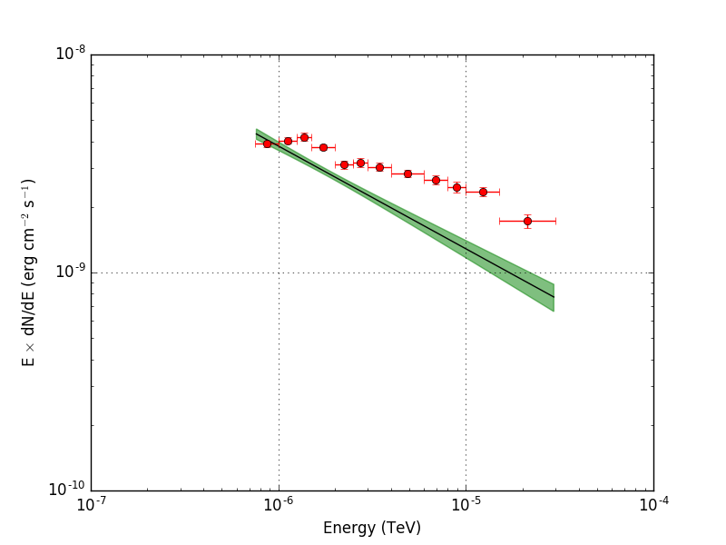

.. _howto_comptel_butterfly:

Generate a butterfly diagram for a model component
--------------------------------------------------

  .. admonition:: What you will learn

     You will learn how to use :ref:`ctbutterfly` to create a butterfly diagram
     for a model component from COMPTEL data.

A butterfly diagram shows the envelope of all spectral models that are
statistically compatible with the data. You can create such a butterfly
diagram for the Crab using the :ref:`ctbutterfly` tool by providing
the
:ref:`model definition file <glossary_moddef>`
output file from :ref:`ctlike` as input:

.. code-block:: bash

   $ ctbutterfly fit=yes
   Input event list, counts cube or observation definition XML file [events.fits] obs.xml
   Source of interest [Crab]
   Input model definition XML file [$CTOOLS/share/models/crab.xml] models.xml
   Start value for first energy bin in TeV [0.1] 0.00000075
   Stop value for last energy bin in TeV [100.0] 0.00003
   Output ASCII file [butterfly.txt]

:ref:`ctbutterfly` produces the ASCII file ``butterfly.txt`` that contains
the envelope of the butterfly diagram. The figure below gives a graphical
representation of the envelope. The red data points show the combined
Crab nebular and pulsar spectrum from
`Kuiper et al. 2001, A&A, 378, 918 <http://cdsads.u-strasbg.fr/abs/2001A%26A...378..918K>`_
for comparison.

   *Butterfly diagram of the fitted Crab spectrum*
