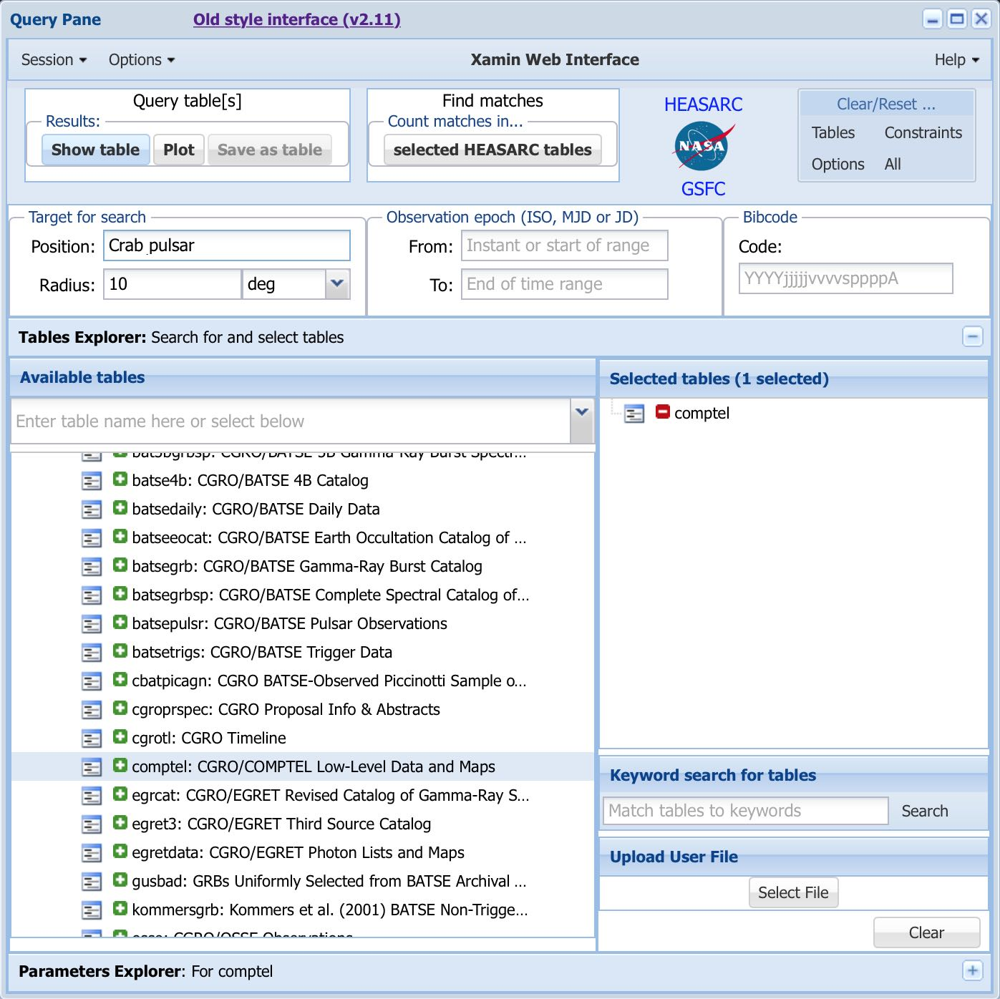
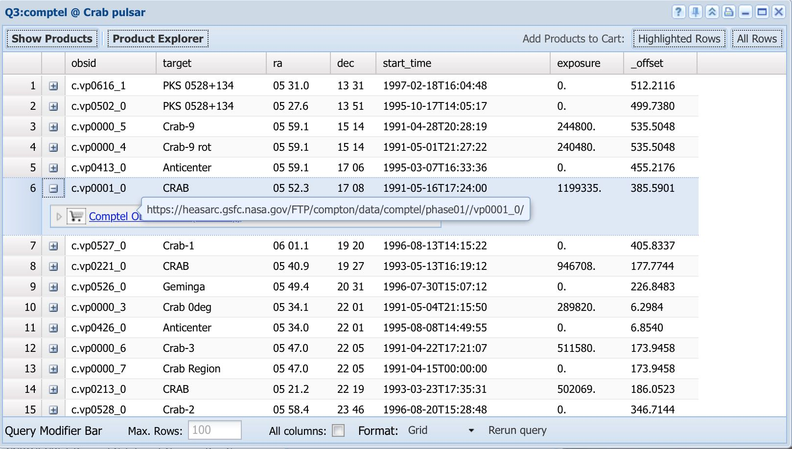
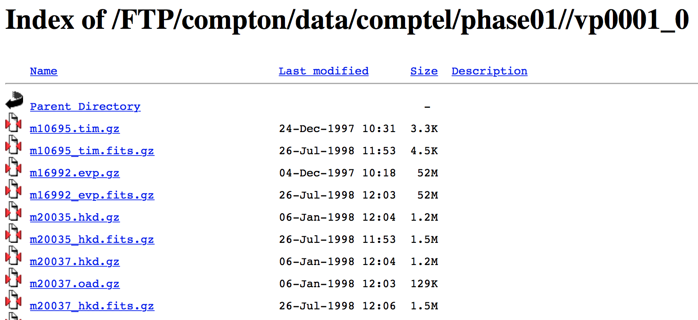

.. _howto_comptel_download:

Download COMPTEL data
---------------------

  .. admonition:: What you will learn

     You will learn how to prepare COMPTEL data for an analysis with
     ctools.

COMPTEL data can be downloaded from the HEASARC data server through the
`Xamin Web Interface <https://heasarc.gsfc.nasa.gov/xamin/>`_.
As example, the figure below shows a request for data around the Crab pulsar.

   *Xamin Web Interface to query COMPTEL data*

Click on the button ``Show table`` in the upper left which opens a new
window that shows all available data sets. Click on the ``+`` symbol of a
dataset to get a link to the data archive directory.

   *Available COMPTEL data for the Crab region*

Clicking on the link brings you to the archive directory, shown below.

   *COMPTEL data archive for viewing period 0001*

The COMPTEL obervations were divided in so-called viewing periods (``vp``) of
typically 14 days. The Crab nebula was observed during many viewing periods.
In this example, the data for the viewing period 0001 was selected. From the
archive you now have to download the following files:

* ``m32171_drx.fits.gz`` - Exposure map
* ``m34997_drg.fits.gz`` - Geometry factors (needed for response computation)
* ``m50438_dre.fits.gz`` - Counts cube for energy interval 0.75 - 1 MeV
* ``m50439_dre.fits.gz`` - Counts cube for energy interval 1 - 3 MeV
* ``m50440_dre.fits.gz`` - Counts cube for energy interval 3 - 10 MeV
* ``m50441_dre.fits.gz`` - Counts cube for energy interval 10 - 30 MeV

The COMPTEL data are usually processed for four standard energy intervals,
and a 3-dimensional counts cube exists for each of these energy intervals.
Counts cubes are always suffixed ``_dre``, exposures ``_drx`` and geometry
factors ``_drg``.

  .. warning::

     The files in the HEASARC archive have a ``.gz`` extension but apparently
     the files are not gzipped. You may however leave the file names as they
     are and specify later the file names without the ``.gz`` extension since
     reading of gzipped files is transparent for ctools.
