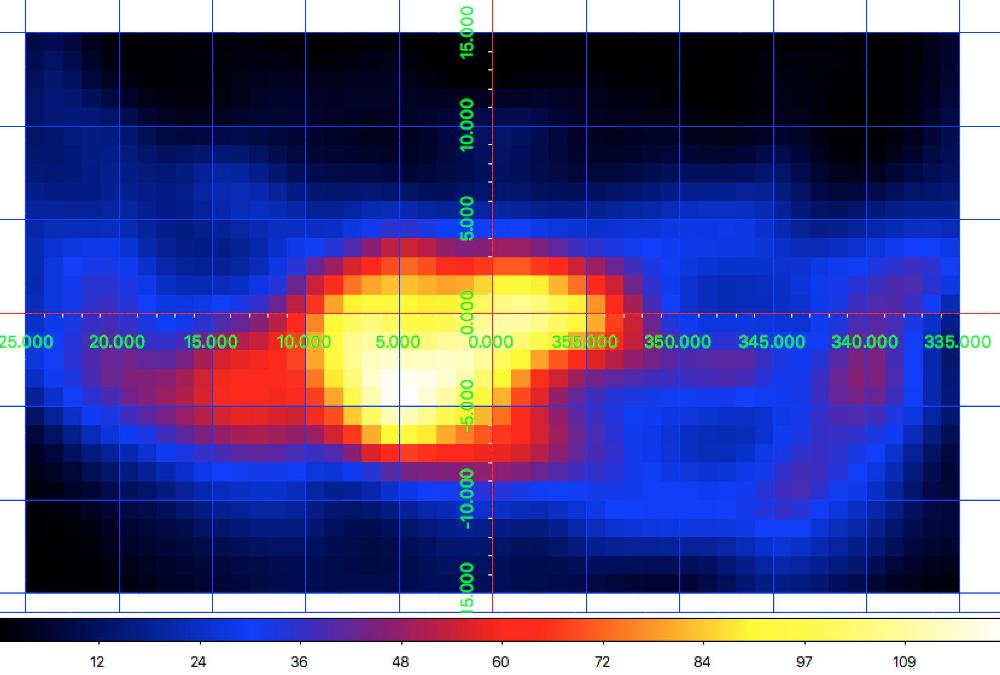
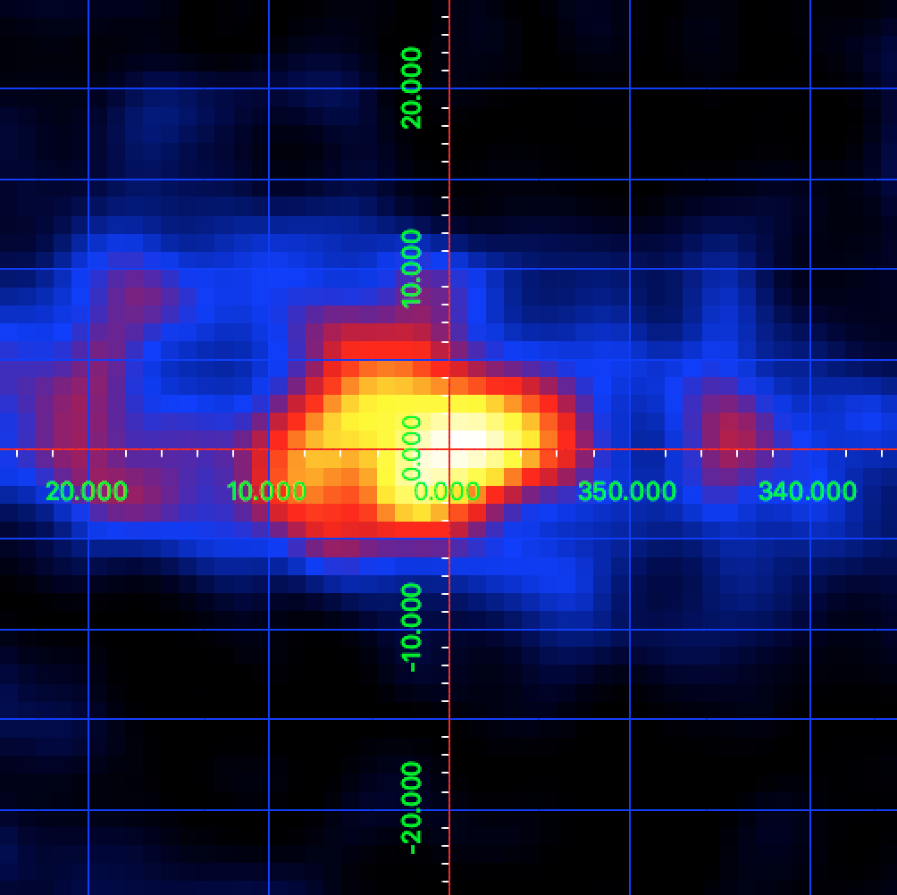

.. _howto_comptel_dri:

Generating your own event selection
-----------------------------------

  .. admonition:: What you will learn

     You will learn how to use the GammaLib classes to generate your own
     data cubes and response functions for a COMPTEL analysis.

The data in the
`HEASARC archive <https://heasarc.gsfc.nasa.gov/xamin/>`_
comprises counts cubes for the standard COMPTEL energy ranges (0.75-1 MeV,
1-3 MeV, 3-10 MeV and 10-30 MeV) per viewing period. In case that you want
to analyse a different energy range, or that you want to perform a different
event selection, you need to create ``DRE``, ``DRG``, ``DRB`` and ``DRX``
data and the corresponding ``IAQ`` response function yourself. You can do
this with GammaLib.

Let's assume you want to make a 1.8 MeV line map of the Galactic centre.
You can use for this the data of the COMPTEL viewing period 16 in phase 1 of
the mission. Go to the
`HEASARC archive <https://heasarc.gsfc.nasa.gov/xamin/>`_
and download the ``EVP``, ``TIM`` and ``OAD`` datasets. Once this is done,
create the following
:ref:`observation definition file <glossary_obsdef>`:

.. code-block:: xml

   <?xml version="1.0" standalone="no"?>
   <observation_list title="observation library">
     <observation name="GC" id="000160" instrument="COM">
       <parameter name="EVP" file="$COMDATA/phase01/vp0016_0/m28846_evp.fits"/>
       <parameter name="TIM" file="$COMDATA/phase01/vp0016_0/m11765_tim.fits"/>
       <parameter name="OAD" file="$COMDATA/phase01/vp0016_0/m20745_oad.fits"/>
       <parameter name="OAD" file="$COMDATA/phase01/vp0016_0/m20750_oad.fits"/>
       <parameter name="OAD" file="$COMDATA/phase01/vp0016_0/m20753_oad.fits"/>
       <parameter name="OAD" file="$COMDATA/phase01/vp0016_0/m20759_oad.fits"/>
       <parameter name="OAD" file="$COMDATA/phase01/vp0016_0/m20760_oad.fits"/>
       <parameter name="OAD" file="$COMDATA/phase01/vp0016_0/m20761_oad.fits"/>
       <parameter name="OAD" file="$COMDATA/phase01/vp0016_0/m20762_oad.fits"/>
       <parameter name="OAD" file="$COMDATA/phase01/vp0016_0/m20764_oad.fits"/>
       <parameter name="OAD" file="$COMDATA/phase01/vp0016_0/m20770_oad.fits"/>
       <parameter name="OAD" file="$COMDATA/phase01/vp0016_0/m20771_oad.fits"/>
       <parameter name="OAD" file="$COMDATA/phase01/vp0016_0/m20772_oad.fits"/>
       <parameter name="OAD" file="$COMDATA/phase01/vp0016_0/m20785_oad.fits"/>
       <parameter name="OAD" file="$COMDATA/phase01/vp0016_0/m20786_oad.fits"/>
       <parameter name="OAD" file="$COMDATA/phase01/vp0016_0/m20787_oad.fits"/>
       <parameter name="OAD" file="$COMDATA/phase01/vp0016_0/m20788_oad.fits"/>
       <parameter name="OAD" file="$COMDATA/phase01/vp0016_0/m20789_oad.fits"/>
     </observation>
   </observation_list>

.. note::
   There exist two formats for the
   :ref:`observation definition file <glossary_obsdef>`
   for COMPTEL data, one that describes the locations of the COMPTEL
   data space cubes and response functions, and one that desribes
   the location of an ``EVP`` event list, a ``TIM`` Good Time
   Interval file, and an arbitrary number of ``OAD`` Orbit Aspect
   Data files. In general there exists one ``OAD`` per day, while
   there is one ``EVP`` event file and one ``TIM`` Good Time Interval
   file per viewing period.

   In the example above, the environment variable ``$COMDATA`` was set
   to the root directory of the COMPTEL archive.

Now you are ready to generate the ``DRE``, ``DRG``, ``DRB``, ``DRX`` and
``IAQ`` datasets that you need for a ctools analysis of COMPTEL data.
This will take a few minutes. Start
`Python <https://www.python.org>`_
in your terminal and type the following:

.. code-block:: python

    # You need GammaLib, of course ;)
    import gammalib

    # Create sky map for the definition of the DRE and DRG data cubes
    cube = gammalib.GSkyMap('TAN', 'GAL', 0.0, 20.0, 1.0, 1.0, 80, 80)

    # Create sky map for the definition of the DRX exposure map
    expo = gammalib.GSkyMap('CAR', 'GAL', 0.0, 0.0, 1.0, 1.0, 360, 180)

    # Allocate DRE, DRG and DRX. DRE and DRG have a 3rd Phibar dimension, starting at 0.0 deg,
    # with a binsize of 2.0 deg, and 25 Phibar layers.
    dre = gammalib.GCOMDri(cube, 0.0, 2.0, 25)
    drg = gammalib.GCOMDri(cube, 0.0, 2.0, 25)
    drx = gammalib.GCOMDri(expo)

    # Set DRE energy range to 1.7-1.9 MeV, DRG and DRX are energy independent
    dre.ebounds(gammalib.GEbounds(gammalib.GEnergy(1.7, 'MeV'),
                                  gammalib.GEnergy(1.9, 'MeV')))

    # Load observation definition XML file 'obs.xml' (the file you created above)
    obsdef = gammalib.GObservations('obs.xml')

    # Compute DRE, DRG and DRX for the first observation in the XML file
    dre.compute_dre(obsdef[0])
    drg.compute_drg(obsdef[0])
    drx.compute_drx(obsdef[0])

    # Save DRE, DRG and DRX ('True' indicates to overwrite any existing file)
    dre.save('dre.fits', True)
    drg.save('drg.fits', True)
    drx.save('drx.fits', True)

    # Load DRE and DRG to generate a DRB background model cube
    dre = gammalib.GCOMDri('dre.fits')
    drb = gammalib.GCOMDri('drg.fits')

    # Normalise DRB on the Phibar distribution of the DRE cube
    npix = dre.nchi() * dre.npsi()
    for k in range(dre.nphibar()):
        sum_dre = 0.0
        sum_drb = 0.0
        for i in range(npix):
            index    = i + k * npix
            sum_dre += dre[index]
            sum_drb += drb[index]
        if sum_drb > 0:
            for i in range(npix):
                index       = i + k * npix
                drb[index] *= sum_dre / sum_drb

    # Save DRB
    drb.save('drb.fits', True)

    # Initialise IAQ that will hold the response function
    iaq = gammalib.GCOMIaq(55.0, 1.0, 50.0, 2.0)

    # Compute IAQ for a line energy of 1.809 MeV and an energy band of 1.7-1.9 MeV
    iaq.set(gammalib.GEnergy(1.809, 'MeV'),
            gammalib.GEbounds(gammalib.GEnergy(1.7, 'MeV'),
                              gammalib.GEnergy(1.9, 'MeV')))

    # Save IAQ and you are done
    iaq.save('iaq.fits', True)

Now you have everything at hand to perform a COMPTEL maximum likelihood
analysis. For that purpoe you need to gather all the datasets that you
just created in a new
:ref:`observation definition file <glossary_obsdef>`
that should look as follows:

.. code-block:: xml

   <?xml version="1.0" standalone="no"?>
   <observation_list title="observation library">
     <observation name="GC" id="000160" instrument="COM">
       <parameter name="DRE" file="dre.fits"/>
       <parameter name="DRB" file="drb.fits"/>
       <parameter name="DRG" file="drg.fits"/>
       <parameter name="DRX" file="drx.fits"/>
       <parameter name="IAQ" value="iaq.fits"/>
     </observation>
   </observation_list>

.. warning::
   Be aware that the attribute for the ``IAQ`` parameter is ``value`` and
   not ``file`` since the ``IAQ`` parameter is not necessarily a file
   but can be also a response name of the calibration database.

Before doing a model fit you need a model. We included one in the ctools package
that you can find at ``$CTOOLS/share/models/comptel_howto_gc.xml``. Here the
first few lines of this model:

.. code-block:: xml

   <?xml version="1.0" encoding="UTF-8" standalone="no"?>
   <source_library title="source library">
     <source name="GC" type="PointSource" tscalc="1">
       <spectrum type="Constant">
         <parameter name="Normalization" scale="1.0e-5" value="1.0"  min="-100.0" max="100.0" free="1"/>
       </spectrum>
       <spatialModel type="PointSource">
         <parameter name="RA"  scale="1.0" value="266.40" min="-360" max="360" free="0"/>
         <parameter name="DEC" scale="1.0" value="-28.94" min="-90"  max="90"  free="0"/>
       </spatialModel>
     </source>
     <source name="Background" type="DRBFitting" instrument="COM">
       <node>
         <parameter name="Phibar"        value="9"   scale="1" min="0" max="50"   free="0" />
         <parameter name="Normalization" value="1.0" scale="1" min="0" max="1000" free="1" />
       </node>
       ...
       <node>
         <parameter name="Phibar"        value="49"  scale="1" min="0" max="50"   free="0" />
         <parameter name="Normalization" value="1.0" scale="1" min="0" max="1000" free="1" />
       </node>
     </source>
   </source_library>

This file contains a single point source at the position of the Galactic
Centre. The spectral model is a simple constant normalisation that will
return the gamma-ray line flux in units of
:math:`{\rm photons}\,{\rm cm}^{-2}\,{\rm s}^{-1}`.
For the background we do a Phibar fitting of the ``DRB`` cube. Since the
first four layers of the ``DRE`` cube are empty we start the nodes at the
fifth layer which corresponds to a Phibar value of 9 degrees. There are
subsequent nodes spaced by 2 degrees (not shown) up to a Phibar value of
49 degrees.

Now it's time for model fitting. You can produce for example a Test Statistic
map of the region around the Galactic centre as follows:

.. code-block:: bash

   $ cttsmap
   Input event list, counts cube or observation definition XML file [events.fits] obs_dri.xml
   Test source name [Crab] GC
   Input model definition XML file [$CTOOLS/share/models/crab.xml] $CTOOLS/share/models/comptel_howto_gc.xml
   Coordinate system (CEL - celestial, GAL - galactic) (CEL|GAL) [CEL] GAL
   Projection method (AIT|AZP|CAR|GLS|MER|MOL|SFL|SIN|STG|TAN) [CAR]
   First coordinate of image center in degrees (RA or galactic l) (0-360) [83.63] 0.0
   Second coordinate of image center in degrees (DEC or galactic b) (-90-90) [22.01] 0.0
   Image scale (in degrees/pixel) [0.02] 1.0
   Size of the X axis in pixels [200] 50
   Size of the Y axis in pixels [200] 30
   Output Test Statistic map file [tsmap.fits]

Below is the resulting Test Statistic map that shows 1.8 MeV emission
following the Galactic plane and peaking near the Galactic centre.

   *1.8 MeV Test Statistic map for COMPTEL viewing period 16 of the Galactic Centre*

It is left to you as an exercise to extend this example. To get a better
statistics you may for example combine observations. For that purpose you
can add the ``DRI`` datasets of multiple observations into single ``DRE``,
``DRG``, ``DRB`` and ``DRX`` datasets,
that's the way how the COMPTEL analysis was done. You can however also leave
the ``DRI`` datasets separate and combine their description in the
:ref:`observation definition file <glossary_obsdef>`.
To combine for example the data of viewing periods 5, 7.5, 13, 16 and 27
the
:ref:`observation definition file <glossary_obsdef>`
should look like this:

.. code-block:: xml

   <?xml version="1.0" standalone="no"?>
   <observation_list title="observation library">
     <observation name="GC" id="000050" instrument="COM">
       <parameter name="DRE" file="dre_0050.fits"/>
       <parameter name="DRB" file="drb_0050.fits"/>
       <parameter name="DRG" file="drg_0050.fits"/>
       <parameter name="DRX" file="drx_0050.fits"/>
       <parameter name="IAQ" value="iaq.fits"/>
     </observation>
     <observation name="GC" id="000075" instrument="COM">
       <parameter name="DRE" file="dre_0075.fits"/>
       <parameter name="DRB" file="drb_0075.fits"/>
       <parameter name="DRG" file="drg_0075.fits"/>
       <parameter name="DRX" file="drx_0075.fits"/>
       <parameter name="IAQ" value="iaq.fits"/>
     </observation>
     <observation name="GC" id="000130" instrument="COM">
       <parameter name="DRE" file="dre_0130.fits"/>
       <parameter name="DRB" file="drb_0130.fits"/>
       <parameter name="DRG" file="drg_0130.fits"/>
       <parameter name="DRX" file="drx_0130.fits"/>
       <parameter name="IAQ" value="iaq.fits"/>
     </observation>
     <observation name="GC" id="000160" instrument="COM">
       <parameter name="DRE" file="dre_0160.fits"/>
       <parameter name="DRB" file="drb_0160.fits"/>
       <parameter name="DRG" file="drg_0160.fits"/>
       <parameter name="DRX" file="drx_0160.fits"/>
       <parameter name="IAQ" value="iaq.fits"/>
     </observation>
     <observation name="GC" id="000270" instrument="COM">
       <parameter name="DRE" file="dre_0270.fits"/>
       <parameter name="DRB" file="drb_0270.fits"/>
       <parameter name="DRG" file="drg_0270.fits"/>
       <parameter name="DRX" file="drx_0270.fits"/>
       <parameter name="IAQ" value="iaq.fits"/>
     </observation>
   </observation_list>

The corresponding Test Statistic map is shown below.

   *1.8 MeV Test Statistic map for COMPTEL viewing periods 5, 7.5, 13, 16 and 27 of the Galactic Centre*
