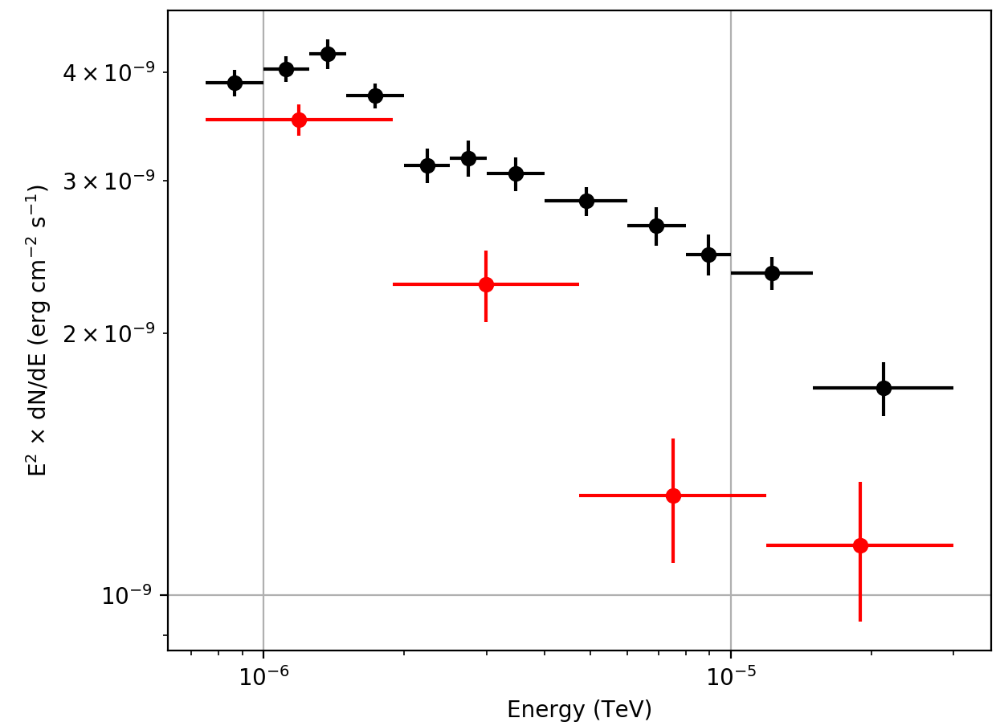

.. _howto_comptel_spectrum:

Generate a spectral energy distribution for a source
----------------------------------------------------

  .. admonition:: What you will learn

     You will learn how to use :ref:`ctlike` to derive the spectral energy
     density of a source from COMPTEL data.

So far the :ref:`csspec` script does not work for COMPTEL data, but you
will learn here a method that you can use to derive the spectrum of any
source using COMPTEL data. For this you have to modify the
:ref:`model definition file <glossary_moddef>`
and replace the spectral component of the Crab by a node function:

.. code-block:: xml

   <?xml version="1.0" standalone="no"?>
   <source_library title="source library">
     <source name="Crab" type="PointSource" tscalc="1">
       <spectrum type="NodeFunction">
         <node>
           <parameter name="Energy" value="0.75" scale="1" free="0" />
           <parameter name="Intensity" value="0.00177777777777778" error="0" scale="1" min="1e-30" free="1" />
         </node>
         <node>
           <parameter name="Energy" value="2.56496392001505" scale="1" free="0" />
           <parameter name="Intensity" value="0.000151997861926818" error="0" scale="1" min="1e-30" free="1" />
         </node>
         <node>
           <parameter name="Energy" value="8.7720532146386" scale="1" free="0" />
           <parameter name="Intensity" value="1.29956343920572e-05" error="0" scale="1" min="1e-30" free="1" />
         </node>
         <node>
           <parameter name="Energy" value="30" scale="1" free="0" />
           <parameter name="Intensity" value="1.11111111111111e-06" error="0" scale="1" min="1e-30" free="1" />
         </node>
       </spectrum>
       <spatialModel type="PointSource">
         <parameter name="RA"  scale="1.0" value="83.6331" min="-360" max="360" free="0"/>
         <parameter name="DEC" scale="1.0" value="22.0145" min="-90"  max="90"  free="0"/>
       </spatialModel>
     </source>
     <source name="Background(0.75-1.0)MeV" type="DRBFitting" instrument="COM" id="100001">
       <node>
         <parameter name="Phibar"        scale="1.0" value="1.0"  min="0.0" max="50.0"   free="0"/>
         <parameter name="Normalization" scale="1.0" value="0.0"  min="0.0" max="1000.0" free="0"/>
       </node>
       ...
   </source_library>

Instead of the power law the model now contains a node function with four
intensity nodes between 0.75 MeV and 30 MeV, and the :ref:`ctlike` tool will
now adjust the intensities of each of the nodes which will result in a
spectrum. To do this type now:

.. code-block:: bash

   $ ctlike
   Input event list, counts cube or observation definition XML file [obs.xml]
   Input model definition XML file [models.xml] model_nodes.xml
   Output model definition XML file [crab_results.xml] crab_nodes_results.xml

This will produce the
:ref:`model definition file <glossary_moddef>`
``crab_nodes_results.xml`` with the intensities of the fitted source at
each energy. The results are displayed graphically below. The red data points
show the combined Crab nebular and pulsar spectrum from
`Kuiper et al. 2001, A&A, 378, 918 <http://cdsads.u-strasbg.fr/abs/2001A%26A...378..918K>`_
for comparison.

   *Spectrum of the Crab derived using a node function*
..

  .. note::

     The ``NodeFunction`` spectral models implements a piece-wise power law
     that is defined by the intensity values at each node.
