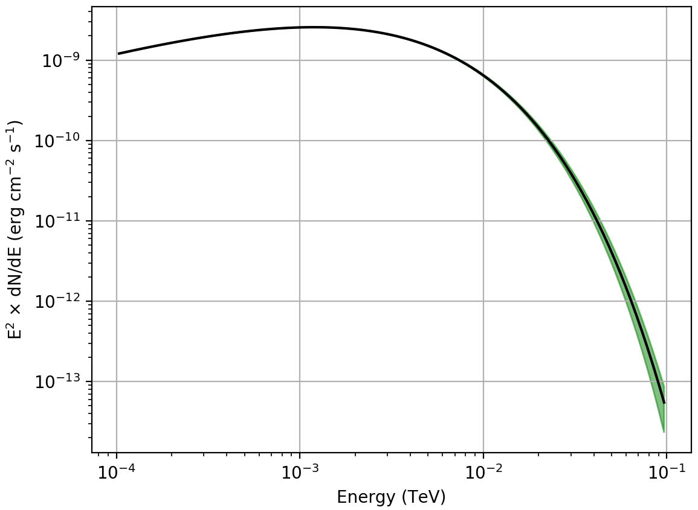

.. _howto_fermi_butterfly:

Generate a butterfly diagram for a model component
--------------------------------------------------

  .. admonition:: What you will learn

     You will learn how to use :ref:`ctbutterfly` to create a butterfly diagram
     for a model component from Fermi-LAT data.

A butterfly diagram shows the envelope of all spectral models that are
statistically compatible with the data. You can create such a butterfly
diagram for the Vela pulsar using the :ref:`ctbutterfly` tool by providing
the
:ref:`model definition file <glossary_moddef>`
output file from :ref:`ctlike` as input:

.. code-block:: bash

   $ ctbutterfly
   Input event list, counts cube or observation definition XML file [events.fits] obs.xml
   Source of interest [Crab] Vela
   Input model definition XML file [$CTOOLS/share/models/crab.xml] vela_results.xml
   Start value for first energy bin in TeV [0.1] 0.0001
   Stop value for last energy bin in TeV [100.0] 0.1
   Output ASCII file [butterfly.txt]

:ref:`ctbutterfly` produces the ASCII file ``butterfly.txt`` that contains
the envelope of the butterfly diagram. The figure below gives a graphical
representation of the envelope.

   *Butterfly diagram of the fitted Vela pulsar spectrum*
..

  .. note::

     The figure was created using the ``show_butterfly.py`` script that is
     located in the ctools example folder. The example script requires the
     `matplotlib <http://matplotlib.org>`_ Python module for display.
     You may reproduce the plot by typing

     .. code-block:: bash

        $ $CTOOLS/share/examples/python/show_butterfly.py butterfly.txt
