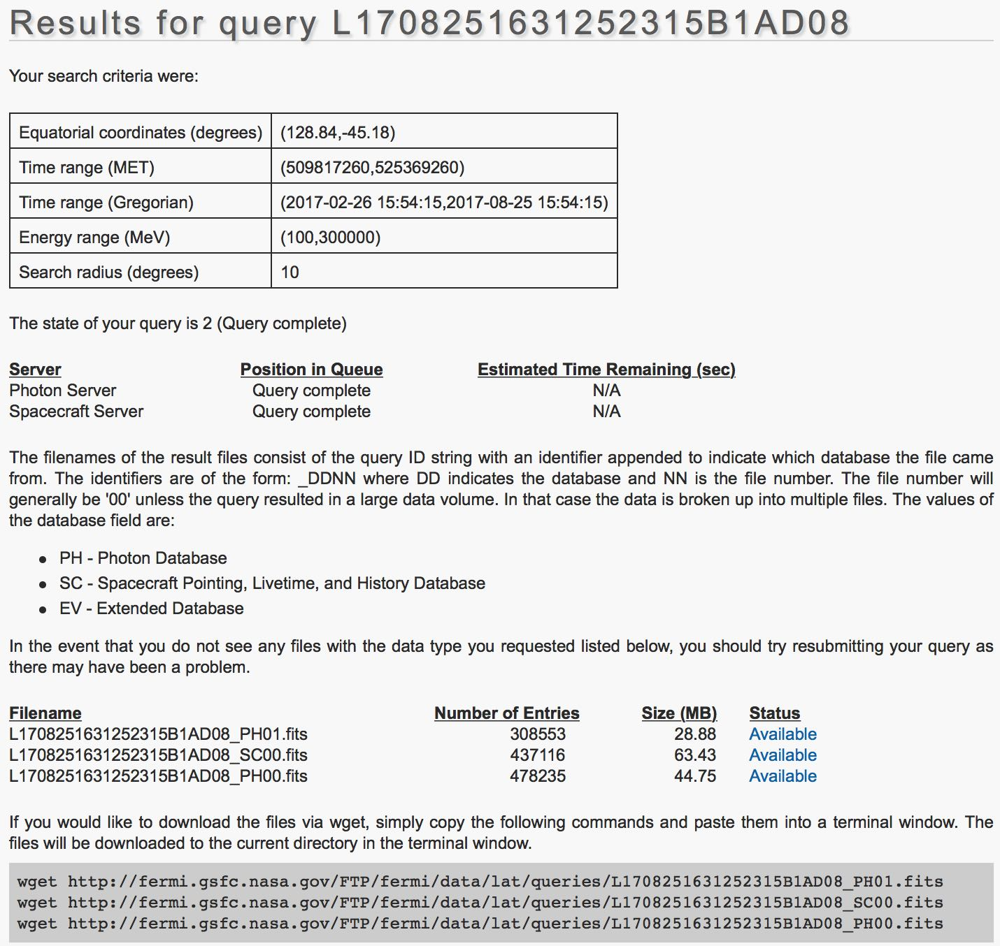

.. _howto_fermi_prepare:

Prepare Fermi-LAT data
----------------------

  .. admonition:: What you will learn

     You will learn how to prepare Fermi-LAT data for an analysis with
     ctools.

     You will find more information about the Fermi-LAT software and data
     analysis at the
     `Fermi Science Support Center (FSSC) <https://fermi.gsfc.nasa.gov/ssc/>`_
     web site.

Prerequisits
~~~~~~~~~~~~

The following sections assume that you have properly installed the Fermi-LAT
Science Tools. The Fermi-LAT Science Tools can be downloaded from the
`Fermi Science Support Center (FSSC) <https://fermi.gsfc.nasa.gov/ssc/>`_.

Get data from the Fermi-LAT data server
~~~~~~~~~~~~~~~~~~~~~~~~~~~~~~~~~~~~~~~

Start with requesting the data you are interested in from the
`Fermi-LAT Data server <https://fermi.gsfc.nasa.gov/cgi-bin/ssc/LAT/LATDataQuery.cgi>`_.
As example the figure below shows a request for data around the Vela pulsar.

   *Fermi-LAT data server interface*

After submitting the request you will get information of how to retrieve the
data:

   *Fermi-LAT data retrieval information*

Now you download the data using the ``wget`` tool. At the same time of
downloading the data you should also download the input files for the diffuse
galactic and extragalactic model components. In the current example the
following files were downloaded:

.. code-block:: bash

   $ wget http://fermi.gsfc.nasa.gov/FTP/fermi/data/lat/queries/L1708251631252315B1AD08_SC00.fits
   $ wget http://fermi.gsfc.nasa.gov/FTP/fermi/data/lat/queries/L1708251631252315B1AD08_PH00.fits
   $ wget http://fermi.gsfc.nasa.gov/FTP/fermi/data/lat/queries/L1708251631252315B1AD08_PH01.fits
   $ wget https://fermi.gsfc.nasa.gov/ssc/data/analysis/software/aux/gll_iem_v06.fits
   $ wget https://fermi.gsfc.nasa.gov/ssc/data/analysis/software/aux/iso_P8R2_SOURCE_V6_v06.txt
..

  .. warning::

     In the current example data within a radius of only 10 degrees around the
     source of interest were selected. This was mainly for getting a small
     data set. The
     `Fermi Science Support Center (FSSC) <https://fermi.gsfc.nasa.gov/ssc/>`_
     recommends to use larger regions for the Fermi-LAT data analysis.

Data preparation
~~~~~~~~~~~~~~~~

First you need to combine the event lists into a single file. At the same
time you will select the region of interest for the analysis. You do this
using the ``gtselect`` tool:

.. code-block:: bash

   $ ls *_PH* > events.txt
   $ gtselect evclass=128 evtype=3
   Input FT1 file[] @events.txt
   Output FT1 file[] events_fermi.fits
   RA for new search center (degrees) (0:360) [INDEF] 128.84
   Dec for new search center (degrees) (-90:90) [INDEF] -45.18
   radius of new search region (degrees) (0:180) [INDEF] 10.0
   start time (MET in s) (0:) [INDEF] 
   end time (MET in s) (0:) [INDEF] 
   lower energy limit (MeV) (0:) [30] 100.0
   upper energy limit (MeV) (0:) [300000] 300000.0
   maximum zenith angle value (degrees) (0:180) [180] 90.0

Now you have to select from all events those which fall into periods where
data quality is good, the telescope is configured for science, and the rocking
angle is not too large. You do this using the ``gtmktime`` tool that defines
the Good Time Intervals for your analysis:

.. code-block:: bash

   $ gtmktime
   Spacecraft data file[] L1708251631252315B1AD08_SC00.fits
   Filter expression[DATA_QUAL>0 && LAT_CONFIG==1 && ABS(ROCK_ANGLE)<52] 
   Apply ROI-based zenith angle cut[yes] no
   Event data file[] events_fermi.fits
   Output event file name[] events_fermi_gti.fits

The events are now ready to be binned into a counts cube using the
``gtbin`` tool:

.. code-block:: bash

   $ gtbin
   This is gtbin version ScienceTools-10-01-01
   Type of output file (CCUBE|CMAP|LC|PHA1|PHA2|HEALPIX) [PHA2] CCUBE
   Event data file name[] events_fermi_gti.fits
   Output file name[] cntmap.fits
   Spacecraft data file name[NONE] L1708251631252315B1AD08_SC00.fits
   Size of the X axis in pixels[] 60
   Size of the Y axis in pixels[] 60
   Image scale (in degrees/pixel)[] 0.2
   Coordinate system (CEL - celestial, GAL -galactic) (CEL|GAL) [CEL] 
   First coordinate of image center in degrees (RA or galactic l)[] 128.84
   Second coordinate of image center in degrees (DEC or galactic b)[] -45.18
   Rotation angle of image axis, in degrees[0.] 
   Projection method e.g. AIT|ARC|CAR|GLS|MER|NCP|SIN|STG|TAN:[AIT] TAN
   Algorithm for defining energy bins (FILE|LIN|LOG) [LOG] 
   Start value for first energy bin in MeV[30] 100.0
   Stop value for last energy bin in MeV[200000] 300000.0
   Number of logarithmically uniform energy bins[] 40

As next step you need to compute a livetime cube which is a computational
intensive task. You do this using the ``gtltcube`` tool:

.. code-block:: bash

   $ gtltcube zmax=90
   Event data file[] events_fermi_gti.fits
   Spacecraft data file[] L1708251631252315B1AD08_SC00.fits
   Output file[expCube.fits] ltcube.fits
   Step size in cos(theta) (0.:1.) [0.025] 
   Pixel size (degrees)[1] 
   Working on file L1708251631252315B1AD08_SC00.fits
   .....................!

The little dots indicate the progress while the tool is computing. Once
finished you need to compute the binned exposure map using the ``gtexpcube2``
tool:

.. code-block:: bash

   $ gtexpcube2
   Livetime cube file[] ltcube.fits
   Counts map file[] none
   Output file name[] expmap.fits
   Response functions to use[CALDB] P8R2_SOURCE_V6
   Size of the X axis in pixels[INDEF] 200
   Size of the Y axis in pixels[INDEF] 200
   Image scale (in degrees/pixel)[INDEF] 0.2
   Coordinate system (CEL - celestial, GAL -galactic) (CEL|GAL) [GAL] CEL
   First coordinate of image center in degrees (RA or galactic l)[INDEF] 128.84
   Second coordinate of image center in degrees (DEC or galactic b)[INDEF] -45.18
   Rotation angle of image axis, in degrees[0]
   Projection method e.g. AIT|ARC|CAR|GLS|MER|NCP|SIN|STG|TAN[CAR] TAN
   Start energy (MeV) of first bin[INDEF] 100.0
   Stop energy (MeV) of last bin[INDEF] 300000.0
   Number of logarithmically-spaced energy bins[INDEF] 40
   Computing binned exposure map....................!

Generate source maps
~~~~~~~~~~~~~~~~~~~~

Now you are ready to produce source maps for all diffuse model components.
Start with putting the diffuse model components into a
:ref:`model definition XML file <glossary_moddef>`:

.. code-block:: xml

   <?xml version="1.0" standalone="no"?>
   <source_library title="source library">
     <source type="DiffuseSource" name="Galactic_diffuse" instrument="LAT">
       <spectrum type="ConstantValue">
         <parameter name="Value" scale="1.0" value="1.0" min="0.1" max="1000.0" free="1"/>
       </spectrum>
       <spatialModel type="MapCubeFunction" file="gll_iem_v06.fits">
         <parameter name="Normalization" scale="1.0" value="1.0" min="0.1" max="10.0" free="0"/>
       </spatialModel>
     </source>
     <source type="DiffuseSource" name="Extragalactic_diffuse" instrument="LAT">
       <spectrum type="FileFunction" file="iso_P8R2_SOURCE_V6_v06.txt">
         <parameter name="Normalization" scale="1.0" value="1.0" min="0.0" max="1000.0" free="1"/>
       </spectrum>
       <spatialModel type="ConstantValue">
         <parameter name="Value" scale="1.0" value="1.0" min="0.0" max="10.0" free="0"/>
       </spatialModel>
     </source>
   </source_library>
..

  .. warning::

     While ctools also implements the syntax used for Fermi-LAT Science Tools
     :ref:`model definition files <glossary_moddef>`,
     the Fermi-LAT Science Tools naming conventions are not very homogenous,
     hence we usually advocate to use the more coherent ctools syntax. For the
     Fermi-LAT Science Tools you have to use however the Fermi-LAT syntax.

Now you can generate the source maps using ``gtsrcmaps``:

.. code-block:: bash

   $ gtsrcmaps ptsrc=no
   Exposure hypercube file[] ltcube.fits
   Counts map file[] cntmap.fits
   Source model file[] diffuse.xml
   Binned exposure map[none] expmap.fits
   Source maps output file[] srcmaps.fits
   Response functions[CALDB] P8R2_SOURCE_V6
   Generating SourceMap for Extragalactic_diffuse....................!
   Generating SourceMap for Galactic_diffuse....................!

And you are done with the preparation of the Fermi-LAT data. You now have
the following files in your working directory:

* ``srcmaps.fits`` - Counts cube including source maps
* ``ltcube.fits`` - Livetime cube
* ``expmap.fits`` - Exposure map
