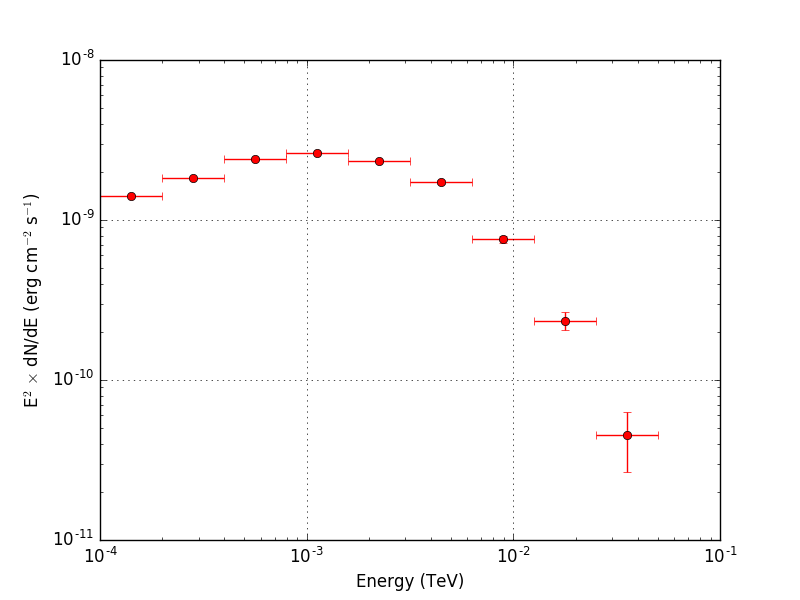

.. _howto_fermi_spectrum:

Generate a spectral energy distribution for a source
----------------------------------------------------

  .. admonition:: What you will learn

     You will learn how to use :ref:`ctlike` to derive the spectral energy
     density of a source from Fermi-LAT data.

So far the :ref:`csspec` script does not work for Fermi-LAT data, but you
will learn here a method that you can use to derive the spectrum of any
source using Fermi-LAT data. For this you first need a little Python code
to transform the spectral component of the Vela source in the
:ref:`model definition file <glossary_moddef>`
from a super exponentially cut-off power law into a node function.
You do this as follows:

.. code-block:: python

   >>> import gammalib
   >>> models   = gammalib.GModels('vela_results.xml')
   >>> energies = gammalib.GEnergies(10, gammalib.GEnergy(100.0, 'MeV'), gammalib.GEnergy(100.0, 'GeV'))
   >>> nodes    = gammalib.GModelSpectralNodes()
   >>> for energy in energies:
   >>>     nodes.append(energy, models['Vela'].spectral().eval(energy))
   >>> for par in nodes:
   >>>     if 'Energy' in par.name():
   >>>         par.fix()
   >>>     if 'Intensity' in par.name():
   >>>         par.min(1.0e-30)
   >>> models['Vela'].spectral(nodes)
   >>> models.save('model_nodes.xml')

This will create a
:ref:`model definition file <glossary_moddef>`
with the following structure:

.. code-block:: xml

   <?xml version="1.0" encoding="UTF-8" standalone="no"?>
   <source_library title="source library">
     <source name="Vela" type="PointSource">
       <spectrum type="NodeFunction">
         <node>
           <parameter name="Energy" value="100" scale="1" free="0" />
           <parameter name="Intensity" value="7.40280399439422e-08" error="0" scale="1" min="1e-30" free="1" />
         </node>
         <node>
           <parameter name="Energy" value="215.443469003188" scale="1" free="0" />
          <parameter name="Intensity" value="2.27587615163047e-08" error="0" scale="1" min="1e-30" free="1" />
         </node>
         ...
   </source_library>

Instead of the super exponentially cut-off power law the model now contains
a node function with ten intensity nodes between 100 MeV and 100 GeV, and the
:ref:`ctlike` tool will now adjust the intensities of each of the nodes which
will result in a spectrum. To do this type now:

.. code-block:: bash

   $ ctlike debug=yes
   Input event list, counts cube or observation definition XML file [obs.xml]
   Input model definition XML file [models.xml] model_nodes.xml
   Output model definition XML file [vela_results.xml] vela_nodes_results.xml

This will produce the
:ref:`model definition file <glossary_moddef>`
``vela_nodes_results.xml`` with the intensities of the fitted source at
each energy. The results are displayed graphically below.

   *Spectrum of the Vela pulsar derived using a node function*
..

  .. note::

     The ``NodeFunction`` spectral models implements a piece-wise power law
     that is defined by the intensity values at each node.
