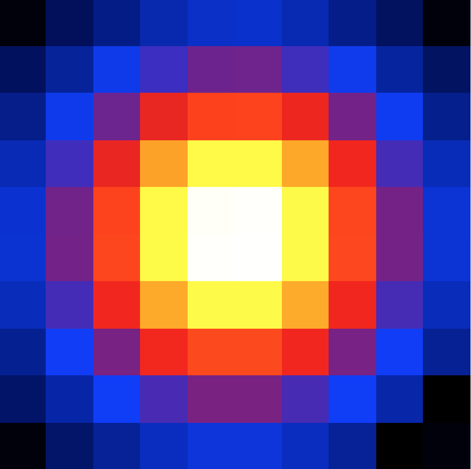

.. _howto_fermi_tsmap:

Generate a Test Statistic map
-----------------------------

  .. admonition:: What you will learn

     You will learn how to use :ref:`cttsmap` to generate a Test Staristic
     map from Fermi-LAT data.

The Test Statistic (or maximum likelihood ratio) is a measure of the detection
significance of a gamma-ray source. By displacing the location of a test source
on a grid of positions you can generate a Test Statistic map that helps in
finding significant source and assessing the position uncertainty of a
source. You do this by using the :ref:`cttsmap` tool as follows:

.. code-block:: bash

   $ cttsmap
   Input event list, counts cube or observation definition XML file [events.fits] obs.xml
   Test source name [Crab] Vela
   Input model definition XML file [$CTOOLS/share/models/crab.xml] vela_results.xml
   First coordinate of image center in degrees (RA or galactic l) (0-360) [83.63] 128.84
   Second coordinate of image center in degrees (DEC or galactic b) (-90-90) [22.01] -45.18
   Projection method (AIT|AZP|CAR|GLS|MER|MOL|SFL|SIN|STG|TAN) [CAR]
   Coordinate system (CEL - celestial, GAL - galactic) (CEL|GAL) [CEL]
   Image scale (in degrees/pixel) [0.02] 0.3
   Size of the X axis in pixels [200] 10
   Size of the Y axis in pixels [200] 10
   Output Test Statistic map file [tsmap.fits]

:ref:`cttsmap` created a 10 x 10 pixels map with a pixel size of 0.3 degrees
around the location of the Vela pulsar and saved the result in the FITS file
``tsmap.fits``. The file also contains the values of all fitted parameters
at each grid position. The Test Statistics map is displayed using
`ds9 <http://ds9.si.edu>`_ in the figure below:

   *Test Statistic map for Fermi-LAT of the Vela pulsar*
