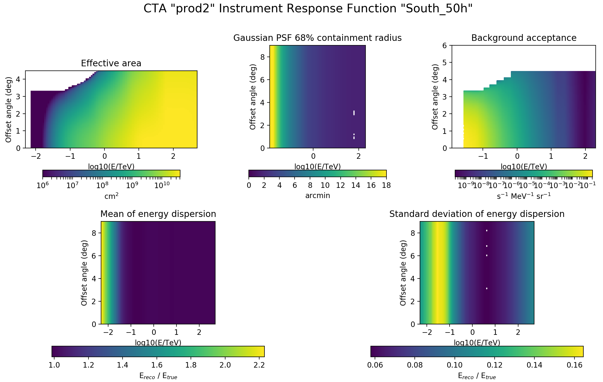

.. _howto_display:

How to display the results?
---------------------------

  .. admonition:: What you will learn

     You will learn how to **display results** using some example scripts
     written in Python.

     Please not that these scripts need the ``matplotlib`` Python module
     installed.

The ctools package does not contain any tools or scripts for graphical
display of results since results are generally written into standard FITS
files that are readily displayed by existing astronomical tools.

Nevertheless, for your convenience several scripts for graphical display are
included in the ctools package that rely on the
`matplotlib <http://matplotlib.org>`_
Python module. You can find these scripts in the
``$CTOOLS/share/examples/python`` folder. The following scripts are available:

  +------------------------+--------------------------------------+
  | Script                 | Usage                                |
  +========================+======================================+
  | ``show_butterfly.py``  | Display a butterfly diagram          |
  +------------------------+--------------------------------------+
  | ``show_irf.py``        | Display Instrument Response Function |
  +------------------------+--------------------------------------+
  | ``show_lightcurve.py`` | Display a light curve                |
  +------------------------+--------------------------------------+
  | ``show_obs.py``        | Display observation summary          |
  +------------------------+--------------------------------------+
  | ``show_phases.py``     | Display event phases                 |
  +------------------------+--------------------------------------+
  | ``show_pointings.py``  | Display pointing directions          |
  +------------------------+--------------------------------------+
  | ``show_residuals.py``  | Display spectral residuals           |
  +------------------------+--------------------------------------+
  | ``show_spectrum.py``   | Display a spectrum                   |
  +------------------------+--------------------------------------+

**Do not hesitate to copy and adapt these scripts to your needs.**

Below some usage examples and the expected output.

show_butterfly.py
^^^^^^^^^^^^^^^^^

.. code-block:: bash

   $ $CTOOLS/share/examples/python/show_butterfly.py butterfly.txt

.. figure:: howto_display_butterfly.png
   :width: 600px
   :align: center

   *Butterfly diagram displayed with show_butterfly.py*

show_irf.py
^^^^^^^^^^^

.. code-block:: bash

   $ $CTOOLS/share/examples/python/show_irf.py prod2 South_50h

   *Instrument Response Function displayed with show_irf.py*

show_lightcurve.py
^^^^^^^^^^^^^^^^^^

.. code-block:: bash

   $ $CTOOLS/share/examples/python/show_lightcurve.py lightcurve.fits

.. figure:: howto_lightcurve.png
   :width: 600px
   :align: center

   *Light curve displayed with show_lightcurve.py*

show_obs.py
^^^^^^^^^^^

.. code-block:: bash

   $ $CTOOLS/share/examples/python/show_obs.py obs.xml

   *Observation summary displayed with show_obs.py*

show_phases.py
^^^^^^^^^^^^^^

.. code-block:: bash

   $ $CTOOLS/share/examples/python/show_phases.py -n 50 events_phased.fits

   *Event phases displayed with show_phases.py*

show_pointings.py
^^^^^^^^^^^^^^^^^

.. code-block:: bash

   $ $CTOOLS/share/examples/python/show_pointings.py obs.xml

.. figure:: howto_display_pointings.png
   :width: 600px
   :align: center

   *Pointings displayed with show_pointings.py (zoomed in)*

show_residuals.py
^^^^^^^^^^^^^^^^^

.. code-block:: bash

   $ $CTOOLS/share/examples/python/show_residuals.py residual.fits

.. figure:: howto_display_residuals.png
   :width: 600px
   :align: center

   *Spectral residuals displayed with show_residuals.py*

show_spectrum.py
^^^^^^^^^^^^^^^^

.. code-block:: bash

   $ $CTOOLS/share/examples/python/show_spectrum.py spectrum.fits

.. figure:: howto_display_spectrum.png
   :width: 600px
   :align: center

   *Spectrum displayed with show_spectrum.py*
