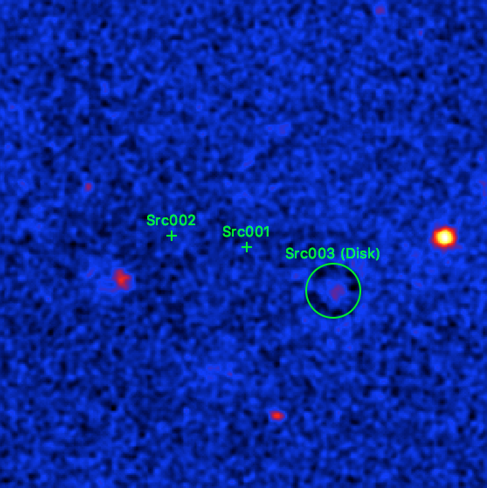
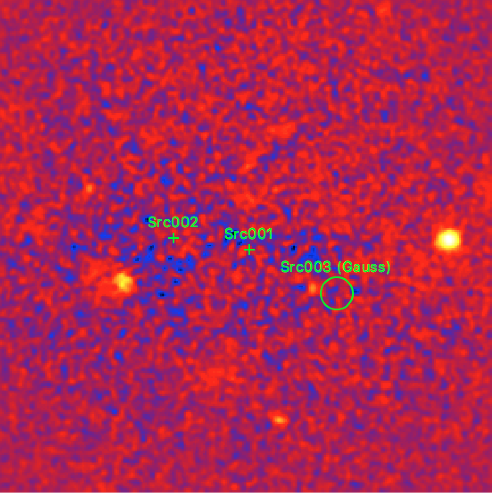

.. _1dc_howto_extent:

How to determine the extension of a source?
-------------------------------------------

  .. admonition:: What you will learn

     You will learn how you **determine the spatial extent of a source** by
     fitting an extended source model to the data.

To determine the spatial extension of a source, an extended source model
has to be used in the
:ref:`model definition file <glossary_moddef>`
for the source of interest.
The example below is based on the source model that was determined
during the
:ref:`source detection step<1dc_select_models>`
of the
:ref:`first CTA Data Challenge <glossary_1dc>`
tutorial where two point sources were detected.
As in the tutorial, ``Src001`` is modelled with an exponentially cut-off power
law spectrum, ``Src002`` with a simple power law.
In addition, a diffuse emission component was added to the model.

As noted during the
:ref:`iterative improvement of the source model <1dc_first_improving>`
there is a bright extended source south-west of the Galactic Centre, and
we add now an additional ``Src003`` component with a ``RadialDisk`` model to
describe the spatial morphology of the source.
The
:ref:`model definition <glossary_moddef>`
for ``Src003`` is shown below:

.. code-block:: xml

   <source name="Src003" type="ExtendedSource" tscalc="1">
     <spectrum type="PowerLaw">
       <parameter name="Prefactor"   scale="5.7e-18" value="1.0" min="0"    max="1000.0" free="1"/>
       <parameter name="Index"       scale="-2.48"   value="1.0" min="-4.0" max="4.0"    free="1"/>
       <parameter name="PivotEnergy" scale="300000"  value="1.0" free="0" />
     </spectrum>
     <spatialModel type="RadialDisk">
       <parameter name="RA"     scale="1.0" value="266.3070" min="-360"  max="360" free="1"/>
       <parameter name="DEC"    scale="1.0" value="-30.1876" min="-90"   max="90"  free="1"/>
       <parameter name="Radius" scale="1.0" value="0.3"      min="0.001" max="10"  free="1"/>
     </spatialModel>
   </source>

Running :ref:`ctlike` using the
:ref:`model definition file <glossary_moddef>`
will then fit the disk radius of ``Src003``. The results can be seen in the
log file and will also be written into the output
:ref:`model definition file <glossary_moddef>`.
For illustration, an excerpt of the :ref:`ctlike` log file is shown below.
The disk with of ``Src003`` has been fitted to 0.334 +/- 0.003 degrees.
The source is detected with a TS value of 5376.9.

.. code-block:: xml

   2017-07-28T05:53:53: === GModelSky ===
   2017-07-28T05:53:53:  Name ......................: Src003
   2017-07-28T05:53:53:  Instruments ...............: all
   2017-07-28T05:53:53:  Test Statistic ............: 5376.92376418598
   2017-07-28T05:53:53:  Instrument scale factors ..: unity
   2017-07-28T05:53:53:  Observation identifiers ...: all
   2017-07-28T05:53:53:  Model type ................: ExtendedSource
   2017-07-28T05:53:53:  Model components ..........: "RadialDisk" * "PowerLaw" * "Constant"
   2017-07-28T05:53:53:  Number of parameters ......: 7
   2017-07-28T05:53:53:  Number of spatial par's ...: 3
   2017-07-28T05:53:53:   RA .......................: 266.309961354122 +/- 0.00363413551819907 [-360,360] deg (free,scale=1)
   2017-07-28T05:53:53:   DEC ......................: -30.1920697862131 +/- 0.00315430125250908 [-90,90] deg (free,scale=1)
   2017-07-28T05:53:53:   Radius ...................: 0.334199097561604 +/- 0.00257183907696455 [0.001,10] deg (free,scale=1)
   2017-07-28T05:53:53:  Number of spectral par's ..: 3
   2017-07-28T05:53:53:   Prefactor ................: 6.21523600805409e-17 +/- 1.05933757692423e-18 [0,5.7e-15] ph/cm2/s/MeV (free,scale=5.7e-18,gradient)
   2017-07-28T05:53:53:   Index ....................: -2.73943047192846 +/- 0.0151745151814222 [9.92,-9.92]  (free,scale=-2.48,gradient)
   2017-07-28T05:53:53:   PivotEnergy ..............: 300000 MeV (fixed,scale=300000,gradient)
   2017-07-28T05:53:53:  Number of temporal par's ..: 1
   2017-07-28T05:53:53:   Normalization ............: 1 (relative value) (fixed,scale=1,gradient)

.. warning::
   The parameter errors returned by :ref:`ctlike` are purely statistical. In
   addition to the statistical errors there are systematic uncertainties, such
   as for example the limits on the knowledge of the point spread function.
   These systematic uncertainties are **not** determined by ctools.

The figure below shows the residual map after subtracting the three fitted
sources and the diffuse emission model from the data. There is a ring-like
residual at the position of ``Src003`` which suggests that an axisymmetric
disk is not an accurate description of the data.

   *Residual sky map for a radial disk spatial shape for Src003*

There are other spatial models in ctools, and we try in a second step an
axisymmetric Gaussian spatial shape. The corresponding
:ref:`model definition file <glossary_moddef>`
looks as follows:

.. code-block:: xml

   <source name="Src003" type="ExtendedSource" tscalc="1">
     <spectrum type="PowerLaw">
       <parameter name="Prefactor"   scale="5.7e-18" value="1.0" min="0"    max="1000.0" free="1"/>
       <parameter name="Index"       scale="-2.48"   value="1.0" min="-4.0" max="4.0"    free="1"/>
       <parameter name="PivotEnergy" scale="300000"  value="1.0" free="0" />
     </spectrum>
     <spatialModel type="RadialGaussian">
       <parameter name="RA"    scale="1.0" value="266.3070" min="-360"  max="360" free="1"/>
       <parameter name="DEC"   scale="1.0" value="-30.1876" min="-90"   max="90"  free="1"/>
       <parameter name="Sigma" scale="1.0" value="0.2"      min="0.001" max="10"  free="1"/>
     </spatialModel>
   </source>

Running :ref:`ctlike` again with that model results in a Gaussian sigma of
0.198 +/- 0.003 degrees for ``Src003``. The source is detected with a TS value
of 5659.2 which is considerably larger than the TS value of 5376.9 that is found
above for the radial disk model.
Below an excerpt of the :ref:`ctlike` log file:

.. code-block:: xml

   2017-07-28T05:37:55: === GModelSky ===
   2017-07-28T05:37:55:  Name ......................: Src003
   2017-07-28T05:37:55:  Instruments ...............: all
   2017-07-28T05:37:55:  Test Statistic ............: 5659.21767961094
   2017-07-28T05:37:55:  Instrument scale factors ..: unity
   2017-07-28T05:37:55:  Observation identifiers ...: all
   2017-07-28T05:37:55:  Model type ................: ExtendedSource
   2017-07-28T05:37:55:  Model components ..........: "RadialGaussian" * "PowerLaw" * "Constant"
   2017-07-28T05:37:55:  Number of parameters ......: 7
   2017-07-28T05:37:55:  Number of spatial par's ...: 3
   2017-07-28T05:37:55:   RA .......................: 266.302363126862 +/- 0.00476126847653064 [-360,360] deg (free,scale=1)
   2017-07-28T05:37:55:   DEC ......................: -30.1977095245935 +/- 0.00412840925183781 [-90,90] deg (free,scale=1)
   2017-07-28T05:37:55:   Sigma ....................: 0.198403793257533 +/- 0.00298520334678877 [0.001,10] deg (free,scale=1)
   2017-07-28T05:37:55:  Number of spectral par's ..: 3
   2017-07-28T05:37:55:   Prefactor ................: 7.15243704872173e-17 +/- 1.40858695554198e-18 [0,5.7e-15] ph/cm2/s/MeV (free,scale=5.7e-18,gradient)
   2017-07-28T05:37:55:   Index ....................: -2.71991083144987 +/- 0.0147325731477118 [9.92,-9.92]  (free,scale=-2.48,gradient)
   2017-07-28T05:37:55:   PivotEnergy ..............: 300000 MeV (fixed,scale=300000,gradient)
   2017-07-28T05:37:55:  Number of temporal par's ..: 1
   2017-07-28T05:37:55:   Normalization ............: 1 (relative value) (fixed,scale=1,gradient)

.. note::
   While the TS values can formally not be convert into a statistical
   significance between different spatial model hypotheses, a TS improvement
   of 282.3 indicates a considerably better fit of the axisymmetric Gaussian
   model with respect to the radial disk model to the data.

The figure below shows the residual map for the fit of ``Src003`` with an
axisymmetric Gaussian model.
The map now looks pretty flat around ``Src003``, suggesting that an axisymmetric
Gaussian model is an appropriate description for the morphology of the gamma-ray
source.

   *Residual sky map for an axisymmetric Gaussian spatial shape for Src003*

.. tip::
   The region overlays for the residual sky maps were generated using the
   :ref:`csmodelinfo` script.

.. warning::
   The fitting of extended spatial models takes more computing time
   than the fitting of point sources. The computing time is related to the
   spatial extent of the source and to the spatial shape, with a Gaussian
   disk model taking considerably more computing time than a radial disk
   model due to the tails of the Gaussian function. It is therefore **recommended
   to use by default radial disk models for the extension fitting**, and only
   switch to a Gaussian disk models when really needed, or for the determination
   of final values for a publication.

   For reference, here the computing times on Mac OS X for the example using
   different spatial morphology hypotheses for ``Src003``:

   * Point source: 12 min
   * Radial disk source: 15 min
   * Axisymmetric Gaussian source: 40 min
