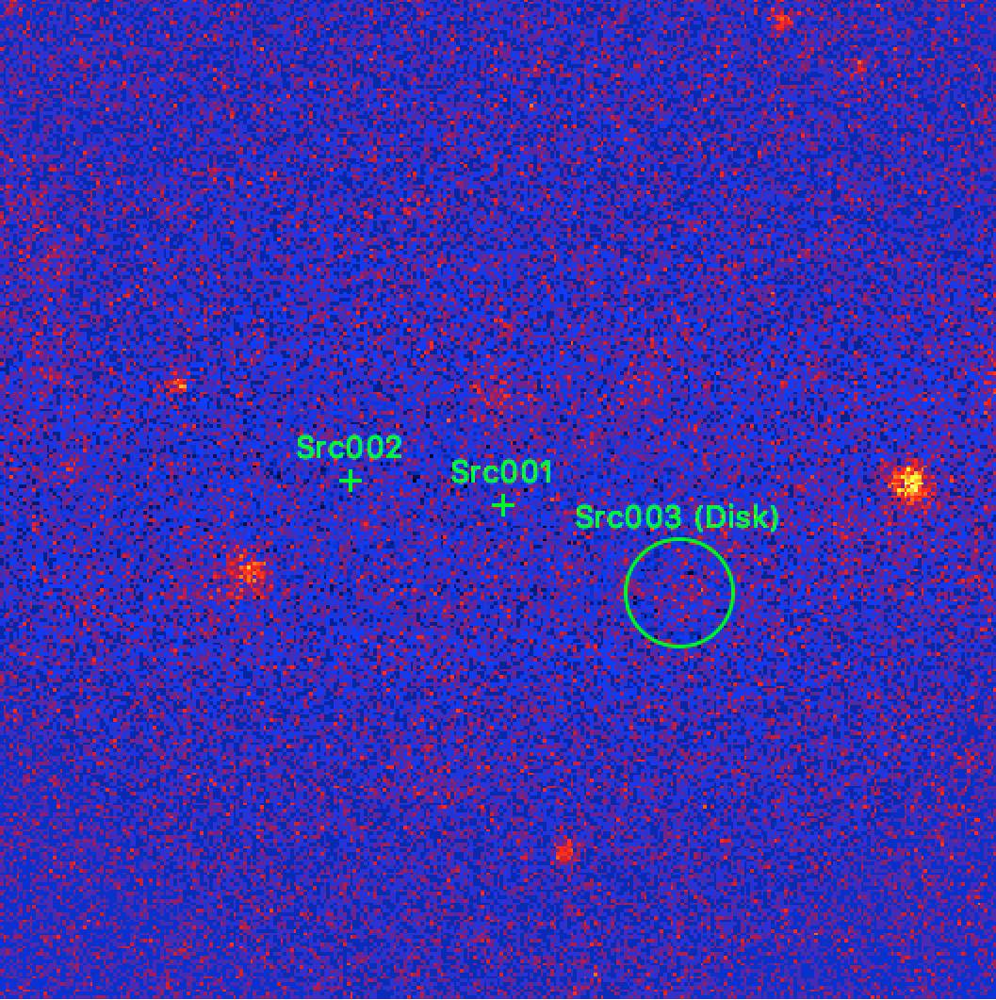

.. _howto_extent:

How to determine the extension of a source?
-------------------------------------------

  .. admonition:: What you will learn

     You will learn how you **determine the spatial extent of a source** by
     fitting an extended source model to the data.

To determine the spatial extension of a source, an extended source model
has to be used in the
:ref:`model definition file <glossary_moddef>`
for the source of interest.
The example below is based on the source model that was determined
during the
:ref:`iterative model improvement <1dc_first_improving>`
of the
:ref:`first CTA Data Challenge <glossary_1dc>`
tutorial where two point sources were detected.
As in the tutorial, ``Src001`` is modelled with an exponentially cut-off power
law spectrum, ``Src002`` with a simple power law.
In addition, a diffuse emission component was added to the model.

As noted during the
:ref:`iterative improvement of the source model <1dc_first_improving>`
there is a bright extended source south-west of the Galactic Centre, and
we add now an additional ``Src003`` component with a ``RadialDisk`` model to
describe the spatial morphology of the source.
To do this, copy the 1DC :ref:`model definition <glossary_moddef>` file

.. code-block:: bash

   $ cp $CTOOLS/share/models/1dc_howto.xml extended_model.xml

and add the following source to it

.. code-block:: xml

   <source name="Src003" type="ExtendedSource" tscalc="1">
     <spectrum type="PowerLaw">
       <parameter name="Prefactor"   scale="5.7e-18" value="1.0" min="0"    max="1000.0" free="1"/>
       <parameter name="Index"       scale="-2.48"   value="1.0" min="-4.0" max="4.0"    free="1"/>
       <parameter name="PivotEnergy" scale="300000"  value="1.0" free="0" />
     </spectrum>
     <spatialModel type="RadialDisk">
       <parameter name="RA"     scale="1.0" value="266.3070" min="-360"  max="360" free="1"/>
       <parameter name="DEC"    scale="1.0" value="-30.1876" min="-90"   max="90"  free="1"/>
       <parameter name="Radius" scale="1.0" value="0.3"      min="0.001" max="10"  free="1"/>
     </spatialModel>
   </source>

Then run :ref:`ctlike` to fit the parameters of ``Src003`` together with the
other source parameters

.. code-block:: bash

   $ ctlike
   Input event list, counts cube or observation definition XML file [events.fits] cntcube.fits
   Input exposure cube file [NONE] expcube.fits
   Input PSF cube file [NONE] psfcube.fits
   Input background cube file [NONE] bkgcube.fits
   Input model definition XML file [$CTOOLS/share/models/crab.xml] extended_model.xml
   Output model definition XML file [crab_results.xml] result.xml

The results can be seen in the log file and will also be written into the
output :ref:`model definition file <glossary_moddef>`.
For illustration, an excerpt of the :ref:`ctlike` log file is shown below.
The disk with of ``Src003`` has been fitted to 0.326 +/- 0.005 degrees.
The source is detected with a TS value of 960.3.

.. code-block:: none

   2019-04-04T10:02:58: === GModelSky ===
   2019-04-04T10:02:58:  Name ......................: Src003
   2019-04-04T10:02:58:  Instruments ...............: all
   2019-04-04T10:02:58:  Test Statistic ............: 960.322220887407
   2019-04-04T10:02:58:  Instrument scale factors ..: unity
   2019-04-04T10:02:58:  Observation identifiers ...: all
   2019-04-04T10:02:58:  Model type ................: ExtendedSource
   2019-04-04T10:02:58:  Model components ..........: "RadialDisk" * "PowerLaw" * "Constant"
   2019-04-04T10:02:58:  Number of parameters ......: 7
   2019-04-04T10:02:58:  Number of spatial par's ...: 3
   2019-04-04T10:02:58:   RA .......................: 266.317422676847 +/- 0.00715320609048925 [-360,360] deg (free,scale=1)
   2019-04-04T10:02:58:   DEC ......................: -30.1850853839605 +/- 0.00616458713967605 [-90,90] deg (free,scale=1)
   2019-04-04T10:02:58:   Radius ...................: 0.325736814893164 +/- 0.00480422517891009 [0.001,10] deg (free,scale=1)
   2019-04-04T10:02:58:  Number of spectral par's ..: 3
   2019-04-04T10:02:58:   Prefactor ................: 5.63906592494167e-17 +/- 6.89890876156083e-18 [0,5.7e-15] ph/cm2/s/MeV (free,scale=5.7e-18,gradient)
   2019-04-04T10:02:58:   Index ....................: -2.7048301145616 +/- 0.0560202225832113 [9.92,-9.92]  (free,scale=-2.48,gradient)
   2019-04-04T10:02:58:   PivotEnergy ..............: 300000 MeV (fixed,scale=300000,gradient)
   2019-04-04T10:02:58:  Number of temporal par's ..: 1
   2019-04-04T10:02:58:   Normalization ............: 1 (relative value) (fixed,scale=1,gradient)

.. warning::
   The parameter errors returned by :ref:`ctlike` are purely statistical. In
   addition to the statistical errors there are systematic uncertainties, such
   as for example the limits on the knowledge of the point spread function.
   These systematic uncertainties are **not** determined by ctools.

Now generate a residual map using :ref:`csresmap` to check the fit quality

.. code-block:: bash

   $ csresmap
   Input event list, counts cube, or observation definition XML file [events.fits] cntcube.fits
   Input model cube file (generated with ctmodel) [NONE]
   Input exposure cube file [NONE] expcube.fits
   Input PSF cube file [NONE] psfcube.fits
   Input background cube file [NONE] bkgcube.fits
   Input model definition XML file [$CTOOLS/share/models/crab.xml] result.xml
   Residual map computation algorithm (SUB|SUBDIV|SUBDIVSQRT|SIGNIFICANCE) [SIGNIFICANCE]
   Output residual map file [resmap.fits]

The resulting residual map is shown below. The map looks rather clean.

   *Residual sky map for a radial disk spatial shape for Src003*

.. tip::
   The region overlays for the residual sky maps were generated using the
   :ref:`csmodelinfo` script

   .. code-block:: bash

      $ csmodelinfo
      Input model definition XML file [model.xml] result.xml
      Output DS9 region file [ds9.reg] result.reg

.. warning::
   The fitting of extended spatial models takes more computing time
   than the fitting of point sources. The computing time is related to the
   spatial extent of the source and to the spatial shape, with a Gaussian
   disk model taking considerably more computing time than a radial disk
   model due to the tails of the Gaussian function. It is therefore **recommended
   to use by default radial disk models for the extension fitting**, and only
   switch to a Gaussian disk models when really needed, or for the determination
   of final values for a publication.
